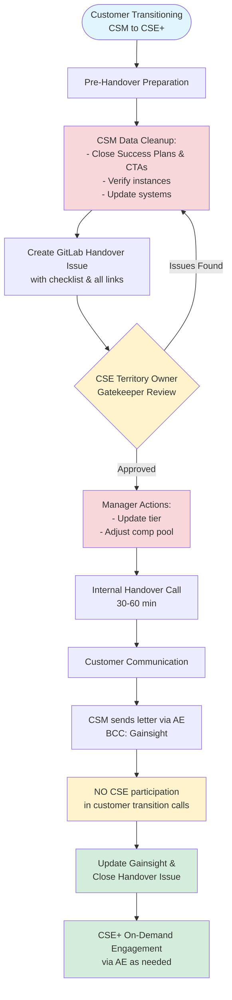

**Overview**

This process transitions customer accounts from dedicated CSM engagement to the CSE+ pooled support model.

**Key Principles:**

- CSE+ is an **on-demand, pooled resource** (not dedicated)
- Customer engagement is **AE-led**
- **CSEs do NOT join customer transition calls**
- Timeline: **3-4 weeks**

## Process Flow



## Step-by-Step Process

### 1. Pre-Handover (Week 1-2) - CSM

**Data Cleanup:**

- Close all Success Plans and CTAs
- Verify instance classification (production vs non-production)
- Flag instances not pinging for 6+ months
- Update: Gainsight, Salesforce, GDocs, Gong

**Create Handover Issue:**

- Use template in [CSM-to-CSE-Handover project](https://gitlab.com/gitlab-com/customer-success/csm-to-cse-handover/-/issues)
- Fill in all required info
- Add links: Collaboration Project, Customer Notes GDoc, Gong recordings
- Tag CSE Territory Owner with `@mention`
- Link issue in Gainsight Timeline

### 2. Review & Approval (Week 2)

**CSE Territory Owner Review** (within 3 business days):

- Check all Success Plans/CTAs closed
- Verify instance classification accurate
- Confirm systems up to date

**Manager Actions** (after CSE approval):

- Update account to TAM Scale tier
- Adjust compensation pool
- Check "Manager actions complete" in issue

### 3. Internal Handover (Week 2-3)

**Handover Call** (30-60 min | CSM + CSE Territory Owner):

- Review handover issue together
- Discuss Top 3 things to know
- Cover relationship dynamics and watch-outs
- Address questions
- Update issue and check "Handover call completed"

### 4. Customer Communication (Week 3) - CSM

**Process:**

1. Draft transition letter using [approved template](https://gitlab.com/-/project/42504524/uploads/36d5cb3fc13f971e0af65ad321fea3fb/__NEW___CSM_Email_to_Customers_Moving_into_Scale_.docx)
2. Align timing with AE
3. Send letter (BCC: Gainsight email)
4. Update issue with send date
5. Address customer questions

**Letter emphasizes:**

- AE = primary contact
- CSE = on-demand via AE (pooled model, not dedicated)
- Self-service resources available
- **❗ CSEs do NOT join customer calls**

### 5. Completion (Week 3-4) - CSM

- Update Gainsight Timeline (completion date, handover link, feedback)
- Remove customer from active book
- Get CSE+ sign-off in issue
- Close handover issue

## Handover Issue Template

Create issues in [CSM-to-CSE-Handover project](https://gitlab.com/gitlab-com/customer-success/csm-to-cse-handover/-/issues).

```markdown
## Account Information
**Customer:** _________________
**AE:** _________________
**Renewal Manager:** _________________
**Outgoing CSM:** _________________
**CSE Territory Owner:** @mention
**Handover Date:** _______

## Pre-Handover
- [ ] Success Plans closed
- [ ] CTAs resolved/closed
- [ ] Instances verified (Prod: ___ | Non-prod: ___)
- [ ] Systems up to date
- [ ] Link to Collaboration Project: [URL]
- [ ] Link to Customer Notes GDoc: [URL]
- [ ] Link to Gong recordings: [URL]

## Account Overview
- [ ] Health: ☐ Green ☐ Yellow ☐ Red | Why: __________________
- [ ] Next renewal: _______ | Risks: __________________
- [ ] Active issues/escalations: __________________

## Key People & Dynamics
| Name | Role | Notes |
|------|------|-------|
|      |      |       |

## Technical Setup
- [ ] Deployment: ☐ SaaS ☐ Self-managed
- [ ] Tier: _______ | Seats: _______
- [ ] Last ping date: _______
- [ ] Known issues: __________________

## Strategic Context
- [ ] Primary use case(s): ☐ SCM ☐ CI/CD ☐ DevSecOps ☐ Compliance
- [ ] Customer goals: __________________
- [ ] Current blockers: __________________

## Top 3 Things to Know (risks, expansion, on-going issues)
1. __________________
2. __________________
3. __________________

## Handover Status
- [ ] CSE Territory Owner review: ☐ Approved ☐ Needs fixes
- [ ] Manager actions complete
- [ ] Handover call completed: Date: _______
- [ ] Customer letter sent: Date: _______
- [ ] AE aligned: ☐ Yes
- [ ] Logged in Gainsight: ☐ Yes

## Sign-off
**CSM:** _________________ Date: _______
**CSE+:** _________________ Date: _______

/label ~"CSM to CSE+ Transition" ~"Handover"
```

## RACI

| Activity | CSM | CSE Territory Owner | CSM Manager | AE |
|----------|-----|---------------------|-------------|----|
| Data cleanup & create issue | R/A | I | I | I |
| Review/approve handover | C | R/A | I | - |
| Update tier & comp pool | I | I | R/A | I |
| Handover call | R/A | R/A | I | - |
| Draft/send customer letter | R/A | I | C | C |
| Align on timing | C | - | - | R/A |
| Update Gainsight & close | R/A | C | R/A | I |
| Validate success | C | R/A | I | R/A |

**R** = Responsible | **A** = Accountable | **C** = Consulted | **I** = Informed
