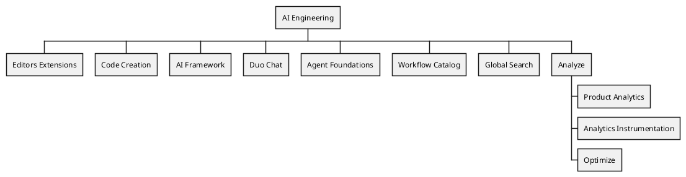

## Vision

 **Our goal is not merely to launch features, but to ensure they land successfully and provide real value to our customers.** We strive to develop a best-in-class product that exceeds expectations across all user groups by meeting high-quality standards while ensuring reliability and maintaining an ease of operation and scalability to meet diverse customer needs. All team members should remain mindful of our target customers and the multiple platforms we support in everything we do.

Ensure our product excels in all aspects especially for our primary customer [organization archetypes](/handbook/product/personas/organization-archetype/) of large enterprises. This includes scalability, adaptability, and seamless upgrade paths. When designing and implementing features, always keep in mind compatibility for all our deployment options: self-managed, dedicated and Software as a Service (SaaS).

Develop our technical, diverse and global team to drive results that support our product and customer growth, while maintaining [our values](/handbook/values/) and [unique way of working](/handbook/company/culture/all-remote/guide/).

## Mission

GitLab's unique way of working asynchronously, handbook first method, utilization of the product we develop and clear focus on our values enables very high productivity. We focus on constantly improving quality, usability and reliability of our product to reach maximum customer satisfaction. Community contributions and customer interactions rely on efficient and effective communication. We are a data-driven, customer experience first, open core organization delivering one secure, reliable, world leading DevSecOps platform. Join us in setting new standards, driving innovation, pushing the boundaries of DevSecOps, and consistently delivering exceptional results for our customers.

## Organizational Structure

## AI Engineering stakeholders

This section provides an overview of all teams invested in implementing and maintaining AI features. Our Duo initiative is a cross-category effort.

These are the stakeholders:

| Team | Responsible For |
|------|-----------------|
| [Agent Foundations](/handbook/engineering/ai/agent-foundations/) | Agentic observability / Reusable Agentic components / Duo workflow service |
| [AI Framework](/handbook/engineering/ai/ai-framework/) | Abstraction Layer / AI Gateway for LLM integration to the application (GitLab Chat, Code Suggestions and other AI capabilities) |
| [AI Framework](/handbook/engineering/ai/ai-framework/) (formerly Model Validation) | Custom feature evaluators, evaluation support, automated evaluation tooling |
| [Cloud Connector](/handbook/engineering/infrastructure/team/cloud-connector/) (`@mkaeppler`, `@nmilojevic1`) | Supports access to Duo for Self-Managed: Cloud Connector, Unit Primitives  |
| [Code Creation](/handbook/engineering/ai/code-creation/) | Code Suggestions, Repository X-Ray, Knowledge Graph, Semantic Indexing, Duo Code Review, code-related slash commands (/explain, /refactor, /tests, /fix)  |
| [Duo Chat](/handbook/engineering/ai/duo-chat/)  | GitLab Chat for VS Code and WebIDE  |
| [Editor Extensions: VS Code](/handbook/engineering/ai/editor-extensions-vscode/) | Maintains the GitLab Workflow VS Code Extension ([maintainers](https://gitlab-org.gitlab.io/gitlab-roulette/?currentProject=gitlab-vscode-extension&mode=show&hidden=reviewer)) & [Web IDE](https://gitlab.com/gitlab-org/gitlab-web-ide) extensions and the [language server](https://gitlab.com/groups/gitlab-org/-/epics/2431). Also contributes with UX improvements for Code Suggestions within GitLab Workflow. |
| [Editor Extensions: Multi-Platform](/handbook/engineering/ai/editor-extensions-multi-platform/) | <ul><li>[JetBrains](https://gitlab.com/gitlab-org/editor-extensions/gitlab-jetbrains-plugin), [Neovim](https://gitlab.com/gitlab-org/editor-extensions/gitlab.vim) & [Visual Studio](https://gitlab.com/gitlab-org/editor-extensions/gitlab-visual-studio-extension) editor extensions</li> <li>Co-owns [Language Server](https://gitlab.com/gitlab-org/editor-extensions/gitlab-lsp) with [Editor Extensions: VS Code](/handbook/engineering/ai/editor-extensions-vscode/) </li><li>Duo CLI (Ideation/MVC phase)</li></ul>  |
| [Global Search](/handbook/engineering/ai/search/) | Abstraction Layer / Vector Storage / Semantic |
| [Infrastructure Platforms - Runway](/handbook/engineering/infrastructure/team/runway/) | AI Gateway Scalability / Runway infrastructure |
| [Workflow Catalog](/handbook/engineering/ai/workflow-catalog) | AI Catalog / Custom Agents / Custom Flows |

## Counterparts

The AI department engineering structure is different from the Product structure. To read about how we collaborate and who are the counterparts, you can check the [AI product's page](/handbook/product/ai/).

## ClickHouse Datastore usage

[ClickHouse usage by Analytics:Platform Insights group](/handbook/engineering/data-engineering/analytics/platform-insights/#clickhouse-datastore)

## AI Experimentation

We strongly encourage team members to experiment and develop AI-related projects as part of their exploration and learning journey. These experimental initiatives help accelerate our work and allow AI teams to embrace emerging challenges and opportunities.

Existing projects may be reviewed by product and engineering teams on a case-by-case basis for potential migration into GitLab-managed projects.

To protect GitLab's brand while maintaining our commitment to transparency, all experimental AI projects must prominently display the following disclaimer at the top of their README:

"⚠️ This is an unofficial project. It is not endorsed or supported by GitLab Inc. and is not recommended for use in production environments."
