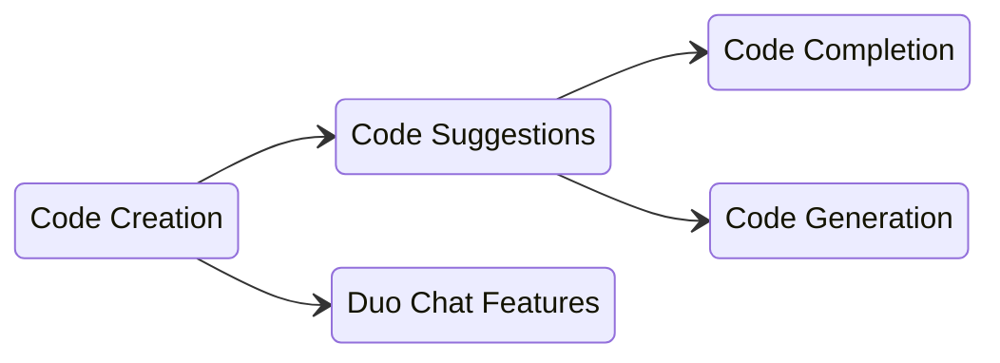

## Overview

Code Suggestions is one of the main features developed by the Code Creation group. It provides AI-generated code within IDEs through two main capabilities:

- **Code Completion**: Short AI-generated suggestions intended to complete an existing line or block of code
- **Code Generation**: Longer AI-generated suggestions intended to create entire functions, classes, code blocks, etc.

## Key Concepts

A lot of the terms we use in this area sound similar and can be confusing at first. Here are the basic terms we use:

- **Code Creation**: The group name and a collection of features relating to providing AI generated code
- **Code Suggestions**: A feature within Code Creation that provides AI-generated code within an IDE
  - **Code Completion**: A short AI-generated suggestion intended to complete an existing line or block of code
  - **Code Generation**: A longer AI-generated suggestion intended to create entire functions, classes, code blocks, etc.
- **Duo Chat**: Another feature that interacts with GitLab Duo Chat to write new code, refactor existing code, or scan code for vulnerabilities

If it helps, here are these terms in a diagram:

## Technical Implementation

For detailed technical information about how Code Suggestions works, including architecture diagrams and API details, see the [Engineering Overview](/handbook/engineering/ai/code-creation/code_suggestions/engineering_overview/).

## Dashboards and Monitoring

- [User Metrics](https://10az.online.tableau.com/#/site/gitlab/views/PDCodeSuggestions/ExecutiveSummary) ([README](https://10az.online.tableau.com/#/site/gitlab/views/PDCodeSuggestions/README?:iid=1)) - usage, acceptance rate, latency, error rates, etc (Tableau)
- [General Metric Reporting](https://10az.online.tableau.com/#/site/gitlab/views/DRAFTCentralizedGMAUDashboard/MetricReporting?:iid=1) - can find code suggestions rate limiting, X-Ray usage, etc (Tableau)
- [Log Visualization Dashboard](https://log.gprd.gitlab.net/app/dashboards#/view/6c947f80-7c07-11ed-9f43-e3784d7fe3ca?_g=(refreshInterval:(pause:!t,value:0),time:(from:now-6h,to:now))) - another view of latency, response codes, number of requests, etc (Kibana)
- [Latency Dashboard](https://log.gprd.gitlab.net/app/r/s/mMaY3): Breakdown of server-side latency for code suggestions (Kibana)
- [LSP Sentry Alerts](https://new-sentry.gitlab.net/organizations/gitlab/alerts/rules/gitlab-language-server/51/details/) and the corresponding Slack channel where the alerts are posted: [#g_code_creation_alerts](https://gitlab.enterprise.slack.com/archives/C096BUFJHFU)

## Documentation

- [Development Guide](/handbook/engineering/ai/code-creation/code_suggestions/development_guide/) - Development guide for engineers
- [Quick Start](https://docs.gitlab.com/ee/user/gitlab_duo/quick_start/) - GitLab Documentation
- [GitLab Documentation](https://docs.gitlab.com/ee/user/project/repository/code_suggestions/) - GitLab Documentation
- [Direction](https://about.gitlab.com/direction/create/code_creation/code_suggestions/)
- [Difference between Code Completion and Code Generation](https://youtu.be/9dsyqMt9yg4) - YouTube
- [Engineering Overview](/handbook/engineering/ai/code-creation/code_suggestions/engineering_overview/) - Technical overview of Code Suggestions
- [Epic](https://gitlab.com/groups/gitlab-org/-/epics/18077)
