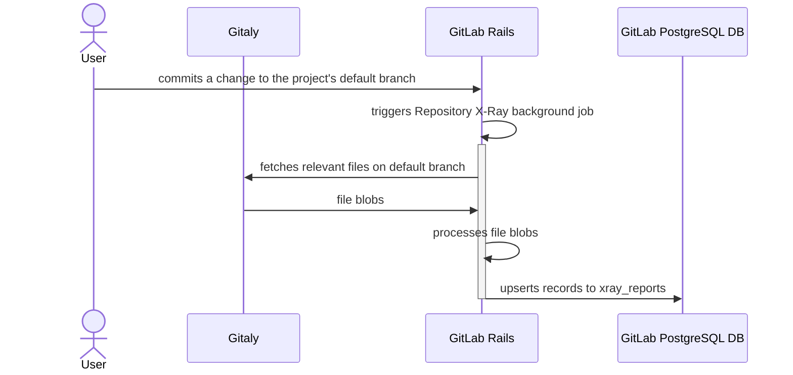

## Overview

[Repository X-Ray](https://docs.gitlab.com/ee/user/project/repository/code_suggestions/repository_xray.html) is a feature that analyzes your repository to extract metadata and contextual information. This information is then used as additional context for code generation requests, helping AI models understand your project's coding patterns.

## How it Works

Repository X-Ray automatically analyzes repositories and extracts external dependencies and libraries used in the project

This extracted metadata is stored in the database and included in code generation requests to provide more accurate and contextually relevant suggestions.

## Technical Implementation

Repository X-Ray reports are generated automatically when changes are committed to a project's default branch:

Components pictured on diagram are as follows:

1. [Gitaly](https://docs.gitlab.com/ee/administration/gitaly/) - an application that provides high-level RPC access to Git repositories.
1. GitLab PostgreSQL DB - relational database engine storing GitLab operational data.

The generated reports are then automatically included in code generation requests to enhance the AI model's understanding of the project context.

## Dashboards and Monitoring

- [X-Ray Dependency Parsing Errors Dashboard](https://log.gprd.gitlab.net/app/dashboards#/view/a828978b-8f41-489a-9e3b-aa71937e25b9?_g=h@e98e959): Breakdown of parsing errors triggered by X-Ray dependency scanning (Kibana)
- [General Metric Reporting](https://10az.online.tableau.com/#/site/gitlab/views/DRAFTCentralizedGMAUDashboard/MetricReporting?:iid=1) - includes X-Ray usage metrics (Tableau)

## Documentation

- [Repository X-Ray User Documentation](https://docs.gitlab.com/ee/user/project/repository/code_suggestions/repository_xray.html)
