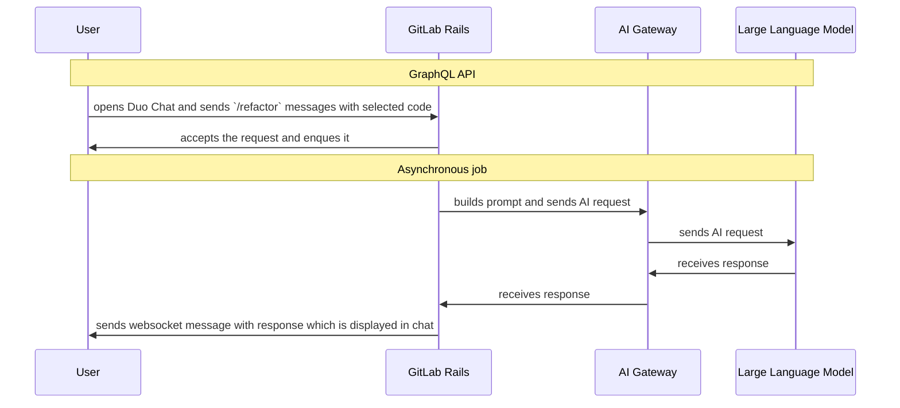

## Overview

Code-related slash commands provide interactive AI assistance for common development tasks. These commands integrate with GitLab Duo Chat to help developers understand, improve, and test their code.

Available Commands

- `/explain` - Provides detailed explanations of selected code, helping developers understand complex logic, algorithms, or unfamiliar code patterns. [Docs](https://docs.gitlab.com/user/gitlab_duo_chat/examples/#explain-selected-code)
- `/refactor` - Suggests improvements and refactoring opportunities for selected code, focusing on code quality, readability, and maintainability. [Docs](https://docs.gitlab.com/user/gitlab_duo_chat/examples/#refactor-code-in-the-ide)
- `/tests` - Generates unit tests for selected code, helping developers improve test coverage and ensure code reliability. [Docs](https://docs.gitlab.com/user/gitlab_duo_chat/examples/#write-tests-in-the-ide)
- `/fix` - Analyzes selected code for potential bugs or issues and suggests fixes or improvements. [Docs](https://docs.gitlab.com/user/gitlab_duo_chat/examples/#fix-code-in-the-ide)

## Usage

These commands can be used within IDEs through the GitLab extension or directly in GitLab Duo Chat. Select the code you want to analyze and use one of the available commands to get AI-powered assistance.

## Technical Implementation

A user can use one of the predefined chat commands to suggest changes in the selected code.

These commands can be used in Duo Chat and the response is displayed in the Duo Chat window.

## Evaluations

We have datasets for evaluations for some of our chat commands. You can find them:

- [/fix dataset](https://gitlab.com/gitlab-org/code-creation/fix-dataset)
- [/tests dataset](https://gitlab.com/gitlab-org/code-creation/tests-dataset)

## Documentation

For more details on using these commands, see:

- [Duo Chat Examples](https://docs.gitlab.com/ee/user/gitlab_duo_chat/examples.html)
- [Code Tasks in IDEs](https://docs.gitlab.com/ee/user/gitlab_duo_chat/examples.html#refactor-code-in-the-ide)
- [Epic](https://gitlab.com/groups/gitlab-org/-/epics/18079)
