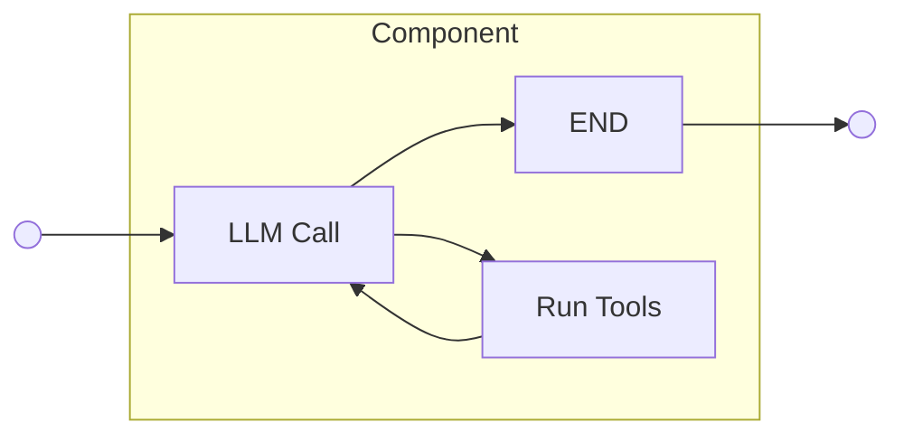
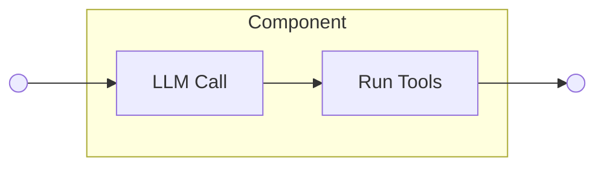
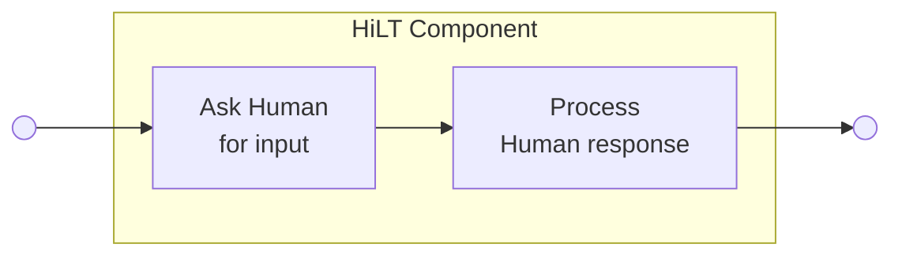
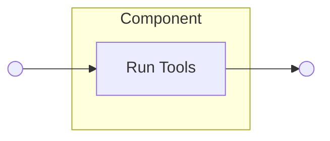
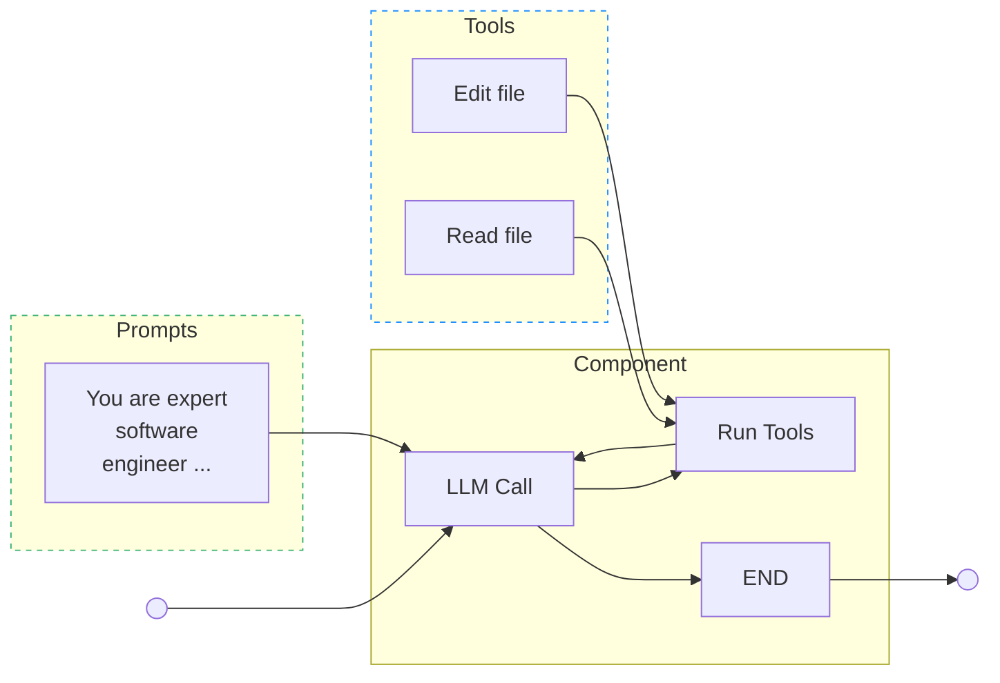
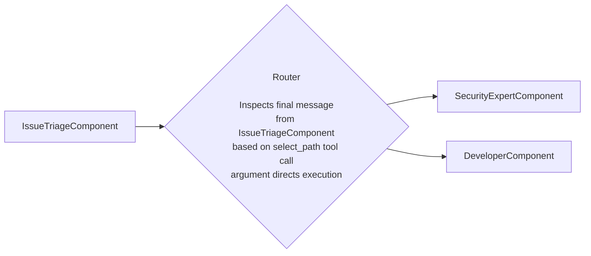



## Summary

This blueprint presents the implementation of a Flow Registry as part of the AI Gateway to centrally manage GitLab's growing collection of Duo Agent Platform flows.
As GitLab continues transforming AI features to be agentic and building new agent capabilities, there is a need for a standardized approach to building, managing, and orchestrating these agent setups.
The proposed Flow Registry will serve as a single entry point for agentic AI development and orchestration across the GitLab platform.

## Preamble

This section gives a high-level overview of the key concepts that define agents and flows at GitLab.
These concepts explain general details, while specific implementation details can be found in the subsequent sections.

### Large Language Models

Large Language Models (LLMs) are AI systems that process and generate code and text by identifying patterns in vast amounts of training data, enabling them to produce coherent, contextually relevant responses across diverse topics and tasks
LLMs  are trained on vast amounts of text data from books, articles, and web content, source code repositories etc, allowing to learn patterns in language and develop a broad understanding of human knowledge.
LLMs work by processing input text and predicting the most appropriate next words or phrases, enabling them to engage in conversations, answer questions, write content,
and assist with various language-related tasks.

### Prompting

To effectively communicate with LLMs, users need to provide clear instructions called prompts.
A prompt is the input text that tells the LLM what task to perform, what role to take, or what type of response is expected.
For example, a prompt might say "Act as a helpful assistant and explain quantum physics in simple terms" or "Summarize the following article in three bullet points."
The quality and specificity of prompts directly influence the LLM's output. Well-crafted prompts lead to more accurate and useful responses.
Prompting techniques range from simple questions to complex multi-step instructions that guide the model through reasoning processes, making it essential for unlocking the full potential of LLMs.

### Agents

LLMs are great at text generation but cannot directly interact with the real world.
To solve this limitation, we connect external tools (such as web search, APIs, or database queries) to the LLM and implement advanced prompts leveraging tool use.
The LLM decides which tools to use based on the user's input, and then the system executes the selected tools to provide the user with actual real-world data.
For example, if the user asks "What's the current weather in New York?", the LLM would choose to use a web search tool.
An agent is this combination of an LLM with external tools that enables it to take actions and achieve specific goals in the real world.
This allows agents to perform complex, multi-step tasks such as researching topics online, sending emails, or controlling software applications, making them more practical for real-world problem-solving.

### Multi-agent setup

Multi-agent systems are setups that consist of several specialized agents orchestrated in some way.
The market has demonstrated that multi-agent setups are exceptionally effective at solving complex user tasks that would be challenging for a single agent to handle alone.
For example, Anthropic recently demonstrated that a multi-agent research system with Claude Opus 4 as the lead agent and Claude Sonnet 4 sub-agents
outperforms single-agent Claude Opus 4 by [90.2%](https://www.anthropic.com/engineering/built-multi-agent-research-system).
There are many architectures of multi-agent systems available ranging from sequential chains, through polling, peer-to-peer, up to a lead agent that manages other sub-agents.
This ADR aims to be multi-agent architecture agnostic, supporting wide variety of options, without prescribing any particular one.

### Agents vs Flow vs Duo Agent Platform: what is the difference?

An Agent, is a system where LLMs dynamically direct it's own processes and tool usage, maintaining control over how it accomplishes tasks.
A Flow (previously known as Workflow) orchestrates one or multiple agents, as well as predefined deterministic actions (like commit creation, or an API call)
into a sequence of steps connected through predefined code paths designed to achieve a specific task or goal.
Duo Agent Platform is an engine that runs Flows.

For more details on terminology please refer to GitLab Duo Agent Platform terminology [documentation](https://docs.gitlab.com/development/ai_features/glossary/#gitlab-duo-agent-platform-terminology).

> Note: Due to the ongoing development and legacy code, the Workflow term is still actively used and means a single or multi-agent setup for solving complex user tasks.

## Motivation

We recently completed the migration of Duo Workflow Service to the AI Gateway.
We also reimplemented Duo Chat using the Duo Workflow codebase, marking our first successful attempt
at converting the Duo Workflow infrastructure into a flexible engine for various agent-based setups.
To better reflect this evolution, we have renamed Duo Workflow to **Duo Agent Platform**.
Our existing Software Developer setup now serves as the foundational example of the new Flow [concept](https://docs.gitlab.com/development/ai_features/glossary/#gitlab-duo-agent-platform-terminolog).
These changes establish a clear pathway for creating diverse agents and flows in a scalable and efficient manner through the Duo Agent Platform.

However, as we expand beyond individual agent implementations and accelerate development of new complex agentic flows,
the need for centralized management and orchestration across our growing AI stack has become critical.

To address this requirement, the AI Gateway needs a **Flow Registry** that will provide:

- **Discoverability** of available Flows
- **Governance** and version control
- **Seamless implementation** of new Flows of varying complexity levels throughout the platform

## Goal

Build a central Flow Registry in the AI Gateway that makes it easy to build, run, and manage agentic flow setups of varying complexity and orchestration approaches.

## Objectives

Based on the goal and motivation, we define the following objectives:

1. Build a Flow Registry as part of the AI Gateway and Workflow Service.
1. As part of the registry implementation, provide internal mechanisms to build Flows using either the custom Python-based API or YAML syntax.
1. Write clear documentation to help developers build and maintain new Flows.

## Non-goals

1. Customer-facing DSL implementation. This blueprint involves building an internal YAML-based DSL for scalable Flow implementation in the AI Gateway.
   Please note this DSL is entirely internal and improves our existing AI stack. Building a customer-facing DSL that
   customers may use for building their own custom Flows is out of scope for this blueprint. However, the work done
   in this proposal can be reused by the Duo Workflow Catalog team to further extend its functionality for customers.

## Implementation details

At GitLab, we use LangGraph, a framework built on top of LangChain that enables the creation of complex, stateful, and multi-agent setups using directed graphs.
Every graph consists of nodes that contain specific logic (such as LLM calls, tool executions, or Python code) and edges that orchestrate the nodes governing the order of operations.
This allows us to create complex agent behaviors by connecting different components together.
To share data between all parts of the graph, LangGraph provides a shared state object that nodes can read from and update.

Any agent setup (single or multi-agent) we develop at GitLab can be presented as a graph with its own state.
In the next sections, we define a set of primitives provided by the Flow Registry to compose reusable and maintainable agentic flows that are easy to develop, find, and store.

### Agent Flow Graph Composition

We define the following list of primitives supported by the Flow Registry for agentic AI development:

1. Components
1. Routers
1. State
1. Prompts
1. Tools

The proposed framework has been tested early with a [PoC](https://gitlab.com/gitlab-org/modelops/applied-ml/code-suggestions/ai-assist/-/merge_requests/2881)
that served as the basis for several demo recordings:

- [Python API](https://gitlab.zoom.us/rec/share/MvGkn2wnv4OohOYJhzN9EQXnXiJBZEyz87yPB0r9D49yrvXwmpZtEf1HDrweMdgi.dbSRQylaJ7OcoNdr?startTime=1750073407000)
- Internal YAML-based DSL (TODO: add link)

#### 1\. Components

Components are the basic atomic units of operations to compose agentic flows; they represent an entity with a certain role in a process.
For example, a component can be responsible for reviewing a merge request, or a component can be responsible for writing a new unit test to improve test coverage for a project.
One can perceive components as individuals within an organization, to whom various tasks in a business process can be delegated. Those tasks can vary in complexity and
be as simple as a one-off interaction (for example, sending an email), to more elaborate tasks like reviewing a merge request. What creates an important distinction is the fact that
components must have **a single role** in a flow.
For example, when a feature is being developed, an engineer creates the feature implementation,
but a technical writer is responsible for providing user-facing documentation.
Each of those personas is an expert in their field, which ensures quality of their outputs.

##### Implementation

On a more technical level, the component is a collection of LangGraph nodes arranged in a certain architecture, which is designed to solve a category of problems.
There might be components designed to act as cyclic agents, one-off agents, HiTL (Human-in-the-loop) component, or predefined non-AI steps in the process.
Example diagrams for the mentioned components are presented in a [section](#proposed-components) below.

##### Proposed components

Non exhaustive list of generic components outlining a starting point for the proposed framework.

1. Cyclic agent



1. One-off agent



1. HiLT



1. Deterministic step



##### Inputs

Components may define a set of required inputs.
A component's inputs reflect attributes within a global graph [state](#3-state) object
that carry necessary information without which the component won't be able to fulfill its role.

##### Outputs

Components should specify a set of attributes within a global graph [state](#3-state) object
that they will modify or add during the course of their execution. This is necessary to ensure that
subsequent components within a graph will have their inputs present.

##### Components customisation

Some [components](#proposed-components) may serve as customizable blueprints flexible enough
to be reused in different roles. To specify a generic component into a
distinct role, one assigns them a [prompt](#4-prompts), and then defines the component abilities with an
assigned set of [tools](#5-tools), that restrict actions available to an individual in the role in the modeled process.

The diagram below pictures role specification:



An example implementation of customised component

```python
agent_component = AgentComponent(
    name="agent",
    prompt_id="agents/awesome",
    prompt_version="^1.0.0",
    toolset=agents_toolset,
    inputs=["context:task"],
    output_type=AgentFinalOutput,
    output="context:agent.answer"
)
```

#### 2\. Routers

Routers orchestrate Components into predefined structures, governing the order of operations within a Flow setup.
Flow setups are composed of Components, but these components need to be arranged in a specific structure to model effective business processes.
Routers navigate between different components and ensure the required order of operations is respected.

On a technical level, Routers wrap LangGraph edges that connect components and implement logic that enforces correct execution through the Flow setup.
Routers make path selection decisions based on attributes within the Flow setup's state, such as status or messages from preceding components.
One example is a supervisor approach when one agent is a lead and other agents are sub-agents performing certain smaller tasks.

An example Router diagram is presented below:



#### 3\. State

Each Flow setup has a global State object used to transport information between different components.

##### Implementation

The State object is a dictionary containing predefined required attributes and a flexible _context_ attribute.
The context is a nested dictionary that enables every component in a Flow setup to write their outputs as key-value pairs for subsequent components to use.

```python
class AgentState(TypedDict):
    status: AgentStatusEnum
    conversation_history: Annotated[
        dict[str, list[BaseMessage]]
    ]
   ui_chat_log: Annotated[list[UiChatLog]]
   context: dict[str, str | int | float]
```

#### 4\. Prompts

Prompts are text templates used to specify roles for generic components.
Upon configuration, a generic component must be connected to a prompt through a _prompt id_.
Prompt templates can have placeholder fields for dynamic values. If a prompt template
has any placeholders, their names must match a component [input](#inputs).

##### Implementation

All prompts have to be placed into the prompt registry defined in the AI Gateway.

#### 5\. Tools

Tools represent actions in the external environment that a component can take in the course of its execution.
By way of analogy, tools can be imagined as skills possessed by an individual, then for such an individual to play an appointed role in an organization, it is required to possess correct set of skills, to match their role description.
For example, a CFO can issue financial statements on behalf of a whole organization,
while a database admin can restart a database server. In the same fashion, tools should be
assigned to components based on their role in a Flow setup.

##### Implementation

This proposal doesn't change any of the existing decisions around the way tools are developed and managed.
The tools implementation is described in this [document](https://gitlab.com/gitlab-org/modelops/applied-ml/code-suggestions/ai-assist/-/blob/main/docs/adding_new_tool.md?ref_type=heads),
while tools permissions and configurations are described in the Duo Workflow architecture [blueprint](../duo_workflow/_index.md).

## Future evolution

Implementing customer-facing DSL might be considered as the next step.
This work will require additional effort and collaboration with the Duo Workflow Catalog team.
