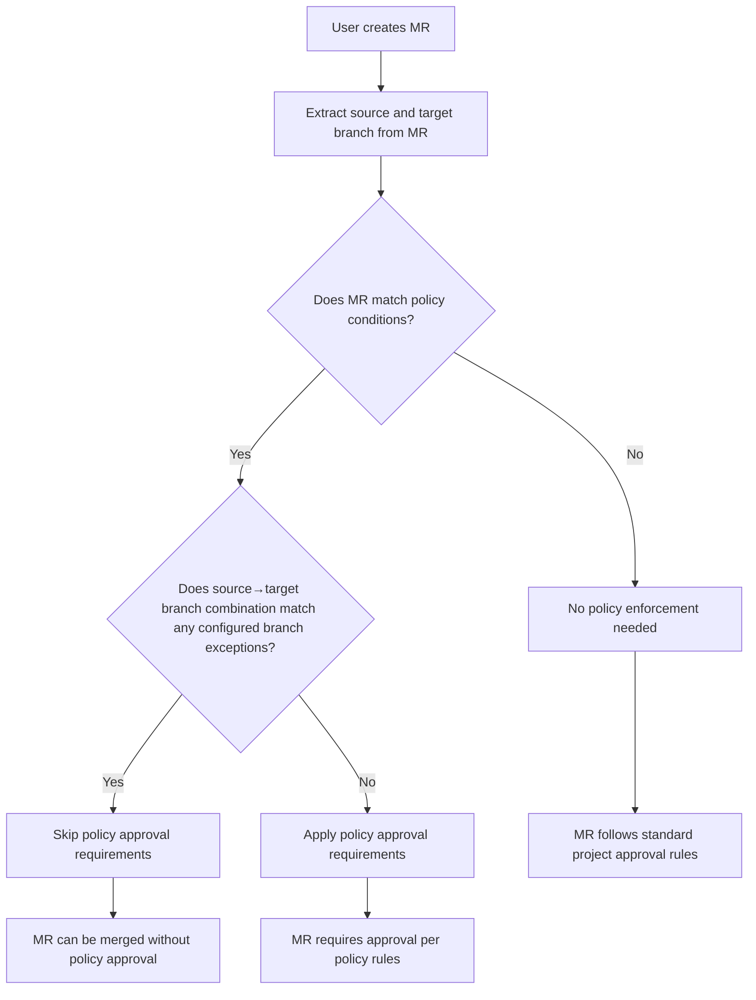
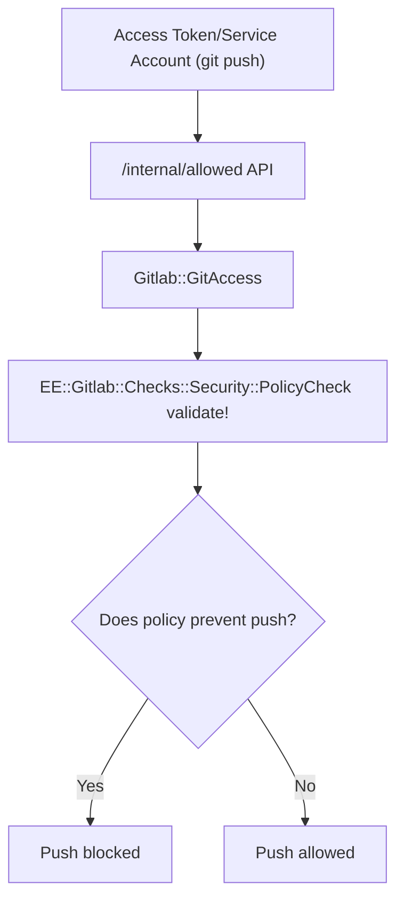
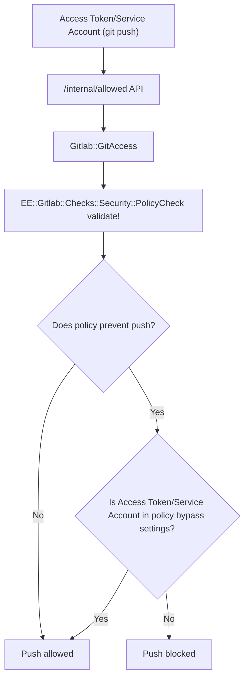

<!-- Design Documents often contain forward-looking statements -->
<!-- vale gitlab.FutureTense = NO -->

<!-- This renders the design document header on the detail page, so don't remove it-->


## Summary

Organizations implementing GitLab's Merge Request Approval Policies face a critical friction point where security controls designed for standard development processes block legitimate operational workflows including automation (CI/CD pipelines, pull mirroring, bot operations), emergency hotfixes, and complex branching strategies like GitFlow. This forces organizations to choose between maintaining strong security governance and operational efficiency, often resulting in custom workarounds that undermine the very security policies they're trying to enforce, or complete removal of policies in projects where exceptions are needed, creating compliance gaps and reducing overall security posture across their development lifecycle.

## Motivation

GitLab will support the full spectrum of development workflows—from automated CI/CD processes to emergency incident response—without compromising security posture by:

- **Source Branch Exceptions**: Define flexible source branch patterns that automatically bypass approval requirements when merging to specified target branches , eliminating approval bottlenecks while maintaining security governance.
- **Service Account & Access Token Exceptions**: Define specific service accounts, bot users, and access tokens (Instance/Group/Project tokens) to bypass approval requirements for CI/CD pipelines, pull mirroring, and automated version updates. Service accounts can push directly to protected branches using approved tokens while maintaining restrictions for human users.
- **Designated User Override**: Allow specific users, groups, and custom roles to bypass merge request approval policies during critical situations while maintaining comprehensive audit trails and governance controls.

### Goals

- **Enable Automation Workflows**: Allow service accounts, access tokens and bot users to bypass approval policies for legitimate automated processes while maintaining security boundaries
- **Support Emergency Operations**: Provide documented emergency override capabilities that maintain audit trails and governance during critical incidents
- **Accommodate Complex Branching**: Support GitFlow and other enterprise branching strategies where traditional approval workflows become impractical
- **Maintain Security Governance**: Ensure all bypasses are properly documented, audited, and traceable for compliance requirements
- **Reduce Custom Workarounds**: Eliminate the need for organizations to implement risky custom scripts or disable policies entirely

### Non-Goals

- **Weakening Security Posture**: This feature will not reduce the overall security effectiveness of approval policies or create uncontrolled bypass mechanisms
- **Replacing Existing Approval Workflows**: Standard merge request approval processes will remain unchanged for typical development workflows
- **Supporting Unlimited Exceptions**: Bypass capabilities will be controlled and require proper justification, not blanket permissions

## Proposal

The proposed architecture will be implemented in 3 iterations:

- [Source Branch Exceptions](https://gitlab.com/groups/gitlab-org/-/epics/18113)
- [Service Account & Access Token Exceptions](https://gitlab.com/groups/gitlab-org/-/epics/18112)
- [User and Group Exceptions](https://gitlab.com/groups/gitlab-org/-/epics/18114)

## Design and implementation details

### Source Branch Exceptions

**Problem**: When using GitFlow workflows, merging from `release/*` branches to `main` often leaves teams with few or no eligible approvers, since most contributors have already participated in the release branch development. This creates approval deadlocks that block critical releases.

**Solution**: Source branch pattern exceptions allow policies to automatically waive approval requirements based on source and target branch combinations. Teams will configure policies that require strict approvals for feature-to-main merges while allowing streamlined release-to-main workflows.

#### Flow Diagram



#### Policy Schema

```yaml
name: Merge request approval policy
rules:
  - type: scan_finding
    ...
actions:
  - type: require_approval
    ...
approval_settings:
  prevent_pushing_and_force_pushing: true
bypass_settings:
  branches:
    - source:
        pattern: 'release/*'
      target:
        name: 'master'
```

#### Audit Logs

Whenever a merge request is excempted by the policy, an audit log will be created with the details of the merge request.

#### Key Considerations

- The exception will also be applied when the merge request's target branch is updated after the merge request is created with a different target branch.

### Service Account & Access Token Exceptions

**Problem**: Automated workflows essential for modern DevOps practices—including CI/CD pipelines that commit version updates, pull mirroring operations, and bot-driven processes—are blocked by branch protection settings(`prevent_pushing_and_force_pushing`) in approval policies.

**Solution**: Service Accounts and Access Tokens (Personal/Project/Group) can be configured as exceptions in policies to bypass approval requirements for CI/CD pipelines, pull mirroring, and automated version updates with audit logs.

#### Flow Diagram

##### Current Flow



##### Proposed Flow



#### Policy Schema

```yaml
name: Merge request approval policy
rules:
  - type: scan_finding
    ...
actions:
  - type: require_approval
    ...
approval_settings:
  prevent_pushing_and_force_pushing: true
bypass_settings:
  service_accounts:
    - id: 123
    - id: 345
  access_tokens:
    - id: 456
    - id: 567
```

#### Audit Logs

Whenever a push is made after the bypass check, an audit log is created with the details of the service account or access token and the branch.

#### Key Considerations

- The APIs to list [service accounts](https://docs.gitlab.com/api/user_service_accounts/#list-all-service-account-users) and [access tokens](https://docs.gitlab.com/api/project_access_tokens/#list-all-project-access-tokens) requires admin permission. So we need to expose the resources for users who have access to edit the security policy so that the API can be used to load the service accounts and access tokens in the policy editor UI.

### User and Group Exceptions

**Problem**: In the case of emergency, it may be necessary to merge an MR through push, force push, or by merging without all required approvals if the MR is blocked by approvals from security policy.

**Solution**: Specific users/groups/roles/custom roles can be configured to bypass the policy approvals while collecting reason for audit logs.

#### Flow Diagram

#### Policy Schema

```yaml
name: Merge request approval policy
rules:
  - type: scan_finding
    ...
actions:
  - type: require_approval
    ...
approval_settings:
  prevent_pushing_and_force_pushing: true
bypass_settings:
  users:
    - id: 123
    - id: 345
  groups:
    - id: 456
    - id: 567
  roles:
    - id: 145
```

#### Database Schema

A new table `approval_policy_bypass_events` will be created to store the bypasses made by users.

```sql
CREATE TABLE approval_policy_bypass_events (
  id bigint NOT NULL,
  project_id bigint NOT NULL,
  merge_request_id bigint, // this can be NULL for cases when the user force pushes to a branch directly
  user_id bigint,
  security_policy_id bigint,
  source_branch text,
  target_branch text,
  reason text,
  created_at timestamp with time zone NOT NULL,
  updated_at timestamp with time zone NOT NULL
)
```

#### API & GraphQL

- Add 2 new attributes `allow_bypass` and `bypassed` to the [`ApprovalRule`](https://docs.gitlab.com/api/graphql/reference/#approvalrule) GraphQL type that denotes if the current user is eligible to bypass the approval and if the rule is already bypassed.

#### Audit Logs

Whenever a push is made after the bypass check, an audit log is created with the details of the user, merge request along with source and target branch.

#### Key Considerations

- A new [git push option](https://git-scm.com/docs/git-push#Documentation/git-push.txt---push-optionltoptiongt) (`git push -o policy.bypass=<reason>`) will be introduced along with [GitLab's existing push options](https://docs.gitlab.com/topics/git/commit/#push-options) to get the reason while the user commits to the protected branch.
