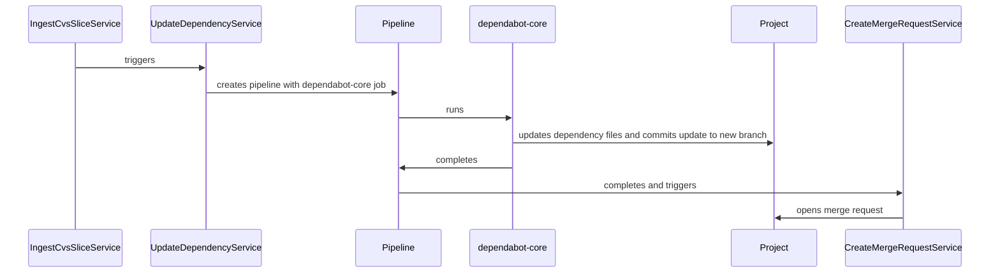
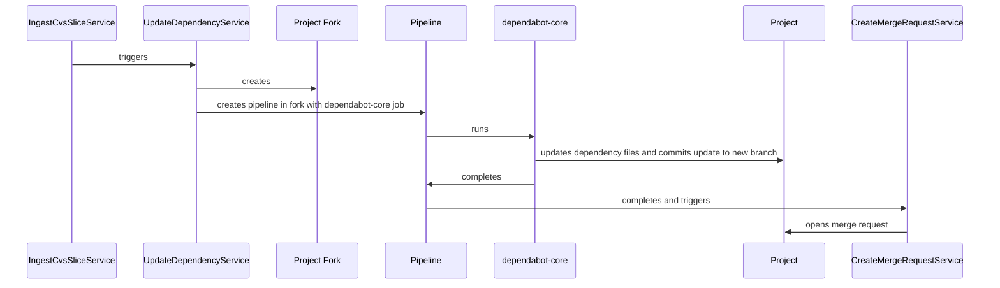

<!-- Design Documents often contain forward-looking statements -->
<!-- vale gitlab.FutureTense = NO -->

<!-- This renders the design document header on the detail page, so don't remove it-->


## Summary

Automated dependency updates is a service responsible for keeping project
dependencies up to date. Keeping project dependencies up to date is widely
considered a good practice. Doing this ensures that the latest bug fixes,
performance enhancements, and security patches are applied to project
dependencies. The process of checking for and applying dependency updates is
quite often simple, but time consuming. Automated dependency updates aims to
automatically run this process, and integrate it with the GitLab Duo Agent
Platform, so that users can enjoy a hassle-free dependency update experience.

## Motivation

Existing dependency management tools like
[Renovate](https://docs.renovatebot.com/) and
[dependabot-core](https://github.com/dependabot/dependabot-core#) can automate
the process of checking for updates and can also create merge requests with the
updates found. They however suffer from some limitations:

- Installation can be difficult to scale up [^1]
- Users are required to manage the required access tokens which adds
  configuration overhead
- They often run arbitrary code which requires additional security controls [^2] [^3]
- The dependency updates proposed by the tools lack critical context,
  such as whether they address a vulnerability—and if so,
  what the severity of that vulnerability is.

### Goals

- Automated MR creation for language dependency updates [^4]
- Zero config enablement
- Integration with the GitLab Agent Duo Platform to help identify and address
  previously manually fixed dependency update issues.

### Non-Goals

- Custom dependency managers like the ones supported by Renovate
- Updating anything other than language dependencies

## Proposal

Dependency management is inherently a complex problem space. While it's possible
to build a completely greenfield solution, it's a much more efficient option to
use an off the shelf tool that's been heavily used, and proven to work well. To
that effect, we've chosen to use the dependabot-core library to power our
automated dependency updates. The following pros and cons were considered while
evaluating this library as an option.

**Pros**:

- Diverse list of supported ecosystems
- Receives frequent contributions from core contributors and the open source community
- Written in a language that's heavily used at GitLab (Ruby)

**Cons**:

- Requires dependencies like interpreters and runtime managers [^5]
- Designed to run as an isolated CI/CD job, and not in the context of something
  like a Sidekiq worker
- Security recommendations require running a dependency proxy for private
  registries
- Only allows indirect dependency updates for projects that have a lock file

Despite some drawbacks, dependabot-core provides substantial benefits, and
allows us to deliver a solution that works for a wide percentage of our users.
Therefore, we'll be using dependabot-core to automate dependency updates.

## Design and implementation details

At a high level, the system will interact with the following components.

- **IngestCvsSliceService**: This
  [service](https://gitlab.com/gitlab-org/gitlab/blob/e4102ebc0e751446b73628c4a0161e5a4dcad504/ee/app/services/security/ingestion/ingest_cvs_slice_service.rb#L5)
  creates
  [Continuous Vulnerability Scanning](https://docs.gitlab.com/user/application_security/continuous_vulnerability_scanning/)
  vulnerabilities. When a scan completes, it will forward vulnerable components
  for further analysis. Any vulnerable components that can be updated will be
  queued to do so.
- **UpdateDependencyService**: This new service will be responsible for creating
  a new pipeline that will **only** run the dependency update job. Apart from
  turning the capability on, no further user configuration will be required.
- **dependabot-core**: This software will run in a CI/CD job, and will resolve
  the latest version a dependency can update to. It will then commit the
  necessary changes in a branch.
- **CreateMergeRequestService**: This service will create a merge request once a
  dependency update pipeline completes. This means that the accounts used for
  the dependabot-core commits will not need the permissions to create merge
  requests at the project, group, or instance level.
- **RebaseMergeRequestService**: This service is responsible for rebasing any
  open dependency update merge requests in the case of a conflict.

**Project based system**

**Alternative fork-based system**

### Separation of responsibilities

As mentioned, the dependabot-core job has the ability to run arbitrary code when
updating certain dependencies. This powerful ability allows dependabot-core to
carry out some complex updates, but it also adds some risk that needs to be
mitigated. For this reason, two separate accounts, one used for the CI/CD job
and another for the merge request creation, will be used to perform the
dependency updates.

The CI/CD job will have access to an account that will be able to read the
repository, and will only be able to write to the set of dependency update
related branches. Additionally, the job will not have any package registry
tokens set, and will instead access registries through a hardened proxy service.

Since the CI/CD job will be unable to create merge requests through the API, a
separate account will be used to create the merge requests with the
`DependencyManagement::CreateMergeRequestService` class. This class will only
open new merge requests from the branches created by the dependabot-core job.
It will not be able to do anything outside of these preconfigured tasks.

This design makes it so that a compromised token only has read and write
permissions to unprotected branches. Bundling the merge request creation with an
API call from CI/CD job would mean that a compromised token does not have the
overly permissive `api` scope attached to it.

### Module grouping

Careful consideration should be given to the module name used for this
feature set. While possible, it's not an easy task to change it later on. For
example, Sidekiq workers require [at least 3 milestones](https://docs.gitlab.com/development/sidekiq/compatibility_across_updates/#removing-worker-classes)
before they can be removed.

To that effect, it's proposed that the `DependencyManagement` module is used for
all related code. This name is descriptive, easy to find, and provides a clear
boundary on what it should handle. The `UpdateDependencyService` and `CreateMergeRequestService` will both
reside in this module, and have the following references.

- `DependencyManagement::UpdateDependencyService`
- `DependencyManagement::CreateMergeRequestService`

### Image maintenance

To complete dependency updates, we'll require access to the necessary
interpreters, compilers, and package managers. There are two viable approaches
to achieve this, both of which utilize containers.

1. Monolithic image with a comprehensive set of bundled dependencies.
1. Multiple images segmented by environments

The clear choice between the two is to create and maintain multiple images. We
have tried the monolithic image approach in other projects, and have found this
approach to have too many drawbacks. For one, monolithic images tend to be
enormous in size. This means that they take substantially longer to build,
compress, and upload to the container registry. In addition to that, the blast
area of bugs in monolithic images are much higher. Instead of causing a single
damage to a single ecosystem, a monolithic image risks causing damage to all of
the ecosystems it contains. For these reasons, we will be going with a
multi-image approach, where each ecosystem will have its own container image.

### Dependency management insights

Customers should be able to view open dependency updates, the current status
of such updates, and view if a vulnerability was closed by an automated
dependency update. To accomplish this, the following options are available.

1. Update the merge request list view to surface this information
1. Create a new dashboard type under Security
1. Enrich dependency list with references to merge requests that fix a
   vulnerability
1. Mention related merge request in vulnerability details

#### Update the merge request list view

This option will let us iterate quickly, and requires the least amount of work.
We can leverage the existing merge request page to surface merge requests
created by the dependency management bot. This list will have the proper
approval statuses surface, pipeline status, last updated status, and all the
other details already visible for normal merge requests. The downside is that we
won't have any visibility into any vulnerabilities that will be addressed.

#### Create a new dashboard type under Security

This option has a higher upfront cost, but it allows us to tailor the experience
to the dependency management, and vulnerability resolution context. With this
new view, we'll surface the following pieces of information.

- Vulnerabilities resolved by the dependency update. We currently do this with
the merge request widget, and should be able to re-use, or build from this work.
- Status of the pipeline, and any fixes applied by Duo.
- Merge request age. This piece of information can help prioritize merge
requests that have gone stale.

#### Enrich the dependency list

The dependency list already lists the number of vulnerabilities associated with
each dependency, so we may be able to add an additional piece of data that
highlights how many merge requests that resolve a vulnerability exist.

#### Mention related merge request in vulnerability details

The vulnerability page mentions the commit at which the vulnerability was no
longer detected. You can then find any related merge requests by viewing the
commit details. This can work, but hides the very important detail that the
managed dependency update assisted with this resolution.

### Usage metrics and observability

GitLab allows customers to [analyze GitLab usage](https://docs.gitlab.com/user/analytics/).
This feature set allows users to view things like AI Impact Analytics, and CI/CD
analytics. Data like this helps customers visualize the impact of adopting
features like dependency management with vulnerability resolution, so we'll be
surfacing this here as well.

## Alternative Solutions

### Bootstrap our own dependency management service

This is a fairly large task that would require us to implement version
resolution for a large amount of package managers over time, but it does have
some advantages.

**Pros**:

- Bump version ranges for projects that **do not** have a lock file
- No need to install dependencies locally

**Cons**:

- Requires a large amount of work to support the same ecosystems of existing
  tools like Renovate or dependabot-core.

[^1]:
    For example, Renovate requires a
    [global access or an allow list](https://docs.renovatebot.com/getting-started/installing-onboarding/#repository-installation).

[^2]:
    Renovate may execute
    [arbitrary code](https://docs.renovatebot.com/security-and-permissions/#execution-of-code),
    and often recommends using an allow list of user commands.

[^3]:
    dependabot-core may execute
    [arbitrary code](https://github.com/dependabot/dependabot-core#private-registry-credential-management)
    and requires the user to configure the job to run in isolation from access
    tokens for added security.

[^4]:
    Language dependencies are programming language dependencies managed by a
    package manager. Examples include Bundler managed Ruby gems, Go modules,
    Rust crates, and many more.

[^5]:
    For example, Python and PyEnv are required to run `dependabot-core/python`.
