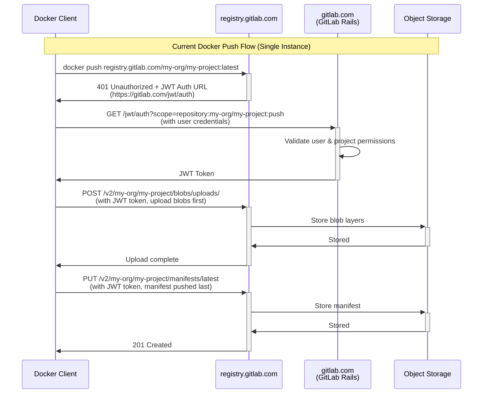
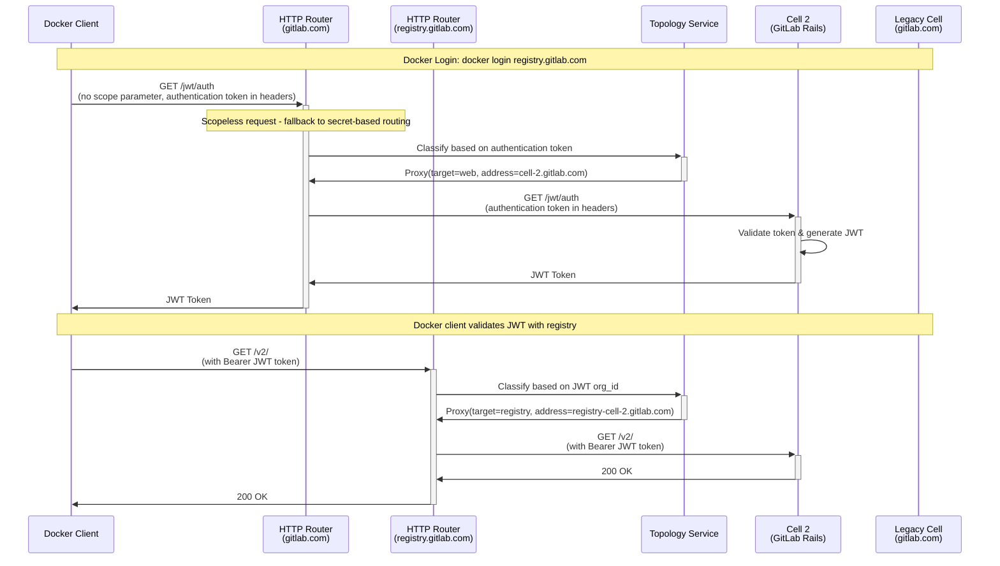
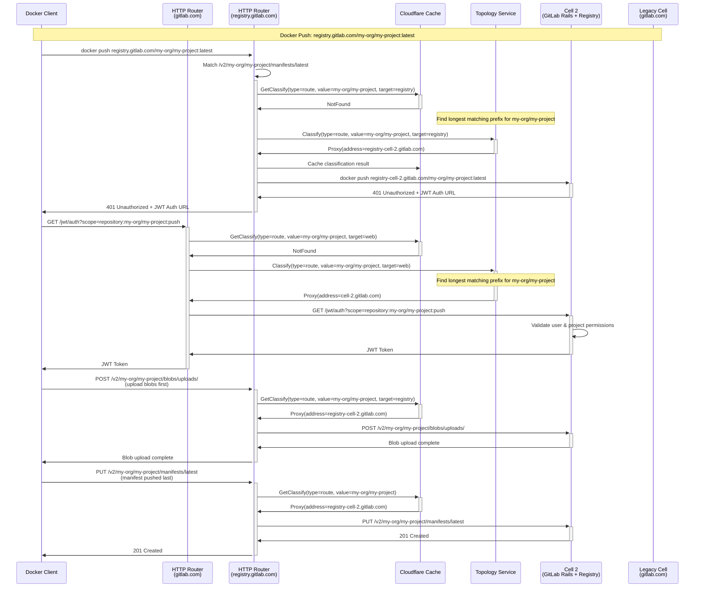
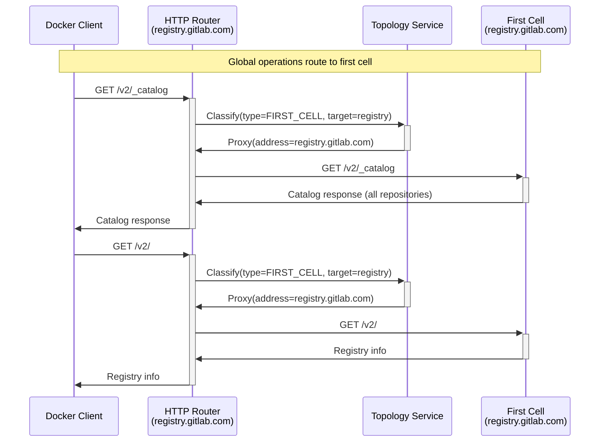
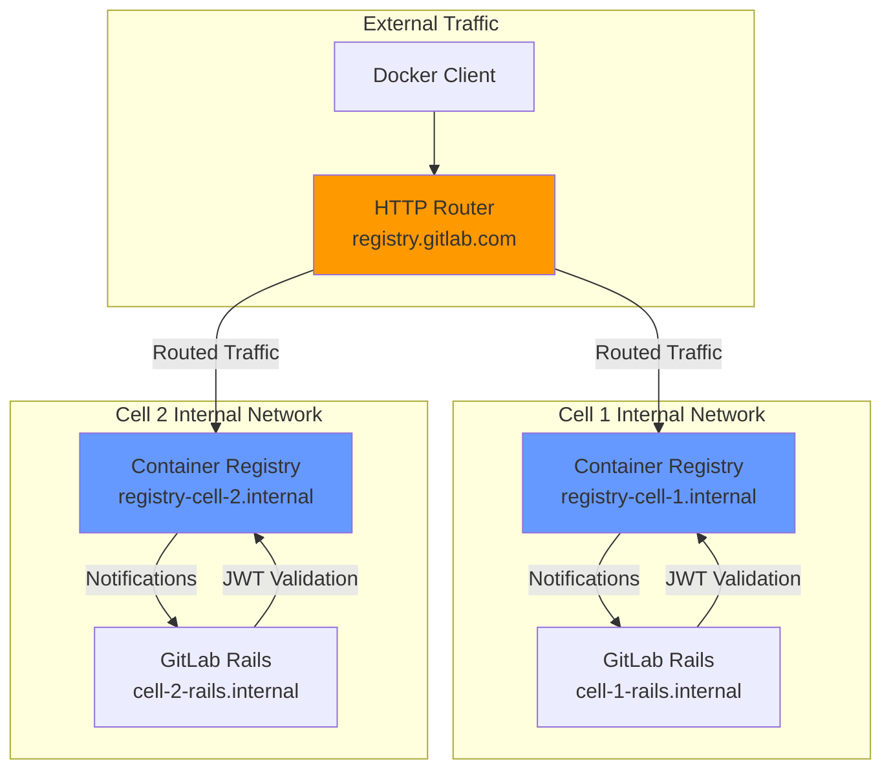



This document outlines the design goals and architecture of Container Registry Routing Service.

## Overview

This document describes the implementation of Container Registry routing within the GitLab Cells architecture using the HTTP Router. The Container Registry requires routing to the correct Cell based on project ownership using path-based routing.

## Current Docker Push Flow

Before diving into Cells implementation, let's understand how Docker push works today:



## Architecture Overview

In the Cells architecture, the `/jwt/auth` endpoint is part of GitLab Rails and must be processed by the HTTP Router to decode the scope and route to the correct Cell. Container Registry routing uses path-based routing exclusively, extracting project information from URL paths. All endpoints not explicitly classified will route to the legacy Cell.

### Key Components

- **HTTP Router**: Deployed as Cloudflare Worker, handles request routing
- **Container Registry**: Run as local service within each Cell
- **Topology Service**: Provides Cell discovery and classification
- **JWT Authentication**: `/jwt/auth` endpoint within GitLab Rails for Docker authentication
- **Legacy Cell**: Default target for all non-classified endpoints and global operations

## HTTP Router Rules Configuration

### Session Token Rules (`ruleset/session_token.json`)

Add the following rule to the existing session token ruleset for JWT authentication:

```json
{
  "comment": "Container Registry JWT Authentication - with scope (path-based routing)",
  "match": [
    {
      "type": "path",
      "regex_name": "jwt_auth",
      "regex_value": "^/jwt/auth$"
    },
    {
      "type": "query_string",
      "regex_name": "scope",
      "regex_value": "repository:(?<route>[^:]+):(?<actions>.*)"
    }
  ],
  "action": "classify",
  "classify": [
    {
      "type": "route",
      "value": "${route}",
      "target": "web"
    }
  ]
}
```

Note: `/jwt/auth` will be routed based on path only if scope repository is present, otherwise it will fallback to secret-based routing (handled by other rules in the session token ruleset). The route is sent in full to the Topology Service, which will try to find the longest matching prefix.

#### JWT Authentication Routing Limitations

The current implementation depends on the **first registry scope** in the `/jwt/auth` request for routing decisions. This creates a potential issue since the Docker Registry specification does not define the order of scopes in the request.

**Current Assumption**: Clients make the first scope the repository where they want to push, and other scopes are repositories they intend to link from (for blob mounting operations).

**Potential Issue**: If this assumption is incorrect and clients provide scopes in different orders, requests might be routed to the wrong Cell.

#### Alternative Routing Solutions

If the first-scope assumption proves problematic, several alternatives exist:

1. **Current Implementation**: `/jwt/auth` with secret-based routing (as described above)

2. **Option 1 (Preferred)**: `/jwt/auth?cell_id=X`
   - Configure Registry to include `cell_id` parameter
   - Minimal changes required
   - Risk: Some clients might not support cell_id parameters and drop them

3. **Option 2**: `/c/cell-id/jwt/auth`
   - Requires GitLab Rails changes to support `/c/cell-id` prefix
   - More reliable than query parameters
   - Moderate implementation complexity

4. **Option 3**: `/jwt/auth/cell/cell_id`
   - Requires GitLab Rails changes to support different paths
   - Higher implementation complexity

**Recommendation**: Option 1 is preferred due to minimal required changes, with Option 2 as fallback if query parameter support proves insufficient.

### Container Registry Rules (`ruleset/container_registry.json`)

Minimal ruleset for Container Registry with four rules:

```json
{
  "rules": [
    {
      "comment": "Container Registry v2 API - All project-related operations",
      "match": [
        {
          "type": "path",
          "regex_name": "v2_api",
          "regex_value": "^/v2/(?<route>[^/]+(?:/[^/]+)*)/.*$"
        }
      ],
      "action": "classify",
      "classify": [
        {
          "type": "route",
          "value": "${route}",
          "target": "registry"
        }
      ]
    },
    {
      "comment": "Container Registry v2 base endpoint - JWT token validation",
      "match": [
        {
          "type": "path",
          "regex_name": "v2_base",
          "regex_value": "^/v2/$"
        }
      ],
      "action": "classify",
      "classify": [
        {
          "type": "org_id",
          "value": "${org_id}",
          "target": "registry"
        }
      ]
    },
    {
      "comment": "GitLab Container Registry HTTP API V1",
      "match": [
        {
          "type": "path",
          "regex_name": "gitlab_v1_api",
          "regex_value": "^/gitlab/v1/repositories/(?<route>[^/]+(?:/[^/]+)*)/.*$"
        }
      ],
      "action": "classify",
      "classify": [
        {
          "type": "route",
          "value": "${route}",
          "target": "registry"
        }
      ]
    },
    {
      "comment": "All other registry endpoints route to first cell",
      "match": [],
      "action": "classify",
      "classify": {
        "type": "FIRST_CELL",
        "target": "registry"
      }
    }
  ]
}
```

Note: The `/v2/` endpoint is used for JWT token validation by Docker client. The JWT token contains organization_id which enables routing to the correct Cell. This requires organization_id to be added in the GitLab Rails generated JWT.

## Topology Service Configuration Extension

### Current Topology Service Configuration

The Topology Service configuration needs to be extended to include Container Registry URL information for each Cell:

```toml
# Legacy Cell configuration
[[cells]]
address = "gitlab.com"
registry_address = "registry.gitlab.com"

[[cells]]
address = "cell-us-1.gitlab.com"
registry_address = "registry-cell-us-1.gitlab.com"

[[cells]]
address = "cell-eu-1.gitlab.com"
registry_address = "registry-cell-eu-1.gitlab.com"
```

## Docker Login Authentication Flow

### Docker Login Process

The `docker login` command is scopeless and will be routed using secret-based routing:



### Repository Linking Limitation

Repository linking functionality will not work in this architecture:

- **Cross-Cell Mounting**: Users cannot mount blobs from repositories in different Cells
- **Public Resource Access**: Users can only access public resources from other Organizations or Cells
- **Single Repository Routing**: Each JWT request is routed based on the first repository in the scope only

### Public Repository Access Across Cells

The `/jwt/auth` endpoint routing based on project path is essential for accessing public container repositories from other Cells. When a user attempts to pull a public image from a different Cell:

1. **Path-Based Routing**: The `/jwt/auth` request includes the repository scope, allowing the HTTP Router to route the authentication request to the Cell containing the repository
2. **Cross-Cell Public Access**: This enables users to authenticate and pull public repositories that exist in different Cells than their home Cell
3. **Public Project Resolution**: Even though user credentials may not be valid on another Cell, the system will be able to resolve public project access by routing the authentication request to the correct Cell where the public repository exists

Without path-based routing for `/jwt/auth`, users would only be able to access repositories within their own Cell.

## Container Registry Request Flow

### Docker Push Flow with Separate HTTP Routers



### Legacy Cell Fallback Flow



## Implementation Details

### HTTP Router Configuration

Separate HTTP Routers are deployed for different domains:

```javascript
// wrangler.toml configuration for gitlab.com
[env.gprd.vars]
vars = { 
  GITLAB_SESSION_RULES = "session_token", 
  TOPOLOGY_SERVICE_URL = "https://topology-service.gitlab.com" 
}

// wrangler.toml configuration for registry.gitlab.com
[env.reg_gprd.vars]
vars = { 
  GITLAB_SESSION_RULES = "container_registry", 
  TOPOLOGY_SERVICE_URL = "https://topology-service.gitlab.com"
}
```

### Separate HTTP Router Architecture

The Container Registry uses a separate HTTP Router deployment from GitLab Rails for the following architectural reasons:

#### Service Separation Benefits

1. **Different Rule Complexity**: Registry rules are lightweight (3-4 rules) and unlikely to change after initial deployment, while GitLab Rails rules are more complex and frequently updated

2. **Different Token Handling**: Registry uses JWT Bearer tokens with different validation requirements than GitLab Rails session tokens

3. **Performance Optimization**: Avoids CPU cost of processing GitLab Rails rules that will never match registry requests

4. **Reduced Complexity**: Eliminates need for:
   - Host header processing when not required
   - Conditional logic for different rulesets based on hostname
   - Environment-specific ruleset management

5. **Service Scalability**: Follows the pattern where additional services get their own rulesets rather than joining existing ones

6. **Configuration Management**: Each service can maintain its own ruleset without cross-service dependencies

#### Configuration Approach

Rather than using magic conventions replicated across multiple places, explicit configuration is required. While conventions are acceptable when implemented in a single place, having the same convention in multiple locations creates maintenance complexity. Services implementing conventions can generate appropriate configurations, but the configuration itself must be explicit and centralized.

### HTTP Router Changes Required

The HTTP Router requires the following enhancements to support Container Registry routing:

#### 1. Target-Based Routing Support

Add support for the `target` parameter in routing rules:

```javascript
export interface ClassifyRequest {
  type: string;
  value?: string;
  target: string; // default to "web"
}
```

#### 2. Topology Service API Updates

Update the ClassifyRequest interface:

```proto
enum TargetType {
  WEB = 0;
  REGISTRY = 1;
}

message ClassifyRequest {
  ClassifyType type = 2;
  string value = 3;
  TargetType target = 4;
}
```

#### 3. Topology Service Config Updates

```toml
[[cells]]
id = 1
address = "my.cell-1.example.com"
registry_address = "registry.my.cell-1.example.com"
```

#### 4. Multiple Classification Matches Support

The HTTP Router must support multiple classification matches processed in sequence. Example rule structure:

```json
{
  "match": [
    {
      "type": "path",
      "regex_name": "jwt_auth",
      "regex_value": "^/jwt/auth$"
    },
    {
      "type": "query_string",
      "regex_name": "scope",
      "regex_value": "repository:(?<project_path>[^:]+):(?<actions>.*)"
    }
  ]
}
```

Matches are processed in sequence until a successful classification is found. The route is sent in full to the Topology Service, which will try to find the longest matching prefix.

#### 5. Caching with Target Parameter

The target parameter will be automatically cached as part of the classify request body hash. The existing caching mechanism in the HTTP Router caches based on the request body hash, which will include the target parameter, ensuring proper cache isolation between different target types.

### Topology Service Target-Based Routing

The HTTP Router uses the target parameter when calling the Topology Service. The Topology Service, based on the target, will return the proper URL:

```javascript
// Example Topology Service call
const response = await topologyService.classify({
  type: "project_full_path",
  value: "my-org/my-project",
  target: "registry"  // or "web"
});

// Response will contain the appropriate URL based on target
// For target="registry": returns registry-cell-2.gitlab.com
// For target="web": returns cell-2.gitlab.com
```

### Cell Configuration Requirements

No changes are required in GitLab Rails or Container Registry components. All connectivity is handled by the HTTP Router. Each Cell requires minimal configuration:

#### Container Registry Configuration

Each Cell's Container Registry must be configured with:

1. **Public Endpoint**: All Cells use `registry.gitlab.com` as the public host
2. **Internal Communication**: Each Cell uses internal URLs (`api_url`) for Cell-to-Registry communication
3. **Cell-Specific Keys**: Each Cell has its own signing keys for JWT token validation
4. **Internal Notifications**: Registry pushes notifications to Cell Rails using internal networking

#### GitLab Rails Configuration

GitLab Rails requires minimal configuration changes:

```yaml
# GitLab Rails configuration for Cell
gitlab:
  registry:
    enabled: true
    host: registry.gitlab.com  # Public endpoint
    port: 443
    api_url: http://registry-cell-1.internal:5000/  # Internal registry URL
    key: /path/to/cell-1-registry.key  # Same key as registry for JWT validation
    issuer: cell-1-gitlab-issuer  # Cell-specific issuer
```

### Network Architecture

The HTTP Router handles all external routing, while Cells use internal networking:



## Related Documents

- [GitLab Cells Infrastructure Architecture](infrastructure/_index.md)
- [HTTP Router Configuration](https://gitlab.com/gitlab-org/cells/http-router/-/blob/main/docs/config.md)
- [HTTP Router Rulesets](https://gitlab.com/gitlab-org/cells/http-router/-/tree/main/config/ruleset)
- [Topology Service Implementation](https://gitlab.com/gitlab-org/cells/topology-service)
- [Container Registry Auth Request Flow](https://gitlab.com/gitlab-org/container-registry/-/blob/master/docs/auth-request-flow.md) - Most accurate Docker flows documentation
