## Summary

All user data will be wrapped in an [Organization](goals.md#organizations)
which provides isolation and enables moving an organization from one Cell to
another, especially from the [Legacy Cell](goals.md#legacy-cell).

In [Protocells](https://gitlab.com/groups/gitlab-com/gl-infra/-/epics/1616), we
will define cohorts consisting of top-level groups that can be moved
to an organization and then migrated to a Cell.

[Defining](https://gitlab.com/gitlab-com/gl-infra/mstaff/-/issues/474) the cohorts
is the first part of work, but we also need to build tooling to move organizations
from the Legacy Cell to a Cell. The first major target is to begin moving
easy-to-move organizations to Protocells in FY27Q1.

This design document focuses on the migration tooling that moves an organization
from source to destination. it only mentions Cohorts and Top Level Group
migration and doesn't go into implementation detail of those.

## Motivation

Cells is only successful if we meet its primary goal to horizontally scale
GitLab.com. For us to scale we need to move the existing data we have on Legacy
Cell to new Cells to permanently remove load before we hit database scaling
limits. This migration capability is essential for future-proofing our GitLab.com
services as GitLab grows.

### Goals

- _Interruptible_: If a migration is interrupted like a compute failure or stopped
  by an operator it should start where it left off.
- _Hands Off_: The migration should run in the background, and we shouldn't have
  a team member laptop running the migration.
- _Code Reuse_: Geo was built to replicate data from one GitLab instance to
  another, we are doing the same but it's on a organization level.
- _No Data Loss_: All data that lives on the source Cell should be available on the
  destination Cell. This means that we have account for all data types such as
  Object Storage, Postgres, Advanced Search, Exact Code Search, Git, and Container Registry.
- _No Cell Downtime_: When migrating an organization the source Cell and
  destination Cell shouldn't incur any downtime.
- _No Visible Downtime_: The organization should not realize that we are migrating their
  data. We will never get zero downtime and we will start with some
  downtime/read-only but will continuously improve this the higher profile
  customers we migrate.
- _Large Organizations Support_: Able to migrate terabytes of data in a
  timely fashion. This means we have to make our tooling scalable to the data.
- _Concurrency_: Able to migrate multiple organizations at the same time without
  affecting one another.
- _Cell Local_: A migration should happen on the destination Cell to prevent a
  single point of failure for all migrations.
- _Minimal Throwaway Work_: We should iterate on the migration tooling instead
  of re-writing it multiple times.
- _Observability_: At any point in time we need to know where the migration is
  at, and if there are any problems.
- _Cell Aware_: The migration tooling needs to also update information in
  Topology Service to start routing requests to the correct Cell.
- _No User Visible Performance Impact_: Migration should not degrade performance for
  neither the source or destination Cell.
- _Rollback Capability_: If we need to migrate an organization back to the
  source destination this should be possible.
- _Dry Run Support_: Operators should be able to test migrations with validation
  and time estimates without actually moving data.
- _Security_: All data in transit should be encrypted, and cross-cell communication
  must use proper authentication and authorization.

### Non-Goals

- The decision of which organization lives in which cell.
- Support for self-hosted installations.
- Be a replacement to any disaster recovery tooling.

## High-Level Proposal

A organization move can be broken down into five distinct high-level phases:

1. **Continuously replicate an organization's non-PostgreSQL data from the source cell to the target cell.**

    1. Organization Migration will reuse [Geo](https://docs.gitlab.com/ee/administration/geo/) code to transfer non-PostgreSQL data continuously to the target cell.

       The purpose is to reuse GitLab Geo code to replicate organization data outside the PostgreSQL database (files, Git data, object storage, container registry, etc.) from the source cell to the target cell. Given that cells cannot use PostgreSQL streaming replication, we need to make Geo independent of the method of PostgreSQL replication. This way, the target cell can connect directly to the source cell database or use PostgreSQL logical replication.

1. **Prepare the organization for the switchover.**

    1. Put the organization into a [maintenance mode](https://gitlab.com/groups/gitlab-org/-/epics/13800).

       A switchover requires a maintenance window in which updates to the source cell are blocked to ensure the switchover can occur without data loss. To block new writes to the data on the source Cell, we put the organization in maintenance mode. This means that the organization's users cannot make any writes to it while in maintenance mode.

       The maintenance window ends once the replication of all the organization's data is completely finished and verified and the routing table is updated. So, to keep the window as short as possible, we should ensure that non-PostgreSQL data replication and verification processes are as close to 100% as possible during active use, and that the newer changes are almost immediately replicated to the target cell before putting the organization in maintenance mode.

1. **Copy organization's PostgreSQL data from the source cell to the target cell.**

    1. Copy data for a particular organization from the source database and write it to the target database present in another cell.

       Copy data for a particular organization from the source database in multiple tables based on `organization_id` and write it to the database present in the target cell.

       Early Organization Migration will implement a tool that uses the [COPY approach](https://gitlab.com/gitlab-org/gitlab/-/issues/473894) to transfer PostgreSQL data during cutover. This requires a long downtime to move large organizations, but can be very quick for small organizations.

       The tool is also responsible for the secrets/tokens stored at rest (database). It will establish a trust between the source and target cell to either re-encrypt data inline or prepare the encrypted data on the source cell to be re-encrypted with a transport key and re-encrypted to the target cell after the process finishes. This document does not require a decision at the time of writing.

    1. Handle tables exempt from sharding.

       Some tables are missing the sharding key, so the tooling will need to know how to move the data in each of these tables to the target database. This must happen after the organization database data copy is complete.

    1. Handle the ElasticSearch and Zoekt data.

       TBD

    1. Rebuild the ClickHouse data.

       We don't have the `organization_id` available in ClickHouse to move the data to another cell, and most data in ClickHouse is built from PostgreSQL. So once the organization database data copy is complete, we must rebuild the ClickHouse data from PostgreSQL data.

       It is important to note that the Analytics Data Working Group is investigating different ways of syncing data, which would automatically pick up database-level changes and apply them to ClickHouse databases. Since the Organization Migration re-creates data on the target cell and drops data from the source cell, changes will be picked up by ClickHouse automatically, and the Organization Migration does not need to know about ClickHouse. This is still in [the research phase](https://gitlab.com/gitlab-org/architecture/gitlab-data-analytics/design-doc/-/blob/master/areas/synchronization.md?ref_type=heads#goals-and-objectives.).

1. **Switchover and update the routing information.**

    There are no new writes to the organization data in the source cell, and the
    organization database in the source cell is equal to the organization data in
    the target cell. So, we change the routing information for the organization
    `cell_id`. When we update the `cell_id`, it will automatically make the given
    cell authoritative to handle traffic for the given organization, and we can
    disable the maintenance mode.

1. **Remove all organization data that has been moved over.**

    1. Delete organization's stale data from the source cell:

        1. Remove all data from the PostgreSQL database.

        1. Remove all data from tables exempt from sharding.

        1. Rebuild the ClickHouse data.

        1. Remove all non-PostgreSQL data.

    1. Delete organization's stale data from the targer cell:

        1. Remove all data from the Geo tracking database.

## Implementation Roadmap

Based on the [Near-term vision for Protocells FY26Q3-FY27Q1](#near-term-vision-for-protocells-fy26q3-fy27q1), as of July 2025, the [Organization Migration](https://gitlab.com/groups/gitlab-com/gl-infra/-/epics/1626) implementation will proceed through several phases:

### **FY26 Q3: Protocells Foundation**

**Goal**: Establish the foundational capabilities to move the first cohorts of organizations from the Legacy Cell to Protocells.

- **Cohort Selection**: Define and select granular cohorts for initial migrations (e.g. first, organizations with no Git repos or object storage data, second, ...)
- **Add Geo Selective Sync by Organization**: This feature allows Geo to replicate all Git, container registry, and object storage data
- **Infrastructure Preparation**: Configure Protocells to act as Geo secondary sites of the Legacy Cell
- **Manual Migration Tooling**: Develop scripts and playbooks for orchestrating an organization data migration
- **PostgreSQL Data Copy**: Implement PostgreSQL data extraction and insertion for organization-scoped data

### **FY26 Q4: Test and Expand Migration Capabilities**

**Goal**: Begin testing migrations in staging and production infrastructure. Expand the cohorts that can be migrated by continuing to support more data types in selective sync by organization.

- **Continue Adding Geo Selective Sync by Organization**: This feature allows Geo to replicate all Git, container registry, and object storage data
- **Handle replication of cell-local tables**: Handle LFS objects rows, and references to shards table
- **Basic Validation**: Create checksumming and validation tools for PostgreSQL data
- **Quiesce data**: Prevent and block writes to an organization's data to ensure data integrity during cutover
- **Finalize migration**: Re-route requests to the destination cell, allow writes to the organization

### **FY27 Q1: Production Migration Execution**

**Goal**: Begin moving real organizations from the Legacy Cell to Protocells.

- **Initial Cohort Migrations**: Start with the smallest, simplest organizations (inactive users, minimal data)
- **React to High-Priority Needs**: Implement bug fixes and better observability

### **Beyond FY27 Q1: Scale and Optimize**

**Future Considerations** (timeline to be determined based on learnings from initial migrations):

- **Automated Orchestration**: Reduce manual intervention required for migrations
- **Larger Organization Support**: Improve migration experience of more complex organizations with more data
- **Reduced Downtime**: Minimize maintenance windows
- **Cross-Cell Rebalancing**: Enable moving organizations between any cells (not just from Legacy Cell)

### **Success Metrics**

In rough order or priority:

- Number of organizations successfully migrated from Legacy Cell
- Data integrity validation (zero data loss)
- Infrastructure stability during migrations
- Migration downtime per organization
- Operational toil reduction over time

## Long-term vision

### Overview of components involved in data replication

The automated data replication system uses a combination of PostgreSQL logical replication, message queuing, and background job processing to continuously sync organization data between cells. This diagram shows the key components and their interactions:

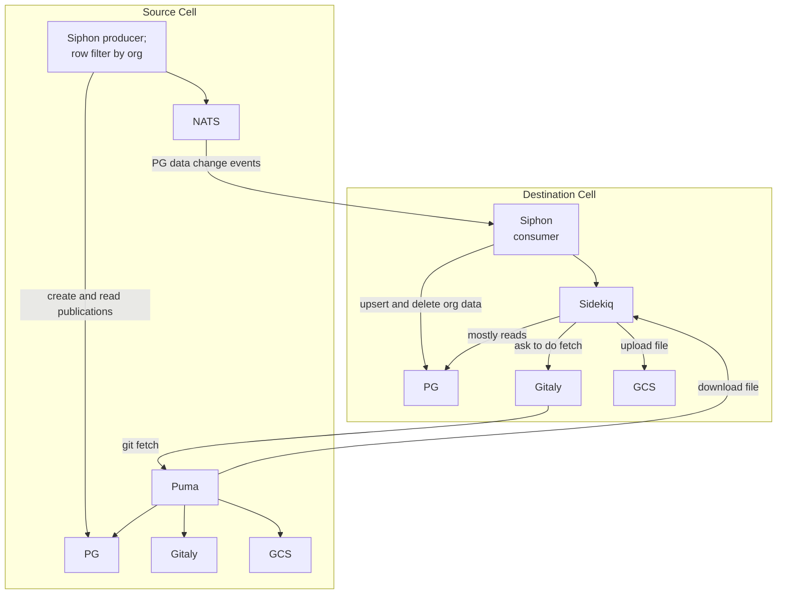

### Components involved in configuring a new organization migration

Before data replication can begin, several components must be configured and coordinated. An external orchestration system manages the setup process across both source and destination cells.

An application external to both cells, for example something like Switchboard, is responsible for:

- Configuring a NATS service
- Configuring Siphon producer(s) and consumer(s)
- Using GitLab Rails API to configure a new organization migration

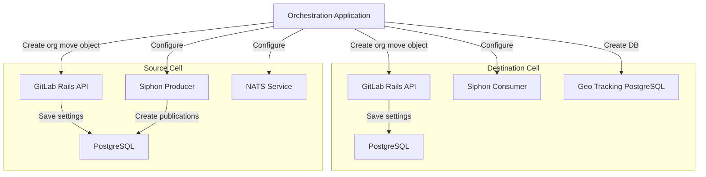

### Data replication flow example

This sequence diagram illustrates how the system handles a typical data change event, using a CI job artifact upload as an example. The flow demonstrates the end-to-end process from initial data creation to final replication and file synchronization.

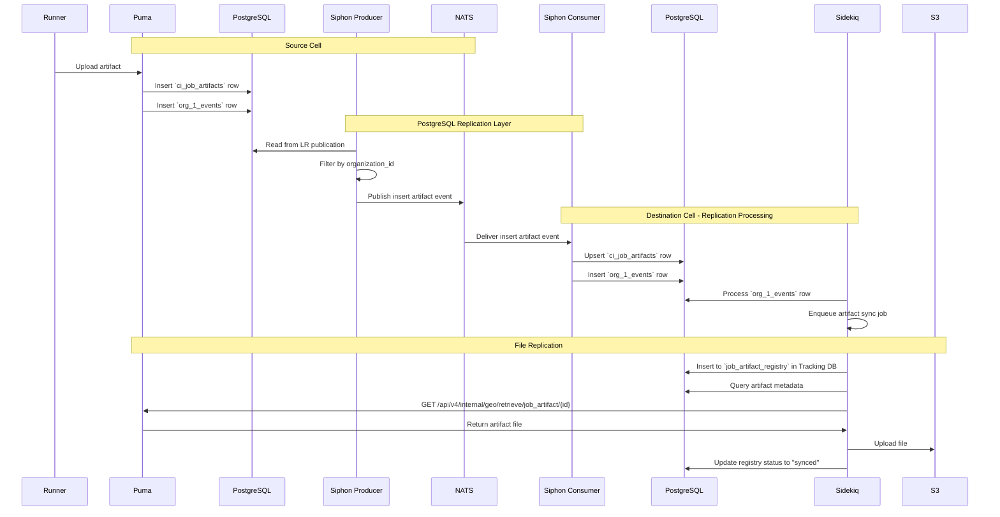

## Near-term vision for Protocells FY26Q3-FY27Q1

The following sections describe many possible paths to performing organization data migration, each with different trade-offs in terms of complexity, downtime, and operational requirements.

The current direction is the [Geo-leveraged migration process](#geo-leveraged-migration-process).

### Geo-leveraged migration process

This approach repurposes existing Geo replication infrastructure to handle organization migration. By configuring the destination cell as a temporary Geo secondary site, we can leverage proven replication mechanisms while minimizing custom development.

Unfortunately we must disable Geo configuration in Protocells. Then we can more easily configure the Protocell to act as a secondary Geo site without designing cascading replication or resolving Geo/Organization Migration conflicts. But this tradeoff is acceptable because legacy GitLab.com does not have Geo as a disaster recovery option.

This approach is aligned with the [Long-term vision](#long-term-vision), unlike the [Fully manual migration process](#fully-manual-migration-process). Therefore if it can be achieved in time, it is more efficient overall.

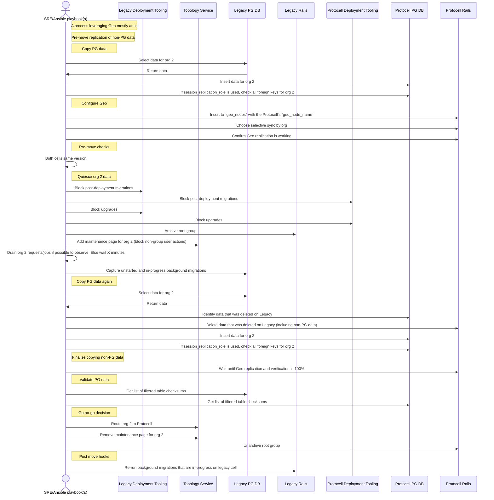

### Fully manual migration process

This approach provides maximum control, and there are more options for cutting scope if time runs out. If we cannot find the capacity for the [Geo-leveraged migration process](#geo-leveraged-migration-process), then it may be necessary to go with a much more manual approach.

However, this approach may contain more unknown unknowns.

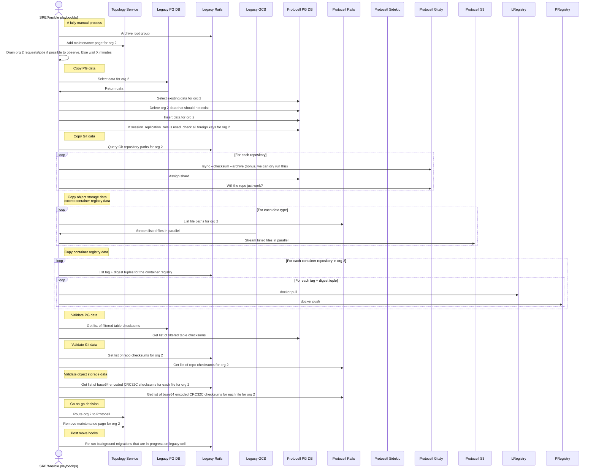

#### Manual options for copying Git data

The following options provide different approaches to copying Git repositories, each with specific advantages and operational considerations.

##### Option 1: Rsync

Direct file-level synchronization using rsync provides the fastest transfer method and allows for dry-run validation. Since an organization's Git repositories are mixed with other organizations', we may need to use an rsync command per repository. To minimize downtime, we must sync while an organization is active, and propagate deletions.

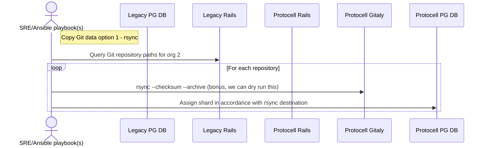

##### Option 2: Backup/restore

Using built-in backup and restore functionality ensures compatibility and handles repository metadata correctly. This approach is slow but provides the highest confidence in data integrity. Minimizing organization downtime is difficult.

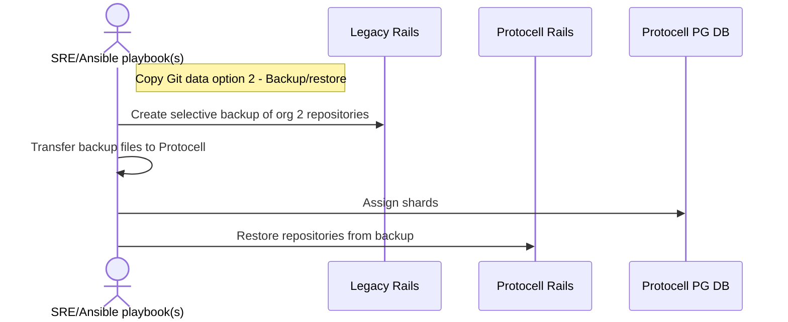

##### Option 3: Minimal adaptation of Geo code

This approach reuses existing Geo synchronization logic with minimal modifications, providing a balance between development effort and operational reliability.

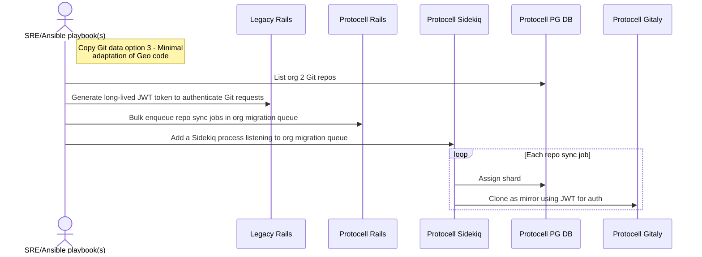

##### Option 4: Legacy cell temporarily uses protocell's Gitaly storage

This approach minimizes data transfer by moving repositories directly to the destination cell's storage while they're still being served by the source cell. It requires careful coordination but can significantly reduce migration time.

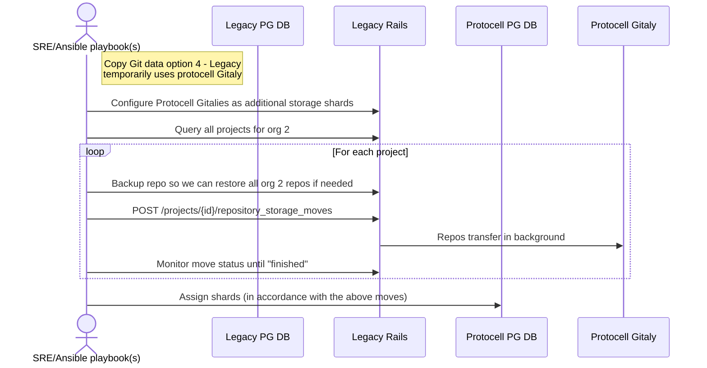

#### Manual options for copying container registry data

Container registry data presents unique challenges due to its distributed nature and blob deduplication. Unlike other data types, container registry blobs are shared across the entire registry and cannot be easily scoped to individual organizations.

How can we identify a specific organization's container registry data? We can query the PostgreSQL database for "container repositories" which are associated with projects.

How can we copy the associated object storage files? Unfortunately the file structure is not entirely scoped by namespace or project. Blobs are deduplicated by digest for the whole registry.

So we probably need to talk to the registry service either directly or through methods in the GitLab Rails application.

##### Option 1: Script doing pull and push

This approach uses standard Docker registry protocols to transfer container images. It's the most straightforward method but can be slow for large registries with many layers.

The inner loop is roughly what the Geo container repository sync job does under the hood.

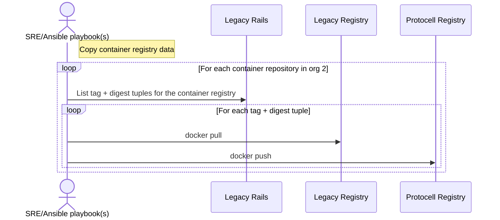

##### Option 2: Use Container Registry API + Blob Mapping

This approach directly manipulates the underlying storage blobs, potentially offering better performance by avoiding the Docker protocol overhead. However, it requires deep knowledge of the registry's internal structure.

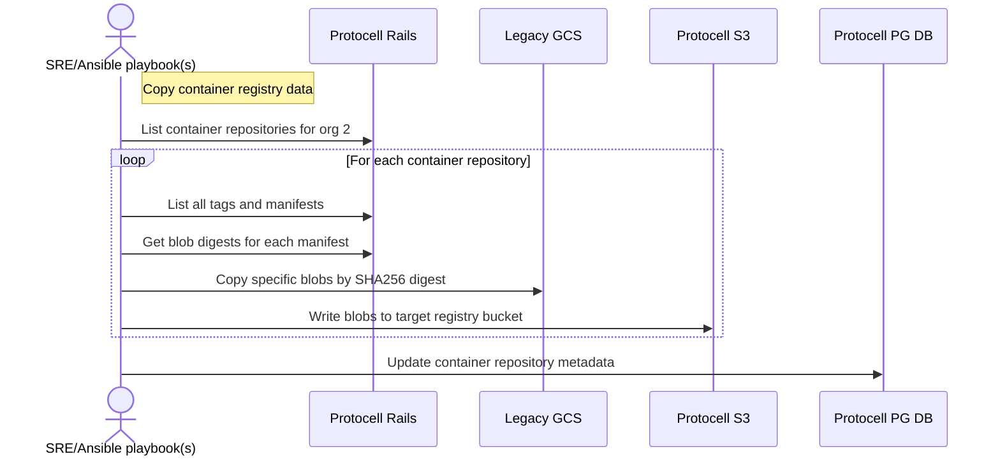
