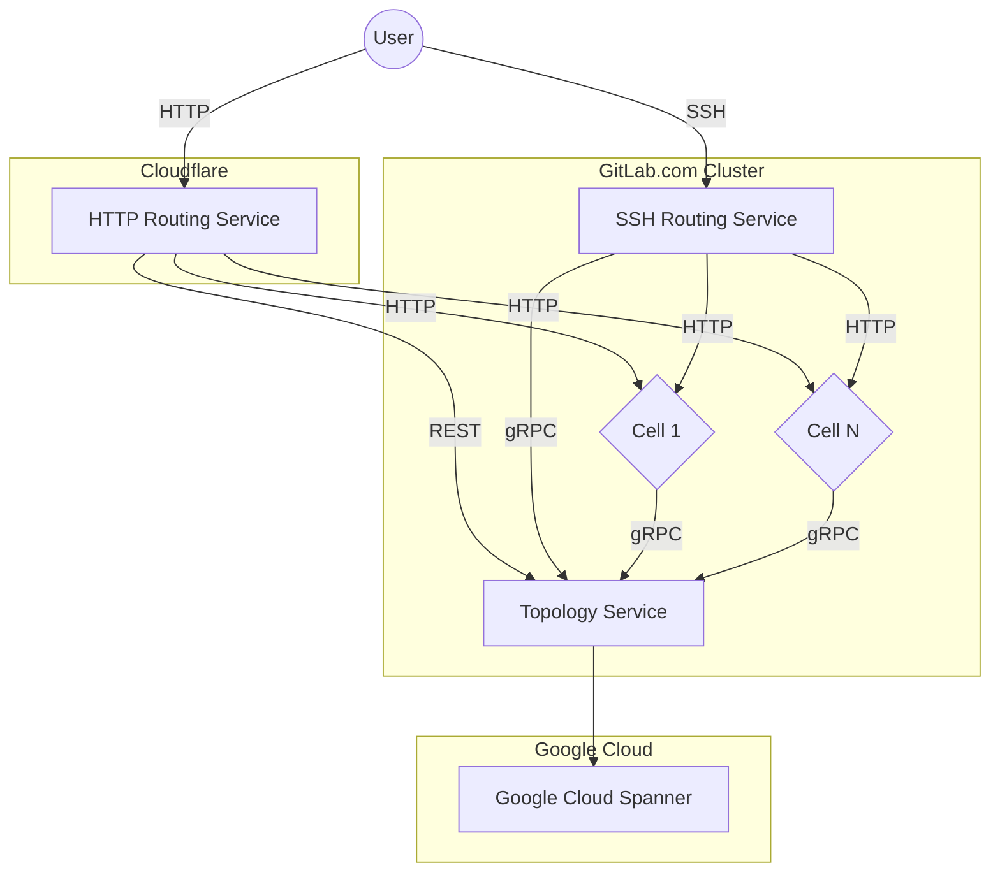
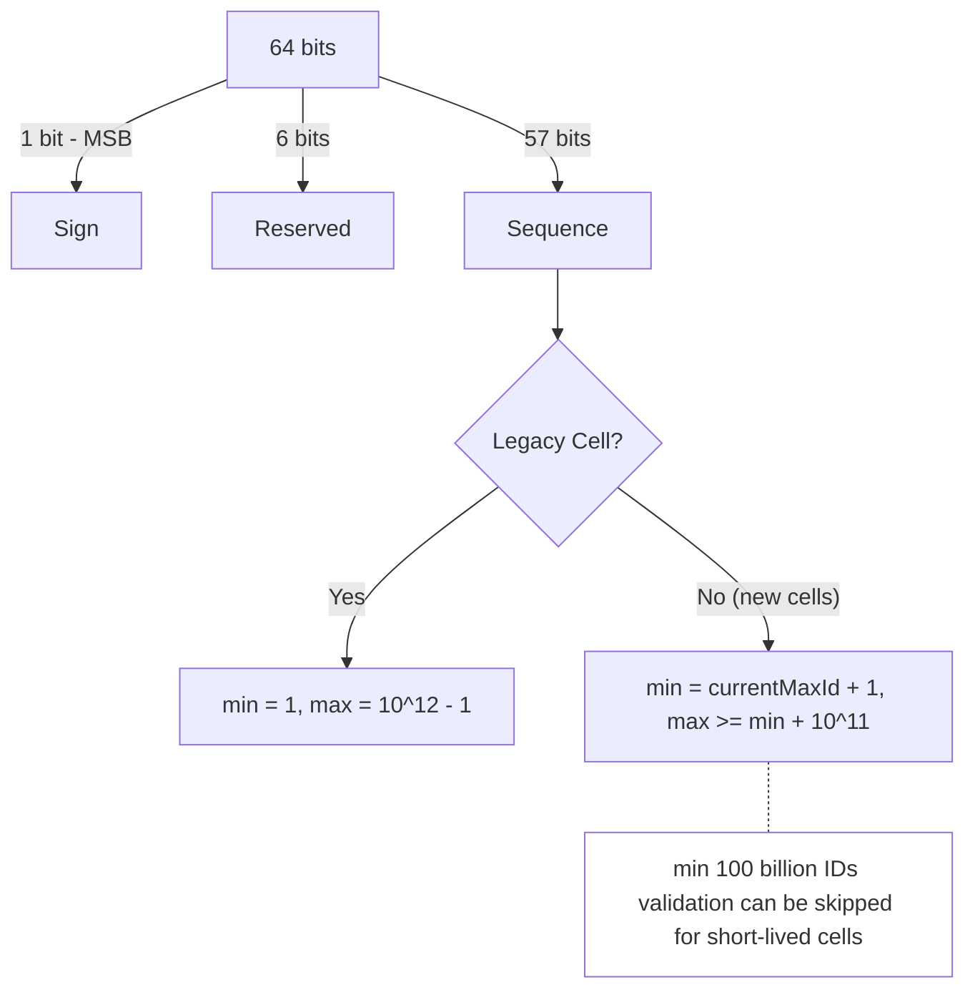
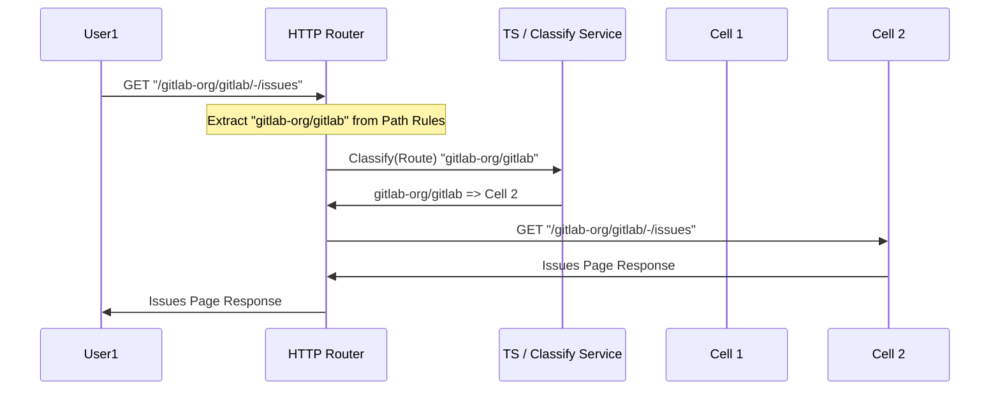
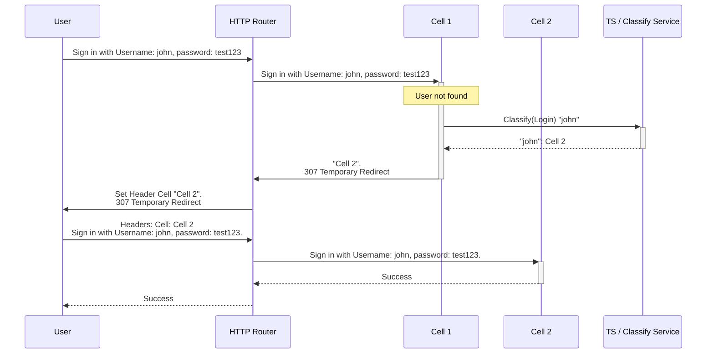
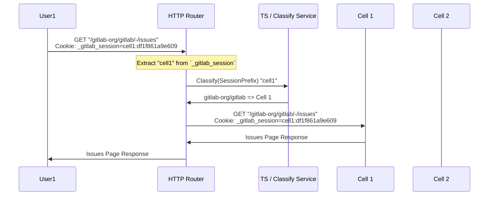
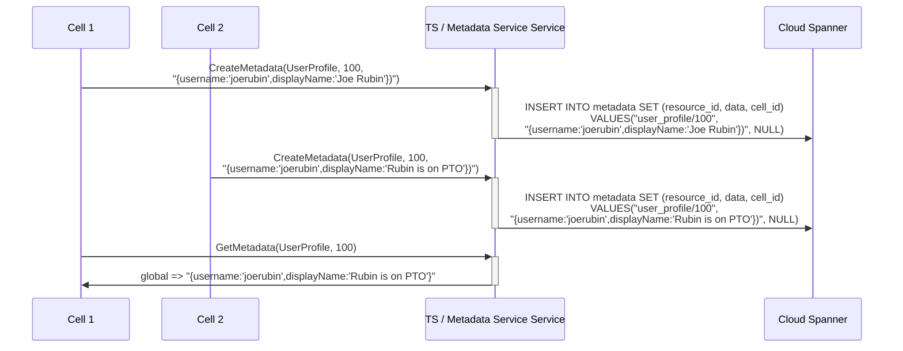
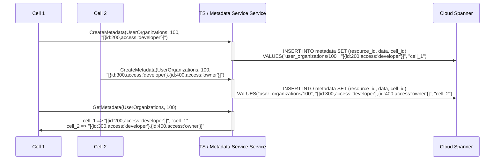
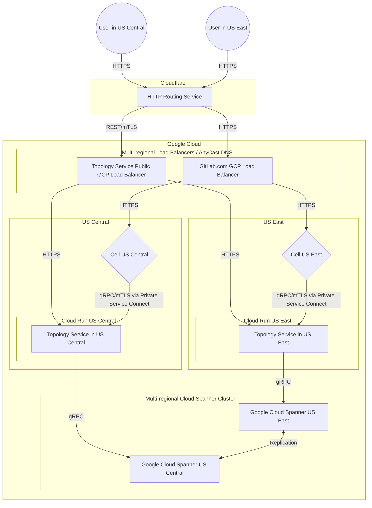

This document describes design goals and architecture of Topology Service
used by Cells.

## Goals

The purpose of Topology Service is to provide essential features for Cells
to operate. The Topology Service will implement a limited set of functions
and serve as an authoritative entity within the Cluster. There's only a single
Topology Service, that can be deployed in many regions.

1. **Technology.**

    The Topology Service will be written in [Go](https://go.dev/)
    and expose API over [gRPC](https://grpc.io/), and REST API.

1. **Cells aware.**

    The Topology Service will contain a list of all Cells. The Topology Service
    will monitor Cells health, and could pass this information down to Cells
    itself or Routing Service. Whether the Cell is healthy will be determined
    by various factors:

    - Watchdog: last time Cell contacted,
    - Failure rate: information gathered from the Routing Service
    - Configuration: Cells explicitly marked as orphaned

1. **Cloud first.**

    The Topology Service will be deployed in Cloud, and use Cloud managed services
    to operate. Those services at later point could be extended with on-premise
    equivalents if required.

    The Topology Service will be written using a dual dialect:

    - GoogleSQL to run at scale for GitLab.com with Cloud Spanner
    - PostgreSQL for use internally and later provide on-premise compatibility.

1. **Small.**

    The Topology Service due to its criticality in architecture will be limited to
    provide only essential functions required for cluster to operate.

## Requirements

| Requirement   | Description                                                                | Priority |
| ------------- | -------------------------------------------------------------------------- | -------- |
| Configurable  | contains information about all Cells                                       | high     |
| Security      | only authorized cells can use it                                           | high     |
| Cloud-managed | can use cloud managed services to operate                                  | high     |
| Latency       | Satisfactory Latency Threshold of 20ms, 99.95% Error SLO, 99.95% Apdex SLO | high     |
| Self-managed  | can be eventually used by [self-managed](goals.md#self-managed)            | low      |
| Regional      | can route requests to different [regions](goals.md#regions)                | low      |

## Non-Goals

Those Goals are outside of the Topology Service scope as they heavily inflate the complexity:

- The Topology Service will not provide indexing of the user-facing information for Cells.
  Example: CI Catalog to show data available cluster-wide will have to use another means
  to merge the information from all Cells.
- The Topology Service has no knowledge of the business logic of GitLab.
  In theory it can work with any other web application that has the same authentication/access
  tokens as GitLab. However, this is subject to change as part of implementation.

## Architecture

The Topology Service implements the following design guidelines:

- Topology Service implements only a few gRPC services.
- Some services due to backward compatibility are additionally exposed with REST API.
- Topology Service does not perform complex processing of information.
- Topology Service does not aggregate information from Cells.



### Configuration

The Topology Service will use `config.toml` to configure all service parameters.

#### List of Cells

```toml
[[cells]]
id = 1
address = "cell-us-1.gitlab.com"
session_prefix = "cell1:"
```

### Sequence Service

On initial provisioning, each cell will reach out to the SequenceService to get the range of IDs for their ID sequences.
Topology Service will make sure that the given range is not overlapping with other cell's sequences.

#### Logic to compute the range



- **Sign**: Always 0 for positive numbers.
- **Reserved**: Currently always `0`, reserved for 2 purposes.
  1. To increase the number of cells, if needed.
  1. To allow us to switch to a variant of ULID ID allocation in future without interfering with the existing IDs. Since
   ULID based ID allocator will have the `timestamp` value in the most significant bits,
   reserving only one bit would have been sufficient but
   more bits are reserved to have the sequence bits at minimum.
- **Sequence**:
  - Legacy cell gets the first trillion IDs and each new instance will get 100 billion IDs each. See the [Sequence Saturation](#sequence-saturation) section for how we arrived at this number.
  - Excluding the legacy cell, this will support 1,441,141 cells (using 57 bits) in production.

Example `config.toml` of Topology Service:

```toml
env = "production"

[[cells]]
id = 1
address = "legacy.gitlab.com"
[[cells.sequence_ranges]]
minval = 1
maxval = 999999999999 # 1 trillion

[[cells]]
id = 2
address = "cell-2-example.gitlab.com"
session_prefix = "cell-2"
[[cells.sequence_ranges]]
minval = 1000000000000
maxval = 1099999999999 # 100 billion

[[cells]]
id = 3
address = "cells-3-test.gitlab.com"
session_prefix = "cell-3"
[[cells.sequence_ranges]]
minval = 1100000000000
maxval = 1199999999999 # 100 billion
```

```toml
env = "staging"

[[cells]]
id = 2
address = "cell-2.gitlab-cells.dev"
session_prefix = "cell-2"
minval = 1000000000000
maxval = 1099999999999 # 100 billion

[[cells]]
id = 3
address = "cell-3.gitlab-cells.dev"
session_prefix = "cell-3"
[[cells.sequence_ranges]]
minval = 1100000000000
maxval = 1101000000000
skip_range_validation = true # For short lived cells, min 100 billion IDs validation can be skipped
```

##### Cell Bootstrap Sequence Altering Process

1. **Database Preparation Stage**

   During cell provisioning, the database preparation consists of these steps, which
are automatically executed:

   - Execute Ansible task to create the database as part of Instrumentor `configure` script
   - Execute `/scripts/db-migrate` script during Helm Chart installation
   - Within this script, run `/srv/gitlab/bin/rake gitlab:db:configure` command

1. **The `gitlab:db:configure` Rake Task**

   This is the main entry point that alters sequence ranges. The task:

   - Runs `db:migrate` or `db:schema:load` depending on database state
   - Calls `configure_pg_databases` for each PostgreSQL database
   - Executes `alter_cell_sequences_range` function **only during bootstrap**

1. **Bootstrap Detection Logic**

   The key condition that determines if sequence altering happens is in the `configure_pg_database` method:

   ```ruby
   # Only alter sequences during bootstrap (when database is empty)
   return false if database_loaded # Skip if tables already exist
   ```

   The system checks if there are existing tables in the `public` schema. If tables exist, it skips sequence altering entirely.

1. **Sequence Range Fetching**

   When conditions are met (bootstrap scenario), the system:

   - Fetches sequence ranges from Topology Service via gRPC: `Gitlab::TopologyServiceClient::CellService.new.cell_sequence_ranges`
   - Retrieves the configured ranges (e.g., `minval: 500000000000, maxval: 599999999999`)

1. **Sequence Alteration Execution**

   The `alter_cell_sequences_range` function:

   - Logs: `"Running gitlab:db:alter_cell_sequences_range rake task with (minval, maxval)"`
   - Calls `Gitlab::Database::AlterCellSequencesRange.new` to actually modify the PostgreSQL sequences
   - Updates all relevant sequences to use the ranges fetched from Topology Service

1. **Configuration Requirements**

   For this to work, the cell must be configured with:

   ```yaml
   cell:
     enabled: true
     id: 6
     database:
       skip_sequence_alteration: false
     topology_service_client:
       address: "topology-grpc.staging.runway.gitlab.net:443"
   ```

1. **One-Time Bootstrap Limitation**

   **Important**: This sequence altering only happens **once during bootstrap**. If you try to run `gitlab:db:configure` again on an already-initialized database, it will skip the sequence altering because tables already exist and they can have sequences consumed.

1. **Final Result**

   After successful bootstrap, running `SELECT sequencename, min_value, max_value FROM pg_sequences LIMIT 10;` shows the sequences configured with the ranges from Topology Service instead of default PostgreSQL ranges.

   This design ensures that each cell gets its unique, non-overlapping sequence ranges during initial provisioning.

##### Sequence Saturation

At the time of writing the largest ID in the legacy cell was ~11 billion (PK of `security_findings` table).

- With trillion IDs, this should allow the legacy cell to grow ~91 times.
- Given the aim of cells architecture is to keep new instance's database growth in control, 100 billions IDs should give them enough space as well.

###### Bumping sequence range for saturating sequences

This is a critical part for working of Gitlab.com, so we have introduced saturation monitoring for each sequence in [merge_requests/8630](https://gitlab.com/gitlab-com/runbooks/-/merge_requests/8630).

On finding saturating sequences, the range can be bumped by following the below process.

1. Update TS config.toml to add an extra range to `cells.sequence_ranges` array.
2. Run `gitlab:db:increase_sequences_range` rake in the particular cell, by passing saturating sequences names as the param.

Example:

1. Let's say `security_findings_id_seq` and `web_hook_logs_id_seq` of `cell-2` have reached the hard SLO (of 90%) on [pg_id_sequences](https://gitlab.com/gitlab-com/runbooks/-/blob/d1491099e52037cd23cc5d871b5c11dacce08888/libsonnet/saturation-monitoring/pg_id_sequences.libsonnet) monitoring.
2. We have to update its `sequence_ranges` in the config.toml, with an extra range.

   ```toml
    env = "production"

    [[cells]]
    id = 1
    address = "legacy.gitlab.com"
    [[cells.sequence_ranges]]
    minval = 1
    maxval = 999999999999 # 1 trillion

    [[cells]]
    id = 2
    address = "cell-2-example.gitlab.com"
    session_prefix = "cell-2"
    [[cells.sequence_ranges]]
    minval = 1000000000000
    maxval = 1099999999999 # 100 billion
    [[cells.sequence_ranges]]
    minval = 1200000000000
    maxval = 1299999999999 # 100 billion

    [[cells]]
    id = 3
    address = "cells-3-test.gitlab.com"
    session_prefix = "cell-3"
    [[cells.sequence_ranges]]
    minval = 1100000000000
    maxval = 1199999999999 # 100 billion
   ```

3. Open a CR to run `gitlab:db:increase_sequence_range['security_findings_id_seq', 'web_hook_logs_id_seq']` on the cell-2 instance.

The above manual process is adopted as a boring solution, since this should occur very rare.
And [Issue#540801](https://gitlab.com/gitlab-org/gitlab/-/issues/540801) will automate this process,
by having a cron running within the cell, which will auto increment the sequence ranges when needed.

NOTE:

- The above decision will support till [Cells 1.5](iterations/cells-1.5.md) but not [Cells 2.0](iterations/cells-2.0.md).
  - To support Cells 2.0 (i.e: allow moving organizations from
  Cells to the Legacy Cell), we need all integer IDs in the Legacy Cell to be converted to `bigint`.
  This effort is tracked in the epic [Convert all integer IDs to bigint in the primary cell (#15591)](https://gitlab.com/groups/gitlab-org/-/epics/15591).

More details on the decision taken and other solutions evaluated can be found [here](decisions/008_database_sequences.md).

```proto
// sequence_request.proto

message GetCellSequenceInfoRequest {
  optional string cell_id = 1; // if missing, it is deduced from the current context
}

message SequenceRange {
  required int64 minval = 1;
  required int64 maxval = 2;
}

message GetCellSequenceInfoResponse {
  CellInfo cell_info = 1;
  repeated SequenceRange ranges = 2;
}

service SequenceService {
  rpc GetCellSequenceInfo(GetCellSequenceInfoRequest) returns (GetCellSequenceInfoResponse) {}
}
```

#### Workflow

```mermaid
sequenceDiagram
    box Cell 1
        participant Cell 1 sequences rake AS rake gitlab:db:alter_sequences_range
        participant Cell 1 migration AS db/migrate
        participant Cell 1 TS AS Topology Service Client
        participant Cell 1 DB AS DB
        participant Cell 1 metadata rake AS rake gitlab:export_cells_metadata
    end

    box Cell 2
        participant Cell 2 sequences rake AS rake gitlab:db:alter_sequences_range
        participant Cell 2 migration AS db/migrate
        participant Cell 2 TS AS Topology Service Client
        participant Cell 2 DB AS DB
        participant Cell 2 metadata rake AS rake gitlab:export_cells_metadata
    end

    box Topology Service
        participant Sequence Service
        participant config.toml
    end

    box
        participant File Storage
    end

    par
        Cell 1 sequences rake ->>+ Cell 1 TS: get_sequence_range
        Cell 1 TS ->>+ Sequence Service: SequenceService.GetCellSequenceInfo()
        Sequence Service -> config.toml: Uses cell 1's `sequence_range` from the config
        Sequence Service ->>- Cell 1 TS: CellSequenceInfo(minval: int64, maxval: int64)
        Cell 1 TS -->>- Cell 1 sequences rake: [minval, maxval]
        loop For each existing Sequence
            Cell 1 sequences rake ->>+ Cell 1 DB: ALTER SEQUENCE [seq_name] <br>MINVALUE {minval} MAXVALUE {maxval}
            Cell 1 DB -->>- Cell 1 sequences rake: Done
        end
        Cell 1 migration ->>+ Cell 1 TS: get_sequence_range
        Cell 1 TS ->>+ Sequence Service: SequenceService.GetCellSequenceInfo()
        Sequence Service -> config.toml: Uses cell 1's `sequence_range` from the config
        Sequence Service ->>- Cell 1 TS: CellSequenceInfo(minval: int64, maxval: int64)
        Cell 1 TS -->>- Cell 1 migration: [minval, maxval]
        Cell 1 migration ->>+ Cell 1 DB: [On new ID column creation]<br>CREATE SEQUENCE [seq_name] <br> MINVALUE {minval} MAXVALUE {maxval}
        Cell 1 DB -->>- Cell 1 migration: Done
    and
        Cell 2 sequences rake ->>+ Cell 2 TS: get_sequence_range
        Cell 2 TS ->>+ Sequence Service: SequenceService.GetCellSequenceInfo()
        Sequence Service -> config.toml: Uses cell 2's `sequence_range` from the config
        Sequence Service ->>- Cell 2 TS: CellSequenceInfo(minval: int64, maxval: int64)
        Cell 2 TS -->>- Cell 2 sequences rake: [minval, maxval]
        loop For each existing Sequence
            Cell 2 sequences rake ->>+ Cell 2 DB: ALTER SEQUENCE [seq_name] <br>MINVALUE {minval} MAXVALUE {maxval}
            Cell 2 DB -->>- Cell 2 sequences rake: Done
        end
        Cell 2 migration ->>+ Cell 2 TS: get_sequence_range
        Cell 2 TS ->>+ Sequence Service: SequenceService.GetCellSequenceInfo()
        Sequence Service -> config.toml: Uses cell 1's `sequence_range` from the config
        Sequence Service ->>- Cell 2 TS: CellSequenceInfo(minval: int64, maxval: int64)
        Cell 2 TS -->>- Cell 2 migration: [minval, maxval]
        Cell 2 migration ->>+ Cell 2 DB: [On new ID column creation]<br>CREATE SEQUENCE [seq_name] <br> MINVALUE {minval} MAXVALUE {maxval}
        Cell 2 DB -->>- Cell 2 migration: Done
    end

    loop Every x minute
        Cell 1 metadata rake -->>+ File Storage: artifacts cells metadata <br> (will include maxval used by each sequence)
    end

    loop Every x minute
        Cell 2 metadata rake -->>+ File Storage: artifacts cells metadata <br> (will include maxval used by each sequence)
    end

    critical Reuse unused sequence range from decommissioned cells
        Sequence Service ->>+ File Storage: fetchSequenceMetadata(cell_id)
        File Storage -->>- Sequence Service: SequenceMetadata
        Note right of Sequence Service: If possible will use the unused ID range for new cells
    end
```

### Claim Service

Claim service is only serving on GRPC protocol. No REST API as we have
for the Classify Service. This is a simplified version of the API Interface.

```proto
message ClaimRecord {
  enum Bucket {
    UNSPECIFIED = 0;
    NAMESPACE = 1;
    EMAIL = 2;
    KEY = 3;
    PACKAGE = 4;
    IMAGE = 5;
  };

  Bucket bucket = 1;
  string value = 2;
}

message OwnerRecord {
  enum Bucket {
    UNSPECIFIED = 0;
    GROUP = 1;
    PROJECT = 2;
    USER = 3;
  };

  Bucket bucket = 1;
  int64 id = 2;
}

message ClaimRequest {
  OwnerRecord owner = 1;
  repeated ClaimRecord claims = 2;
}

message ClaimInfo {
  string uuid = 1;
  ClaimRecord record = 2;
  CellInfo cell_info = 3;
}

message OwnerInfo {
  string uuid = 1;
  OwnerRecord record = 2;
  CellInfo cell_info = 3;
}

message CreateClaimRequest {
  ClaimRequest request = 1;
}

message CreateClaimResponse {
  OwnerInfo owner = 1;
  repeated ClaimInfo claims = 2;
}

message GetClaimRequest {
  ClaimRecord record = 1;
}

message GetClaimResponse {
  ClaimInfo claim = 1;
}

message GetOwnerRequest {
  OwnerRecord record = 1;
}

message GetOwnerResponse {
  OwnerInfo owner = 1;
}

service ClaimService {
    rpc CreateClaim(CreateClaimRequest) returns (CreateClaimResponse) {}
    rpc GetClaim(GetClaimRequest) returns (GetClaimResponse) {}
    rpc GetOwner(GetOwnerRequest) returns (GetOwnerResponse) {}
    rpc DestroyClaim(DestroyClaimRequest) returns (DestroyClaimResponse) {}
}
```

The purpose of this service is to provide a way to ensure an identity is never
ambiguous and only belonging to a specific resource in a specific cell in a
specific time (resources can be migrated to another cell later).

By this definition, a claim also means a route in an abstract way, because
we will be able to classify which cell it belongs to.

Take users as an example. A user here is a resource that it should claim:

- The top-level namespace belonging to the user, and in this case, the username
- The emails associated with the user
- The keys associated with the user
- Others

So that we can route to the cell owning the user correctly via:

- User profile page: https://gitlab.com/ghost1
  - Claim `ghost1` as the top-level namespace, which is the username
- REST API: https://gitlab.com/api/v4/users/1243277
  - Claim `1243277` as a resource id, which is the user id
- Authenticating the user via:
  - Username (Note that we plan to re-scope username to an organization later)
  - Primary email (Note that we might not have a public route for this but to be future proof we should also claim unique resources)
  - Various keys

In effects, the claims must be unique within the cluster, therefore unambiguous.

To make claims, a cell can send a `CreateClaimRequest`, which contains a
`ClaimRequest` consisting of 2 components:

1. **OwnerRecord**: Represents the resource that owns the claims on the cell.
   For example, for the group `gitlab-org`, the bucket would be `GROUP` and
   the `id` would be the group id.
1. **repeated ClaimRecord**: Consists of bucket and value, where each value
   can only be claimed once per bucket. A bucket represents a unique scope for
   the claim. For example, for the group `gitlab-org` it should claim
   `gitlab-org` as a top-level namespace, and once that's claimed, no other
   resources can claim the same again. This is repeated so it can make
   multiple claims at once in a request for a resource.

The request must be atomic in a transaction so it'll either success for all
or fail for all.

It's worth noting that the list of the enums is not final, and it can be
expanded over time.

#### Example usage of Claim Service in Rails

```ruby
class User < MainClusterwide::ApplicationRecord
  include CellsUniqueness

  cell_cluster_unique_attributes :username,
   sharding_key_object: -> { self },
   claim_type: Gitlab::Cells::ClaimType::Usernames,
 owner_type: Gitlab::Cells::OwnerType::User

  cell_cluster_unique_attributes :email,
   sharding_key_object: -> { self },
   claim_type: Gitlab::Cells::ClaimType::Emails,
 owner_type: Gitlab::Cells::OwnerType::User
end
```

The `CellsUniqueness` concern will implement `cell_cluster_unique_attributes`.
The concern will register before and after hooks to call Topology Service gRPC
endpoints for Claims within a transaction.

### Classify Service

```proto
enum ClassifyType {
    Route = 1;
    Login = 2;
    SessionPrefix = 3;
}

message ClassifyRequest {
    ClassifyType type = 2;
    string value = 3;
}

service ClassifyService {
    rpc Classify(ClassifyRequest) returns (ClassifyResponse) {
        option (google.api.http) = {
            get: "/v1/classify"
        };
    }
}
```

The purpose of this service is find owning cell of a given resource by string value.
Allowing other Cells, HTTP Routing Service and SSH Routing Service to find on which Cell
the project, group or organization is located.

#### Path Classification workflow with Classify Service



#### User login workflow with Classify Service



The sign-in request going to Cell 1 might at some point later be round-rubin routed to all Cells,
as each Cell should be able to classify user and redirect it to correct Cell.

#### Session cookie classification workflow with Classify Service



The session cookie will be validated with `session_prefix` value.

### Metadata Service (**future**, implemented for Cells 1.5)

The Metadata Service is a way for Cells to distribute information cluster-wide:

- metadata is defined by the `resource_id`
- metadata can be owned by all Cells (each Cell can modify it), or owned by a Cell (only Cell can modify the metadata)
- get request returns all metadata for a given `resource_id`
- the metadata structure is owned by the application, it is strongly preferred to use protobuf to encode information due to multi-version compatibility
- metadata owned by Cell is to avoid having to handle race conditions of updating a shared resource

The purpose of the metadata is to allow Cells to own a piece of distributed information,
and allow Cells to merge the distributed information.

Example usage for different owners:

- owned by all Cells: a user profile metadata is published representing the latest snapshot of a user publicly displayable information.
- owner by Cell: a list of organizations to which user belongs is owned by the Cell (a distributed information), each Cell can get all metadata shared by other Cells and aggregate it.

```proto
enum MetadataOwner {
    Global = 1; // metadata is shared and any Cell can overwrite it
    Cell = 2; // metadata is scoped to Cell, and only Cell owning metadata can overwrite it
}

enum MetadataType {
    UserProfile = 1; // a single global user profile
    UserOrganizations = 2; // a metadata provided by each Cell individually
    OrganizationProfile = 3; // a single global organization information profile
}

message ResourceID {
    ResourceType type = 1;
    int64 id = 2;
};

message MetadataInfo {
    bytes data = 1;
    MetadataOwner owner = 2;
    optional CellInfo owning_cell = 3;
};

message CreateMetadataRequest {
    string uuid = 1;
    ResourceID resource_id = 2;
    MetadataOwner owner = 3;
    bytes data = 4;
};

message GetMetadataRequest {
    ResourceID resource_id = 1;
};

message GetMetadataResponse {
    repeated MetadataInfo metadata = 1;
};

service MetadataService {
    rpc CreateMetadata(CreateMetadataRequest) returns (CreateaMetadataResponse) {}
    rpc GetMetadata(GetMetadataRequest) returns (GetMetadataResponse) {}
    rpc DestroyMetadata(DestroyMetadataRequest) returns (DestroyMetadataResponse) {}
}
```

#### Example: User profile published by a Cell



#### Example: Globally accessible list of Organizations to which user belongs



## Reasons

1. Provide stable and well described set of cluster-wide services that can be used
   by various services (HTTP Routing Service, SSH Routing Service, each Cell).
1. As part of Cells 1.0 PoC we discovered that we need to provide robust classification API
   to support more workflows than anticipated. We need to classify various resources
   (username for login, projects for SSH routing, etc.) to route to correct Cell.
   This would put a lot of dependency on resilience of the First Cell.
1. It is our desire long-term to have Topology Service for passing information across Cells.
   This does a first step towards long-term direction, allowing us to much easier perform
   additional functions.

## Spanner

[Spanner](https://cloud.google.com/spanner) will be a new data store introduced into the GitLab Stack, the reasons we are going with Spanner are:

1. It supports Multi-Regional read-write access with a lot less operations when compared to PostgreSQL helping with out [regional DR](../disaster_recovery/)
1. The data is read heavy not write heavy.
1. Spanner provides [99.999%](https://cloud.google.com/spanner/sla) SLA when using Multi-Regional deployments.
1. Provides consistency whilst still being globally distributed.
1. Shards/[Splits](https://cloud.google.com/spanner/docs/schema-and-data-model#database-splits) are handled for us.

The cons of using Spanners are:

1. Vendor lock-in, our data will be hosted in a proprietary data.
    - How to prevent this: Use generic SQL.
1. Not self-managed friendly, when we want to have Topology Service available for self-managed customers.
    - How to prevent this: Support actual PostgreSQL as well. We will run this for local development by default for developers.
1. Brand new data store we need to learn to operate/develop with.

### GoogleSQL vs PostgreSQL dialects

Spanner supports two dialects one called [GoogleSQL](https://cloud.google.com/spanner/docs/reference/standard-sql/overview) and [PostgreSQL](https://cloud.google.com/spanner/docs/reference/postgresql/overview).
It is claimed that both dialects [offer the same core features, performance, and scalability](https://cloud.google.com/spanner/docs/choose-googlesql-or-postgres).
However, they should be treated as two different databases because the dialect has to be decided upfront when creating the database, and there's no way to change the dialect beside going through a [complex migration process](https://cloud.google.com/spanner/docs/migration-overview).

We will use the `GoogleSQL` dialect for the Topology Service, and [go-sql-spanner](https://github.com/googleapis/go-sql-spanner) to connect to it, because:

1. Using Go's standard library `database/sql` will allow us to swap implementations which is needed to support self-managed.
1. GoogleSQL [data types](https://cloud.google.com/spanner/docs/reference/standard-sql/data-types) are narrower and don't allow to make mistakes for example choosing int32 because it only supports int64.
1. New features seem to be released on GoogleSQL first, for example, <https://cloud.google.com/spanner/docs/ml>. We don't need this feature specifically, but it shows that new features support GoogleSQL first.
1. A more clear split in the code when we are using Google Spanner or native PostgreSQL, and won't hit edge cases.

We will not use `PostgreSQL` dialect but actual PostgreSQL for local development because:

1. [`PGAdapter`](https://cloud.google.com/spanner/docs/pgadapter) only works with the `PostgreSQL` dialect based Spanner database, so we cannot use it against a `GoogleSQL` dialect based Spanner database.
1. [`PostgreSQL` dialect](https://cloud.google.com/spanner/docs/reference/postgresql/overview) differs significantly from actual `PostgreSQL`. It is not a strict subset, so code written for the dialect might not work as expected on real `PostgreSQL`.
1. Although actual `PostgreSQL` may not scale as well as `Spanner`, it is suitable for local development and likely sufficient for self-managed environments.
1. Running emulated Spanner locally requires Docker or compatible container engine, which is not strictly required for all developers using GDK at the moment. [Emulated Spanner only stores data in memory](https://cloud.google.com/spanner/docs/emulator), all state, including data, schema, and configs, is lost on restart, which is not convenient and can cause data inconsistency with cells' own data. Developers can use it for developing and debugging the implementation for `GoogleSQL` dialect Spanner, but this cannot be the default for most developers especially for those who are not working on Topology service directly. On CI we run tests against both the actual PostgreSQL database and emulated `GoogleSQL` Spanner.

Citations:

1. Google (n.d.). _PostgreSQL interface for Spanner._ Google Cloud. Retrieved April 1, 2024, from <https://cloud.google.com/spanner/docs/postgresql-interface>
1. Google (n.d.). _Dialect parity between GoogleSQL and PostgreSQL._ Google Cloud. Retrieved April 1, 2024, from <https://cloud.google.com/spanner/docs/reference/dialect-differences>

### Multi-Regional

Running Multi-Regional read-write is one of the biggest selling points of Spanner.
When provisioning an instance you can choose single Region or Multi-region.
After provisioning you can [move an instance](https://cloud.google.com/spanner/docs/move-instance) whilst it is running but this is a a cautious process that requires careful planning and manual execution.

We will provision a Multi-Regional Cloud Spanner instance because:

1. Won't require migration to Multi-Regional in the future.
1. Have Multi Regional on day 0 which cuts the scope of multi region deployments at GitLab.

Cloud Spanner has a list of pre-defined [instance configurations](https://cloud.google.com/spanner/docs/instance-configurations) and we will be using `nam11` as detailed in [Cloud Spanner Region Configuration for Topology Service](decisions/015_spanner_multiregional.md).

For data security, we will use Google's default encryption for data at rest, which is automatically enabled with Cloud Spanner. As noted in Google's documentation: "By default, Spanner encrypts customer content at rest. Spanner handles encryption for you without any additional actions on your part." This eliminates the need to implement custom encryption in the Topology Service with CMEK while ensuring data security compliance.

An [estimated cost](https://cloud.google.com/products/calculator?hl=en&dl=CjhDaVJpWldSalpUVmxOeTAxWXprekxUUTBPR1l0T1RJeU5DMW1PVEUwTnpVMVpXTXpZVEFRQVE9PRAOGiRDRENBM0ZENy0zQ0Y5LTQ1MkQtQkJBMi04NUZGNjU1RUVBM0U) for this configuration is approximately $11,838.94 per month, based on a hypothetical compute usage of 5 nodes, 1 TB of storage, and Enterprise Plus Edition.

#### Architecture of multi-regional deployment of Topology Service

The Topology Service and its storage (Cloud Spanner) are deployed in two regions, providing resilience in case of a regional outage and reducing latency for users in those areas. The HTTP Router Service connects to the Topology Service through a public load balancer, while internal cells use Private Service Connect for communication. This setup helps minimize ingress and egress costs.



Citations:

1. Google (n.d.). Using private service connect with cloudrun services. Google Cloud. Retrieved Nov 11, 2024, from <https://cloud.google.com/vpc/docs/private-service-connect>
1. Google (n.d.). How multi-region with cloud spanner works. Google Cloud. Retrieved Nov 11, 2024,<https://cloud.google.com/blog/topics/developers-practitioners/demystifying-cloud-spanner-multi-region-configurations>
1. [ADR for private service connect](decisions/004_vpc_subnet_design.md)

### Performance

We haven't run any benchmarks ourselves because we don't have a full schema designed.
However looking at the [performance documentation](https://cloud.google.com/spanner/docs/performance), both the read and write throughput of a Spanner instance scale linearly as you add more compute capacity.

### Alternatives

1. PostgreSQL: Having a multi-regional deployment requires a lot of operations.
1. ClickHouse: It's an `OLAP` database not an `OLTP`.
1. Elasticsearch: Search and analytics document store.

## Disaster Recovery

We must align with [Disaster Recovery policies for GitLab.com](/handbook/engineering/gitlab-com/policies/disaster-recovery) for the Topology Service.
Ideally, we need smaller windows for recovery because this service is in the critical path.

The service is stateless, and is deployed to multiple regions using runway
The state is stored in Cloud Spanner, configured as [multi-regional](./decisions/015_spanner_multiregional/). This provides automatic failover with RTO and RPO of less than 1 minute for regional outages and offers 99.999% availability.

### Backup Strategy

#### Cloud Spanner Databases

| Area                | Details                                                                                                           |
| ------------------- | ----------------------------------------------------------------------------------------------------------------- |
| Backup frequency    | Daily incremental backups with 90-day retention                                                                   |
| Storage             | Resides in the same instance as their source database and are replicated in the same geographic locations         |
| Encryption          | Backup data is encrypted in transit and at rest                                                                   |
| Retention           | 90 days for incremental backups, 36 hours for Point-in-Time Recovery (PITR)                                       |
| Loss prevention     | Multi-region configuration with automatic failover and geographic redundancy                                      |
| Location/redundancy | [Multi-region redundancy](./decisions/015_spanner_multiregional/) across 5 total regions (2xWriter)               |
| Monitoring          | [WIP](https://gitlab.com/gitlab-com/gl-infra/tenant-scale/cells-infrastructure/team/-/issues/471)                 |
| Restore validation  | [WIP](https://gitlab.com/gitlab-com/gl-infra/tenant-scale/cells-infrastructure/team/-/issues/483)                 |

### Point-in-Time Recovery (PITR)

- **Retention period**: 36 hours - [chosen to balance performance and recoverability](https://gitlab.com/gitlab-com/gl-infra/tenant-scale/cells-infrastructure/team/-/issues/301)
- **Use case**: Logical corruption and failed migrations discovered within the retention window
- **Benefits**: Precise recovery to any point in time with microsecond granularity
- **Performance impact**: [Testing shows no significant performance degradation](https://gitlab.com/gitlab-com/gl-infra/tenant-scale/cells-infrastructure/team/-/issues/474#note_2720927646) at expected load levels

### Incremental Backups

- **Schedule**: Every 24 hours
- **Retention**: 90 days
- **Use case**: Storage-efficient protection against logical corruption discovered after PITR window expires
- **Benefits**: Lower storage costs and faster backup times compared to full backups. Backups are stored in all zones that contain either a read-write or read-only replica.

### Additional Protection Measures

We implement several layers of protection beyond backups:

1. [**Database deletion protection**](https://cloud.google.com/spanner/docs/prevent-database-deletion#enable) is enabled to prevent accidental database removal. [Configuration example](https://gitlab.com/gitlab-com/gl-infra/cells/topology-service-deployer/-/blob/5e027f859173ae0f769164f4bd6d33fed09863a3/terraform/prod/main.tf#L27)
2. **Multi-regional configuration** provides automatic failover for regional outages
3. **Application-level protections** [spanner.databaseUser is used as it has no access to drop a database or modify backups](https://cloud.google.com/spanner/docs/iam#spanner.databaseUser)

## Recovery Scenarios

| Scenario | Recovery Method | RTO | RPO |
|----------|----------------|-----|-----|
| Logical corruption (< 36 hours) | PITR | Minutes | Seconds |
| Regional outage | Multi-region failover | < 1 minute | < 1 minute |
| Logical corruption (> 36 hours) | Incremental backup | ~1.5 hours including re-deployment | 24 hours |
| Multi-region disaster | Multi-region failover | < 1 minute | < 1 minute |
| Complete multi-region failure | Backup restoration | ~1.5 hours including re-deployment | 24 hours |

## Storage Considerations

Cloud Spanner uses Multi-Version Concurrency Control (MVCC), storing all versions of data within the retention period. This design:

- Enables lock-free read operations
- Increases storage costs proportionally to update frequency
- Requires garbage collection of expired versions
- May impact performance with very high update rates

## Citations

1. Google (n.d.). _Choose between backup and restore or import and export._ Google Cloud. Retrieved April 2, 2024, from <https://cloud.google.com/spanner/docs/backup/choose-backup-import>
2. Google (n.d.). _Disaster recovery overview._ Google Cloud. <https://cloud.google.com/spanner/docs/backup/disaster-recovery-overview>
3. Google (n.d.). _Point-in-time recovery overview._ Google Cloud. <https://cloud.google.com/spanner/docs/pitr>

## FAQ

1. Does Topology Service implement all services for Cells 1.0?

    No, for Cells 1.0 Topology Service will implement `ClaimService` and `ClassifyService` only.
    Due to complexity the `SequenceService` will be implemented by the existing Cell of the cluster.
    The reason is to reduce complexity of deployment: as we would only add a function to the first cell.
    We would add new feature, but we would not change "First Cell" behavior. At later point
    the Topology Service will take over that function from First Cell.

1. How we will push all existing claims from "First Cell" into Topology Service?

    We would add `rake gitlab:cells:claims:create` task. Then we would configure First Cell
    to use Topology Service, and execute the Rake task. That way First Cell would claim all new
    records via Topology Service, and concurrently we would copy data over.

1. How and where the Topology Service will be deployed?

    We will use [Runway](../../../infrastructure/platforms/tools/runway/),
    and configure Topology Service to use [Spanner](https://cloud.google.com/spanner) for data storage.

1. How Topology Service handle regions?

    We anticipate that [Spanner](https://cloud.google.com/spanner) will provide regional database support,
    with high-performance read access. In such case the Topology Service will be run in each region
    connected to the same multi-write database. We anticipate one Topology Service deployment per-region
    that might scale up to desired number of replicas / pods based on the load.

1. Will Topology Service information be encrypted at runtime?

    This is yet to be defined. However, Topology Service could encrypt customer sensitive information
    allowing for the information to be decrypted by the Cell that did create that entry. Cells could
    transfer encrypted/hashed information to Topology Service making the Topology Service to only store
    metadata without the knowledge of information.

1. Will Topology Service data to be encrypted at rest?

    This is yet to be defined. Data is encrypted during transport (TLS/gRPC and HTTPS)
    and at rest by Spanner.

## Links

- [Cells 1.0](iterations/cells-1.0.md)
- [Routing Service](http_routing_service.md)

### Topology Service discussions

- [Topology Service PoC](https://gitlab.com/gitlab-org/tenant-scale-group/pocs/global-service)
- [Topology Service Fastboot Presentation](https://docs.google.com/presentation/d/12NlfOwolRf10DSLszQi9NjxFy0UUKc2XVC2kYW0HFGk/edit#slide=id.g2cd2d29ce3d_0_147)
- [Topology Service Fastboot Agenda](https://docs.google.com/document/d/1fTeiS6ksvhxJggui_DnCZ9tl5xIN23IZGrqgiqzB5JU/edit#heading=h.24quiflbyl2c)
