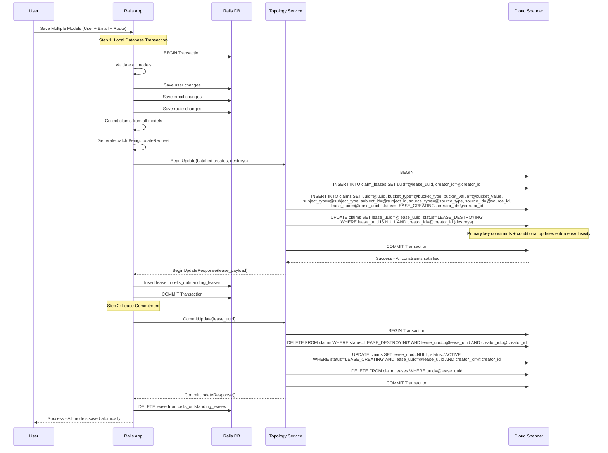
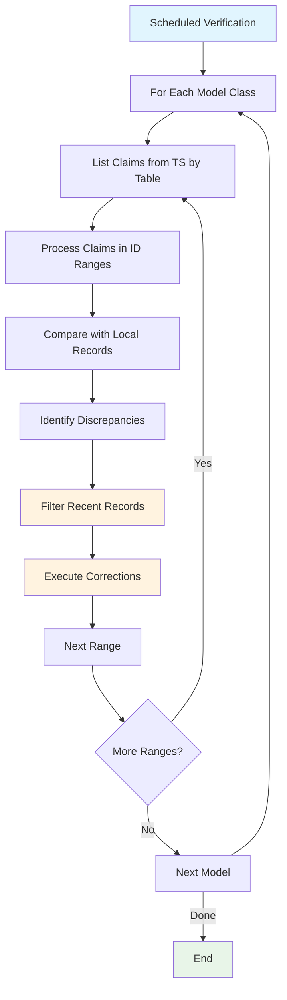
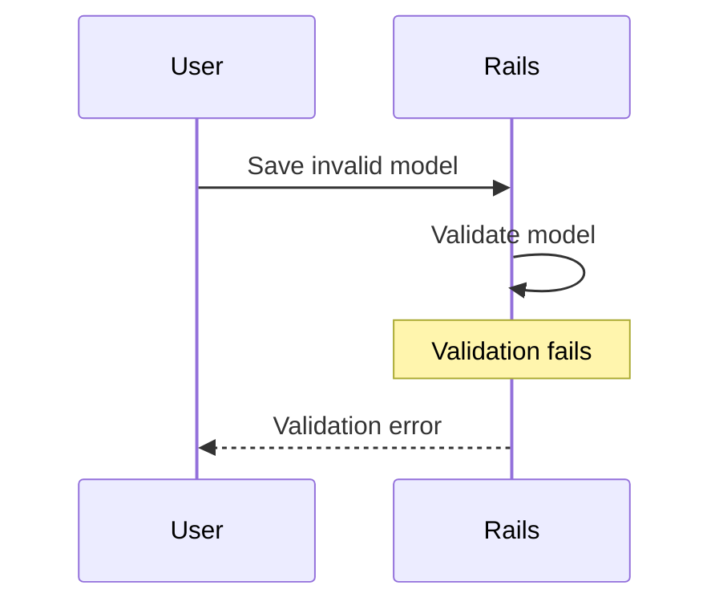
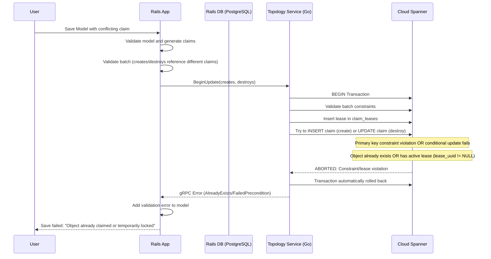
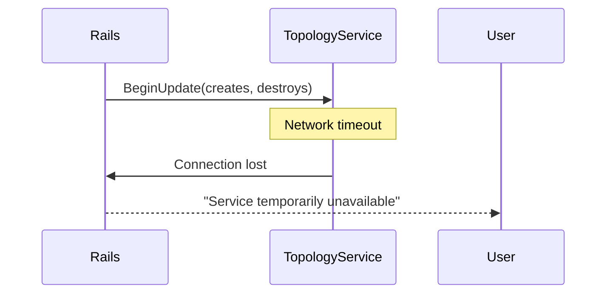
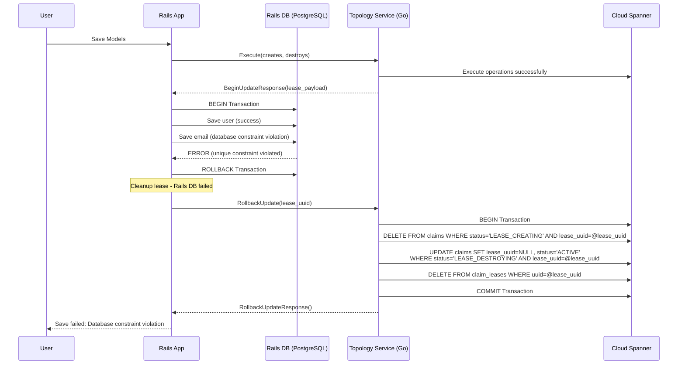
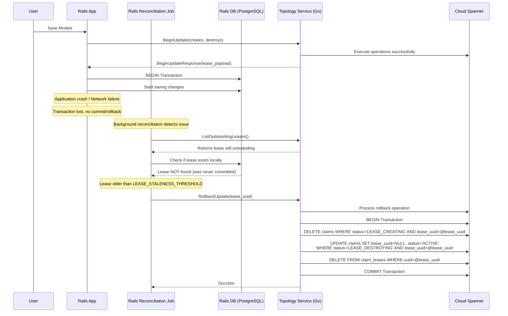
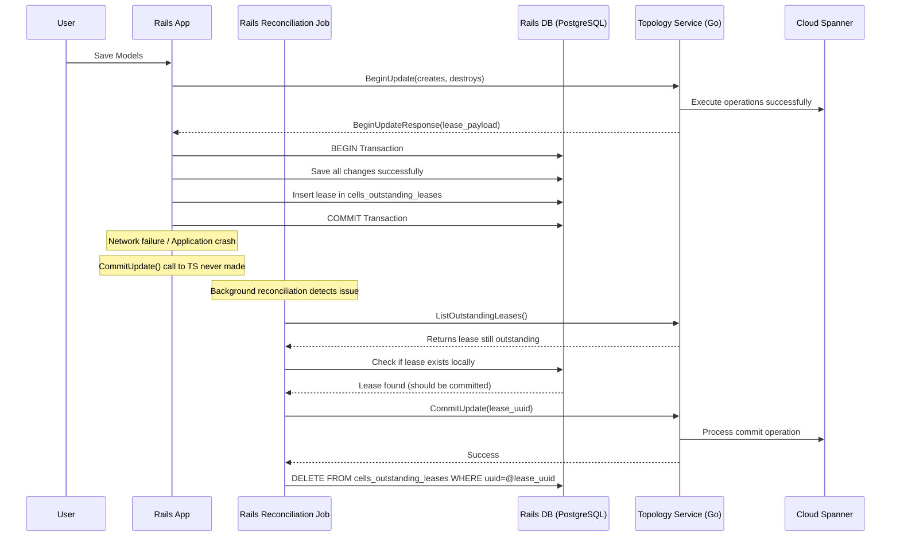
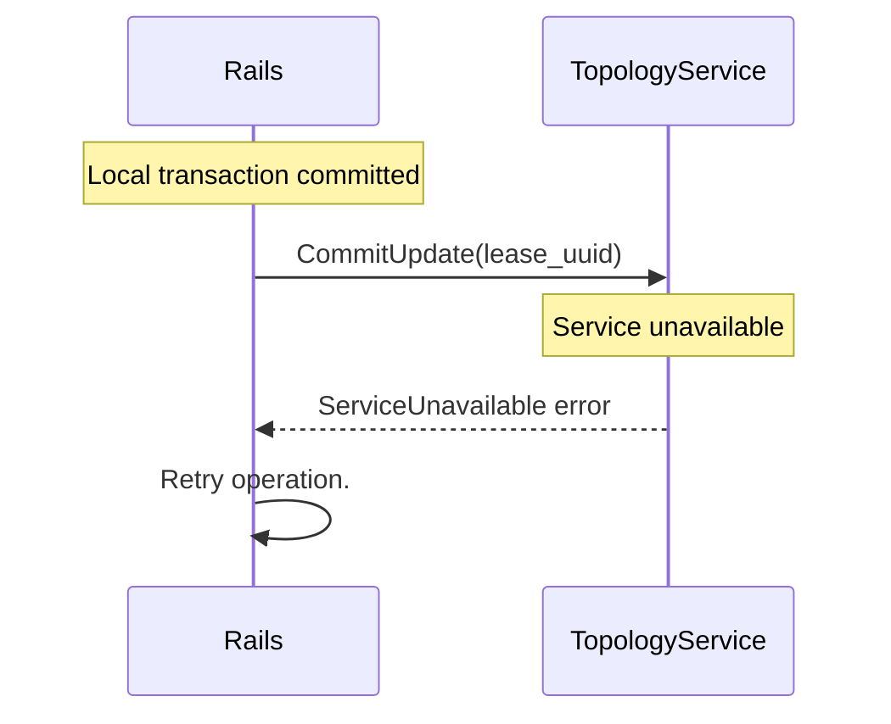
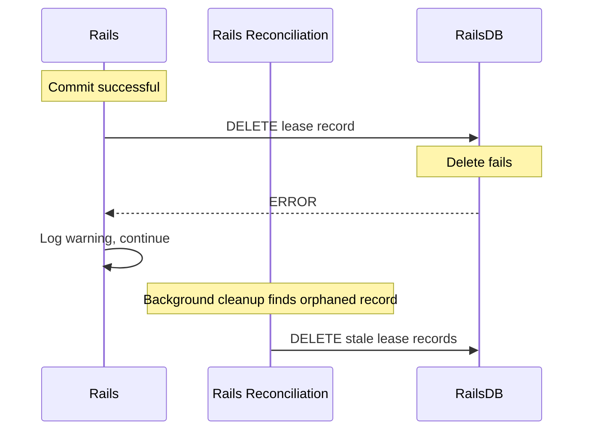



This document outlines the design goals and architecture of Topology Service implementing transactional behavior for Claims Service.

This document does simplify some concepts (intentionally or unintentionally), so it is not reflective of the actual implementation. The API presented should be considered as an example to present the concepts, not the final state.

> Note:
The protobuf and database structures used in this document are only for presenting the behavior
and does not represent the final data structures used.

## Essential Concepts

### **Distributed Lease-Based Coordination**

This system implements a **distributed lease-based coordination mechanism** for managing globally unique claims (usernames, emails, routes) across multiple GitLab cells. It ensures only one cell can "own" a particular claim at any given time, preventing conflicts in a distributed environment.

### **Core Behavioral Principles**

#### **1. Lease-First Coordination**

The system follows a "lease-first, commit-later" pattern:

- **Before** making any local changes, acquire a lease from the central Topology Service
- **Only after** successful lease acquisition, proceed with local database operations
- **After** local success, commit the lease to make changes permanent
- **If anything fails**, rollback the lease to maintain consistency

#### **2. Atomic Batch Operations**

Multiple related models MUST be processed together:

- Collect all claim changes from multiple models
- Send a single batch request to Topology Service
- Process all local database changes in one transaction
- Commit or rollback all claims together

**Critical Constraint**: The same claims can only be marked for one operation at the same time, meaning it cannot be marked for both creation and destruction at the same time.

#### **3. Time-Bounded Leases**

Leases are time-bounded through the reconciliation process:

- Leases only have creation timestamps, no explicit expiration
- Reconciliation process determines staleness based on age (default 10 minutes threshold)
- Prevents indefinite locks as leases are rolled back after some threshold
- Background reconciliation ensures consistency

#### **4. Lease Exclusivity**

**Critical Rule**: Objects with active leases (`lease_uuid != NULL AND status != ACTIVE`) cannot be claimed by other operations:

- **Create Operations**: Will fail with primary key constraint if object already exists
- **Destroy Operations**: Will fail with conditional update if object has active lease
- **Temporal Lock**: Objects remain locked until committed/rolled back
- **Automatic Release**: Stale leases are rolled back through reconciliation, making objects available again

#### **5. Ownership Security**

**Critical Security Constraint**: Only the cell that created the claim can destroy it:

- **Cell ID Verification**: Cells can only operate on their own leases
- **Prevents Interference**: Cells cannot destroy claims created by other cells
- **Security Isolation**: Malicious or buggy cells cannot disrupt other cells' data

## System Participants

### **Rails Concern: Claim Attributes**

- **Primary Role**: Handles application actions (create, update or destroy) that modify claimable attributes
- **Responsibilities**:
  - Validates models locally before claiming
  - Collects all claims from multiple models into batch requests
  - Coordinates with Topology Service for lease acquisition
  - Manages local database transactions
  - Handles immediate commit/rollback after local operations
  - Retries reasonable amount of times network failures

### **Sidekiq Worker or Cron Job: Lost Transaction Recovery**

- **Frequency**: Every minute
- **Operation**: Reconciles leases that exist in Topology Service and in Rails (or vice versa)
- **Strategy**: Rails-driven cleanup with idempotent Topology Service operations
- **Process**:
  - List outstanding leases from Topology Service with cursor-based pagination
  - Separate stale and active leases based on creation time and staleness threshold
  - Commit active leases that exist locally, rollback stale leases
  - Clean up orphaned local lease records

### **Sidekiq Cron Job: Data Verification Process**

- **Frequency**: A few times a day. The cron job execution should be best randomizes between cells to avoid creating spiky workload. This might mean limiting concurrency globally via Topology Service.
- **Operation**: Validates the consistency of claims between Rails and Topology Service
- **Strategy**: Rails-driven validation process
- **Process**:
  - Iterate information stored on Topology Service
  - Compare with information stored in Rails DB
  - Process all claims defined in Rails codebase
  - Correct information stored in Topology Service (Create, Update or Destroy)

### **Topology Service**

**Primary Role**: Centralized coordination service managing global claim state

**Responsibilities**:

- Enforces lease exclusivity through database constraints
- Manages lease lifecycle (create, commit, rollback)
- Provides atomic batch operations for multiple claims
- Ensures cells can only operate on their own claims

## Happy Path Workflow



### **Detailed Steps**

1. **Pre-flight Validation**: Rails validates all models locally and generates batch claim requests
2. **Lease Acquisition**: Single atomic transaction in Topology Service acquires leases for all claims
3. **Commit Local Database Transaction**: Rails saves all changes and creates lease tracking record
4. **Lease Commitment**: Topology Service finalizes all claims and removes lease
5. **Cleanup**: Rails removes local lease tracking record

### **Detailed Process Flow**

#### **Phase 1: Pre-Flight Claims Acquisition**

```text
User saves models → Rails DB Transaction → Rails validates → Model changes → Claims generated → Topology Service called
```

**What happens:**

1. **Local Database Transaction Start**: When engineer calls `User.save` begin Rails database transaction.
1. **Model Validation**: Rails validates the model locally first.
1. **Database Update**: Insert/Update the records inside of the rails database, still uncommitted.
1. **Claim Generation**: For each changed unique attribute, generate create/destroy claims.
1. **Batch Collection**: If multiple models are being saved, collect all claims together.
1. **Topology Service Call**: Send `BeginUpdate()` request with all claims BEFORE local DB transaction.

**Why this order:**

- **Fail Fast**: If claims conflict, fail before committing any local changes.
- **Atomicity**: Either all claims succeed or all fail
- **Efficiency**: Single network call for multiple models. Important due to long write latency on doing multi-region writes.

**Handling long database transaction:**

It is considered an [anti-pattern to send network requests during database transactions](https://docs.gitlab.com/development/database/transaction_guidelines/#dangerous-example-third-party-api-calls).
We got [explicit approval](https://gitlab.com/gitlab-com/gl-infra/tenant-scale/cells-infrastructure/team/-/issues/488#note_2777159474) from the database frameworks team that this is a risk we are going to take.
As long as we have the following mechanism in place:

1. Hard timeout on Topology Service requests during database transactions.
1. Claim behind feature flag, especially at the start with incremental increase.
1. Circuit breaker pattern to only have 300 concurrent requests to Topology
   Service that happen during the database transaction.

#### **Phase 2: Atomic Lease Creation in Topology Service**

```text
BeginUpdate() → Single transaction → Database constraints + lease exclusivity enforced
```

**What happens in Topology Service during `BeginUpdate()`:**

1. **Lease Record**: Insert into `claim_leases` with full payload
2. **Create Claims**: Insert new claims with `status='LEASE_CREATING'` and the lease_uuid
    - Primary key constraint on (claim_type, claim_value) prevents duplicates
    - **Constraint**: Creates must reference claims that don't exist in the system
3. **Mark Destroys**: Update existing claims ONLY if it's not leased (`lease_uuid IS NULL`) AND `creator_id` matches the requesting cell
    - Conditional update ensures no concurrent operations on same object AND only creator can destroy
    - **Constraint**: Destroys must reference claims that are committed and not leased, and are owned by the requesting cell
4. **Batch Validation**: The same claim (`claim_type`, `claim_value`) can only have one operation (create or destroy) to avoid irreconcilable state transitions
5. **Lease Exclusivity**: Only objects not being leased (`lease_uuid IS NULL`) are open for new operations
6. **Atomic Success/Failure**: If any operation fails, entire transaction automatically rolls back

**Ownership Rule**:

- **Only unlocked objects** (where `lease_uuid IS NULL`) can be claimed
- **Owned by Cell** only claims that belong to the cell can be modified
- **This prevents concurrent modifications** and ensures operation isolation

**Why this approach:**

- **Minimize Global Replication Latency**: The create portion of changes become routable in a system, allowing to hide cross-regional Cloud Spanner replication latency. This is aligned with expectation how the failure rate. We expect 99.9% of operations to succeed. As such creating records that might be rolled back is rather exception.
- **Exclusive Access**: Only one operation can work on an object at a time
- **Prevents Race Conditions**: Cannot claim objects already being modified
- **Temporal Isolation**: Leases provide time-bounded exclusive access
- **Database-Level Enforcement**: Constraints are faster and more reliable than application checks
- **No Explicit Conflict Checking**: Database constraints handle uniqueness automatically

#### **Phase 3: Commit Local Database Transaction**

```text
Lease acquired → Create lease record in local database → Commit Transaction
```

**What happens in Rails:**

1. **Lease Tracking**: Create `cells_outstanding_leases` record with `lease_uuid` and creation date
1. **Transaction Commit**: Commit all changes together

**Why after lease acquisition:**

- **Safety**: Local changes only happen after global coordination succeeds
- **Tracking**: Inserting `lease_uuid` into `cells_outstanding_leases` ensures that local transaction was properly committed
- **Immediate Cleanup**: Lease record in Rails DB enables prompt cleanup after transaction completion
- **Rollback Capability**: If local DB fails, we have `lease_uuid` to clean up

#### **Phase 4: Lease Commitment**

```text
Local success → CommitUpdate() → Finalize claims → Remove lease
```

**What happens in Rails before `CommitUpdate()`:**

1. **Immediate Commit**: The `CommitUpdate()/RollbackUpdate()` is triggered by Rails `after_commit`/`after_rollback` hooks
1. **No-transaction Check**: Rails checks that there's no local DB transaction open
1. **Rails Check**: Before doing `CommitUpdate()` Rails check `cells_outstanding_leases` to ensure that transaction was committed successfully

**What happens in Topology Service during `CommitUpdate()`:**

1. **Destroy Processing**: `DELETE claims WHERE status='LEASE_DESTROYING' AND lease_uuid=@lease_uuid`
1. **Create Finalization**: `UPDATE claims SET lease_uuid=NULL, status='ACTIVE' WHERE status='LEASE_CREATING' AND lease_uuid=@lease_uuid`
1. **Lease Cleanup**: `DELETE FROM claim_leases WHERE uuid=@lease_uuid`
1. **Rails Cleanup**: Rails deletes its cells_outstanding_leases record

**Why this two-phase approach:**

- **Durability**: Creates become permanent, destroys are executed
- **Immediate Cleanup**: Leases are removed immediately after successful completion
- **Idempotency**: CommitUpdate can be retried safely - operations are idempotent

## Terminology by Participant

### **Rails Client**

#### **Local Schema**

```sql
-- Rails migration for cells_outstanding_leases table (tracks local lease state)
-- This table only contains active leases - entries are deleted when consumed
CREATE TABLE cells_outstanding_leases (
    uuid uuid NOT NULL,
    created_at timestamp with time zone NOT NULL,
    updated_at timestamp with time zone NOT NULL
);

ALTER TABLE ONLY cells_outstanding_leases
    ADD CONSTRAINT cells_outstanding_leases_pkey PRIMARY KEY (uuid);

-- Indexes for performance and operational queries
CREATE INDEX idx_cells_outstanding_leases_created ON cells_outstanding_leases(created_at);
```

#### **Model Definition**

```ruby
# Rails ActiveRecord concern for handling distributed claims
module Cells::Claimable
  # Configure claimable attributes with their bucket types
  def cells_claims_attribute(attribute_name, type:)

  # Configure metadata for claims (subject and source information)  
  def cells_claims_metadata(subject_type:, subject_key: nil, source_type:)
end

# Example model implementations
class Route < ApplicationRecord
  include Cells::Claimable

  cells_claims_metadata subject_type: CLAIMS_SUBJECT_TYPE::GROUP,
                        subject_key: :namespace_id,
                        source_type: CLAIMS_SOURCE_TYPE::RAILS_TABLE_ROUTES

  cells_claims_attribute :path, type: CLAIMS_BUCKET_TYPE::ROUTES
end

class User < ApplicationRecord  
  include Cells::Claimable

  cells_claims_metadata subject_type: CLAIMS_SUBJECT_TYPE::USER,
                        subject_key: :id,
                        source_type: CLAIMS_SOURCE_TYPE::RAILS_TABLE_USERS

  cells_claims_attribute :username, type: CLAIMS_BUCKET_TYPE::UNSPECIFIED
end
```

#### **Operations**

- **Claim Generation**: Extract unique attributes from model changes into create/destroy claims
- **Batch Collection**: Aggregate claims from multiple models into single BeingUpdateRequest
- **Batch Validation**: Ensure creates and destroys within a batch reference different claims to avoid modeling conflicts
- **Lease Tracking**: Store lease_uuid locally for reconciliation and cleanup
- **Immediate Cleanup**: Remove lease records after successful commit/rollback
- **Error Handling**: Convert gRPC errors to Rails validation errors

### **Background Reconciliation**

#### **Rails-Driven Cleanup Process**

```ruby
# Rails-driven cleanup with idempotent Topology Service operations
class ClaimsLeaseReconciliationService
  LEASE_STALENESS_THRESHOLD = 10.minutes  # Consider lease stale if older than threshold

  def self.reconcile_outstanding_leases
    topology_service = Gitlab::Cells::TopologyServiceClient.new
    cursor = nil

    loop do
      # Get leases from Topology Service with cursor-based pagination
      response = topology_service.list_outstanding_leases(
        ListOutstandingLeasesRequest.new(
          cell_id: current_cell_id,
          cursor: cursor
        )
      )

      break if response.leases.empty?

      # Process active leases: commit if they exist locally
      local_active_leases = LeasesOutstanding.where(lease_uuid: response.leases.pluck(:lease_uuid)).pluck(:lease_uuid)

      local_active_leases.each do |lease_uuid|
        topology_service.commit_update(CommitUpdateRequest.new(cell_id: current_cell_id, lease_uuid: lease_uuid))
        LeasesOutstanding.find_by(lease_uuid: lease_uuid)&.destroy!
      end

      # Find stale leases that are missing locally
      now = Time.current
      local_active_leases = local_active_leases.to_set
      stale_leases = response.leases
        .reject { |lease| local_active_leases.include?(lease.lease_uuid) }
        .select { |lease| lease.created_at.to_time < (now - LEASE_STALENESS_THRESHOLD) }

      # Process stale leases: rollback all (idempotent)
      stale_leases.each do |lease|
        topology_service.rollback_update(RollbackUpdateRequest.new(cell_id: current_cell_id, lease_uuid: lease.lease_uuid))
        # Clean up any local record that might exist
        LeasesOutstanding.find_by(lease_uuid: lease.lease_uuid)&.destroy!
      end

      # Update cursor for next iteration
      cursor = response.next_cursor
      break if cursor.blank?  # No more pages
    end

    # Exception case: leases missing from TS but present locally
    # This might happen during "Scenario 5A: Failed to Delete Local Lease Record"
    stale_local_leases = LeasesOutstanding.where('created_at < ?', Time.current - LEASE_STALENESS_THRESHOLD)
    if stale_local_leases.exists?
      Rails.logger.error "Found #{stale_local_leases.count} stale local leases without TS counterparts"
      stale_local_leases.destroy_all
    end
  end
end
```

#### **Reconciliation Principles**

- **Primary Cleanup**: Rails is responsible for cleaning up outstanding leases
- **Cursor-Based Pagination**: Guarantees iteration through all leases without infinite loops
- **Idempotent Operations**: Topology Service CommitUpdate/RollbackUpdate operations are idempotent
- **Staleness-Based Cleanup**: Leases older than threshold are considered stale (local property)
- **Complete Processing**: Both stale and active leases are processed to ensure forward progress
- **Exception Handling**: Local leases without corresponding TS leases indicate system issues
- **Immediate Cleanup**: Leases are removed immediately

## Topology Service Data Verification

### **Overview**

The data verification process ensures consistency between the Topology Service's global claim state and each cell's local database records. This is a cell-initiated process that runs periodically to detect and reconcile discrepancies.



### **Core Verification Process**

The system uses cursor-based pagination to fetch claims from TS in ID ranges, then compares them with local records using efficient hash-based matching. Three types of discrepancies are detected: missing claims in TS, different claim values, and extra claims in TS. Recent records (within 1 hour) are skipped to avoid correcting transient changes.

Optionally, the gRPC streaming can be used to fetch records live,
but allowing the streaming replication to resume from the specific cursor.

### **Verification Service Implementation**

```ruby
class ClaimsVerificationService
  CURSOR_RANGE_SIZE = 1000  # Records per TS request
  LOCAL_BATCH_SIZE = 500    # Local records per batch
  RECENT_RECORD_THRESHOLD = 1.hour  # Skip recent records

  def self.verify_all_claim_models(models_with_claims)
    models_with_claims.each do |model_class|
      verify_model_claims(model_class)
    end
  end

  def self.verify_model_claims(model_class)
    topology_service = Gitlab::Cells::TopologyServiceClient.new
    cursor = 0

    loop do
      # Fetch claims from TS in cursor-based ranges
      response = topology_service.list_claims(
        ListClaimsRequest.new(
          cell_id: current_cell_id,
          table_name: model_class.cell_cluster_table_name,
          cursor: cursor,
          limit: CURSOR_RANGE_SIZE
        )
      )
      break if response.claims.empty?

      # Process the returned ID range
      process_claims_range(model_class, response.claims, response.start_range, response.end_range, config)

      cursor = response.next_cursor
      break if cursor.nil?
    end
  end

  def self.process_claims_range(model_class, ts_claims, start_range, end_range, config)
    # Create hash map for O(1) claim lookups
    mapped_ts_claims = ts_claims.to_h(&:method(:claim_key))
    recent_threshold = Time.current - RECENT_RECORD_THRESHOLD

    # Query local records matching the exact TS range
    model_class.where(id: start_range...end_range).find_in_batches(batch_size: LOCAL_BATCH_SIZE) do |local_batch|
      missing_ts_claims = []
      different_local_claims = []
      different_ts_claims = []

      local_batch.each do |record|
        # Skip recent records to avoid transient conflicts
        next if record_is_recent?(record, recent_threshold)

        model_class.cell_claim_attributes.each do |claim_attributes|
          # Generate expected claim from local record
          claim_record = record.generate_claim_record(claim_attributes)

          # Look up and remove from hash (tracks processed claims)
          ts_claim_record = mapped_ts_claims.delete(claim_key(claim_record))

          if ! ts_claim_record
            # Missing in TS: local exists, no TS claim
            missing_ts_claims << claim_record
          elsif ! claim_records_match?(claim_record, ts_claim_record)
            # Different: both exist but data differs
            next if ts_claim_is_recent?(ts_claim_record, recent_threshold)

            different_local_claims << claim_record
            different_ts_claims << ts_claim_record
          end
          # If match exactly, no action needed
        end
      end

      # Execute corrections in batches
      if missing_ts_claims.present?
        # TODO: This can fail if it's already claimed by the other cell. Need manual intervene.
        begin_update_and_commit(creates: missing_ts_claims)
      end

      if different_ts_claims.present?
        # TODO: This can fail if it's already claimed by the other cell. Need manual intervene.
        # Non-atomic update: destroy then create
        begin_update_and_commit(destroys: different_ts_claims)
        begin_update_and_commit(creates: different_local_claims)
      end
    end

    # Remaining hash entries are extra TS claims
    extra_ts_claims = mapped_ts_claims.values.reject { |ts_claim| ts_claim_is_recent?(ts_claim, recent_threshold) }
    if extra_ts_claims.present?
      begin_update_and_commit(destroys: extra_ts_claims)
    end
  end

  def self.record_is_recent?(record, recent_threshold)
    record.created_at > recent_threshold
  end

  def self.ts_claim_is_recent?(ts_claim, recent_threshold)
    ts_claim.created_at.to_time > recent_threshold
  end

  def self.claim_records_match?(expected_claim, ts_claim)
    # TODO: Compare claim type, value, and owner
  end

  def self.claim_key(ts_claim)
    # Unique identifier for hash lookups
    "#{ts_claim.claim_type}/#{ts_claim.claim_value}"
  end

  def self.begin_update_and_commit(creates: [], destroys: [])
    topology_service = Gitlab::Cells::TopologyServiceClient.new

    # Use standard BeginUpdate/CommitUpdate pattern
    response = topology_service.begin_update(
      BeginUpdateRequest.new(
        cell_id: current_cell_id,
        creates: creates,
        destroys: destroys
      )
    )

    # Immediate commit (no local DB changes for verification)
    topology_service.commit_update(
      CommitUpdateRequest.new(
        cell_id: current_cell_id,
        lease_uuid: response.lease_payload.lease_uuid
      )
    )

    Rails.logger.info "Verified: #{creates.size} creates, #{destroys.size} destroys"
  end

  private

  def self.current_cell_id
    Gitlab::Cells.current_cell_id
  end
end
```

### **Key Behaviors**

- **Range-Based Processing**: TS returns claims in ID ranges (start_range to end_range), local queries match exact ranges
- **Hash-Based Matching**: O(1) lookups using claim_key, processed claims removed via delete()
- **Three-Way Comparison**: Missing (local only), Different (both exist, data differs), Extra (TS only)
- **Recent Record Protection**: Skip records created within threshold to avoid transient conflicts
- **Batch Corrections**: BeginUpdate/CommitUpdate pattern used for all corrections, separate batches per discrepancy type
- **Cursor Pagination**: Automatic advancement through all records, no gaps or overlaps

### **Recent Record Protection**

The verification system protects against correcting transient changes:

- **Configurable Threshold**: `RECENT_RECORD_THRESHOLD = 1.hour` (adjustable)
- **Local Record Protection**: Skips entire record if `created_at` is within threshold
- **Claim Comparison Protection**: Skips correction if either local or TS claim is recent
- **Extra Claim Protection**: Filters out recent TS claims from deletion

**Benefits:**

- **Transient Change Handling**: Prevents correction of records still propagating
- **Race Condition Prevention**: Avoids interfering with ongoing operations
- **Operational Safety**: Reduces risk of correcting legitimate new data

### **Topology Service**

#### **Cloud Spanner Schema**

```sql
-- Claims table with integrated lease tracking
CREATE TABLE claims (
  uuid STRING(36) NOT NULL,                        -- UUID for internal tracking
  bucket_type INT64 NOT NULL,                      -- Type of bucket (maps to protobuf Bucket.Type enum)
  bucket_value STRING(1024) NOT NULL,              -- The actual value being claimed
  subject_type INT64 NOT NULL,                     -- Type of subject (maps to protobuf Subject.Type enum)
  subject_id STRING(128) NOT NULL,                 -- Subject identifier
  source_type INT64 NOT NULL,                      -- Database source type (maps to protobuf Source.Type enum)
  source_id STRING(128) NOT NULL,                  -- Record ID in the source table
  creator_id STRING(128) NOT NULL,                 -- Creator (cell) ID that created this claim
  lease_uuid STRING(36),                           -- NULL for committed records, UUID for leased records
  status INT64 NOT NULL DEFAULT 0,                 -- 0: 'UNSPECIFIED', 1: 'ACTIVE', 2: 'LEASE_CREATING', 3: 'LEASE_DESTROYING'
  created_at TIMESTAMP NOT NULL DEFAULT (CURRENT_TIMESTAMP()),
  updated_at TIMESTAMP NOT NULL DEFAULT (CURRENT_TIMESTAMP()),
) PRIMARY KEY (uuid);

-- Unique index for bucket uniqueness (primary constraint for claim conflicts)
CREATE UNIQUE INDEX idx_claims_bucket_value
ON claims(bucket_type, bucket_value)
STORING (creator_id); -- used for claim uniqueness and storing creator_id for faster classification

-- Index for lease operations
CREATE NULL_FILTERED INDEX idx_claims_lease_uuid
ON claims(lease_uuid); -- used to quickly update the claims in the `commitUpdate`

-- CRITICAL CONSTRAINTS:
-- 1. Objects with lease_uuid != NULL cannot be claimed by other operations
-- 2. Only the cell that created a claim (creator_id) can destroy it
-- These constraints prevent concurrent operations and unauthorized access

-- Outstanding leases table
CREATE TABLE claim_leases (
  uuid STRING(36) NOT NULL,                        -- UUID of the lease
  creator_id STRING(128) NOT NULL,                 -- Creator (cell) ID that owns the lease
  created_at TIMESTAMP NOT NULL DEFAULT (CURRENT_TIMESTAMP()),
  updated_at TIMESTAMP NOT NULL DEFAULT (CURRENT_TIMESTAMP()),
) PRIMARY KEY (uuid); -- used to quickly fetch the correct lease_uuid during commitUpdate

-- Foreign keys are used to ensure referential integrity between claims and claim_leases tables
```

#### **Protobuf Definitions**

```protobuf
syntax = "proto3";
package gitlab.cells.topology_service.claims.v1;

import "google/protobuf/any.proto";
import "google/protobuf/timestamp.proto";
import "proto/types/v1/uuid.proto";

option go_package = "gitlab.com/gitlab-org/cells/topology-service/clients/go/proto/claims/v1;claims_proto";

// Core message definitions
message Bucket {
  enum Type {
    UNSPECIFIED = 0;
    ROUTES = 1;
    ORGANIZATION_PATH = 2;
    REDIRECT_ROUTES = 3;
  }

  Type type = 1;
  string value = 2;
}

message Subject {
  enum Type {
    UNSPECIFIED = 0;
    ORGANIZATION = 1;
    GROUP = 2;
    PROJECT = 3;
    USER = 4;
  }

  Type type = 1;
  int64 id = 2;
}

message Source {
  enum Type {
    UNSPECIFIED = 0;
    RAILS_TABLE_USERS = 1;
    RAILS_TABLE_EMAILS = 2;
    RAILS_TABLE_ROUTES = 3;
    RAILS_TABLE_PROJECTS = 4;
    RAILS_TABLE_GROUPS = 5;
    RAILS_TABLE_ORGANIZATIONS = 6;
    RAILS_TABLE_REDIRECT_ROUTES = 7;
  }

  Type type = 1;
  int64 rails_primary_key_id = 2;
}

message Metadata {
  Bucket bucket = 1;
  Subject subject = 2;
  Source source = 3;
}

message Record {
  enum Status {
    UNSPECIFIED = 0;
    ACTIVE = 1;
    LEASE_CREATING = 2;
    LEASE_DESTROYING = 3;
  }
  types.v1.UUID uuid = 1;
  Metadata metadata = 2;
  int64 cell_id = 3;
  Status status = 4;
  optional types.v1.UUID lease_uuid = 5;
  google.protobuf.Timestamp created_at = 6;
}

// Service request/response messages
message GetRecordRequest {
  Bucket bucket = 1;
}

message GetRecordResponse {
  Record record = 1;
  optional CellInfo cell_info = 2;
}

message BeginUpdateRequest {
  repeated Metadata create_records = 1;
  repeated Metadata destroy_records = 2;
  int64 cell_id = 3;
}

message BeginUpdateResponse {
  int64 cell_id = 1;
  types.v1.UUID lease_uuid = 2;
}

message CommitUpdateRequest {
  int64 cell_id = 1;
  types.v1.UUID lease_uuid = 2;
}

message CommitUpdateResponse {}

message RollbackUpdateRequest {
  int64 cell_id = 1;
  types.v1.UUID lease_uuid = 2;
}

message RollbackUpdateResponse {}

message ListLeasesRequest {
  int64 cell_id = 1;
  optional google.protobuf.Any next = 2;
  optional int32 limit = 3;
}

message LeaseRecord {
  types.v1.UUID uuid = 1;
  google.protobuf.Timestamp created_at = 2;
}

message ListLeasesResponse {
  repeated LeaseRecord leases = 1;
  optional google.protobuf.Any next = 2;
}

message ListRecordsRequest {
  int64 cell_id = 1;
  Source.Type source_type = 2;
  optional google.protobuf.Any next = 3;
  optional int32 limit = 4;
}

message ListRecordsResponse {
  repeated Record records = 1;
  optional google.protobuf.Any next = 2;
}

// Service definition
service ClaimService {
  rpc GetRecord(GetRecordRequest) returns (GetRecordResponse);
  rpc BeginUpdate(BeginUpdateRequest) returns (BeginUpdateResponse);
  rpc CommitUpdate(CommitUpdateRequest) returns (CommitUpdateResponse);
  rpc RollbackUpdate(RollbackUpdateRequest) returns (RollbackUpdateResponse);
  rpc ListLeases(ListLeasesRequest) returns (ListLeasesResponse);
  rpc ListRecords(ListRecordsRequest) returns (ListRecordsResponse);
}
```

#### **gRPC API Behaviors**

- **BeginUpdate()**: Atomically acquire leases for batch operations, enforce exclusivity constraints
  - **Validation**: Ensures creates and destroys reference different claims within the same batch
  - **Create Processing**: Inserts new claims that don't exist in the system
  - **Destroy Processing**: Updates existing claims owned by the requesting cell
- **CommitUpdate()**: Finalize claims (delete destroys, clear lease_uuid from creates) and remove leases
- **RollbackUpdate()**: Revert claims (delete creates, clear lease_uuid from destroys) and remove leases
- **ListOutstandingLeases()**: Retrieve leases for reconciliation with cursor-based pagination
- **ListClaims()**: Retrieve claims by table for verification with range information

## Unhappy Path Workflows

### **Failure Point 1: Pre-flight Validation Failure**

**Scenario**: Model validation fails before lease acquisition



**Recovery**: No recovery needed - no resources acquired, user sees validation error

---

### **Failure Point 2: Lease Acquisition Failure**

#### **Scenario 2A: Topology Service Conflict - Permanent Claim**



**Different conflict types:**

1. **Permanent Conflict**: Object permanently owned by another cell → "Already taken"
2. **Temporary Conflict**: Object temporarily leased by another operation → "Try again later"
3. **Batch Validation Conflict**: Creates and destroys reference same claim → "Invalid batch operation"

**Recovery**: No recovery needed - user sees appropriate error message

#### **Scenario 2B: Network Failure During Execute**



**Recovery**: No recovery needed - no lease acquired, safe to retry. The limited amount of retries might be done by the application.

---

### **Failure Point 3: Local Database Transaction Failure**

#### **Scenario 3A: Rails Database Constraint Violation**



**Recovery**: Automatic rollback of lease, user sees error

#### **Scenario 3B: Application Crash During Local Transaction**



**Recovery**: Background reconciliation rolls back orphaned lease

---

### **Failure Point 4: Lease Commitment Failure**

#### **Scenario 4A: Missing Commit After Successful Local Transaction**



**Recovery**: Background reconciliation commits the lease

#### **Scenario 4B: Topology Service Unavailable During Commit**



**Recovery**: The operation will be retried reasonable amount of times. Otherwise, the Reconciliation Job will handle it at later time.

---

### **Failure Point 5: Cleanup Failure**

#### **Scenario 5A: Failed to Delete Local Lease Record**



**Recovery**: Background reconciliation eventually removes stale records

## Advanced Behaviors

### **Lease Exclusivity and Concurrency Control**

```text
Cell A: BeginUpdate(create email@example.com) → Lease acquired
Cell B: BeginUpdate(destroy email@example.com) → BLOCKED until Cell A commits/rollbacks
```

**Behavior**: Objects with active leases cannot be claimed:

- **Creates**: Will fail with primary key constraint if object exists (regardless of lease status)
- **Destroys**: Will fail with conditional update if object has `lease_uuid != NULL`
- **Temporal Lock**: Object remains locked until lease expires or is committed/rolled back
- **Automatic Release**: Stale leases are cleaned up through reconciliation, making objects available again

**Example scenarios:**

1. **Email change collision**: User changes email while admin tries to delete it → First wins, second fails. User will have to retry at later time.
2. **Route transfer conflict**: Two operations try to move same route → First wins, second fails
3. **Concurrent creation**: Two cells try to create same username → First wins, second fails permanently

### **Multi-Model Coordination**

```text
User + Email + Route changes → Single batch BeginUpdate() → All-or-nothing semantics
```

**Example**: Creating user with email and route:

1. User model generates username claim
2. Email model generates email claim
3. Route model generates path and name claims
4. All 4 claims sent in single BeginUpdate() call
5. All models saved in single Rails transaction
6. All claims committed together

**Why**: Business operations often span multiple models - atomic coordination required

## Performance Characteristics

### **Optimizations**

- **Batch Processing**: Multiple claims in single RPC call
- **Efficient Indexes**: Cloud Spanner indexes optimized for lease operations
- **Connection Pooling**: Reuse gRPC connections
- **Background Processing**: Async cleanup doesn't block user operations
- **Constraint-Based Conflicts**: Database handles uniqueness without application logic

### **Scalability**

- **Cell Independence**: Each cell operates independently until conflicts
- **Centralized Coordination**: The conflicts prevent other Cells from making the change, no cross-cell communication
- **Time-Bounded Locks**: Automatic cleanup prevents indefinite blocking through staleness detection
- **Horizontal Scaling**: Cloud Spanner scales with claim volume

## Why This Design Works

### **1. Exclusive Access Control**

- Objects can only be modified by one operation at a time
- Prevents data corruption from concurrent modifications
- Clear temporal boundaries for exclusive access

### **2. Graceful Concurrency Handling**

- Permanent conflicts (duplicates) fail immediately
- Temporary conflicts (leases) can be retried
- Users get appropriate feedback for different conflict types

### **3. Consistency Without Distributed Transactions**

- Uses leases instead of 2PC (Two-Phase Commit) - uses a model of distributed locking
- Simpler failure modes than distributed transactions
- Time-bounded recovery from failures through staleness-based cleanup
- **No 2PC Required**: Each cell manages its own local state independently, with the push of the data to the Topology Service

### **4. Operational Simplicity**

- Clear failure modes and recovery procedures
- Observable through standard metrics and logs
- Self-healing through Rails-driven cleanup with idempotent Topology Service operations
- **Immediate Cleanup**: Leases are removed as soon as possible - lingering leases indicate exceptions

### **5. Developer Ergonomics**

- Transparent integration with ActiveRecord
- Declarative configuration
- Familiar transaction semantics

### **6. Production Robustness**

- Handles network partitions gracefully
- Automatic recovery from cell crashes
- Comprehensive error handling and retry logic

### **7. Comprehensive Verification**

- Detects and corrects missing, extra, and different claims
- Efficient cursor-based processing for large datasets
- Recent record protection prevents interference with ongoing operations
- Hash-based matching for optimal performance
- Migration of the data is integral part of the verification

## Open Questions and Considerations

### **Performance Considerations**

- **Batch Size Limits**: What's the maximum number of claims per batch to optimize performance vs. transaction size?
- **Lease Duration**: What is the good staleness threshold to ensure that it handles inflight transaction?
- **Better Local Transaction Detection**: Should system track a local database transaction and attach it to Topology Service lease? This would allow the Reconciliation process to see if the transaction finished
- **Connection Pooling**: How many concurrent connections should Rails maintain to Topology Service, and how should they be distributed across cells?

### **Security Considerations**

- **Authentication**: The Topology Service is secured with usage of mutual TLS
- **Authorization**: Should there be additional authorization beyond cell_id in request payload for authorizing the validity of the request?
- **Audit Trail**: Should all claim operations be logged for security auditing and compliance?
- **Rate Limiting**: What are the rate-limits for the operations?

### **Operational Considerations**

- **Monitoring**: What metrics should be tracked - lease age, conflict rates, reconciliation frequency?
- **Alerting**: When should operators be notified - stale lease threshold, reconciliation failures, or high conflict rates?
- **Disaster Recovery**: How to handle Topology Service outages and ensure data consistency during recovery?

### **Edge Cases**

- **Lease Staleness Race**: What happens if a lease becomes stale during local transaction - should it be allowed or rejected?
- **Partial Batch Failures**: The system will not support partial success in batch operations and only maintain all-or-nothing semantics
- **Concurrent Reconciliation**: How to handle multiple reconciliation processes running simultaneously? Should different reconciliation processes work on a different ranges?
- **Create/Destroy Conflicts**: How should the system handle requests that try to create and destroy the same claim in a single batch? This greatly complicates Commit and Rollback operations on Topology Service. This might be required to correct claims as part of Verification Process

### **Future Enhancements**

- **Lease Renewal**: Should long-running operations be able to refresh leases to prevent staleness?
- **Lease Queuing**: Should there be a queue for waiting operations when leases conflict? Or, are we good with always presenting failure to the user. Maybe the lease conflicts would be only retryable when running Background Jobs (Sidekiq).
- **Lease Priorities**: Should certain operations (admin vs. user) have priority over others?
- **Admin Controls**: What type of admin API access is to resolve failure modes that occur on edge cases?
- **Mulit-layered approach**: How system should implement multi-layered approach for storing leases, where we have layered Topology Services each having its own database and sending claims to upstream databases?

### **Testing Strategy**

- **Chaos Engineering**: How to test behavior under various failure scenarios - network partitions, service crashes, clock skew?
- **Load Testing**: What's the maximum throughput the system can handle under various conflict scenarios?
- **Consistency Testing**: How to verify consistency across all failure modes?
- **Integration Testing**: How to test the complete flow across Rails, Topology Service, and Cloud Spanner?

## Additional Topics

### Cell downtime vs Cell decommissioning

The Topology Service cannot rollback leases, as this might put the Cell information to be outdated. This being critical if other Cells will claim
the record that were previously held by the downtime Cell. As such
the Topology Service does not implement any Reconciliation process,
as it is not authoritative to make decisions about the lease.

In a case of Cell downtime this would have to be administrative action
to remove outstanding leases belonging to the Cell.

This is different to Cell decommissioning. In this case it is expected
that decommissioned Cell should not hold any information in Topology Service
(all information being migrated out). However, decommissioning might mean
deliberate removal of the data. In such case, there might be exposed
administrative interface to drop all data belonging to the particular Cell
that is present in Topology Service to make names available again.

### Auditing and logging

The data structure describing leases stores the whole `lease_payload`.
This makes the `lease_payload` be available to a Cell to validate the payload
sent (if it requires as part of Commit or Rollback).

This makes it possible for the Cell as part of the Reconciliation Process
to validate or revert all changes for outstanding leases.

This also makes it easier to expose those outstanding leases as part of
the administrative interface in case of resolving conflicts or edge cases.

### Race condition when doing `CommitUpdate()/RollbackUpdate()`

The `CommitUpdate()/RollbackUpdate()` will be opportunistically be executed
as part of `after_commit/after_rollback`. However, the Reconciliation Process
might execute those at the same time. This is likely happening rather often.

The `Rollback` will be design be executed after the staleness period. We could
introduce similar threshold to perform `Commit` to ensure that `after_commit` had
time to execute. This should greatly reduce a chance of this happening.

### Hide global replication latency

The `BeginUpdate()` has immediate effect on routing. Objects that are created
are routable right away. This optimizes for 99.99% case, where we will follow
the happy path, and changes made are gonna be sticky to the Cell.

Doing `BeginUpdate()` to impact routing will hide the global replication latency,
as we can expect that doing local Cell changes will take mostly longer than
Cloud Spanner replication lag.

It means that in a period between `BeginUpdate()` and `CommitUpdate()` we will have
extra records pointing to the resource, that are cleaned up with the `CommitUpdate()`.
This should not pose any side effects to the system in a case of claims. If other
buckets of data are stored that have different commit expectations they can be modeled
accordingly. However, of the routing purposes it pose no side effects, except improving
user experience.

You can read about the reasons [here](https://gitlab.com/gitlab-com/content-sites/handbook/-/merge_requests/14565#note_2628736240).

## Alternative Approaches to Consider

### **Separate Leased Table with UUID Cross-Join**

Create a separate `leased` table that references claims by UUID:

```sql
CREATE TABLE leased (
  claim_id STRING(36) NOT NULL, -- References claims.claim_id
  lease_uuid STRING(36) NOT NULL,
  status STRING(10) NOT NULL, -- 'LEASE_CREATING', 'LEASE_DESTROYING'
  creator_id STRING(100) NOT NULL,
  created_at TIMESTAMP NOT NULL,
) PRIMARY KEY (claim_id);
```

**Benefits**:

- **Cleaner Separation**: Permanent ownership (claims) vs. temporary locking (leased)
- **Efficient Lease Queries**: Direct queries against leased table
- **Complex Lease Metadata**: Room for detailed lease analytics without cluttering claims table

**Trade-offs**: Better separation of concerns vs. increased transaction complexity and performance overhead

### **Separate Leased Table Considerations**

- **Eventual Consistency**: Is it affecting the cross-join table?
- **JOIN Complexity**: Most queries require joins between claims and leased tables
- **Transaction Atomicity**: More complex to ensure referential integrity across tables
- **Race Conditions**: Higher risk of inconsistent state between table operations
- **Cloud Spanner Limitations**: No foreign key constraints, potential for orphaned records
- **Structure**: Would the table require to duplicate claim_type and claim_value with unique index to model claims semantics?

### **Two-Phase Commit (2PC)**

Use traditional distributed transactions across cells:

**Benefits**:

- **Proven Pattern**: Well-understood distributed transaction semantics

**Considerations**:

- **Overkill**: 2PC is needed when there are many writers write to a single dataset. The information stored in Topology Service by design is not overlapping between Cells. Cells do not have to modify another Cell information, as such 2PC is not needed
- **Complex**: Requires coordination between all participants
- **Coordinator Failure**: Single point of failure that can block all participants
- **Performance Overhead**: Multiple network round-trips and blocking phases
- **Operational Complexity**: Requires distributed transaction coordinator management
- **Recovery Complexity**: Manual intervention often needed for failed transactions

## Documents

- [AIP-158](https://google.aip.dev/158) - Google guidance on implementing cursor-based pagination
