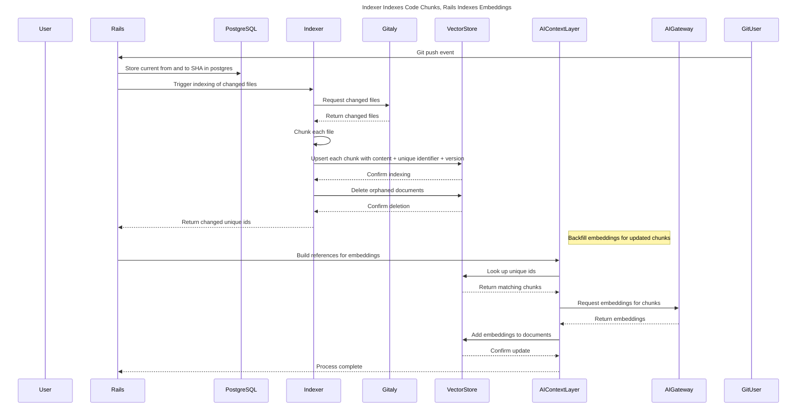
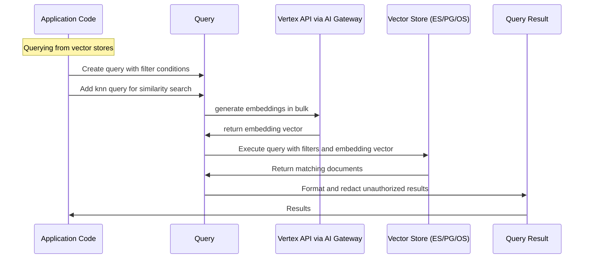
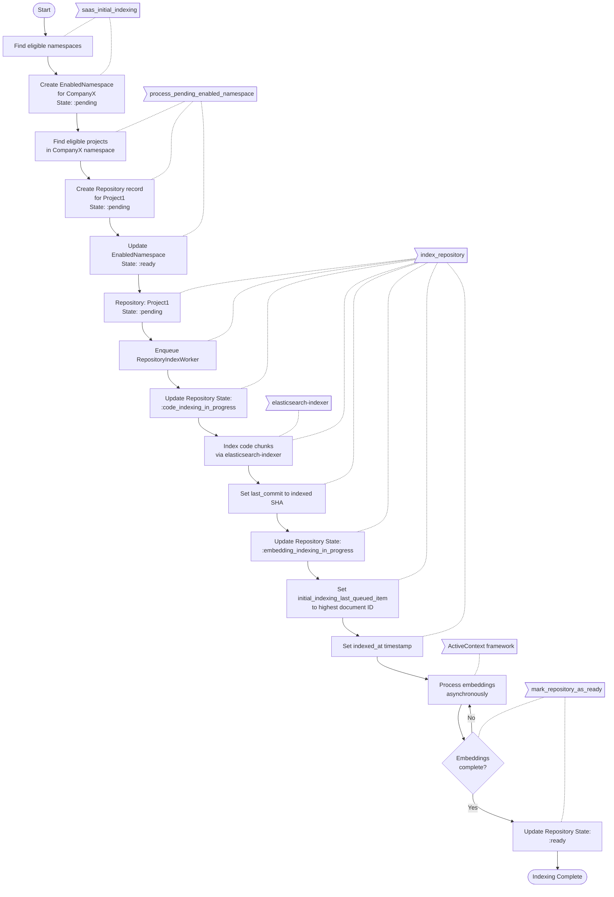
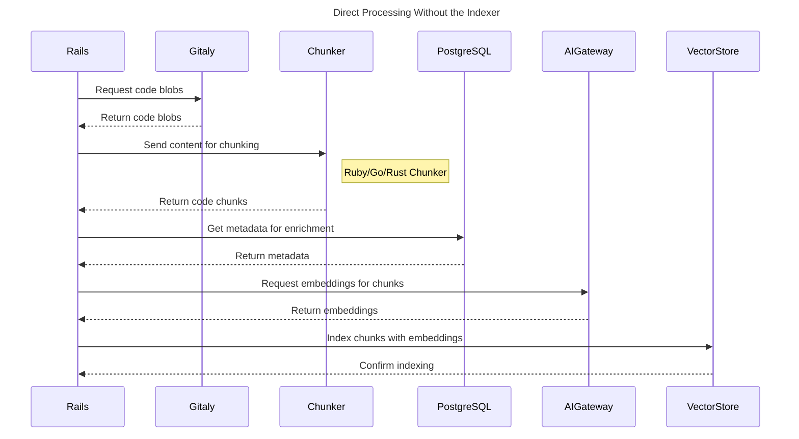
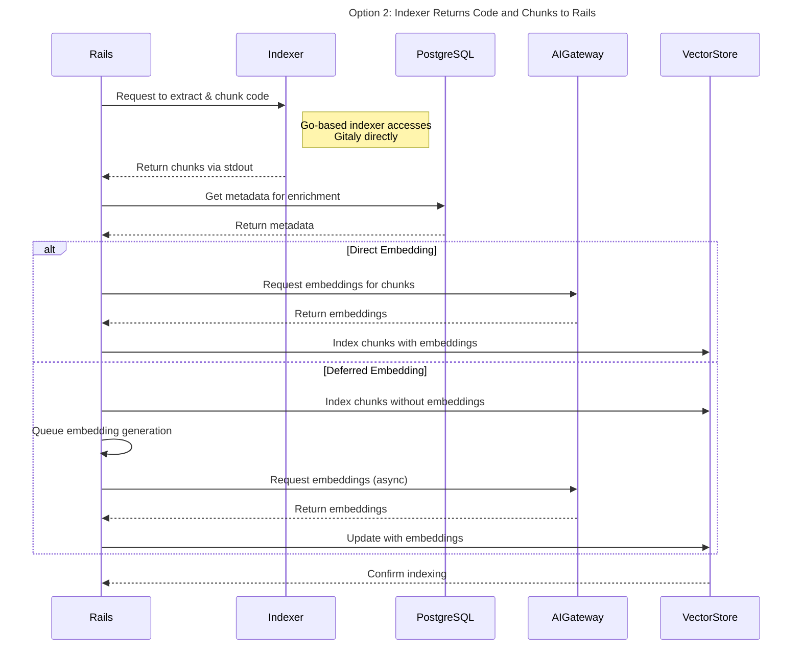

## Code Embeddings

### Available tools for indexing Code Embeddings

#### GitLab Active Context Gem

A Ruby gem for interfacing with vector stores like Elasticsearch, OpenSearch, and PostgreSQL with PGVector for storing and querying vectors.

Key Components:

- **Adapter Layer**: Provides a unified interface to different storage backends.
- **Collection Management**: Handles creating and managing collections of documents.
- **Reference System**: Defines how to serialize and index different types of objects.
- **Queue Management**: Manages asynchronous processing of indexing operations.
- **Migration System**: Similar to database migrations for managing schema changes.
- **Embedding Support**: Integrates with embedding generation for vector search capabilities.

#### GitLab Elasticsearch Indexer

A Go application that indexes Git repositories into Elasticsearch for GitLab.

Key Components:

- **Indexer Module**: Handles the core indexing functionality for different content types.
- **Git Integration**: Uses Gitaly to access repository content.
- **Elasticsearch Client**: Manages connections to Elasticsearch and handles document submission.

### Proposal: Use Go Indexer to index chunks and Rails to index embeddings

Indexing and chunking done in the Go Indexer, with the chunks immediately stored in vector storage.

The indexer efficiently processes and chunks code files, while Rails handles generating and storing embeddings separately.

**Process Flow:**

- Git push event triggers Rails to call indexer.
- Indexer calls Gitaly to retrieve changed files.
- Process each file by chunking the content using the configured chunker.
- Create each chunk if not present
  - Postgres: `INSERT into chunks (...) ON CONFLICT DO UPDATE`
  - Elasticsearch/OpenSearch: `doc_as_upsert: true, detect_noop: true`
- Delete orphaned chunks
  - Postgres: `DELETE from chunks where filename = ? AND id NOT IN (?)`
- Return upserted unique IDs back to Rails
- AI Abstraction Layer tracks embedding references for each unique ID.
- In batches, references are pulled from the queue.
- A bulk lookup is done to the vector store to check if the document exists and get content.
- Embeddings are generated in bulk and upserted into the vector store.



## Design and implementation details

### Key Implementation Notes

- Embedding deduplication is managed by tracking references: if a ref is in the queue for an hour, it might have changed multiple times or be deleted, but we only care about the final state
- A hashed version of the filename and chunk content will be used as the unique identifier for each document.
- The indexer can be called with an option to index a full repository (e.g. a `--force` option) which can be called for initial indexing, when the chunker changes, etc. Normal mode is to process changed files only.
- Embedding generation is the most time-intensive part of the process, with a throughput of approximately 250 embeddings per minute for the current model.
- Data is restricted to namespaces with Duo Pro or Duo Enterprise add-ons.
- NB: This implementation does not support feature branches.

### Required changes on indexer

- Add mode to indexer for indexing code chunks
- Allow indexer to call chunker
- Add postgres client to indexer (Elasticsearch/OpenSearch client exists) and selecting a client from Rails
- Implement translations for each adapter (Elasticsearch, OpenSearch, Postgres) for indexing

### Schema

| Field Name | Type | Description |
|------------|------|-------------|
| id | keyword | hash("#{project_id}:#{path}:#{content}") |
| project_id | bigint | Filter by projects |
| path | keyword | Relative path including file name |
| type | smallint | Enum indicating whether it's the full blob content or a node extracted from a chunker. Example options: `file\|class\|function\|imports\|constant` |
| content | text | Code content |
| name | text | Name of chunk, e.g. `ModuleName::ClassName::method_name` |
| source | keyword | `"#{blob.id}:#{offset}:#{length}"` which can be used to rebuild the full file or restore order of chunks |
| language | keyword | Language of content |
| embeddings_v1 | vector | Embeddings for the content |

The following fields were considered but not added to the initial schema. Adding new fields can be done using AI Abstraction Layer migrations and backfills can be done using either migrations or by doing a reindex.

- `archived` (`boolean`): for group-level search, filter out projects that are archived
- `branches` (`keyword[]`): to support non-default branches
- `extension` (`keyword`): extension of the file to easily filter by extension
- `repository_access_level` (`smallint`): permissions for group-level searches
- `traversal_ids` (`keyword`): Efficient group-level searches
- `visibility_level` (`smallint`): permissions for group-level searches

### Options for supporting multiple branches

By default, GitLab code search supports indexing and searching only the default branch. Supporting multiple branches requires additional considerations for storage, indexing strategy, and query complexity.

#### Option 1: Index Only Branch Diffs

Only index the differences (diffs) between the default branch and other branches. When a file is modified in a branch, index that version with branch metadata.

#### Option 2: Branch Bitmap Approach

Store a bitmap representing branch membership for each file. Maintain an ordered list of branches (e.g., master, branch1, branch2, branch3), and represent file presence with a bitmap (e.g., file in master and branch1 = 1100, file modified in branch2 = 0010).

#### Option 3: Tree Structure Traversal

Implement a tree-based structure representing the git repository hierarchy that can be traversed during search operations. This would mirror the actual version control model but requires a more sophisticated implementation.

#### Pros and Cons

| Option | Pros | Cons |
|--------|------|------|
| **Option 1: Index Only Branch Diffs** | • Requires less storage space<br>• Simpler implementation process<br>• Faster initial indexing | • Search results may include duplicate files (from default branch and branch versions)<br>• Requires result deduplication/selection logic<br>• Boosting for branch-specific results is easier in Elasticsearch than PostgreSQL |
| **Option 2: Branch Bitmap Approach** | • Efficient representation of branch membership<br>• No duplicate results | • Uncertain performance impact for bitmap operations in Elasticsearch/PostgreSQL<br>• Requires reindexing metadata (but not embeddings) for all files when branches change<br>• Bitmap size grows with number of branches<br>• More complex implementation |
| **Option 3: Tree Structure Traversal** | • Most accurate representation of git model<br>• Potentially more flexible for complex queries<br>• Could better handle branch hierarchies and merges| • Most complex implementation<br>• No clear implementation path currently defined |

### Proposal: Searching over indexed chunks

A query containing filters and embeddings is built and when executed, it is translated to a query the vector store is able to execute and results are returned.



**Example query:**

Querying across two projects and getting the 5 closest results to a given embedding (generated by a question):

```ruby
target_embedding = ::ActiveContext::Embeddings.generate_embeddings('the question')
query = ActiveContext::Query.filter(project_id: [1, 2]).knn(target: 'embeddings_v1', vector: target_embedding, limit: 5)
result = Ai::Context::Collections::Blobs.search(user: current_user, query: query)
```

This will return the closest matching blob *chunks*.

Adding AND and OR filters to the query:

```ruby
query = ActiveContext::Query
  .and(
    ActiveContext::Query.filter(project_id: 1),
    ActiveContext::Query.filter(branch_name: 'master'),
    ActiveContext::Query.or(
      ActiveContext::Query.filter(language: 'ruby'),
      ActiveContext::Query.filter(extension: 'rb')
    )
  )
  .knn(target: 'embeddings_v1', vector: target_embedding, limit: 5)
```

### Index state management

#### Overview

This design proposal outlines a system to track the state of indexed namespaces and projects for Code Embeddings.

The process differs between SaaS and SM/Dedicated:

- SaaS: Duo licenses are applied on a root namespace level. Subgroups and projects in the namespace have Duo enabled, except if `duo_features_enabled` is false.
- SM: Duo license is applied on the instance-level. If the instance has a license, all groups and projects have Duo enabled, except if `duo_features_enabled` is false.

#### Database Schema

`Ai::ActiveContext::Code::EnabledNamespace` table tracks namespaces that should be indexed based on Duo and GitLab licenses and enabled features.

`Ai::ActiveContext::Code::Repository` table tracks the indexing state of projects in an enabled namespace.

#### Process Flow

The system uses a `SchedulingService` called from a cron worker `Ai::ActiveContext::Code::SchedulingWorker` every minute that publishes events at defined intervals. Each event has a corresponding worker that processes the event.

#### Scheduling tasks

##### `saas_initial_indexing`

- **Scope**: Only runs on gitlab.com
- **Eligibility Criteria**:
  - Namespaces with an active, non-trial Duo Core, Duo Pro, or Duo Enterprise license
  - Namespaces with unexpired paid hosted GitLab subscription
  - Namespaces without existing `EnabledNamespace` records
  - Namespaces with `duo_features_enabled` AND `experiment_features_enabled`
- **Action**: Creates `EnabledNamespace` records for eligible namespaces in `:pending` state

##### `process_pending_enabled_namespace`

- Finds the first `EnabledNamespace` record in `:pending` state
- Creates `Repository` records in `:pending` state for projects that:
  - Belong to the `EnabledNamespace`'s namespace
  - Have `duo_features_enabled`
  - Don't have existing `Repository` records
- Marks the `EnabledNamespace` record as `:ready` if all records were successfully created

##### `index_repository`

- Enqueues `RepositoryIndexWorker` jobs for 50 pending Repository records at a time
- **`RepositoryIndexWorker` process**:
  1. Executes `IndexingService` for repository to handle initial indexing
  2. Sets state to `:code_indexing_in_progress`
  3. Calls `elasticsearch-indexer` in chunk mode to:
     - Find files from Gitaly
     - Chunk files
     - Index chunks
     - Return successful IDs
  4. Sets `last_commit` to the `to_sha` that was indexed
  5. Sets state to `:embedding_indexing_in_progress`
  6. Enqueues embedding references for successfully indexed documents
  7. Sets `initial_indexing_last_queued_item` to the highest ID of the documents indexed
  8. Sets `indexed_at` to current time
  9. If failures occur during this process, marks the repository as `:failed` and sets `last_error`

##### Embedding Generation

- ActiveContext framework processes enqueued references in batches asynchronously
- Generates and sets embeddings on indexed documents

##### `mark_repository_as_ready`

- Finds `Repository` records in `:embedding_indexing_in_progress` state
- Checks if the `initial_indexing_last_queued_item` record has all currently indexing embedding model fields populated in the vector store
- Marks the repository as `:ready` when embeddings are complete

#### Example flow for a namespace with one project



#### Implementation Notes

- The system follows a state machine pattern for tracking repository state.
- All tasks process in batches to reduce long queries and memory load
- `RepositoryIndexWorker` implements a lock mechanism longer than the indexer timeout to ensure one-at-a-time processing
- The entire system is tied to the currently `active` connection (only one active connection at a time is permitted)
- If a failure occurs during indexing, the repository is marked as `:failed` and the error is recorded in `last_error`

## Alternative Solutions

### Indexing and chunking done in Rails

Call Gitaly from rails to obtain code blobs, use a dedicated chunker in Ruby/Go/Rust to split content, enhance data with PostgreSQL, generate embeddings through the AI gateway, and index resulting vectors into the vector store.



### Indexing and chunking done in the Go Indexer, with the chunks returned to Rails

Use the Go-based indexer to extract and chunk code, then send the results back to Rails via stdout. Rails then enriches the data with PostgreSQL and indexes it into the vector store. Embeddings are either generated in the same process before indexing (direct) or in a separate process (deferred).



### Pros and Cons of solutions

| Option | Pros | Cons |
|--------|------|------|
| **Option 1: Indexing and chunking done in the Go Indexer, with the chunks immediately stored in vector storage** | • More performant indexing of code<br>• Separation of concerns: indexing code and embeddings is separate<br>• Better deduplication handling for rapidly changing files | • Requires more effort to implement clients and adapters for all vector stores<br>• Makes the indexer stateful<br>• The bottleneck for indexing is still on the embedding generation side |
| **Option 2: Indexing and chunking done in Rails** | • Familiar Ruby technology for all engineers<br>• Faster implementation timeline<br> | • Slower processing for getting code blobs (up to 50x slower than Go solution)<br>• Requires building service to get blobs from Gitaly<br>|
| **Option 3: Indexing and chunking done in the Go Indexer, with the chunks returned to Rails** | • Significant performance boost for getting code from gitaly<br>• Type safety<br>• Binary is available in all self-managed installations | • Requires Go expertise for development<br>• Shared binary ownership between teams<br> |

#### Common Implementation Approach

All options

- Use the AI abstraction layer
- Process references using Sidekiq workers
- Re-enqueue failed references for retry
