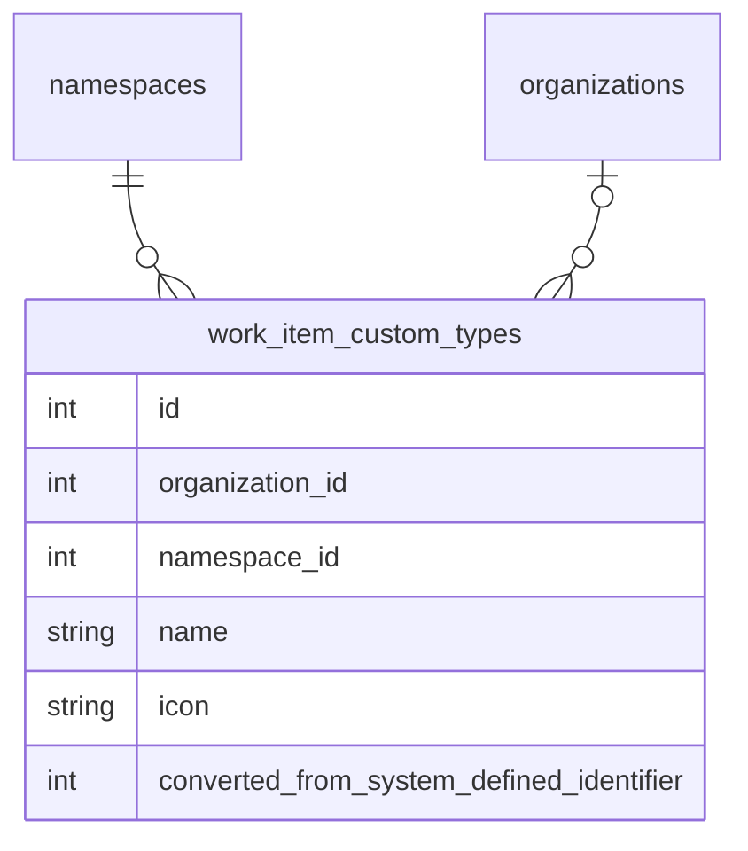

<!-- Design Documents often contain forward-looking statements -->
<!-- vale gitlab.FutureTense = NO -->

<!-- This renders the design document header on the detail page, so don't remove it-->



## Summary

This document outlines our approach to implementing [configurable work item types](https://gitlab.com/groups/gitlab-org/-/epics/9365) for work items in GitLab.

This allows Premium and Ultimate customers to customize the system-defined work item types and create new work item types to match their planning workflows. The
widgets and fields available on these types are also customizable.

To balance customer requirements for top-down control and autonomous teams, users are allowed to customize work item types and their hierarchy restrictions
at the highest possible level only. And if allowed by the organization, descendant namespaces or projects can customize the types further by disabling types they
don't want to use or changing the widgets and fields available on the types.

## Customizing work item types

We allow configuration of work item types at the highest possible level. This allows customers to configure types for all the groups and projects that they own.
This will be the root namespace level for SaaS instances and the [organization level](https://docs.gitlab.com/user/organization/) for self-managed instances.

System-defined types will be stored in-memory and shared across all groups and projects while customizations will be stored in the PostgreSQL database and
sharded by `organization_id` and `namespace_id`.



### Customizing a system-defined type

When a user customizes a system-defined type, we create a new `work_item_custom_types` record and store the system-defined ID in the `converted_from_system_defined_identifier` column. [Similar to custom statuses](../work_items_custom_status/#converting-system-defined-lifecycles-and-statuses-to-custom-ones), this allows us to make the customization take effect immediately on all existing work items.

This conversion is abstracted from the user and we continue to return Global IDs in the format: `gid://gitlab/WorkItems::Type/<system defined identifier>` to avoid breaking customer automations. Our APIs
also accept Global IDs in this format when passing in system defined types that have been customized.

When fetching a work item's type and hierarchy restrictions, we will need to take these conversions into account. The same applies when filtering lists by work item type.

When listing the available types for a namespace or project, we also need to take these into account. We need to fetch all the system-defined and custom types, and then exclude system-defined
types that have a mapped custom type record.

The `converted_from_system_defined_identifier` column will also be used to map special features that are available on certain system-defined types. For example, Service Desk creates work items of type `ticket`.
When `ticket` is customized, Service Desk will create work items based on the custom type that has `converted_from_system_defined_identifier` equal to the system-defined `ticket` identifier.

### Creating a new work item type

A new custom work item type is represented by a `work_item_custom_types` record with a null `converted_from_system_defined_identifier` value.
Global IDs for these custom types are in the format: `gid://gitlab/WorkItems::Custom::Type/<id>`.

For the initial iterations, new types behave like the system-defined `issue` type. They will only be allowed at the project-level and their widgets and hierarchy restrictions will be the same with the `issue` type.

### Storing a work item's type

With custom types, a work item can either have a system-defined type or a custom type. We cannot store both in the existing `issues.work_item_type_id` column because of ID collisions and
foreign key constraints.

This means we will need two columns (`work_item_type_id`, `custom_type_id`) to store the type information with a constraint that only one value is not null.

## Configurations and type checks

To reduce hard-coded type checks throughout the application while maintaining clarity about type behavior,
we use a configuration-based approach with a centralized interface for accessing type settings.

Configurations are boolean flags (or value-based attributes in later iterations) that control
how types behave and render. Multiple types can share the same configuration.

### Configuration interface

**Backend:**

```ruby
# Checking configurations
type.configured_for?(:use_legacy_view)  # => true/false
type.configured_for?(:group_level)      # => true/false
type.configured_for?(:available_in_create_flow)  # => true/false

# Future: value-based configurations
type.configuration(:required_widgets)  # => [:title, :description]
```

**Frontend:** Configurations are exposed via GraphQL and passed to the frontend client.
The frontend should not perform type checks but instead query the configuration flags to determine behavior.

### Special type handling

Service Desk and Incident Management functionality is tied to specific work item types (`ticket` and `incident`).
We handle these through:

1. Configuration flags for quick checks:

   ```ruby
   type.configured_for?(:service_desk)         # Is this the service desk type?
   type.configured_for?(:incident_management)  # Is this the incident type?
   ```

2. Type provider for lookups

   ```ruby
   # Finding the designated type for a feature
   # (concrete class name might be subject to change).
   WorkItems::TypeProvider.new(namespace).service_desk_type
   WorkItems::TypeProvider.new(namespace).incident_type
   ```

### Required widgets

Types like `ticket` and `incident` have mandatory widgets needed for their associated features (Service Desk, Incident Management).
These required widgets are defined as part of the system-defined type definition and
inherited by converted custom types via `converted_from_system_defined_identifier`.

### Implementation and release plan

We've identified these releases. We only list must-have requirements here. See the epics for a list of all attached subepics and issues.

#### Beta

For Beta (what we want to demo)

1. System-defined types
2. Migrate Service Desk issues to tickets
3. Reduce type checks to bare minimum and prepare both BE and FE to consume "any kind of type" for at least the project level.
4. Admin section at the admin settings(organization does not support editing for now) and/or top group level where users can
   1. List types
   2. Rename project work item types
   3. Create new project level work item types
5. New types can have an icon and behave like issues in terms of widgets and hierarchy. Users can associate new types to custom fields and status lifecycles in the top-level group.

#### GA (MVC1)

For GA (what we want to ship)

1. Add cascading setting to enable/disable a type on any hierarchy level
2. Add setting to lock visibility for groups/projects on the top level

#### Remaining iterations

For completeness the remaining iterations/phases that would follow after GA/MVC1 are these. They don't necessarily depend on each other so the order could be changed:

1. [Widget customization on work item types](https://gitlab.com/groups/gitlab-org/-/epics/20075)
2. [Customizable types within groups and configurable hierarchy](https://gitlab.com/groups/gitlab-org/-/epics/20076)
3. [Enhanced configuration options for types (policies)](https://gitlab.com/groups/gitlab-org/-/epics/20077)

#### Timeline

The target dates are linked in the [internal wiki page](https://gitlab.com/groups/gitlab-org/plan-stage/-/wikis/Plan-Stage-Roadmap/Configurable-Work-Item-Types#target-dates) which may change depending on implementation blockers.

## Decision registry

1. [Configure types at the root namespace-level for SaaS instances and at the organization-level for self-managed instances](https://gitlab.com/groups/gitlab-org/-/epics/7897#note_2795232631).

   We are not ready to move every customer to separate organizations on GitLab.com so we have to configure types at the root namespace level for now. Self-managed instances on the other hand
   will always have a single organization so we can configure at the organization level.

   Self-managed customers typically work across multiple root namespaces on their instances so we want them to be able to configure at a higher level so that they will be able to standardize
   their types and workflows.

2. System-defined types will be stored [in-memory as `ActiveRecord::FixedItemsModel` objects](https://gitlab.com/gitlab-org/gitlab/-/issues/519894) to avoid cluster-wide tables and unblock Cells and sharding work.
3. Special features like Service Desk and incident management will be [mapped 1:1 to a system defined type](https://gitlab.com/groups/gitlab-org/-/epics/7897#note_2857326975).
4. To avoid breaking changes, we will [keep the existing Global ID format for system-defined types](https://gitlab.com/gitlab-org/gitlab/-/issues/579238). The same format is also retained even when the system-defined type is customized.
5. [Use configuration-based approach for type behavior instead of separate capability concept](https://gitlab.com/gitlab-com/content-sites/handbook/-/merge_requests/17119#ai-summary-of-the-discussion-in-slack-for-the-record).

   We explored introducing both "capabilities" (exclusive type identities) and "configurations" (behavioral flags) but chose a unified configuration approach. With only two special types requiring exclusive handling, a single concept is simpler to understand and maintain for now.

## Resources

1. [Top level epic for this initiative](https://gitlab.com/groups/gitlab-org/-/epics/9365)
1. Designs for [create/edit work item type](https://gitlab.com/gitlab-org/gitlab/-/issues/580932)
1. Designs for [work item type detail view](https://gitlab.com/gitlab-org/gitlab/-/issues/580940)
1. Designs for [work item types list view](https://gitlab.com/gitlab-org/gitlab/-/issues/580929)
1. [POC for configurable work item types](https://gitlab.com/gitlab-org/gitlab/-/issues/580260)

## Team

Please mention the current team in all MRs related to this document to keep everyone updated. We don't expect everyone to approve changes.

```text
@gweaver @acroitor @nickleonard @gitlab-org/plan-stage/project-management-group/engineers
```
