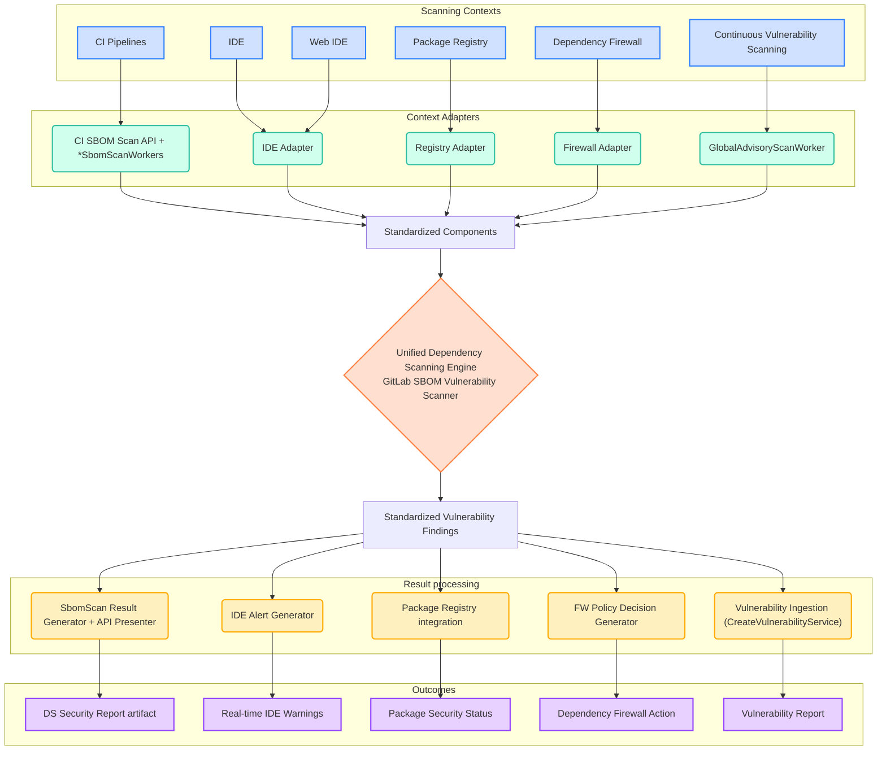



## Summary

GitLab's dependency scanning suffers from fragmentation across multiple contexts, each using different scanning engines with potentially inconsistent vulnerability detection. To establish scanning consistency and eliminate implementation divergence, we propose a unified Dependency Scanning engine built upon the GitLab SBOM Vulnerability Scanner that serves as the single source of truth for all dependency vulnerability detection.

## Context

### Current Fragmentation and Architectural Limitations

GitLab's dependency scanning operates through disparate implementations that suffer from both technological fragmentation and architectural constraints:

**Scanning Implementation Fragmentation**:

- **CI Pipeline Scanning**: Uses legacy Gemnasium analyzer with its own vulnerability detection logic
- **Continuous Vulnerability Scanning**: Utilizes the GitLab SBOM Vulnerability Scanner in Rails backend
- **Future Scanning Contexts**: Each new feature (IDE integration, package registry scanning, dependency firewall) risks developing its own scanning approach

**Atomic Analysis Limitations**: Current scanning implementations use monolithic approaches that tightly couple dependency detection with vulnerability analysis:

- **Inflexible Integration**: Legacy analyzers like Gemnasium perform dependency discovery and security analysis as a single atomic operation, making it impossible to reuse security logic across different contexts
- **Context-Specific Reimplementation**: Each scanning context must implement both dependency detection and vulnerability analysis, leading to duplicated security logic and inconsistent results
- **External Tool Integration Barriers**: Third-party dependency detection tools cannot leverage GitLab's vulnerability intelligence because there's no separation between dependency detection and analysis phases

This creates multiple critical issues:

- **Inconsistent vulnerability detection** - Different scanning engines use varying advisory sources and detection algorithms, causing user confusion and eroding trust in security capabilities
- **Duplicated development effort** - Each context implements complete scanning solutions, leading to repeated work across both dependency detection and security analysis phases
- **Feature parity challenges** - Maintaining equivalent capabilities across multiple engines becomes increasingly difficult as features evolve
- **Integration complexity** - External tools cannot easily contribute dependency data while leveraging GitLab's vulnerability intelligence

### Motivation for Unification

[Continuous Vulnerability Scanning](https://docs.gitlab.com/user/application_security/continuous_vulnerability_scanning/) introduced the GitLab SBOM Vulnerability Scanner as our most advanced and actively maintained scanning engine. However, this capability remains isolated to specific workflows while other contexts continue using legacy implementations.

Our roadmap includes expanding dependency scanning to new contexts that would significantly benefit from consistent vulnerability detection:

- IDE integration for real-time developer feedback
- Web IDE scanning for cloud-based development environments
- Package registry scanning for comprehensive supply chain security
- Dependency firewall for policy-based access control

## Goals

- **Establish unified vulnerability detection** that serves as the single source of truth for dependency security analysis across all GitLab scanning contexts
- **Implement decomposed dependency analysis** by separating dependency detection from vulnerability analysis, enabling different contexts to discover dependencies through various mechanisms while sharing identical security analysis logic
- **Consolidate around the GitLab SBOM Vulnerability Scanner** to leverage our most capable, actively maintained, and feature-complete scanning implementation
- **Enable flexible integration patterns** where external tools can contribute dependency data while leveraging GitLab's comprehensive vulnerability intelligence
- **Ensure consistent security results** regardless of where scanning occurs within the GitLab ecosystem, eliminating user confusion and building trust
- **Support universal deployment** across all GitLab installation types (SaaS, self-managed, dedicated) including air-gapped environments
- **Enable context-optimized scaling** by allowing each scanning workflow to implement specialized processing patterns while sharing the unified scanning engine

## Non-Goals

- Define public APIs for external consumption - focus remains on internal GitLab service integration
- Migrate Container Scanning workflows, which have distinct requirements warranting separate handling
- Replace existing implementations immediately - this establishes the foundation for gradual migration
- Support scanning contexts outside GitLab's core platform capabilities

## Proposal

### Unified Dependency Scanning Architecture

Create a new dependency scanning architecture within GitLab's infrastructure that addresses both fragmentation and coupling limitations through two core architectural principles:

#### 1. Decomposed Dependency Analysis

**Architectural Separation**: Unlike legacy analyzers' atomic approaches, our architecture separates dependency detection (what components exist) from vulnerability analysis (which components have vulnerabilities). This enables:

- **Flexible Discovery Mechanisms**: Different contexts can discover dependencies through various methods - CI-generated manifests,  IDE integration, external tools, or SBOM imports
- **Reusable Security Logic**: Multiple contexts perform vulnerability analysis on the same components discovered through different means while sharing identical dependency scanning engine
- **External Integration**: Third-party dependency detection tools can contribute component data while leveraging GitLab's comprehensive vulnerability intelligence

**SBOM Integration Point**: Software Bill of Materials (SBOM) format provides the standardized interface between dependency discovery and security analysis phases, enabling clean separation while maintaining comprehensive component metadata.

#### 2. Centralized Vulnerability Detection Engine

**Single Security Source**: All vulnerability analysis flows through the GitLab SBOM Vulnerability Scanner as the unified engine, ensuring identical security results regardless of how dependencies were discovered or which scanning context initiated the analysis.

**Specialized Processing Workflows**: Each scanning context implements its own processing patterns, background worker configurations, and scaling strategies optimized for its workload profile while leveraging the shared vulnerability detection logic.

### Architecture Overview

The unified engine follows a modular architecture separating core scanning logic from context-specific concerns:

### Architecture Implementation

The unified engine operates within GitLab's existing Rails infrastructure, leveraging proven components:

**Rails Integration**: The core scanning engine runs within the GitLab Rails application, ensuring compatibility across all deployment types (SaaS, self-managed, dedicated) including air-gapped environments.

**Component-Based Input Processing**: Context adapters normalize input from different scanning contexts into standardized component formats while accommodating context-specific processing requirements and workflow patterns.

**Background Processing**: Each scanning context implements specialized Sidekiq workers optimized for its specific asynchronous workload profile, offering tailored settings for latency, concurrency, as well as error handling and retry logic.

**Synchronous Processing**: In the future, some scanning context may require real-time analysis. Direct Rails integration allows to support small payloads requiring immediate feedback, such as dependency firewall policy decisions.

### Core Components

**Unified Scanning Engine**: The GitLab SBOM Vulnerability Scanner serves as the single vulnerability detection engine, ensuring identical results across all contexts.

**Context Adapters**: Each scanning context implements its own processing pattern, usage metering, limits, and scaling strategies optimized for its workload profile while normalizing input into standardized component formats to leverage the shared scanning engine.

**Result Presenters**: Transform standardized vulnerability findings into context-appropriate formats, allowing each scanning workflow to handle results according to its specific requirements (Security reports, IDE alerts, policy decisions, etc.).

### Decisions

- [001: SBOM Vulnerability Scanner and Package Metadata Database](./decisions/001_gitlab_sbom_vulnerability_scanner.md)
- [002: Continuous Vulnerability Scanning Implementation](./decisions/002_continuous_vulnerablity_scanning.md)
- [003: SBOM-based CI Pipeline Scanning](./decisions/003_sbom_based_scans_for_ci_pipelines.md)

## Advantages

**Vulnerability Detection Consistency**: All GitLab dependency scanning features report identical results for the same components through the unified scanning engine, eliminating user confusion and building trust in security capabilities.

**Architectural Flexibility**: Decomposed analysis enables different contexts to discover dependencies through various mechanisms (CI-generated manifests, IDE integration, external tools) while sharing identical vulnerability analysis logic, reducing implementation complexity and enabling innovative integration patterns.

**Reduced Development Overhead**: New scanning contexts focus on their specific dependency discovery methods while delegating vulnerability detection to the proven, centralized engine, eliminating duplicate security logic implementation.

**External Integration Capability**: SBOM-based separation provides clean integration points for third-party dependency detection tools to contribute component data while leveraging GitLab's comprehensive vulnerability intelligence.

**Simplified Maintenance**: Security improvements, vulnerability database updates, and detection logic enhancements benefit all scanning contexts simultaneously through the single unified engine.

**Infrastructure Efficiency**: Leverages existing Rails and Sidekiq infrastructure available in all GitLab deployments without requiring additional service dependencies or complex orchestration.

**Workflow-Optimized Scaling**: Each scanning context can implement processing patterns optimized for its specific requirements. For instance, Continuous Vulnerability Scanning uses dedicated Sidekiq workers tuned for scanning a single advisory against multiple projects, while CI pipelines context uses workers optimized for multi-advisory but single project performance constraints.

## Challenges

**Shared resources**: Rails-based implementation requires careful resource management and additional considerations to handle scalability, usage-based metering and limits to ensure scanning workloads don't impact core application performance. This is particularly true when compared to CI based or user-owned cloud native solution.

**Performance Bottlenecks**: Multiple contexts sharing the same infrastructure require careful coordination to prevent resource contention between scanning workflows. While each context has different performance characteristics, all ultimately depend on the centralized scanning engine and its underlying PostgreSQL database tables.

**Single point of failure**: As a centralized component, the unified engine becomes critical infrastructure where any bug or outage will impact all dependent scanning features across the platform.

**Infrastructure Dependency Risk**: Relying on shared infrastructure means dependency scanning becomes susceptible to broader platform issues affecting these core components. Database performance degradation, Sidekiq queue backlogs, or Rails application problems can directly impact all scanning contexts simultaneously, requiring enhanced monitoring, alerting, and recovery procedures to maintain scanning service availability.

**Increased E2E Testing Complexity**: The decomposed architecture requires more complex end-to-end testing compared to the historical monolithic scanner. Testing the complete dependency detection and vulnerability scanning flow now involves coordinating multiple components (analyzer, pipeline, GitLab instance, authentication tokens, etc.), making development and validation workflows more intricate than testing a single integrated scanner.

## Alternative Solutions Considered

### Maintain Context-Specific Implementations

**Approach**: Continue developing separate scanning engines for each context.

**Pros**: Context-specific optimizations, no single point of failure, team autonomy.

**Cons**: Perpetuates vulnerability detection inconsistencies, duplicates maintenance effort, creates user confusion.

**Decision**: Rejected - doesn't solve the core fragmentation problem we aim to address.

### Satellite Service with Runway

**Approach**: Deploy unified engine as microservice using Runway infrastructure.

**Pros**: Better isolation, independent scaling, cloud-native architecture.

**Cons**: Runway doesn't support all GitLab deployment types, requires additional infrastructure complexity, introduces network dependencies.

**Decision**: Not suitable for current universal deployment requirements. Could be considered in future phases as cloud-native solutions mature for all GitLab environments.

### Standalone Component Distribution

**Approach**: Package GitLab SBOM Vulnerability Scanner as independent gem/container.

**Pros**: Reduces Rails dependencies, enables external usage, better separation of concerns.

**Cons**: Still requires Package Metadata DB access, doesn't ensure scanning consistency, fragments vulnerability data access.

**Decision**: Rejected - increases complexity without solving consistency goals and maintains database fragmentation.

## Implementation Phases

### Phase 1: Foundation Implementation with Continuous Vulnerability Scanning (Completed)

- Implement the GitLab SBOM Vulnerability Scanner
- Deliver Continuous Vulnerability Scanning using this new engine

### Phase 2: CI Pipeline Integration (Ongoing)

- Replace legacy Gemnasium analyzer with SBOM-based scanning in CI pipelines
- Implement feature parity validation to ensure no regression in vulnerability detection
- Explore backward compatibility opportunities and migration tooling

### Phase 3: Context Expansion and engine improvements (Planned)

- Extend unified engine to new scanning contexts (Dependency firewall, IDE integration, Web IDE, package registry)
- Enhance User Experience and robustness of the unified engine and its dependencies
- Develop asynchronous scanning patterns for high-volume contexts

### Phase 4: Cloud-Native Evolution (Future)

- Evaluate service extraction as cloud-native deployment solutions mature for all GitLab installation types
- Possibly maintain Rails-based implementation as fallback for environments without advanced orchestration capabilities

## References

- [Dependency Scanning Analyzer](../dependency_scanning_analyzer/_index.md)
- [Dependency Scanning using SBOM](https://docs.gitlab.com/user/application_security/dependency_scanning/dependency_scanning_sbom/)
- [Continuous Vulnerability Scanning](https://docs.gitlab.com/user/application_security/continuous_vulnerability_scanning/)
