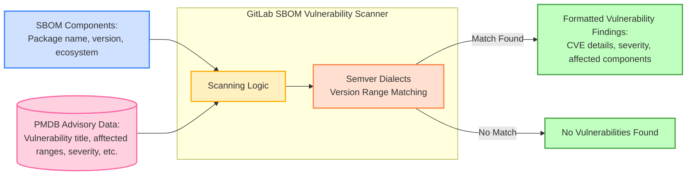

## Context

GitLab's dependency scanning required a fundamental architectural shift to enable scanning workflows beyond traditional CI pipelines. The legacy Gemnasium analyzer, while effective for CI-based scanning, created significant limitations for emerging security requirements:

**Event-Driven Scanning Requirements**: New security workflows like Continuous Vulnerability Scanning needed to react to external events (security advisory disclosures) rather than user-initiated CI pipeline runs. The Gemnasium analyzer's CI-centric design couldn't support this reactive scanning model.

**Universal Deployment Constraints**: GitLab needed scanning capabilities that worked immediately across all deployment types (SaaS, self-managed, dedicated, air-gapped) without requiring additional infrastructure that might not be available in all environments.

**Decomposed Analysis Requirements**: New security workflows required separating dependency detection from security analysis. The Gemnasium analyzer's atomic approach tightly coupled dependency discovery with vulnerability detection, making it impossible to reuse security analysis logic across different contexts or integrate with external dependency detection tools.

Two critical architectural decisions needed to be made:

1. **Scanning Engine Architecture**: How to implement a vulnerability scanner that separates dependency detection from security analysis, enabling reuse across different dependency discovery mechanisms and scanning contexts
2. **Vulnerability Data Access**: How to provide the scanner with comprehensive, up-to-date vulnerability advisory data across all GitLab deployment types, including offline environments

## Decision

We implemented the **GitLab SBOM Vulnerability Scanner** as a Rails-integrated component with access to locally synchronized **Package Metadata Database (PMDB)** data for vulnerability advisory information.

### GitLab SBOM Vulnerability Scanner

### Decomposed Analysis Architecture

The scanner operates as a stateless Rails service that implements decomposed dependency analysis:

**Separation of Concerns**: Our new architecture separates dependency detection (what components exist) from security analysis (which components have vulnerabilities). This enables different contexts to discover dependencies through various mechanisms while sharing identical vulnerability analysis logic through the scanner.

**Component-Based Processing**: Accepts standardized software component lists in SBOM format rather than raw dependency manifests, providing a clean integration point between dependency discovery and security analysis phases.

**Stateless Operation**: Performs pure vulnerability detection without maintaining state or prescribing result processing, allowing each scanning context to handle findings according to its specific requirements.

### Semantic Version Processing

To perform the security analysis, the scanner must handle version matching across different package ecosystems. The legacy Gemnasium analyzer uses native subcommands, however this aproach is not suitable in the context of the GitLab rails application.

To achieve this, the GitLab SBOM vulnerability scanner incorporates GitLab's custom [Semantic Version library](https://gitlab.com/gitlab-org/ruby/gems/semver_dialects):

**Cross-Ecosystem Support**: Different package managers use varying semantic versioning schemes, requiring specialized parsing and comparison logic for accurate vulnerability matching.

**Version Range Matching**: Vulnerability advisories often specify affected version ranges using ecosystem-specific notation, necessitating precise version comparison algorithms.

**Custom Dialect Support**: GitLab-developed semantic version handling ensures accurate vulnerability detection across all supported package ecosystems without relying on external libraries that might not support specialized versioning schemes.

### Core Scanning Process

The technical implementation follows a straightforward workflow that leverages the decomposed architecture:

### Package Metadata Database (PMDB)

PMDB operates as a sophisticated external service architecture that provides comprehensive security intelligence to GitLab instances:

**External Service Architecture**: PMDB runs as a standalone system outside GitLab, consisting of multiple specialized components deployed in Google Cloud Platform:

- **Data Ingestion Pipeline**: Automated feeders collect data from multiple sources (National Vulnerability Database, GitLab Advisory Database, Trivy DB, CISA KEV, FIRST.org EPSS)
- **Processing Components**: Dedicated processors handle license data, security advisories, and CVE enrichments through secure pub/sub messaging
- **Export System**: Hourly exports aggregate all processed data into public GCP storage buckets for GitLab instance consumption

**GitLab Instance Synchronization**: Each GitLab installation maintains local PostgreSQL tables synchronized with PMDB data:

- **5-Minute Sync Cycle**: Automated synchronization pulls updated data from public GCP buckets every 5 minutes
- **Local Database Storage**: Vulnerability data, license information, and CVE enrichments stored locally for fast scanner access
- **Resilient Operation**: Local storage ensures scanning operations continue even if external PMDB service becomes unavailable

**Comprehensive Security Intelligence**: PMDB provides enriched vulnerability data beyond basic advisories:

- **Multi-Source Advisories**: Aggregates vulnerabilities from GitLab Advisory Database, Trivy DB, and other curated sources
- **EPSS Integration**: Exploit Prediction Scoring System data enables vulnerability risk prioritization
- **KEV Catalog**: Known Exploited Vulnerabilities from CISA for critical threat identification
- **CVE Enrichments**: Additional context and metadata for comprehensive vulnerability assessment

**Offline Environment Support**: Air-gapped GitLab installations can access PMDB data through documented [offline synchronization procedures](https://docs.gitlab.com/topics/offline/quick_start_guide/#enabling-the-package-metadata-database), enabling vulnerability scanning without internet connectivity.

**Scalable Data Pipeline**: The external architecture supports growing security intelligence requirements:

- **Hourly Export Cycle**: Hourly data aggregation balances freshness with system performance
- **Modular Processing**: Separate components for different data types enable independent scaling and maintenance
- **Future Extensibility**: Architecture supports additional data types through the same pipeline

## References

- [Continuous Vulnerability Scanning Documentation](https://docs.gitlab.com/user/application_security/continuous_vulnerability_scanning/)
- [Package Metadata Database Design](https://gitlab.com/gitlab-org/security-products/license-db/deployment/-/raw/main/docs/DESIGN.md)
