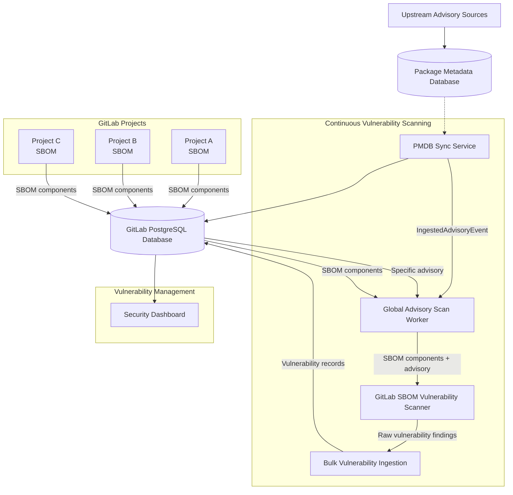

## Context

Traditional dependency scanning in CI pipelines only detects vulnerabilities at build time, leaving a significant security gap. Once a project is deployed, new vulnerabilities discovered in its dependencies go unnoticed until the next pipeline run. This reactive approach means organizations remain exposed to newly disclosed vulnerabilities in production systems.

GitLab needed a solution for **continuous monitoring** of dependency vulnerabilities that could:

- Detect new vulnerabilities in existing project dependencies without requiring code changes or pipeline runs
- Scale across thousands of projects and repositories
- Integrate with existing vulnerability management workflows

## Decision

We implemented **Continuous Vulnerability Scanning (CVS)** as the first production use case of the unified GitLab SBOM Vulnerability Scanner, establishing the architectural foundation for all subsequent dependency scanning contexts.

### Core Design Principles

**Advisory-Driven Scanning**: Instead of scanning projects individually, CVS monitors security advisory updates and identifies which GitLab projects are affected by each new vulnerability.

**SBOM-Based Detection**: Projects maintain Software Bill of Materials (SBOM) inventories that CVS cross-references against vulnerability advisories for precise dependency matching.

**Background Processing**: Asynchronous Sidekiq workers handle scanning operations with careful resource management to avoid impacting user-facing GitLab operations.

**Instance-Wide Efficiency**: Single advisory analysis identifies all affected projects across the entire GitLab instance, rather than scanning each project separately.

## Implementation Details

### Advisory-Driven Workflow

1. **PMDB Synchronization**: A scheduled worker checks and pulls fresh advisory data from PMDB buckets during regular 5-minute sync cycles.
2. **Advisory Ingestion**: An ingestion service stores newly synced advisories into the GitLab instance database and emits a `PackageMetadata::IngestedAdvisoryEvent` for each advisory that must be processed.
3. **Vulnerability Analysis**: The `PackageMetadata::GlobalAdvisoryScanWorker` reacts to this event and  `AdvisoryScanService` uses the GitLab SBOM Vulnerability Scanner to identify all potentially vulnerable projects for this specific advisory by matching against stored SBOM data.
4. **Result Integration**: Confirmed vulnerabilities are persisted directly into GitLab's vulnerability management system for the affected projects.

### SBOM Integration

**Component Inventory**: Projects maintain SBOM data representing their dependency inventory, updated through CI pipeline completion using the Dependency Scanning job or compatible third party SBOM document.

### Scanning Efficiency

**Instance-Wide Analysis**: Single advisory evaluation identifies all affected projects rather than scanning each project individually against all advisories.

**Delta Processing**: Only new or updated advisories trigger scanning activities, avoiding redundant work.

## Advantages

**Proactive Security**: Detects vulnerabilities in deployed applications without waiting for code changes or pipeline triggers.

**Scalable Architecture**: Advisory-driven approach scales efficiently across large numbers of projects and repositories.

**Resource Efficiency**: Avoids redundant scanning by focusing on advisory updates rather than continuous project rescanning.

**Integration Ready**: Establishes patterns and infrastructure reusable by other dependency scanning contexts.

**User Experience**: Provides timely vulnerability notifications through existing GitLab security dashboard and notification systems.

## Challenges Addressed

**Performance at Scale**: Advisory-driven design prevents the performance degradation that would occur from continuously scanning all projects.

**Data Freshness**: Background processing ensures vulnerability data stays current without impacting user-facing operations.

**Storage Requirements**: SBOM storage adds database overhead but enables efficient vulnerability matching without full project rescanning.

**Worker Queue Management**: Specialized worker classes allow independent scaling and monitoring of different scanning phases.

## Integration with Unified Architecture

CVS serves as the foundational implementation demonstrating how scanning contexts can leverage the unified GitLab SBOM Vulnerability Scanner:

**Shared Scanning Logic**: Uses identical vulnerability detection algorithms as other contexts, ensuring consistent results.

**Specialized Processing**: Implements CVS-specific workflow optimization while maintaining scanning consistency.

**Infrastructure Patterns**: Establishes Sidekiq worker patterns and SBOM integration approaches reusable by other contexts.

## Operational Metrics

**Advisory Processing**: Monitor advisory sync frequency and processing latency.

## References

- [Continuous Vulnerability Scanning Documentation](https://docs.gitlab.com/user/application_security/continuous_vulnerability_scanning/)
- [Package Metadata Database Design](https://gitlab.com/gitlab-org/security-products/license-db/deployment/-/raw/main/docs/DESIGN.md)
- [ADR001: SBOM Vulnerability Scanner and Package Metadata Database](./001_gitlab_sbom_vulnerability_scanner.md)
