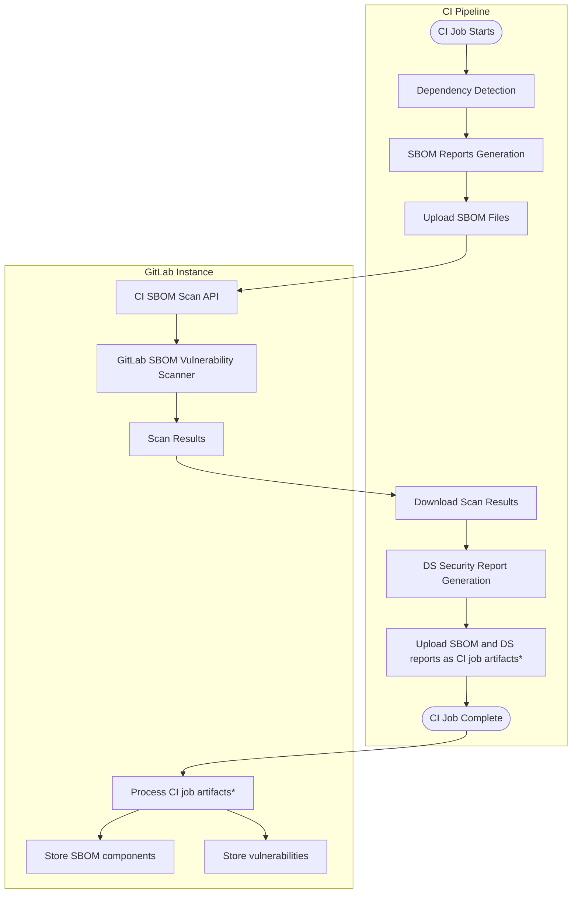
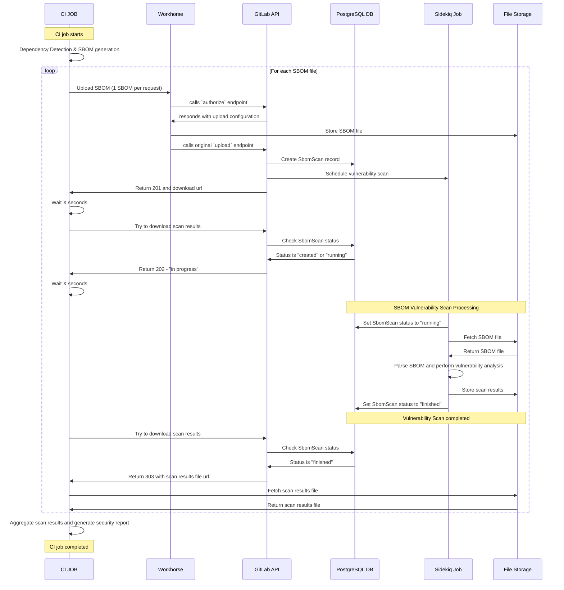

## Context

GitLab's CI pipeline dependency scanning used the legacy Gemnasium analyzer, which implemented monolithic dependency scanning that tightly coupled dependency detection with vulnerability analysis.

The introduction of the unified GitLab SBOM Vulnerability Scanner through Continuous Vulnerability Scanning demonstrated the benefits of decomposed analysis architecture, but CI pipelines remained isolated from this unified approach. To establish scanning consistency across all contexts, we needed to migrate CI pipeline dependency scanning to leverage the unified architecture.

## Decision

We are implementing **SBOM-based CI Pipeline Scanning**, following the two core architectural principles.

### 1. Decomposed Dependency Analysis

- **Dependency detection** is performed locally by the Dependency Scanning analyzer in the CI job as a dedicated step.
- **Vulnerability analysis** is then performed as a distinct, following task in the Dependency Scanning analyzer, offering a potential integration point. The actual analysis is delegated to the GitLab SBOM Vulnerability Scanner.

### 2. Centralized Vulnerability Detection Engine

To leverage the unified GitLab SBOM Vulnerability Scanner engine from a running CI job, a new set of [internal REST API endpoints](#internal-api-usage) are developed to allow the analyzer client to send SBOM documents and fetch scan results.

## Implementation Details

### Workflow comparison

**Legacy Gemnasium Flow**:

1. CI job runs Gemnasium analyzer
2. Analyzer discovers dependencies AND performs vulnerability analysis locally
3. Analyzer outputs a dependency scanning security report with findings and CycloneDX SBOM reports with components
4. The SBOM and security reports are exported as CI job report artifacts and uploaded to the GitLab instance

**New SBOM-Based Flow**:

1. CI job runs new Dependency Scanning analyzer that discovers dependencies and generates CycloneDX SBOM documents locally
2. Analyzer uploads SBOM files to GitLab for asynchronous processing
3. GitLab processes SBOM files through the unified GitLab SBOM vulnerability scanner
4. Analyzer polls for completion and download vulnerability findings
5. Analyzer generates a dependency scanning security report from returned findings (aggregating results if multiple SBOMs have been scanned)
6. The SBOM and security reports are exported as CI job report artifacts and uploaded to the GitLab instance

**Note**: CI job artifacts are uploaded automatically by the CI runner upon CI job completion, however the processing of these reports only occurs when all CI jobs generating security reports are completed.

### SBOM Scan API and Processing Workflow

#### Internal API Usage

This API is designed specifically for GitLab's official Dependency Scanning analyzer and is not documented for public third-party integration. While the CI environment's nature makes it technically possible to access these endpoints from custom jobs, the focus is placed on:

- **Usage Tracking**: All API interactions are logged and attributed to specific projects for monitoring and analysis
- **Application Limits**: Soft and hard limits prevent abuse while allowing legitimate usage patterns
- **Official Support**: Only the official analyzer workflow is supported, with no guarantees about API stability for external usage

#### Workflow

**File Upload Process**: The Dependency Scanning analyzer uploads generated SBOM files through a dedicated API endpoint that follows GitLab's standard file upload mechanism and creates corresponding database records for tracking. The API handles file storage using direct upload and workhorse acceleration when enabled on the GitLab instance.

**Database Tracking**: Each uploaded SBOM creates an ephemeral `SbomScan` record that tracks the scanning status (created → running → finished) and associates these files with their processing state. These records are currently kept for 2 days, and destroyed by a daily clean up worker.

**Asynchronous Vulnerability Analysis**: Background Sidekiq workers fetches SBOM files from storage, parse component data, perform vulnerability analysis using the unified GitLab SBOM Vulnerability Scanner, and store formatted results back to file storage.

**Results Retrieval**: The Dependency Scanning analyzer polls the API for scan completion and receive direct download URLs for result files when processing is complete.

### API Authentication

**CI Job Token Authentication**: The SBOM Scan API uses GitLab's standard CI job token authentication mechanism, following the same security model as other CI-integrated services like CI job artifact uploads.

**Token-Based Access Control**: CI jobs authenticate API requests using the `CI_JOB_TOKEN` environment variable, which provides:

- **Project-Scoped Access**: Tokens are automatically scoped to the specific project and pipeline context
- **Time-Limited Validity**: Tokens expire with the CI job, preventing unauthorized reuse
- **Permission Inheritance**: API access follows the same user permissions as the CI job initiator

**Security Boundaries**: The CI job token ensures that:

- Only active CI jobs can upload SBOM files for vulnerability scanning
- Scan results are only accessible to the originating CI job and project
- API usage is automatically attributed to the correct project for rate limiting and auditing
- No additional credential management is required for CI integration

This authentication approach maintains consistency with GitLab's existing CI security model while enabling secure access to the vulnerability scanning capabilities.

### Rate Limiting Implementation

**Complementary rate limits:** The SBOM upload workflow includes both a hard and a soft rate limiting mechanism to manage resource consumption while maintaining service availability.

**Project-Scoped Rate Limiting**: Rate limiting is applied per project to prevent excessive API and background workers usage from individual projects while maintaining availability for the broader user base.

#### Soft limits Protection

Using the `dependency_scanning_sbom_scan_api_throttling` application limit, the system uses two specialized Sidekiq workers to handle different usage patterns:

- **Normal usage - under threshold:**
  - Scans processed on high-priority worker (`ProcessSbomScanWorker`)
  - Fast processing with `:high` urgency (queue scheduling target < 10s)
  - Standard API responses

- **Heavy usage - over threshold:**
  - Scans routed to throttled worker (`ProcessSbomScanThrottledWorker`)
  - Lower urgency (`:low`) with higher concurrency limits
  - API returns additional properties (`throttled` and `project_throttling_resets_in`) in response body to inform client
  - Client displays a warning about increased processing time

- **Preserves service quality:** Prevents resource contention affecting other users when some projects have higher usage needs
- **Maintains availability:** Heavy users can still use the feature beyond the soft limit, through graceful performance degradation
- **Transparent communication:** Customers are informed about throttling via warnings in log output

#### Hard limits Protection

While allowing the soft limit mechanism to handle most cases gracefully through performance degradation, the system also prevents runaway usage using the `dependency_scanning_sbom_scan_api_upload` and `dependency_scanning_sbom_scan_api_download` application limits, which stop processing the corresponding API requests when their threshold is reached.

### Analyzer Integration

**Integrated SBOM Generation**: The new Dependency Scanning analyzer includes built-in SBOM generation capability.

**Upload Integration**: The analyzer uploads generated SBOM files through GitLab's CI SBOM Scab API and track the asynchronous processing through polling. Up to 3 concurrent requests are made to balance resource management and scan execution velocity.

**Security Report Generation**: After downloading vulnerability findings from completed scans, the analyzer generates the Dependency Scanning security report.

## Migration Benefits

**Vulnerability Detection Consistency**: CI pipeline scans produce identical vulnerability results as Continuous Vulnerability Scanning for the same components, eliminating user confusion about security findings.

**Reduced Maintenance Overhead**: Vulnerability database updates, detection algorithm improvements, and security intelligence enhancements automatically benefit both CI and continuous scanning through the unified scanner.

**Enhanced Integration Flexibility**: The SBOM-based approach enables future integration with external dependency detection tools and enterprise SBOM workflows while maintaining GitLab's security intelligence.

**Resource Management**: Soft rate limiting ensures service availability for all users while providing transparent communication about processing delays during high usage periods.

## Migration Challenges to Address

**CI Performance Requirements**: Asynchronous processing with optimized background workers needs to ensure vulnerability analysis completes within reasonable timeframes while maintaining scanning accuracy across varying workload patterns.

**Resource Scaling**: The dual worker architecture with soft rate limiting needs to handle both normal and heavy usage patterns without service degradation for typical users.

**Feature Parity Validation**: Comprehensive comparison between Gemnasium and SBOM-based results are required to ensure no regression in vulnerability detection capabilities during the migration.

**Backward Compatibility**: The implementation maintains similar security report format and CI/CD integration patterns, ensuring existing workflows continue to be supported. However, the variations in the implementation can lead to breaking changes at different levels (CI job configuration, scanner customization, etc.).

## Implementation Phases

### Phase 2a: Parallel Operation

- Deploy SBOM-based analyzer alongside existing Gemnasium analyzer
- Enable controlled rollout behind `dependency_scanning_sbom_scan_api` feature flag
- Monitor vulnerability detection consistency and processing performance

### Phase 2b: Feature Parity Validation

- Comprehensive comparison of vulnerability detection results between approaches
- Performance benchmarking of upload and processing workflow
- Rate limiting effectiveness validation under various load patterns

### Phase 2c: Default Migration

- Make SBOM-based scanning the default for new projects
- Provide migration guidance and tooling for existing projects
- Maintain Gemnasium analyzer availability during transition period

### Phase 2d: Legacy Removal

- Complete migration of remaining projects to unified scanning architecture
- Remove legacy analyzer and maintenance overhead

## References

- [SBOM-based Dependency Scanning Migration Guide](https://docs.gitlab.com/user/application_security/dependency_scanning/migration_guide_to_sbom_based_scans/)
- [CI Pipeline Scanning Implementation Epic](https://gitlab.com/groups/gitlab-org/-/epics/17150)
- [SBOM Scan API Workflow Issue](https://gitlab.com/gitlab-org/gitlab/-/issues/542831)
- [Soft Rate Limiting Implementation](https://gitlab.com/gitlab-org/gitlab/-/merge_requests/204070)
- [ADR001: SBOM Vulnerability Scanner and Package Metadata Database](./001_gitlab_sbom_vulnerability_scanner.md)
- [ADR002: Continuous Vulnerability Scanning Implementation](./002_continuous_vulnerablity_scanning.md)
