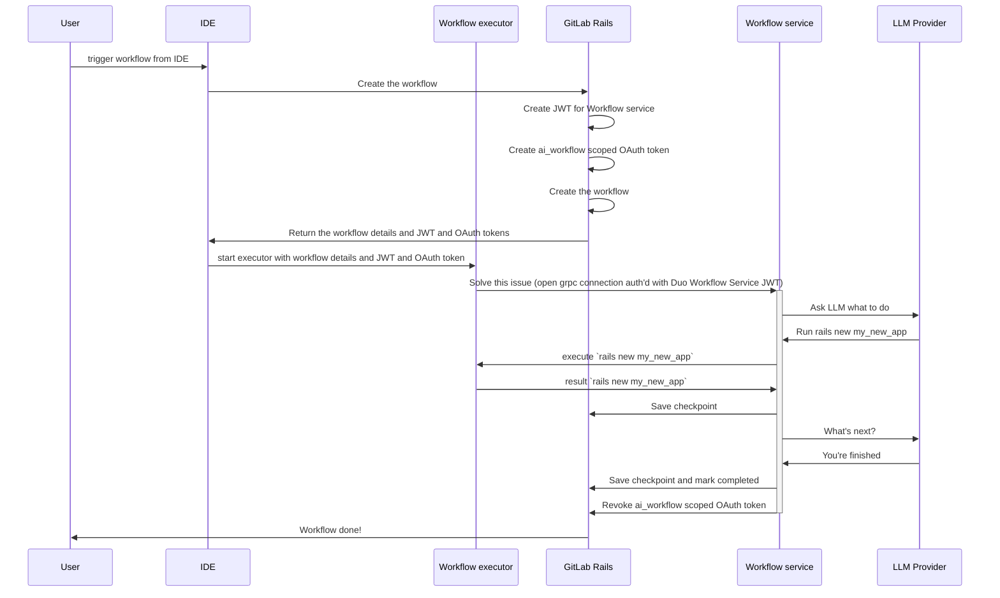
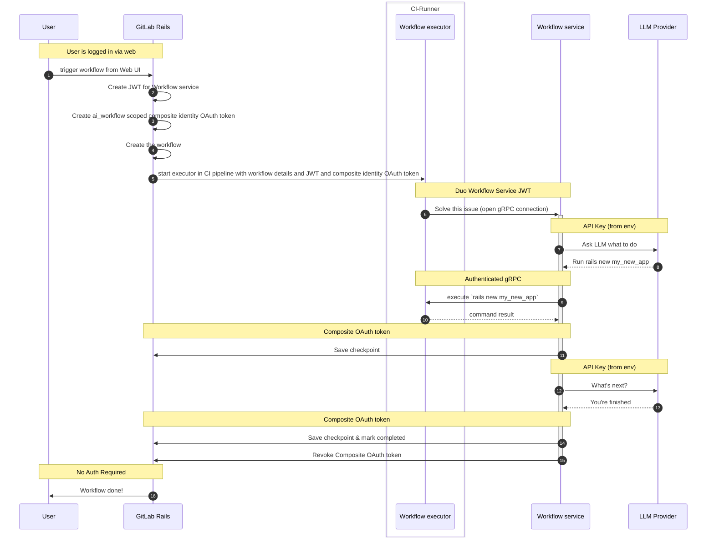
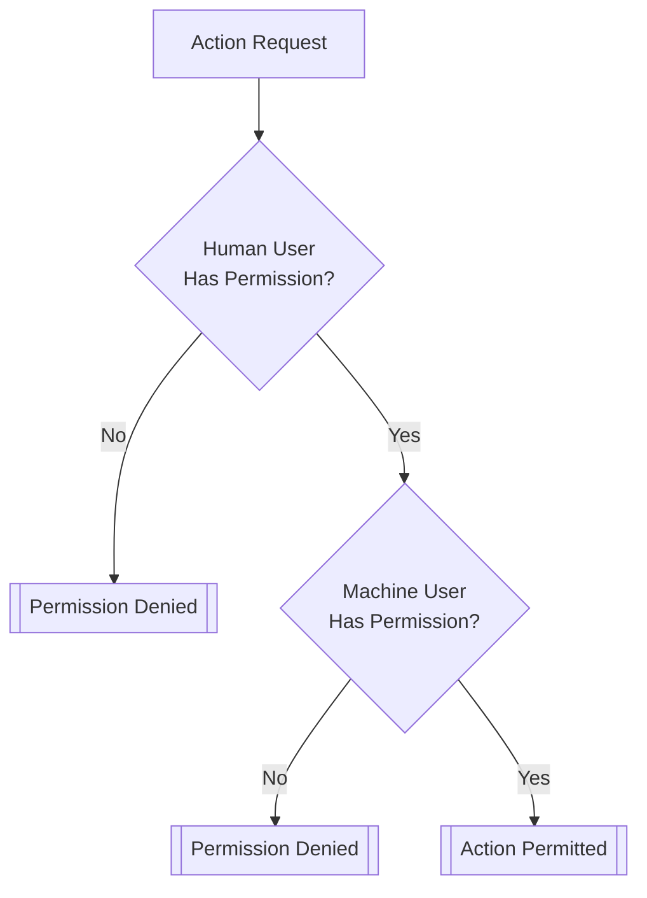
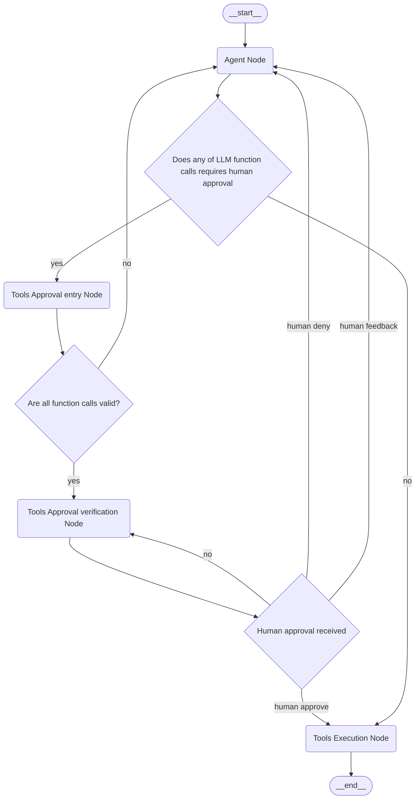
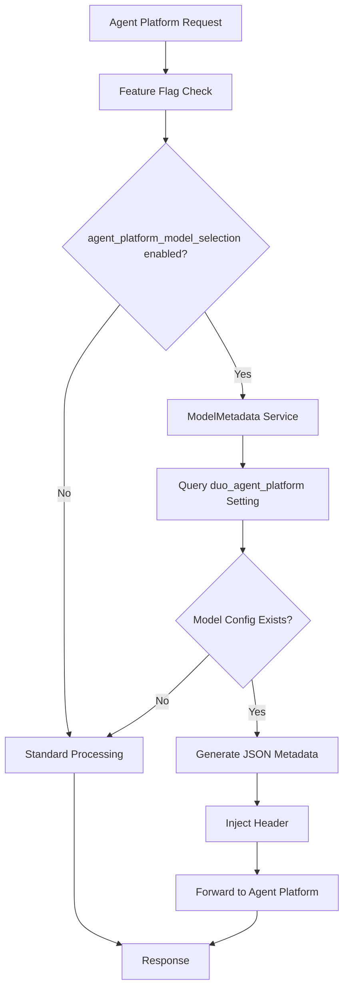
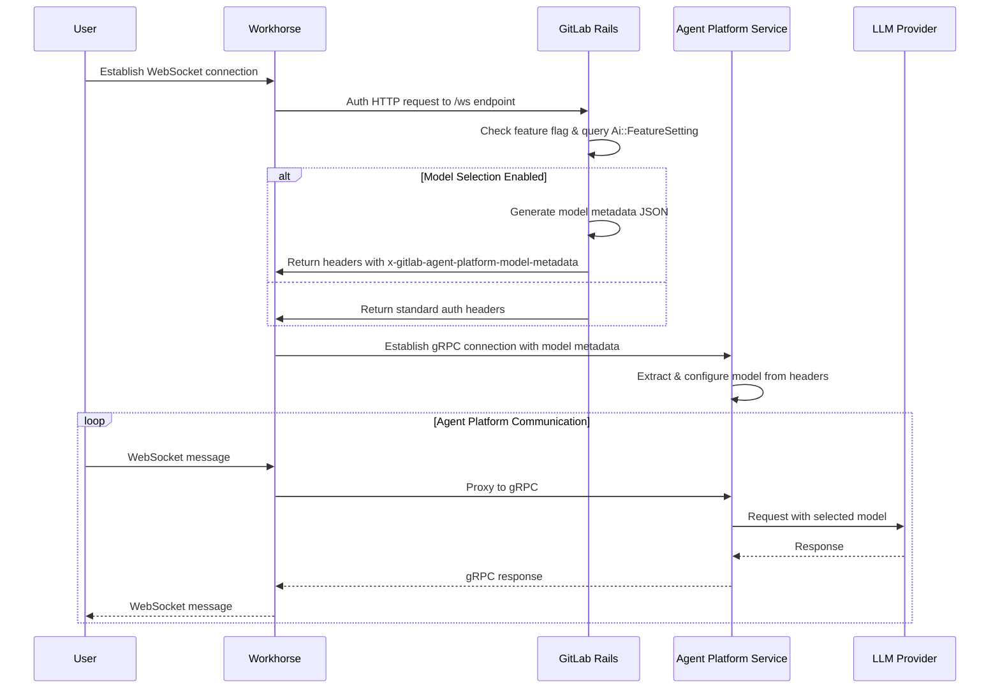



## Execution Environment

### Executive Summary

The functionality to support GitLab Duo Workflow needs to be able to execute arbitrary code
which effectively means "untrusted" code. This means that they cannot just run
like any other service we deploy and specifically they cannot just run inside
the Workflow service or AI Gateway.

In order to address this issue, the Workflow functionality is comprised of
several components:

1. The Duo Workflow Service, which is a Python service we run in our
   infrastructure. The Workflow service is built on top of
   [LangGraph](https://github.com/langchain-ai/langgraph) and lives in a shared
   repo with the AI Gateway to allow code sharing.
1. The `gitlab-lsp` executor client which communicates via a long running
   gRPC connection to the Workflow service and executes arbitrary commands. This
   is used in our Editor Extensions (e.g. VS Code) or built separately as a
   standalone binary that can be run in an interactive mode or a non-interactive
   headless mode.

In our first release we will support 2 execution modes:

1. Local executor: which will run commands and edit files locally in the users
   environment. They will be able to see the files being edited live and it will
   be interactive. Controls, such as user command approval, are used to reduce
   the risk of performing harmful actions by mistake on the users workstation.
1. CI executor: All non-local use-cases of Workflow (for example:
   issue/epic based workflows) will be triggered by the GitLab UI or APIs and
   will create a CI Pipeline to run the Workflow executor.

Our architecture will also support mixed deployments for self-managed such that
some features of Workflow will be available using a cloud-hosted Duo Workflow
Service.

### Technical summary

#### Breakdown of components

Duo Workflow is built upon many different core components:

1. The Workflow UI. We support both IDE and Web UI experiences for Duo Workflow.
   To maximize code reuse across these platforms, most foundational UI components
   are built inside the [duo-ui](https://gitlab.com/gitlab-org/duo-ui) package,
   with active migration to the [duo-ui-next](https://gitlab.com/gitlab-org/duo-ui-next)
   package. These shared packages contain presentational ("dumb") UI components
   with no business logic. The LSP (for IDEs) and Web UI maintain separate wrapper
   components that handle platform-specific business logic around these shared UI components.
1. The Workflow service. This is a Python-based service we deploy with
   a gRPC API. The only interface to this is the gRPC interface, which is
   called from the Workflow executor. Internally, this will use LangGraph to
   execute the workflows. For reasons why LangGraph was chosen, see [this work item](https://gitlab.com/gitlab-org/gitlab/-/work_items/457958).
   The Workflow service will not have any persisted state but the state of
   running workflows will be kept in memory and periodically checkpointed in
   GitLab. The Workflow service is [part of AI Gateway codebase](https://gitlab.com/gitlab-org/modelops/applied-ml/code-suggestions/ai-assist/-/tree/main/duo_workflow_service?ref_type=heads) but it has
   it's own deployment separate from the AI Gateway.
1. The [protocol buffers](https://gitlab.com/gitlab-org/modelops/applied-ml/code-suggestions/ai-assist/-/blob/main/contract/contract.proto)
   which form the contract between `Executor <-> Workflow Service` and `GitLab Rails <-> Workflow Service`
1. The [`gitlab-lsp` executor code](https://gitlab.com/gitlab-org/editor-extensions/gitlab-lsp/-/blob/main/packages/lib_workflow_executor/src/executors/node/node_executor.ts)
   It is only responsible for opening a gRPC connection to the Workflow service or a WebSocket connection to GitLab Rails and executing the actions it is told to do.

#### Key constraints

The following are important constraints of the architecture:

1. All state management are inside GitLab.
1. Periodically, the Workflow service checkpoints its state in GitLab.
1. The Workflow service in-memory state can be dropped/lost at any time so
   checkpointing will be the only guaranteed point that can be returned to.
1. If a local Workflow executor drops the connection, the Workflow
   service will checkpoint and shutdown the state as soon as it runs into
   something where it is waiting on the executor.
1. To avoid multiple Workflow service instances running on the
   same workflow, the Workflow service must always acquire a lock with
   GitLab before it starts running. When it suspends, it will release the lock and
   similarly there will be a timeout state if it has not checkpointed in the
   last 60 seconds. GitLab will not accept checkpoints from a timed out run of
   the Workflow service.
1. Each time a Workflow service resumes a workflow, it gets a new ID.
   This ID is sent when checkpointing so that GitLab can drop/ignore zombie
   services running the workflow and inform the zombie service to shutdown.
1. Code is checkpointed by the executor pushing hidden Git refs to the GitLab
   instance. This will be happening on the same frequency as other checkpoints.
1. For local execution, the Workflow executor initiates a workflow directly by
   calling the Workflow service.
1. When a workflow is triggered from the UI, it doesn't require a Workflow
   executor. GitLab can call the Workflow service directly.
1. All API calls from the Workflow service to GitLab that access private data
   or update data will be authenticated on behalf of the user that created the
   workflow. The Workflow service should not need privileged access to GitLab.

### GitLab.com architecture


1. Initially we focus on running locally and in CI pipelines with all inputs as
   environment variables.
1. State stored in GitLab so it can be accessed from the web UI and through IDE
   extensions.

#### With Local (IDE) execution



#### With Remote (CI pipeline) execution



#### From the GitLab Web UI (without a separate executor)

In order to facilitate running agentic chat through the web UI we
[implemented the ability for workflows to run inside of Workhorse](decisions/004_workhorse_as_a_duo_workflow_service_proxy.md).
In this architecture Workhorse is the component which forwards requests to the
GitLab Rails instance.


This architecture opens up the possibility of running a limited set of agentic
flows from GitLab provided that no local filesystem is needed.

This architecture may also eventually replace all direct communication between
our executors and the Duo Workflow Service and therefore remove the need for our
executors to proxy requests to the GitLab instance for self-managed as
documented below.

### Self-managed architecture

#### With local Workflow service

When customers are running the Workflow service locally the architecture will be very
similar to GitLab.com. This will also allow them to use whatever custom
models they configure in their Workflow service.


#### With cloud Workflow service

In order to allow self-managed customers to trial and rapidly adopt Duo
Workflow without running all Workflow service components, this architecture will
supported a mixed deployment mode. In this case, we assume that the cloud Duo
Workflow Service will not have access to the customers GitLab instance but we can make
use of the local executor (on the user's machine or in a CI runner) to proxy
all interactions with GitLab.


### Dedicated architecture

Similar to self-managed mode, Dedicated customers can connect to cloud workflow service.


### CI pipeline architecture

CI pipelines have been chosen as the hosted runtime option for the Workflow
executor because it is the only infrastructure we have available today to run
untrusted customer workloads with stability, support, security, abuse
prevention and a billing model.

We don't want users to have to configure a specific `.gitlab-ci.yml` in order
to support Workflow. In order to avoid this we use the
[`Ci::Workload`](https://gitlab.com/gitlab-org/gitlab/-/blob/6682c3f76a0196455de3873466f254870383e9bc/app/services/ci/workloads/run_workload_service.rb)
abstraction which effectively constructs a valid `.gitlab-ci.yml` and runs a
pipeline with this in-memory definition. The CI Pipeline internals are
intentionally abstracted from workflow code in order to remain
flexible to changing the hosted runtime in future. This is a key design decision
as pipelines have several limitations which may make it unsuitable in the long
run and it would be easy to accidentally become too tightly coupled to replace
if we are not careful.

CI pipelines also must be run inside a project. There will be some usecases of
Workflow where there is no appropriate project in which to run the pipeline
(e.g. bootstrapping a new project). For these workflows we will:

1. Initially require the user to have a default Workflow project created. It
   can just be any empty project and we'll automatically run the pipeline there.
1. If this proves to be too much setup we'll automate the creation of a default
   Workflow project for you.
1. If the UX is poor over time we might abstract the user away from the
   existence of the Project altogether and make this an implementation detail.
   This will be considered a last resort because it could be quite a wide
   impacting change to GitLab as projects are a central part of GitLab.

In the short term for early customers we may rely on the existing compute
minutes for CI pipelines but in the long run we may want to deploy dedicated
runners and introduce a billing model specific for Workflow.

#### Considerations for CI Runners and Infrastructure

1. Our Workflow rollout may involve substantial increases to our CI runner
   usage.
1. Workflow will likely involve running long running CI pipelines that use
   very little CPU. Mostly what they will be doing is communicating back
   and forth with the LLMs and users in a long running gRPC connection.
1. Users will expect very low latency for CI runner startup.
   1. We should determine if there are ways to have preloaded VMs with our
      Docker images running ready to start a pipeline when it a
      workflow is triggered.
1. We likely want a set of CI runners that are just for Workflow. This may
   mean enabling the runners to a subset of customers or just using appropriate
   job labeling/runner matching to only use these runners for Workflow.
1. It might be possible to roll out some Workflow features on our existing
   runner fleets but we believe there will be enough benefits to invest in
   segregating these runners.

### State checkpointing

The Workflow state will be persisted in GitLab-Rails as the Workflow
service works. There are 2 components to state:

1. The State object being managed by Langgraph. This includes all prompt history
   between user and agents and any other metadata created by the LangGraph
   graph.
1. The working directory where the agent is writing code.
1. We will have data retention limits on all state. We will use PostgreSQL
   partitioning to drop old workflow data after some time and we will also
   drop old Git refs after some time.

We will be persisting the LangGraph state object using APIs in GitLab to
persist this state to PostgreSQL as it goes. The API will use similar LangGraph
conventions to identify all checkpoints with a `thread_ts` as implemented in
the POC <https://gitlab.com/gitlab-org/gitlab/-/merge_requests/153551>.

For the current working directory which contains the code the agent has written
so far we will store this by pushing hidden Git refs to GitLab for the checkpoint. Each
checkpoint will have an associated ref and a checkpoint naming convention (or
something stored in PostgreSQL) will allow us to identify the appropriate Git ref
for the state checkpoint.

Storing in Git has the advantage that we don't need to build any new API for
storing artifacts and it's very easy for the user to access the code by just
checking out that SHA. It also has huge storage savings where a workflow is
working on an existing large project. Ultimately we expect code changes end up
being pushed to Git anyway so this is the simplest solution.

Some workflows do not have an existing project (e.g. bootstrapping a
project). Even those workflows will need to be triggered from some project (as
explained in the section about CI pipelines). As such we can use the workflow
project as a temporary repository to store the snapshots of code generated by
the workflow.

Consideration should also be made to cleanup Git refs over time after some
workflow expiration period.

### Authentication

GitLab Duo Workflow requires several authentication flows.

In this section, each connection that requires authentication is listed and the
authentication mechanism is discussed.


#### Local Workflow executor -> Workflow service

When a workflow starts, the Workflow executor must connect to the
Workflow service.

To authenticate this connection:

1. The IDE will use the OAuth token or Personal Access Token (PAT) that the user
   generated while setting up the GitLab editor extension.
1. The IDE uses that token to authenticate a request to a GitLab Rails API
   endpoint.
1. When the GitLab Rails API receives this request, it loads its
   instance-scoped JWT (synced daily from CustomersDot) and contacts the Duo
   Workflow Service to swap this instance token for the above-mentioned user-scoped token
   (also cryptographically signed).
1. GitLab Rails returns the user-scoped JWT to the IDE.
1. The IDE passes on this JWT to the local Workflow executor component.
1. The Workflow executor uses this JWT to authenticate the Workflow
   service gRPC connection.

This flow mimics the
[token flow that allows IDEs to connect direct to the AI Gateway](https://gitlab.com/groups/gitlab-org/-/epics/13252).

#### CI Workflow executor -> Workflow service

When a workflow is executed by a CI runner, the Workflow executor must
connect to the Workflow service.

A CI pipeline is created by GitLab, so there is no need to query a GitLab Rails
API endpoint to obtain a short-lived user- and system-scoped JWT. Instead, in
the process of creating the CI pipeline, GitLab Rails will:

1. Generate the user-scoped JWT.
1. Inject the JWT as an environment variable (for example: `DUO_WORKFLOW_TOKEN`)
   in the CI pipeline.
1. The Workflow executor running inside the CI job uses this environment
   variable value to authenticate the Workflow service gRPC connection.

#### Workflow service -> GitLab Rails API

All executors are additionally passed an OAuth token with `ai_workflows` scope
which is used for all HTTP requests to GitLab Rails. This is separate from the
JWT used to authenticate with Duo Workflow Service. The executor passes this
token, as well as the GitLab instance's base URL, to the Duo Workflow Service so
that it can make direct calls to GitLab Rails.

Reasons that the Workflow service must be able to authenticate requests to
the GitLab Rails API:

1. The Workflow service will need to periodically make requests to GitLab Rails
   to sync workflow state. This means that the Workflow service must be able
   to authenticate these requests.
1. Workflow may need to make other GitLab Rails API queries to gather
   context. For example, a workflow for "solve issue with code" would
   require an API request to retrieve the issue content.
1. The end state of a workflow may take the form of a generated artifact
   (for example, Git commit or pull request) on the GitLab platform. To
   generate this artifact, the Workflow service must be able to make API
   requests to GitLab Rails.

Requirements for the token used to authenticate requests from the Workflow
service to the GitLab Rails API:

1. Any artifacts created by Workflow must be auditable in order
   to maintain transparency about AI-generated activities on the GitLab platform.
1. The token's access level must match the access level of the user who
   initiated the Workflow to ensure that there is no privilege escalation.
1. We must have the ability to block read/write for all resources that belong to
   instances/projects/groups with `duo_features_enabled` set to false.
1. Token must be valid for as long as it takes an agent to execute or be
   refreshable by the Workflow service. Workflow execution may take several hours.

The JWT that the Workflow executor uses to authenticate to the Workflow
service could potentially be adapted to also work for this use-case but has some problems:

1. Need to update GitLab Rails to accept this type of token for API authentication.
1. JWTs are not revocable; what if we need to cut off an agent's access?
1. Need to build token rotation. How would the Workflow service authenticate an API
   request to generate a new token if the old JWT is already expired?

For these reasons, OAuth is a better protocol for this use-case. OAuth tokens:

1. Are only valid for 2 hours.
1. Can be revoked.
1. Have a built-in refresh flow.
1. Are an established authentication pattern for federating access between
   services.

##### Workflow service OAuth v1

To use OAuth, we will:

1. Create a new token scope called `ai_workflows`
   ([related issue](https://gitlab.com/gitlab-org/gitlab/-/issues/467160)).
1. When the IDE requests the Workflow service User JWT from GitLab Rails, we
   will also generate and return an OAuth token with the `ai_workflows` scope.
   This OAuth token belongs to the user.
1. The Workflow executor will send that OAuth token, along with the `base_url`
   of the GitLab Rails instance, as metadata when the Workflow service when
   the gRPC connection is opened.
1. The Workflow service will use the OAuth token for any GitLab Rails API
   Requests to read or write data for a Workflow.

##### Workflow service OAuth v2

As of October 18, 2024, the OAuth v1 flow has been implemented for Workflow.

The next iteration of Workflow OAuth (v2) will also use an OAuth token to
authenticate requests to the GitLab API. But, instead of using a regular OAuth
token, we will use a composite OAuth token. Composite tokens is a new concept
that will require [adding dynamic scopes to Doorkeeper](https://github.com/doorkeeper-gem/doorkeeper/pull/1739),
the library we use for OAuth.

The composite OAuth token will belong to a [service account](https://docs.gitlab.com/ee/user/profile/service_accounts.html)
but will be tied to a human user. As a result, the output of Workflow will
be attributed to a machine user but the access of the token will be the
intersection of what the machine user's permissions and what the human user's
permissions allow.



To accomplish this, we will:

- Create a service account for the Workflow AI agent with its own distinct
  identity.
  - For all GitLab instances (including GitLab.com): there will be one service
    account per instance.
- Generate a new GitLab OAuth application that accepts both the `ai_workflows` and
  `user:*` scopes (latter scope is a "dynamic scope," which is what makes
  composite identity tokens possible).
- Generate an OAuth access token for the new OAuth application and service account user.
  - In this scenario, the OAuth client and server are both GitLab. The request to
    authenticate comes in from either the IDE or GitLab. The IDE already has a
    token for the user and GitLab exchanges that token for a service account
    token.
  - Because GitLab is both the client and the server, there is no OAuth consent
    screen shown to the user during this flow. A group owner or instance
    admin will enable Workflow by setting up a Workflow service account. This is
    effectively the same thing as clicking "Authorize" on the consent screen which
    would authorize the 3rd-party app to use the service account.
- The OAuth access token will have the `ai_workflows` scope to narrow down the
  access permissions of the AI agent.
- The OAuth access token we will create for the AI Agent will have a human user scope
  (`user:123` using the user id).

The authentication sequence for OAuth v2 identical to OAuth v1, the only difference is that the
generated OAuth token is a composite token rather than a regular user OAuth
token:

```mermaid
sequenceDiagram
    participant IDE
    participant LSP
    participant DWE as Workflow executor (local)
    participant DWS as Workflow service
    participant GR as GitLab Rails (.com or SM)
    participant LLMs

    IDE->>GR: API Request to return Workflow service User JWT (UJWT) and Service Account OAuth composite token with `ai_workflows` scope and dynamic user scope. Authenticated with: PAT or OAuth token used to authenticate GitLab Editor Extension.
    GR->>DWS: API request to generate UJWT. Authenticated with: Instance JWT (IJWT)
    IDE->>LSP: pass UJWT, OAuth token, and other metadata. Authenticated with: n/a, installed locally,
    LSP->>DWE: pass UJWT, OAuth token, and other metadata. Authenticated with: n/a, installed locally.
    DWE->>DWS: grpc connection. Pass OAuth token and other metadata to be used for API requests to GitLab Rails. Authenticted with: UJWT in header.
    DWS->>LLMs: Authenticated with: API keys from environment
    DWS->>GR: API requests to create the workflow, save checkpoints, and perform any other API requests required by the Workflow. Authenticate with: Service Account OAuth composite token with `ai_workflows` scope and dynamic user scope.
```



For more details, see [Issue 480577](https://gitlab.com/gitlab-org/gitlab/-/issues/480577).

##### Workflow service OAuth v3

The `ai_workflows` scope was added to ensure narrow token abilities.

There are 2 primary problems with the `ai_workflows` static scope approach:

- Not every Workflow will need access to the same API endpoints. By using the
  same scope for every Workflow, we are providing more access than is necessary.
  This violates the [principle of least privilege](https://en.wikipedia.org/wiki/Principle_of_least_privilege).
- Each GitLab API endpoint must be manually allow-listed for this scope.
  [Example](https://gitlab.com/gitlab-org/gitlab/-/merge_requests/162671).
  This means that code changes are required to provide new functionality to
  Workflow, which is time intensive. This also means that new Workflow
  functionality may not be available to older GitLab versions where the scope has
  not yet been allow-listed for the necesssary endpoints.

The solution to both of these problems is to provide dynamic scopes to OAuth
access tokens. This means that the scope itself will determine which endpoints the token can
access rather than relying on `ai_workflows` or any other static token scope.

Advanced token scopes are being [added to personal access tokens](https://gitlab.com/gitlab-org/gitlab/-/issues/368904),
[secure job tokens](https://gitlab.com/groups/gitlab-org/-/epics/15234), and are
what will make [routable tokens](https://gitlab.com/gitlab-com/content-sites/handbook/-/merge_requests/7856) possible.

Dynamic token scopes are also being added to OAuth tokens in order to support
composite identity (OAuth v2, described above). The plan for enabling targeted API
access using dynamic token scopes is still in progress. The discussion on this
topic is in [Issue 468370](https://gitlab.com/gitlab-org/gitlab/-/issues/468370).

### Options we've considered and pros/cons

#### Delegate only unsafe execution to local/CI pipelines

This was the option we chose. It attempts to keep as much of the functionality
as possible in services we run while delegating the unsafe execution to the
Workflow executor which can run locally or in CI pipelines.

**Pros**:

1. Running the infrastructure ourselves gives us more control over the versions
   being rolled out.
1. There is less dependencies the user needs to install for local usage.
1. It offers a rapid onboarding experience for self-managed customers to try
   Workflow without deploying any new GitLab components.

**Cons**

1. We need to deploy and maintain new infrastructure which has different
   scaling characteristics to other services we run duo to long running
   execution.

#### Run it locally

**Pros**:

1. This keeps developers in their local environment where most of them work.
1. Compute is absorbed by the local developer so they don't have to worry about
   being billed per minute.
1. Low latency for user interaction especially where the user needs to
   review/edit code while the agent is working.

**Cons**:

1. There are more risks running it locally unless you have an isolated
   development environment as commands have full access to your computer. This
   can be mitigated by UX that limits what commands the agent can run without
   user confirmation.
1. This approach will require some local developer setup and may not be suited
   to tasks that users are expecting to kick off from the web UI (e.g.
   issue/epic planning).

#### CI pipelines (on CI runners)

See <https://gitlab.com/gitlab-org/gitlab/-/issues/457959> for a POC and investigation.

**Pros**:

1. CI pipelines are the only pre-configured infrastructure we have that can run untrusted workflows.
1. We have an established billing model for CI minutes.

**Cons**:

1. CI pipelines are slow to start up and this might mean that iteration and incremental AI development might be slow if the pipelines need to be restarted while timing out waiting for user input.
1. CI minutes will need to be consumed while the agent is awaiting for user input. This will likely require a timeout mechanism and as such if the user returns we'll need to restart a new pipeline when they give input.
1. CI pipelines run in a difficult to access environment (ie. you cannot SSH it or introspect it live) and as such it may make it difficult for users to interact with code that is being built out live in front of them without.
1. CI pipelines require there to be some project to run in. This is not likely something we can overcome but we may be able to simplify the setup process by automatically creating you a "workflow project" for your workflow pipelines to run in.
1. When we implement non-code workflows (e.g. reviewing MRs) there is no need for an isolated compute environment but we'll still be forcing customers to use compute minutes. We've seen this is not a good experience in other cases like X-Ray reports.

#### GitLab workspaces (remote development)

See <https://gitlab.com/gitlab-org/gitlab/-/issues/458339> for a POC and investigation.

**Pros**:

1. This has the fastest iteration cycle as the agent is working locally in your development environment and can interact with you and you can even see and edit the same files live as them.
1. Customers can run it on their own infrastructure and this gives them control over efficient resource usage.

**Cons**:

1. Today we only support customers bringing their own infrastructure (K8s cluster) and this means that the barrier to getting started is to bring your own K8s cluster and this is a fairly significant effort.
1. If we wanted to build out infrastructure on GitLab.com to save customers having to bring their own K8s cluster this would be a fairly large effort from a security and infrastructure perspective. It's possible but to deal with all the complexities of security, abuse and billing would require many teams involvement in both initial development and sustained maintenance.

## Security

### Threat modeling

See detailed and up to date threat modelling in https://gitlab.com/gitlab-com/gl-security/product-security/appsec/threat-models/-/blob/master/gitlab-org/AI%20features/Duo%20Workflow.md

### Security considerations for local execution

Local execution presents the highest value opportunity for developers but also
comes with the greatest risk that a bug or mistake from an LLM could lead to
causing significant harm to a user's local development environment or
compromise confidential information.

Some examples of risks:

1. An AI that can make honest but significant mistakes.
1. An AI that might sometimes be adversarial.
1. The Duo Workflow Service serving the LLM responses may be compromised which would then
   allow shell access to all users of this tool.

### Sandboxing Workflow executor

One proposal here to mitigate risks would be to use some form of sandboxing
where the Workflow executor is only able to run inside of an unprivileged
Docker container. Such a solution would need to:

1. Mount the local working directory into the container so it is still editing
   the files the user is working on in the host.
1. Install all development dependencies the user or agent would need to run the
   application and tests.

The above option may also make use of Dev Containers.

### User confirmation for commands

Another option for limiting the risk is to require the user to confirm every
command the agent executes before it runs the command. We will likely be
implementing this as an option anyway but given the desire for efficient
development of larger workflows it might limit the efficiency of the tool if it
needs to execute a lot of commands to finish a task.

We may also consider a hybrid approach where there a set of user-defined
allowlisted commands (e.g. `ls` and `cat`) which allow the agent to read and
learn about a project without the user needing to confirm. This approach may
not solve all needs though where the user may want to allowlist commands like
`rspec` which then effectively still allow for arbitrary code execution as the
agent can put whatever they want in the spec file.

## Workflow UI

The Workflow UI will need to be available at least in the following places:

1. In GitLab Rails web UI
1. In our editor extensions

The fact that we'll need multiple UIs and also as described above we have
multiple execution environments for Workflow executor have led to the
following decisions.

### How do we package our UI

We support both IDE and Web UI experiences for Duo Workflow. To maximize code
reuse while maintaining platform-specific flexibility, our UI architecture follows
a separation of concerns:

**Shared UI Components**: Most foundational UI components live in the
[duo-ui](https://gitlab.com/gitlab-org/duo-ui) package (migrating to
[duo-ui-next](https://gitlab.com/gitlab-org/duo-ui-next)). These are presentational
("dumb") components that contain no business logic, making them easily reusable
across both IDE and Web platforms.

**Platform-Specific Wrappers**: The LSP (for IDEs) and Web UI each maintain their
own wrapper components that handle platform-specific business logic, data fetching,
and state management around the shared UI components.

For IDE integration, we build the majority of data access into the
[GitLab Language Server](https://gitlab.com/gitlab-org/editor-extensions/gitlab-lsp)
to maximize re-use across all our editor extensions. We employ a mix of webviews
rendered in the IDE and served by the LSP as well as native IDE UI elements.
Where it doesn't considerably limit our user experience, we opt to build the
interface into a web page served from the LSP and then rendered in the IDE as
a web view because this maximizes re-use across all our editor extensions.

### How does the web UI reflect the current state live

The Workflow service regularly saves its state to GitLab
Rails. The UI receives real-time updates through websockets,
automatically refreshing as new data arrives.

Given that the user may be running the Workflow executor locally which may
be seeing some of the state as it happens it might be reasonable to want to
just live render the in-memory state of the running workflow process. We may
choose this option deliberately for latency reasons, but we need to be careful
to architect the frontend and Workflow executor as completely decoupled
because they will not always be running together. For example users may trigger
a workflow locally which runs in GitLab CI or they may be using the web UI to
interact with and re-run a workflow that was initiated locally.

As such we will generally prefer not to have direct interaction between the UI
and executor, but instead all communication should be happening via GitLab. Any
exceptions to this might be considered case by case, but we'll need clear API
boundaries to allow the functionality to easily be changed to consume from
GitLab for the reasons described.

#### Message streaming architecture

To reduce payload size, clients could ideally receive incremental message updates containing only the latest changes, which they concatenate locally. However, the system should preserves the ability to load full conversation history without client-side work (e.g., for the Sessions page which requires no real-time updates). This means maintaining two different ways of loading messages: one optimized for streaming and one as a set-and-forget operation.

### States

UI states are driven by the server to ensure consistency and avoid race conditions between UI state changes and API responses. This simplifies keeping data and actions in sync. All possible workflow states can be seen in the [WorflowStatusEnum](https://gitlab.com/gitlab-org/duo-workflow/duo-workflow-service/-/blob/main/duo_workflow_service/entities/state.py?ref_type=heads#L23).

A key architectural pattern is that any user interaction requiring input passes through the `INPUT_REQUIRED` status. This provides a consistent mechanism for the workflow to pause execution and wait for user response, whether for tool approvals, plan confirmations, or other interactive decisions.

For Flows running locally (IDE execution), the architecture expects a `DuoWorkflowEvent` to be queued before resuming the workflow. This event guides the decision-making process by providing the user's response or input, ensuring that the workflow service has the necessary context to continue execution appropriately.

In contrast, Duo Agentic Chat does not follow this pattern although it is most certainly the desired approach. In time, Flows should be migrated to use a similar pattern as Duo Chat.

### Checkpoints

Checkpoints are built on the server-side and serve as a way to resume execution from certain points. These
are very much an internal detail of LangGraph and should not be used/exposed directly to clients. This has
historically been ignored to allow quicker iterations, but we now
[do support a GraphQL field, duo_messages](https://gitlab.com/gitlab-org/gitlab/-/work_items/535898) from the rails
side that allow clients to consume the data from checkpoints with a proper contract between API and client.

Duo messages can:

- Be streamed to the client for real time update.
- Contain the current state.
- Contain the current messages that were added to the `ui_chat_log`

#### Using duo_messages

The `duo_messages` field provides a clean, structured API for accessing workflow chat history without parsing raw checkpoint data. It is available on both `duoWorkflowWorkflows` (for fetching complete history) and `duoWorkflowEvents` (for streaming updates). This field replaces the deprecated `checkpoint` field and significantly reduces payload sizes by exposing only UI-relevant data from the internal LangGraph state.

## Workflow agent's tools

Workflow **agents** are, in a simplified view, a pair of: **prompt** and **LLM**.
By this definition, agents on their own are not able to interact with the outside world,
which significantly limits the scope of work that can be automated. To overcome this limitation, agents are being equipped with **tools**.

Tools are functions that agents can invoke using the [function calling](https://docs.anthropic.com/en/docs/build-with-claude/tool-use) LLM feature.
These functions perform different actions on behalf of the agent. For example, an agent might be equipped with a tool (function)
that executes bash commands like `ls` or `cat` and returns the result of those bash commands back to the agent.

The breadth of the tool set available to **agents** defines the scope of work that can be automated. Therefore, to
set up the Workflow feature for success, it will be required to deliver a broad and exhaustive tool set.

Foreseen tools include:

1. Tools to execute bash commands via the Workflow executor.
1. Tools to manipulate files (including reading and writing to files).
1. Tools to manipulate Git VCS.
1. Tools to integrate with the [GitLab HTTP API](https://docs.gitlab.com/ee/api/api_resources.html).

### Tools permissions and approval system

Equipping agents with tools comes with different risk factors. For example, read tools might cross boundaries between confidential and public data if applied incorrectly, and tools that
integrate directly with Duo Workflow Executor host bash terminal can open a whole range of severe consequences when agents make mistakes or get tricked into performing malicious actions.
In order to limit the negative impact of different tools, a tool approval system has been implemented, granting users the ability to limit the set of available tools for any given workflow run, as well
as enforce agents to seek user approval before certain tools are executed.

The tools approval system is based on a bucket approach, where tool buckets are named _agent privileges_. Each bucket outlines a subset of all implemented tools
which users can make fully available or conditionally available, following the process outlined in [the next section](#how-agent-tool-set-is-being-defined-for-each-workflow-run). _Agent privileges_ are defined in the [`tools_registry`](https://gitlab.com/gitlab-org/modelops/applied-ml/code-suggestions/ai-assist/-/blob/5e242511c27d6d981dc29f3e1871882b00dcea8f/duo_workflow_service/components/tools_registry.py#L76) within Duo Workflow Service and are reflected in the [`Workflow`](https://gitlab.com/gitlab-org/gitlab/blob/13461f57b9f087055e23651eead75cdc716c1cbb/ee/app/models/ai/duo_workflows/workflow.rb#L41) GitLab Rails model.

#### How agent tool set is being defined for each workflow run

1. An engineer defines an agent's tool set during workflow implementation by listing all possible tools that could be granted to a model.
1. Upon creation of a workflow run, a request is made to workflow's GitLab API [endpoint](https://gitlab.com/gitlab-org/gitlab/blob/467a527a7a78f45dddf547ebb86c63c6239f34f0/ee/lib/api/ai/duo_workflows/workflows.rb#L84) with `agent_privileges` that limits the complete scope of the tool set defined in step 1 by the engineer into a subset constrained by user-granted _agent privileges_. In addition, that API request may include `pre_approved_agent_privileges` which allow agents to use tools from listed buckets without asking for approval.

#### How tools approvals are being enforced

Tools approval verification happens between an agent's node that produces LLM-generated function calls and the `ToolExecutor` node that runs LLM's function calls.
Before the `ToolExecutor` node is triggered, all pending function calls are reviewed against an allow list that is defined with `pre_approved_agent_privileges` following
the process outlined in [the previous section](#how-agent-tool-set-is-being-defined-for-each-workflow-run).

If there is at least one function call that is not included in the allow list, a tool approval subgraph is invoked.
The tool approval flow is illustrated in the diagram below:



At the `Tools Approval verification Node`, a workflow execution is hibernated to wait for a user's approval, denial, or feedback that instructs agents how to
correct their course. After the user provides approval we restart the executor
and resume the workflow.

## Agent Platform Model Selection

### Overview

Agent Platform supports dynamic model selection, allowing GitLab instances to configure AI models at the instance level. This feature reuses model selection logic from self-hosted model infrastructure and AI Gateway, supporting both GitLab-hosted models and self-hosted OpenAI-compatible endpoints. The model metadata is not exposed to users, making it safe to transmit sensitive data like API keys for self-hosted models.

### Architecture

The model selection feature consists of three key components:

1. **Rails Model Metadata Service**: Extracts model configuration from instance-level `Ai::FeatureSetting`
2. **Header Injection**: Passes model metadata via `x-gitlab-agent-platform-model-metadata` header through Workhorse
3. **Agent Platform Service Integration**: Intercepts headers and configures LLM requests accordingly

This architecture ensures that self-hosted model metadata (including API keys) is not exposed to users, making it safe to transmit sensitive authentication data between services.

#### Rails Architecture



#### End-to-End Request Flow



#### Model Configuration

Models are configured at the instance level through `Ai::FeatureSetting` records:

##### GitLab-Hosted Models

```json
{
  "model_provider": "anthropic",
  "model_name": "claude-3-7-sonnet-20250219"
}
```

##### Self-Hosted Models

```json
{
  "model_provider": "self_hosted",
  "model_name": "custom-llama-7b",
  "api_endpoint": "https://internal-llm.company.com/v1",
  "api_key": "[ENCRYPTED]"
}
```

The feature is controlled by the `agent_platform_model_selection` development flag and uses the `duo_agent_platform` feature setting (ID: 16) for configuration storage.

## POC - Demos

1. [POC: Solve issue (internal only)](https://www.youtube.com/watch?v=n1mpFirme4o)
1. [POC: Workflow in Workspaces (internal only)](https://youtu.be/x7AxYwiQayg)
1. [POC: Autograph using Docker executor (internal only)](https://www.youtube.com/watch?v=V-Mw6TXOkKI)
1. [POC: Workflows in CI pipelines with timeout and restart (internal only)](https://youtu.be/v8WWZuAGXMU)
