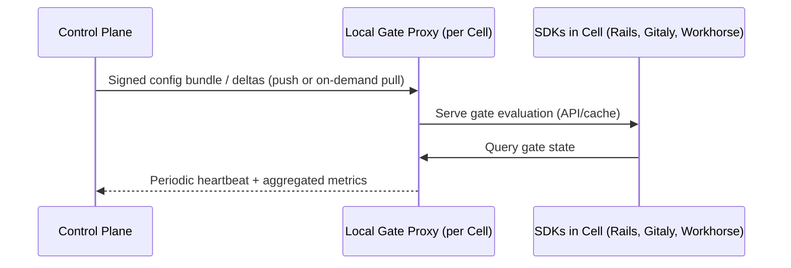
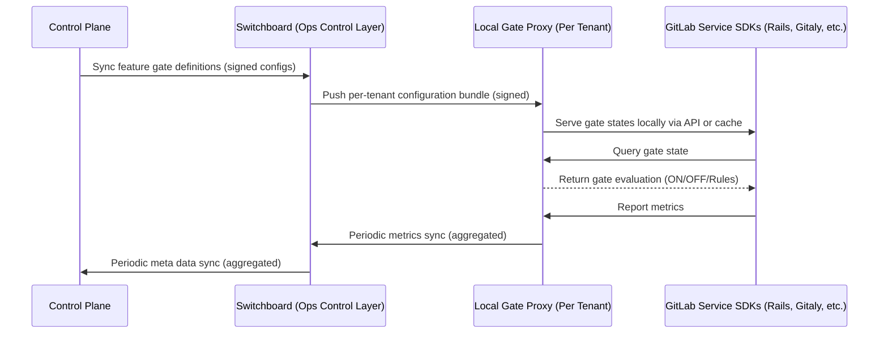



## Executive Summary

Feature flags have been fundamental to GitLab's success, enabling us to safely and iteratively deliver features across our expanding product portfolio. However, our current solution has reached its operational limits, leading to increased time-to-market for new features, higher incident rates and competitive disadvantage in release management capabilities.

This blueprint introduces feature gates, a broader framework that would transform feature management from a tactical development utility into a strategic business enabler with better control over rollouts and incident management for GitLab SaaS platforms.

### In Scope

In this blueprint, the Feature Gates framework is scoped to GitLab SaaS platforms only, yet the work done paves the way for expanding the framework to encompass all GitLab platforms in future iterations.

## Out of Scope

- Implementation details, system architecture, and SDK APIs will be addressed in follow-up technical documents along with execution plan and timeline.
- Existing feature flags in the codebase will not be migrated automatically to the new Feature Gates solution. They will be assessed by the owners and either be removed entirely if expired or not used, converted to settings, or replaced by gates as per the guidelines in this document.
- This blueprint doesn't cover Self-Managed or JiHu rollouts.

## Motivation

GitLab's rapid growth has resulted in a portfolio of three major products deployed across diverse environments, supported by a feature flag solution managing over 700 active flags. Originally designed for a simpler architecture, this solution has not scaled with our business needs and technical evolution, limiting our competitive advantage in modern feature management and impeding our ability to deliver value efficiently and safely.

### The existing Feature Flag solution

GitLab.com currently uses a Flipper-based, feature flag solution. Flags are manually controlled via Slack, with GitLab issues used to track the flag through its lifecycle.

This solution has the following limitations:

- **Rollout Strategy Limitation**: Without progressive delivery support in GitLab Dedicated, we cannot de-risk feature releases through gradual rollouts, potentially impacting customer experience and our ability to iterate quickly.
- **Operational Burden**: 700+ manually managed flags consume engineering time while abandoned flags accumulate as technical debt without clear ownership.
- **Compliance**: Limited user management and audit logs adds complexity for Compliance teams.
- **Language gaps**: Ruby-only implementation excludes Go/Python/JS services, and monolithic coupling prevents feature flags from being used on new architectures.
- **Business Impact**: Manual flag coordination consumes engineering time, compromises deployments' success, product teams lack usage data for decisions, and Dedicated customers don't have the same capabilities as .com users. As we scale, we need better tooling to manage features efficiently and meet compliance requirements.

GitLab offers an [Unleash-compatible API for feature flags](https://docs.gitlab.com/operations/feature_flags/). This feature is being used in Production by a number of customers.

## Objectives

Empower GitLab teams to deliver safe, controlled, and data-driven feature rollouts on GitLab SaaS platforms by eliminating operational bottlenecks, strengthening security and compliance, and supporting innovation at scale.

## Requirements

**Release Safety & Quality**

- **Guard monthly releases:** Prevent any leakage of incomplete features in monthly releases through robust automated gating controls and gradual rollouts.
- **Support Multi-Tenant Segmentation and Rollout:** Enable package deployment to all Cells with organization-by-organization or user-cohort activation for progressive rollouts.

**Incident Response & Recovery**

- **Accelerate incident resolution:** Integrate with existing observability and monitoring tools to correlate errors with feature states and provide visibility during incidents.
- **Ensure system resilience:** Enable external control of feature gates independent of the GitLab monolith, ensuring features can be disabled even during system failures.

**Compliance & Governance**

- **Meet regulatory requirements:** Provide complete audit trails of all gate changes with role-based access controls to satisfy compliance standards.

**Operational Excellence**

- **Automate at scale:** Support GitLab's auto-deployments with automated workflows that trigger gate state changes based on predefined success criteria.
- **Democratize feature management:** Provide intuitive self-service tools allowing any team to create, configure, and retire feature gates independently.

**Development Productivity**

- **Simplify feature testing:** Enable comprehensive testing across different gate configurations, manage inter-feature dependencies, and provide full observability of feature behavior.
- **Empower Dedicated operations:** Enable controlled access to beta features and give Dedicated operators kill switch capabilities for rapid response to customer-impacting issues without requiring code deployments.

## Proposal

**Feature Gates** is a framework for feature rollout and access control for GitLab SaaS platforms. Evolving beyond tactical feature flags, it integrates feature management with **governance, automation, and monitoring**.

The framework is designed to meet modern software delivery needs-including multi-cloud, multi-cell architectures, and complex product portfolios. Be it new features or substantial changes, enhancements, or refactorings to existing GA features, the framework is set to manage the rollout progressively -while ensuring **stability, operability, scalability, and compliance**.

### Key Characteristics

- **Control Plane:** A resilient, standalone service manages all gate definitions, rollout rules, and access controls, decoupled from the main application.
- **Multi-language SDKs:** Lightweight clients for Ruby, Go, Python, and more, ensuring consistent gate evaluation across diverse services and environments.
- **Gate Proxy:** a lightweight service on a cell/tenant level that caches and serves signed feature gate configurations to the feature gates SDKs for performance and fault tolerance.
- **Comprehensive APIs & UI:** Rich management interfaces for self-service gate creation, configuration, and monitoring, supporting both automated and manual workflows.
- **Automated Workflows:** Standardized development and release workflows with built-in safety checks, staged rollouts, and lifecycle automation.
- **Advanced Governance:** Role-based permissions, audit trails, and ownership tracking for all gates, supporting regulatory compliance and operational excellence.
- **Integrated Monitoring:** Real-time dashboards and alerting to track feature health and performance, enabling data-driven decision making and rapid incident response.
- **Cell and Ring Awareness:** Native support for multi-cell deployments and ring-based rollouts, minimizing blast radius and enabling progressive delivery within complex distributed architectures.

## Framework Pillars

### Automated & Standardized Workflows

Feature Gates enforce mandatory gating as an integral part of every feature's lifecycle. This is ensured during feature inception via a new mandatory development stage called **Discovery** in our [Experimental, Beta, and Public Availability workflow](https://docs.gitlab.com/policy/development_stages_support).

In the gate-driven development workflow, all features would start at the **Discovery** phase where all gates are disabled by default. Advancement between workflow stages is automated and conditional on meeting predefined criteria (e.g., test results, performance,..) ensuring that only validated, production-ready features reach broader audiences, reducing the risk of regressions and incomplete launches.

The following chart explains the Feature Gates development workflow:

  ```mermaid
  flowchart TD
    Start([Start: New Feature]) --> Discovery[Discovery]
    
    Discovery --> Decision{Feature<br/>Complexity?}
    
    Decision -->|Complex| Experiment[Experiment]
    Decision -->|Simple| Public[Public Availability]
    
    Experiment --> Beta[Beta]
    Beta --> Public
    
    Public --> End([End: Released])
    
    %% Styling
    style Start fill:#f9f,stroke:#333,stroke-width:2px
    style Discovery fill:#663399,color:#fff,stroke:#333,stroke-width:2px
    style Experiment fill:#7d3f98,color:#fff,stroke:#333,stroke-width:2px
    style Beta fill:#8b4f9f,color:#fff,stroke:#333,stroke-width:2px
    style Public fill:#9966cc,color:#fff,stroke:#333,stroke-width:2px
    style End fill:#9f9,stroke:#333,stroke-width:2px
    style Decision fill:#ffd700,stroke:#333,stroke-width:2px
    
    %% Notes
    Discovery -.-> DiscNote[1.New stage introduced by Feature Gates workflow.<br/>2.Every feature begins here.<br/>3.Only available within predefined workflows for a safe rollout mechanism.<br/> 4.Gates are off]
    
    Experiment -.-> ExpNote[1.More gradual rollout.<br/>2.Opt-in mechanism.<br/>3.Preview of upcoming functionality is the core of development stages support policy.]
    
    Beta -.-> BetaNote[1.Wider testing phase with expanded user access.<br/>2.Opt-in mechanism.<br/>3.Final testing before release.]
    
    Public -.-> PubNote[1.Feature gate defaulted to ON.<br/>2.Available to all users.]
    
    Decision -.-> DecNote[Simple features can jump directly to Public Availability.]
    
    %% Style notes
    style DiscNote fill:#f9f9f9,stroke:#666,stroke-width:1px,stroke-dasharray: 5 5
    style ExpNote fill:#e6f3ff,stroke:#4169e1,stroke-width:1px,stroke-dasharray: 5 5
    style BetaNote fill:#f9f9f9,stroke:#666,stroke-width:1px,stroke-dasharray: 5 5
    style PubNote fill:#f9f9f9,stroke:#666,stroke-width:1px,stroke-dasharray: 5 5
    style DecNote fill:#ffebcd,stroke:#666,stroke-width:1px,stroke-dasharray: 5 5
  ```

#### Monthly Release Alignment and Configuration Snapshots

When the **monthly release** is prepared, all code merged behind feature gates is automatically included - regardless of rollout stage. However, **what ships enabled** is strictly governed by the **Control Plane snapshot process**, ensuring only validated and approved gates are active by default.

- **Snapshot Generation & Embedding**

  As part of the release-cut pipeline, the **Control Plane automatically generates a "Feature Gate Release Snapshot."**

  - The snapshot captures every gate's ID, default state, stage, and metadata at that point in time.
  - Snapshots are **cryptographically signed**, versioned, and stored centrally in the Control Plane.
  - The snapshot is **exported as an artifact** into the release pipeline and **embedded into the deployment bundles**.
  - This guarantees that every deployed environment runs against a **tested, validated, and signed set of gate defaults** for that specific release.
  - During this pipeline step, automated checks validate gate consistency and ownership.
  - If any gate fails validation or causes build/test regressions, the release job automatically notifies the owning feature team. Teams can either fix the underlying issue or adjust the default state before the snapshot is re-generated.

- **Gate States in the Release**

  Once embedded, the snapshot defines **exactly which features are on or off** in that release:

  - **New or incomplete features** → **OFF** by default.
  - **Completed, approved GA features** → **ON** by default in releases - Product decides on feature status using [stages support policy](https://docs.gitlab.com/policy/development_stages_support/) as a guide.
  - **Experiment / Beta features** → Enabled **only for designated cohorts** (e.g., internal users, beta participants); disabled for all others unless promoted later.
  - Progressive rollouts or live percentages have **no effect** on the static snapshot - the release always ships with the **default configuration**, not the current live rollout state.

- **Post-Release Validation**

  - Feature teams verify that only completed, approved gates are **ON** by default.
  - Any subsequent promotions (e.g., Beta → GA) are handled dynamically via the Control Plane after release, not by modifying the shipped defaults.

#### Interaction between Application and Feature Gates

1. A Developer uses the **Gate Management UI** or API to configure the gate of their feature.
2. These settings are stored in the **control plane**.
3. The merged code for the gated feature is deployed as per deployment pipelines to designated environments.
4. When a user accesses the GitLab application instance, the application's **Feature Gate SDK** makes a call to the **Local Gate Proxy**, fetching the state of the gate given the platform and environment context. The local proxy will fetch from **Control Plane** as required. Note that self-managed instances will fallback to packaged defaults instead.
5. The **Feature Gate SDK** uses the information received from  the **Local Gate Proxy** to evaluate the gate state locally and cache it.
6. The application instance then decides whether to show the feature to that specific user using the **Feature Gate SDK**.

### Progressive & Guarded Rollouts

With the introduction of automated workflows, feature releases are now managed via progressive, cohort-based rollouts. This approach enables features to be incrementally exposed to targeted user groups -such as internal teams (dogfooding), beta testers, or randomized user cohorts-through beta programs, and controlled experiments. The process is tightly coupled with real-time monitoring and automated safeguards to ensure user impact is minimized.

#### How It Works

- **Cohort-Based Rollout** - A cohort is a specific, isolated group of users who are exposed to a feature based on a defined rule (e.g., all internal staff, all users in Organization X, or users who have explicitly opted into a Beta program). Each stage of the rollout workflow includes one or more cohorts. The framework uses targeting rules to advance rollout between cohorts until the feature has made it to all cohorts.

- **Incremental/Progressive Rollout** - Rollouts begin with minimal exposure, and are gradually ramped up in stages. The increase in exposure is governed by predefined rules and automated checks, allowing the team to quickly halt or reverse the rollout if issues arise.

- **Automated Safeguards and Immediate Rollback** - Feature Gates would continuously monitor a **composite set of key health metrics** using integrations with monitoring and alerting platforms (e.g., Grafana). This is used to generate **High-Fidelity Rollback Signals (HFRS)** that minimize false positives and alert noise. If an HFRS signal were to exceed its defined threshold, the feature gate system would automatically perform a targeted recovery action, and notify the appropriate teams.

  - **Composite Rollback Metrics:** To prevent side-effect regressions (e.g., a feature with low error rate causing a massive CPU spike elsewhere), the HFRS are formed by combining:

    - **Tier 1: Feature SLOs:** Metrics directly measuring the feature's health (e.g., latency and error rate).
    - **Tier 2: Platform Guardrails (Normalized):** **Cell-scoped, resource-based metrics** (e.g., **CPU Utilization, Memory, Queue Depth**) that measure the feature's impact on platform integrity. These guardrails are **normalized against the local cell's historical baseline** (not a raw global average) to ensure sensitivity to localized performance spikes while avoiding the masking effects of global normalization. The Control Plane uses correlation to detect a systemic problem if multiple cells trigger localized HFRS concurrently.

  - **Thresholds and Rollback Rules:** Rules are calibrated to prevent false positives by requiring **sustained breaches** across the composite metrics. These rules are configured by feature engineers in the management UI, but are subject to review and tuning. The system's action is granular based on defined rollback policies: it will automatically **scale down exposure** (e.g., fall back to the last known stable configuration snapshot) or trigger a targeted **Kill Switch** on the specific problematic feature.

  - **SRE Governance and Incident Control:** **SRE Teams** play a critical role in defining, tuning, and enforcing the **Platform Guardrails** (Tier 2 HFRS), leveraging their expertise to ensure these non-negotiable thresholds protect system health and reliability against resource-intensive rollouts. The method for normalizing and aggregating these per-cell HFRS signals for global rollback decisions will be a critical area of investigation and monitoring during the implementation phase. To control an incident, an SRE on-call can manually **trigger a targeted Kill Switch** to immediately disable any problematic feature gate, serving as a vital lifeboat to protect system availability during critical incidents, independent of the automated policies.

#### Rollout Across Deployment Environments

The rollout is managed independently of the code deployment schedule, treating each environment (e.g., staging-canary, production-canary, staging, production) as a distinct stage for a controlled feature rollout. This approach ensures the code is deployed first (e.g. gate off by default), and the feature is enabled later in a staged manner.

- **Interaction with Deployment Pipeline Tests:** - The gate rollout is contingent on the underlying code being stable:

  - **Tests Must Know Gate State:** - Automated tests must be explicitly aware of the feature gate states to verify application behavior under various gate states (on, off, fallback). In practice, this means that gate state simply becomes part of the test fixture verifying all three code paths (e.g. GA -> ON, Experimental/Rollback -> OFF, and Failure/Fallback mode). The testing focus shifts from individual-gate to full integration when moving from CI (Unit/Integration) to deployment to production like environments (E2E) to ensure multiple active features work together.

  - **Gate Waits for Tests:** - The gate rollout is a subsequent step in the overall workflow and must wait for the deployment pipeline's tests to succeed:
    - The Automated Workflows that control the progressive rollout are conditional on the CI/CD integration. This ensures the underlying code package has passed all basic environmental and functional tests before the feature gate begins its guarded rollout in the new environment.
    - Once tests pass and the code is deployed, the guarded rollouts phase begins. At this point, the gate is enabled for a small cohort, and the focus shifts from pipeline tests to live monitoring for guarded rollbacks based on health metrics.

  - **Triggering the Next Rollout Stage:** - The control plane monitors aggregated metrics (error rate, latency, etc.) coming from the current environment (e.g., staging-canary). Once these metrics are stable and meet all predefined success criteria for a set time, the gate's rollout for that environment is considered validated. This validation acts as the "gate has completed rollout" signal. The Automated Workflows then trigger the promotion of the feature gate's enablement policy to the next target environment (e.g., production-canary).

#### Automated Workflow Example

1. A new feature is deployed to 5% of users.
2. Predefined thresholds are set for critical SLIs, and feature gate metrics.
3. Monitoring tools continuously track these metrics in real time.
4. If a threshold is breached, the feature gate system triggers an immediate rollback for all or affected cohorts on affected platforms, and sends alerts to feature gate owners.
5. All rollout actions, threshold breaches, and rollbacks are logged for audit and future analysis.
6. Once the issue is addressed, the rollout can safely resume.

#### Dependencies

- Supporting controls (e.g. Observability, Metrics & usage instrumentation).

### Federated Deployment Topologies

The Feature Gates framework operates through a federated but centrally governed topology, ensuring consistent control, visibility, and resilience across GitLab SaaS platforms.

The **Control Plane** service is not part of the monolith and operates a seperate Database from the application's under the hood. Each tenant consumes signed configurations and metrics policies through APIs or controlled distribution channels.

Each tenant/instance/Cell has a **Local Gate Proxy**. These proxies are included in base deployment templates (e.g. Terraform modules, Helm charts, or cluster bootstrap manifests). When an environment (e.g. Cell, tenant, or instance) is created, the proxy is automatically deployed.
These **Local Gate Proxies** are a resilience layer, yet all gate definitions, signing, and updates originate from the control plane.

The control plane itself must run HA (e.g. multi-AZ/region, failover, and tested DR runbooks).

#### Resilience and Sad Path Handling (Graceful Degradation)

The federated architecture is specifically designed for resilience, ensuring that failure in the control layers does not impact the application's core feature evaluation and availability.

- **Control Plane Failure:**
  - The **Local Gate Proxies** serve as the primary resilience layer.
  - If the central Control Plane fails, all Proxies continue serving the **last successfully cached and signed configuration bundle** to the local application SDKs.
  - Feature evaluation continues based on the last known good state, and updates/rollout promotions are simply paused until the Control Plane recovers.

- **Local Gate Proxy Failure:**
  - If the Local Gate Proxy (per Cell/Tenant) fails or becomes unreachable, the application **SDK will NOT attempt to query the Control Plane directly**, as this would violate the isolation model and could introduce complex communication dependencies.
  - Instead, the **Feature Gate SDK** first checks its own **in-memory cache** of the last successful gate evaluation.
  - If the cache is unavailable or expired, the SDK will apply the principle of **Fail Closed**, defaulting all queried feature gates to **OFF (Disabled)** for safety. This prevents exposure of potentially buggy or incomplete features during a critical infrastructure failure.

- **Application SDK Fallback:** The SDK includes a defined fallback mechanism for all environments. For SaaS, the ultimate sad path is to default the gate to OFF, ensuring system stability.

This multi-layered caching and fallback strategy ensures **system resilience**-the requirement that features can be disabled even during system failures-is met, providing a robust graceful degradation path.

#### Deployment Models by Environment

**Development**

- **Topology:** Each development environment would have the ability to run an **ephemeral instance** of control plane and Local Gate Proxy, typically containerized, alongside the GDK installation. This is handy for running end-to-end tests, but not required for routine development or acceptance testing. For the later, engineers should default to lightweight, in-memory test doubles (e.g. local config files) and use the SDK to define gate states, cohort membership, and caching behavior on a per-test basis, ensuring fast, deterministic, and isolated test execution. This prevents global shared state across tests, eliminates caching-related nondeterminism, and significantly reduces CI setup time.

- **Maintenance & Updates:** Containerized images will be provisioned and updated by **GitLab infrastructure** through universal build toolchain (UBT), reflecting latest updates from main branch.

**GitLab Multi-tenant SaaS (GitLab.com)**

- **Topology:** The central control plane is deployed on **independent GitLab-managed infrastructure**, separate from the main SaaS application clusters. Each **Cell** hosts a **Local Gate Proxy** service. Cell's SDKs (Rails, Gitaly, Workhorse, etc.) interact only with their local proxy for gate lookups and telemetry.

- **Maintenance & Updates:** Co-managed by the **GitLab Infrastructure and DevEx teams**, with continuous delivery of configuration, schema, and rollout updates.



**GitLab Dedicated**

- **Topology:** The central control plane pushes feature gates as **signed configuration bundles** to **Switchboard**, the operational control layer for Dedicated. Switchboard validates tenant eligibility (e.g. version compatibility, maintenance windows, licensing, etc) and distributes tenant-scoped signed bundles to each tenant's **Local Gate Proxy** service. Tenants' SDKs (Rails, Gitaly, Workhorse, etc.) interact only with their local proxy for gate lookups and telemetry. For **GitLab Dedicated - Public Sector**, outbound network access is tightly regulated (e.g. mTLS, IP whitelisting, approval workflow), allowing tenants to securely sync with the central control plane.

- **Maintenance & Updates:** The central control plane and signing infrastructure are maintained by **GitLab Infrastructure**. **Dedicated Ops** manages Switchboard and per-tenant proxies, ensuring controlled rollout, version compatibility, and SLA compliance. **Tenant Admins** are responsible for managing local change approvals, caching policies, and connectivity windows under their compliance framework maintaining regulatory control.



### Integrated Incident Response & Monitoring

The Feature Gates framework establishes a **feature-centric observability and incident response layer** across GitLab SaaS platforms. It connects **feature behavior**, **configuration**, and **system health**, allowing incidents, triage, and rollbacks to be driven by *feature context* rather than isolated system metrics.

**Observability Strategy** - Currently each GitLab SaaS platform operates an independent observability stack to meet the platform's **privacy**, **compliance**, and **scalability** requirements. The framework layers on top of these existing stacks, implementing a **federated observability model** that connects feature-level insight across cells/tenants through **standardized metadata** and **alert routing**, not raw telemetry.

| Platform                      | Observability Setup                                                | Data Control                  |
| ----------------------------- | ------------------------------------------------------------------ | ----------------------------- |
| **GitLab.com**                | Central multi-tenant observability stack                           | GitLab-managed                |
| **Dedicated**                 | One observability stack per tenant                                 | GitLab-managed                |

**Federated Aggregation Model** - Feature gate operates through local telemetry storage per tenant/cell and aggregates metadata on a control plane level:

| Layer                                    | What It Holds                                                                                       | Who Uses It                    | Purpose                                                                    |
| ---------------------------------------- | --------------------------------------------------------------------------------------------------- | ------------------------------ | -------------------------------------------------------------------------- |
| **Local Observability (Cell / Tenant)**  | Full metrics, traces, logs collected on a tenant/Cell-level                                         | GitLab SRE & Feature Engineers       | Deep debugging and performance insight                                     |
| **Alertmanager Routing**                 | Structured, rule-based alerts enriched with feature-gate metadata (ID, version, stage, severity)    | GitLab GitLab SRE & Feature Engineers       | Primary signal channel for real-time health and incident detection         |
| **Local Gate Proxy**                     | configuration health metadata                                                                       | GitLab Engineering  / Product  | Provides periodic summaries for long-term trends                           |
| **Control Plane**                        | Aggregated alert metadata, gate configurations, version history, correlation summaries              | GitLab Engineering / Product   | Global visibility, automated rollback, and cross-environment correlation   |

To ensure a **secure aggregation path** the framework enforces the following:

- **No telemetry leaves tenant boundaries with sensitive information** - Tenant/Cell's telemetry remains local; only structured metadata are exported.
- **Standardized alert ingestion** - Feature-related alerts are routed to the control plane through **Alertmanager webhooks**, following the same [routing tree](https://gitlab.com/gitlab-com/runbooks/-/blob/master/alertmanager/routing-tests.jsonnet) used for `.com` and Dedicated.
- **Controlled, schema-validated data exchange** - The control plane accepts only signed, schema-validated metadata.
- **Anonymized and auditable** - All metadata excludes PII and customer identifiers; events are logged in control plane with audit trail continuity.

**Core Capabilities**

- **Guarded Rollouts & Kill Switches** - Rollouts are bound to **alert thresholds** and **feature health**. Auto-rollbacks and kill switches allow instant disablement (e.g. via cache invalidation, expediting emergency policy regardless of maintenance window) of problematic gates, without redeployment. Operational controls (e.g., disabling a Sidekiq worker) can also use the same gate model - simply as **ops gates** with no rollout rules.

- **Contextual Gate State Tags** - Instead of logging every gate state on every log line, only the states of **directly relevant feature gates** are logged as tags or metadata with error/exception events and key rollout changes. This dynamic tagging ensures critical context is available for diagnosis:
  - For feature-specific errors, the state of the guarding gate (and its direct dependencies) is included.
  - For global incidents, states of predefined **high-impact, recently changed, or potentially problematic gates** are captured.

- **Standard Dashboards & Alerts** - The framework registers **standardized dashboard panels and alerts** for the following dimensions:

  - **Health:** enablement state, rollout progress, configuration freshness
  - **Performance:** latency, error rate, resource consumption, Apdex
  - **Environment comparison:** staging vs. production, canary vs. main

  **self-describing telemetry** is automatically emitted for each feature gate through standardized metrics including gate metadata and thresholds. Observability stack can leverage **metric-driven visibility** - allowing dashboards and alerts to adapt dynamically to the live state of feature gates across environments:

  - **Templates Deployment** - Templates (e.g. [Aggregation Sets and alerts](https://gitlab.com/gitlab-com/runbooks/-/blob/81250cbf55d6461578cbd769bee6a1cb55d062df/metrics-catalog/README.md?plain=1#L133)) are stored in runbooks as centralized assets - version-controlled, reviewed, and are part of the observability infrastructure deployment pipeline that already manages observability stack configuration.

  - **Metric Emission** - Each service and the control plane emit metrics about the feature gates:
    - metadata in labels (feature gate name, feature category, rollout stage)
    - thresholds (alert & rollback thresholds)
    - Throughput, error and apdex metrics with the relevant information

  - **Dynamic Dashboards (Visualization Layer)** - Dashboards reference these emitted metrics using label filters. Panels automatically populate with live data for any gate - no need for compile-time configuration or redeployment.

  - **Reusable Alert Templates (Alerting Layer)** - Alert rules are label-aware, evaluating thresholds from metric labels or the control plane metadata.

  This approach enables us to create [aggregation sets](https://gitlab.com/gitlab-com/runbooks/-/blob/81250cbf55d6461578cbd769bee6a1cb55d062df/metrics-catalog/README.md?plain=1#L133) to receive these metrics, add alerts based on the thresholds, and provide dashboards with configurable feature gate filters to display this information without having to deploy dashboards every time.

- **Intelligent Alerting & Correlation** - Alertmanager serves as the **primary alert transport**, while the Control Plane acts as the **reasoning layer** that interprets highly-filtered, structured alerts from across tenants, rings, and environments.

  - **Problem Detection (High-Fidelity Signal):** The local Observability stack triggers **High-Fidelity Rollback Signals (HFRS)** for breached composite SLOs. These HFRS prevent false positives by requiring a **sustained breach** across two tiers of metrics:
    - **Tier 1: Feature SLOs** (e.g., specific error rates).
    - **Tier 2: Platform Guardrails(Normalised)** (e.g., sustained CPU saturation of Cell A).
    The signals are enriched with gate metadata for confident attribution.

  - **Alert Routing:** Alertmanager delivers these highly-filtered alerts to the **Control Plane** (via a webhook). The system **avoids querying raw metrics per request**, ensuring the entire incident response mechanism is fast and does not overload the central stack.

  - **Global Correlation and Guarded Rollback:** The Control Plane keeps the state of these high-fidelity alerts and correlates them to determine the exact feature gate version that caused the issue. These HFRS signals are the primary input for the **Guarded Rollback** logic, which triggers:
    - **Targeted Rollback:** Incremental reversion of only the problematic gate to its last stable step using configurations snapshots, avoiding global over-correction.
    - **Incident Workflow:** Routing alerts via existing logic (using feature categories for Slack channels and severities for SRE paging), ensuring **real-time, feature-centric monitoring** without centralizing raw metrics.
- **Error Correlation & Diagnostics** - In addition to **contextual gate state tags**, Feature gates uses the following mechanisms to establish consistent, lightweight correlation primitives across all telemetry types:

  | Mechanism                   | Description                                                                                  |
  | --------------------------- | -------------------------------------------------------------------------------------------- |
  | **Auto-Annotations**        | Gate toggles automatically create Grafana/Kibana annotations for temporal correlation.       |
  | **Configuration Snapshots** | Control plane records complete gate configurations at each rollout or change (GA, rollback). |
  | **Audit Logs**              | Immutable records of all gate changes (who, what, when, where).                              |

  In an **typical triage flow**, an engineer would do the following:

  - Inspect error logs enriched with gate metadata.
  - Review recent gate change events and audit trail.
  - Compare configuration snapshots to confirm correlation.
  - Roll back or adjust rollout in the control plane or local proxy.

  **Example Correlation Flow**

  - Local Prometheus in three Dedicated tenants fires alerts for `ai_code_suggestions` latency.
  - Each tenant's **Alertmanager** routes those alerts to the control plane webhook (alert metadata)
  - The control plane detects a repeated pattern (same gate + version across tenants) and triggers:
    - An alert to global incident management (incident.io, PagerDuty).
    - A recommendation or automated rollback
  - Control plane logs the incident correlation, updates the gate configuration, and syncs rollback instructions downstream to affected environments.
  - Incident tooling posts:

    > "Correlated error trend across Dedicated tenants - gate `ai_code_suggestions` v1.4 auto-paused globally."

   This new automated path does not burden the on-call, but shifts the responsibility left.

- **Metadata Export Governance** - For Dedicated tenants that operate under strict privacy controls and therefore, can restrict or disable outbound metadata export, the progressive rollout would be suspended. In such cases, the control plane continues to deliver signed configuration bundles but does not automatically promote or roll back feature gates without telemetry confirmation. Instead, rollout advancement requires explicit human approval through Switchboard where customer tenant admins review and authorize configuration changes. These manual approvals are versioned, signed, and fully auditable within the control plane, ensuring traceable and compliant feature changes. This guarantees operational safety and regulatory adherence while maintaining full tenant control over rollout timing and exposure in telemetry-silent environments.

#### Dependencies

- Supporting controls (e.g. observability, metrics, and usage instrumentation).
- Integration APIs with incident management solutions.

### Streamlined Testing

The Feature Gates framework would simplify the testing process for features under development, ensuring robustness and reducing environment contamination via the following:

- **Configurable Features** - Feature teams should rely on using settings to represent configurations needed to customise a feature's behavior instead of using code toggles/flags, simply because flags are short-lived meanwhile settings are permanent and unique per user allowing different feature behaviours to be tested in isolation.

- **Environment Scoping** - Feature gate changes are scoped to individual environments (e.g., staging, CI test environments, pre-production), based on explicit configuration by engineers. When setting up a feature gate, engineers specify which environment the gate should apply to-either through configuration files, environment variables, or management UI. This ensures that enabling or disabling a gate for testing in one environment does not impact production or other parallel environments, providing safe and isolated testing and rollout.

- **Ad-Hoc Test Environments namespaces** - Using the feature gates SDK, engineers can programmatically create dedicated, temporary test environment namespaces (or contexts) for automated tests. Each test or test suite generates a unique namespace, allowing it to define and manipulate feature gate states in complete isolation from production and other tests. These namespaces are managed logically within the feature gate service and do not require any additional physical infrastructure.
  
  During the test run, only the specific test runner or CI process has access to its ephemeral namespace, ensuring that gate state changes are scoped exclusively to that test and invisible to others. After the test completes, the namespace and its gate state are automatically cleaned up, preventing state leakage or cross-test contamination.

#### Integration with GitLab's Testing Approach

The Feature Gates testing methodology is designed to fit seamlessly into and improve GitLab's existing testing tiers and across all development stages.

- **Development** - This aligns with **Unit and Local Integration Testing** by providing developers with immediate, isolated feedback:

  - **Offline Mode:** Developers can use **mock configuration files** to simulate gate states for unit tests, requiring no external dependencies and ensuring rapid local development.
  - **Online Mode:** For integration tests, developers connect to a **sandboxed environment** to set and verify actual gate states, ensuring the interaction with the control plane is correct before merging code.
  - **Fallback Validation:** The system mandates explicit testing of **fallback scenarios** (e.g., if the gate server is unreachable) and all possible gate states (enabled, disabled, custom percentages), promoting robust code.

- **Continuous Integration** - This significantly enhances the **CI Test Pipeline** by enabling parallel execution and eliminating state leakage:

  - **Parallel Test Isolation:** The framework uses **environment scoping** and **ad-hoc test environment namespaces** to isolate tests. Each test or test suite gets a unique, temporary namespace in the feature gate service, allowing it to define and manipulate its gate state **without impacting other parallel tests**.
  - **Comprehensive Verification:** Engineers can verify application behavior under various gate states, simulate edge conditions, and test fallback scenarios during the pipeline run.
  - **Traceability:** Test reports capture the exact feature gate configuration and environment context used for each test, which is critical for debugging failures by connecting them to specific gate states.

- **Staging** - The framework resolves the long-standing problem of contamination in shared environments like Staging, which is crucial for **End-to-End (E2E) testing** using **Cohort-Based Testing**. This method relies on **user identity/cohort membership** to achieve both reliable isolation and comprehensive test coverage.
  
  - **Test Isolation and Reliability** - The framework enables the feature based on the identity of the user running the test:

    - **Test User:** During test setup, the automated test would be configured to use a **test user** that is explicitly tagged in the Feature Gate system with a unique, staging-exclusive cohort ID (e.g., `staging-team-A-exp1`).
    - **Targeted Activation:** When the test runs, the Feature Gate SDK resolves the gate state by querying the system to find out if the user running this test part of the desginated cohort e.g. (e.g., `staging-team-A-exp1`).
    - **Result:** The feature is active **only for that test user**. This allows multiple teams to run parallel E2E tests for different in-development features simultaneously on the same Staging environment without interference.

  - **Simulation and Coverage** - This method ensures we can fully test the required code paths:

    - **Positive Test Case:** The test is run with a staging user **in the cohort** to verify the new feature's functionality is correct.
    - **Negative/Legacy Test Case:** The test is run with a staging user **outside the cohort** to verify the legacy code path remains correct and that the new feature is not inadvertently leaking.

### Lifecycle Automation & Accountability

#### Gate Creation and Configuration

Feature Gates would be created early in the development process (e.g. discovery phase) by engineers through the UI or API. Automated bots may also suggest or pre-populate gate configurations based on new merge requests such as:

- Name, description, feature category, and expiry date
- Dependencies between gates (e.g. to be shown in a dependency graph)
- New gates start disabled by default

Dashboards and reports in the management UI would provide visibility into gate status, usage, ownership, and lifecycle events.

#### Gate Cleanup

Gates are automatically checked every release cycle for expiration. In the initial implementation, the system will not attempt automated code removal, as automatic cleanup MRs are high-risk and require significant engineering investment. Instead, the system will generate cleanup issues for the owning groups with due dates and best-effort code reference lists. This ensures sustainable hygiene without operational risk. As patterns become more consistent and the Control Plane matures, we can explore assisted cleanup tooling and, eventually, automated cleanup MRs in later iterations.

##### Process

- Feature teams have 2 weeks to clean up expired gates.
- Once MR is approved and merged, the team can delete gate from the system.
- Escalation: leadership of the stage → department → VP
- Department leadership can approve extensions due to priority changes or incidents
  
#### Gate Ownership

Using feature category, feature gate ownership (e.g. group & stage) can be deducted using the handbook as a SSoT . In case feature groups change function or get dissolved, groups need to take a deliberate action on what to do with a feature category and respective gates accordingly: transition it to another group, put it in maintenance mode (with a new group owning), or remove it entirely.

### Auditing & Governance

- Using feature gates' role-based permissions, we'd be able to govern who can do what in which environments.

- Example of roles and access level for environment:

  | Role                                         | Permissions                                                            |
  | -------------------------------------------- | ---------------------------------------------------------------------- |
  | **Developer**                                | Create and edit gates in *dev/staging*                                 |
  | **Feature groups**                           | Toggle gates in *production* and manage rollout percentages            |
  | **Admin / Security**                         | Manage roles, audit logs, and gate ownership                           |
  | **Observer**                                 | Read-only access to gate status and metrics, e.g. Release Manager      |
  
  | Environment | Restrictions                          |
  | ----------- | ------------------------------------- |
  | Dev         | All devs can create & toggle          |
  | Staging     | Anyone can toggle                     |
  | Production  | Feature groups can toggle             |

- Example of operational workflows and the different roles:

  - Standard Gate Lifecycle
      1. **Creation**: Feature developer creates via Feature Gate platform
      2. **Review**: Product Manager approves rollout plan
      3. **Deployment**: Automated deployment through CI/CD
      4. **Activation**: Automated rollout based on rules
      5. **Monitoring**: Automated alerts for gate state changes
      6. **Cleanup**: Scheduled cleanup with Product Manager and EM confirmation

  - Emergency Procedures
      1. **Incident Detection**: SRE/Infra/RM identifies gate-related issues
      2. **Immediate Response**: Emergency rollback manual or automated using rules
      3. **Escalation**: Product Manager notified for business impact assessment
      4. **Resolution**: Coordinated fix with Feature developer, EM, SRE and Release Manager
  
- Logging feature gate state change would eliminate the need for rollout issues.  

### Cell-architecture Support

The Feature Gates framework fundamentally resolves the synchronization and consistency issues faced by the current feature flag system in a Cell architecture by **decoupling feature state from the application's database, and tightly integrating version-awareness into the rollout logic.**

#### Decoupling and Resilience

The architecture utilizes a decentralized enforcement model to ensure each Cell is operationally autonomous for feature evaluation:

- **Control Plane** - The service is the single, global source of truth for all gate definitions, policies, and rollout rules, and is **decoupled from the main application monolith**.
- **Local Gate Proxy** - Each **Cell** hosts its own dedicated **Local Gate Proxy**. This proxy caches the signed feature gate configurations locally, allowing the Cell's SDKs to interact **only with their local proxy** for high-performance, fault-tolerant gate lookups. This eliminates the need to constantly query a global shared database, addressing the existing synchronization and consistency problems.

#### Rollout Granularity and Automated Inclusion

Rollout control operates at the **Ring** level, ensuring consistent feature exposure across identical Cells while reducing operational overhead for engineers.

- **Ring as the Unit of Customization** - Rollouts are applied per **Ring ID**, not per Cell. The **Automated Workflows** and progressive rollout logic target the Ring as a single configuration domain, abstracting away the growing number of Cells. This guarantees that all Cells in a Ring share identical gate policies, rollout stages, and configurations.

- **Automated Inclusion** - When a new Cell is provisioned and attached to an existing Ring, it automatically inherits the Ring's current feature gate configuration and rollout stage. This ensures that feature exposure remains deterministic and drift-free without additional operator intervention.

- **Drift Handling and Incident Isolation** -
  Drift handling occurs only when a Cell must be temporarily isolated due to an incident. This ensures stability without disrupting broader rollout consistency.

  1. The observability stack detects SLA or error-rate breaches correlated with specific feature gates. The SRE triggers isolation by marking the affected Cell as "Maintenance" in [tissue](https://gitlab.com/gitlab-com/gl-infra/cells/tissue/-/tree/main/rings), our **Cell registry**.
  2. The control plane receives this update, recognizing the Cell's environment context has shifted from its standard Ring to a **Maintenance Ring** (e.g. Ring - 1).
  3. The control plane generates a temporary, signed, versioned override bundle enforcing restrictive policies (e.g., enabling kill switches or halting progressive rollouts).
  4. The affected Cell's **Local Gate Proxy** applies the override immediately, stabilizing the environment without code deployment.
  5. While in Maintenance mode, all emitted metrics are tagged (e.g. `ring_context=maintenance`) and excluded from normal rollout telemetry. Once the Cell returns to a healthy state and rejoins its parent Ring, the Local Gate Proxy automatically reverts to the baseline policy.

This pattern isolates incidents cleanly, maintains strict configuration consistency across Rings, and allows feature rollouts to continue safely without manual reconfiguration or code redeployment.

#### Version Discrepancy Control

Given that Cells in Rings could vary in GitLab versions, the system must treat the **GitLab Application Version** as a core dimension for both targeting and incident correlation:

- **Version Reporting as Context** - The Local Gate Proxy within each Cell must include the Cell's current application version in all aggregated metrics and metadata pushed to the control plane.
- **Regression Safety** - The control plane uses this version tag to enforce safety and prevent regressions:
  - If a feature regression is detected in a Cell running version `V1`, the control plane can automatically enforce the gate state as `OFF` for the entire `V1` version segment globally. This ensures no other Cell running that vulnerable version receives the problematic feature.
  - Rollout policies can be defined using version predicates (e.g., "Enable feature X for Ring B only if app version is `> V1.0`"), tying feature enablement to proven code stability.

### Integration with GitLab SaaS

The new [feature development workflow](https://docs.gitlab.com/policy/development_stages_support) would provide a consistent, unified experience for delivering preview functionality on SaaS platforms:

#### GitLab Multi-tenant SaaS (GitLab.com)

- All stages would be supported on multi-tenant SaaS.

- **Workflow:**
  Feature enablement will follow one of two paths, determined by the primary **actor** or scope of the feature (e.g., a project/group feature vs. a user interface feature).

  - **Path 1: Hierarchical (for Project/Group-Scoped Features)**

    > GitLab Controls Instance Features → Organization Owners Enable → Group Owners Enable → Project Maintainers Configure

  - **Path 2: User-Driven (for Global/User-Scoped Features)**

    > GitLab Controls Instance Features → Organization Owners Enable → Users Opt-in

- GitLab would control which features to be available via a **tiered enablement model**, example:

  - **Group Level:**

    - Group owners can enable specific features for their projects, example:

      ```bash
      Group > Settings > General > Advanced Features (NEW)
      ├── Beta Features Program
      │   ├── [ ] Enable beta features for this group
      │   └── Select specific beta features:
      │       ├── [ ] Feature A (Beta)
      │       └── [ ] Feature B (Beta)
      └── Experimental Features Program
          ├── [ ] Enable Experimental features (Ultimate only)
          ├── Warning: Experimental features may change or be removed
          └── Select specific experimental features:
              └── [ ] Feature C (Experimental)
      ```

  - **Project Level:**

    - Project owners can enable specific features for their projects, example:

      ```bash
      Project > Settings > General > Feature Programs
      ├── Inherit from group: [Group Name] ✓
      └── Override settings:
          ├── [ ] Disable beta features for this project
          └── [ ] Disable experimental features
      ```

  - **User Level:**

    - Users can opt-in to specific features in their preferences, example:

      ```bash
      User > Preferences > Feature Preferences
      ├── Beta Features (if enabled by Instance/Organization)
      │   ├── [ ] New merge request UI (Beta)
      │   └── [ ] Advanced code search (Beta)
      └── Experimental Features (if enabled by Instance/Organization)
          └── [ ] AI code suggestions (Experimental)
      ```

- Users can opt-in for Experimental and/or Beta features, but they can be disabled globally in case issues arise or incase of exceeding defined SLAs.

#### GitLab Dedicated

- All stages would be supported except **Discovery** and **Experimental**.

- **Workflow:**
  Feature enablement will follow one of two paths, determined by the primary **actor** or scope of the feature (Project/Group-scoped vs. User-scoped):

  - **Path 1: Hierarchical (for Project/Group-Scoped Features)**
    > Switchboard (Instance Admin) → Feature Availability → GitLab Instance → Admin Panel (Feature Gates) → Organisation Settings → Group Settings / Project Settings

  - **Path 2: User-Driven (for Global/User-Scoped Features)**
    > Switchboard (Instance Admin) → Feature Availability → GitLab Instance → Admin Panel (Feature Gates) → Organisation Settings / User Settings

  - Since **Switchboard** serves as the primary connection between GitLab tenant operators and GitLab Dedicated tenant instances, it would be the logical place to manage feature availability at the instance level using a **two-tier enablement model**:

    - **Tier 1 - Instance Level (via Switchboard):**
      - Customer Instance Admin would enable feature availability categories in Switchboard.
      - New section: "Admin Area > Settings > Feature Availability" with the following options:
        - Production features only (default)
        - Production + Beta features (New)
      - This acts as a "main switch" for what appears in the GitLab admin panel

    - **Tier 2 - Feature Level (via GitLab Admin Panel):**
      - Once enabled in Switchboard, individual features would appear in the GitLab instance's admin panel.
      - Features would be clearly marked with badges: Beta, or GA.
      - Instance admins could then selectively enable specific Beta features. Meanwhile, GA features are enabled by default.

    - The rest (e.g., Group Settings /User Settings/Project Settings) would follow a similar approach as with multi-tenant SaaS.

- Customers can opt-in for Beta features via admin panel, but also admins can disable them in case issues arise and auto rollback can also be configured in switchboard incase of exceeding defined SLAs.
- Feature Rollout will be a collaborative decision between the Feature PM/EM, driving what to experiment with and why, and the Dedicated PM/EM, governing who and how many Dedicated customers are involved, and manage the "opt-in" process. That's because The Dedicated PM/EM have more context regarding customer engagement, risk tolerance, and the overall operational capacity for beta experiments within the Dedicated fleet.

#### General Development Guidelines

- Flags belonging to Feature gates will be removed after 100 % rollout and pre-defined stability period to accommodate for adoption period per platform.
  
- It's up to the development team to define what is the correct actor for each feature, it could be a user, a project, a group, an organization, or the whole instance. This will enable us to develop a set of cascading controls where from the instance admin, down to the single user, a given feature preview could be enabled or not.
  
- A "Feature Preview" is an admin page in the GitLab application, where the instance administrator can see available features and their state (e.g. GA, beta, or experiment) and select what they want to enable and for which actors.

#### Dependencies

- Admin panel: Feature configuration UI.
- Organization, Project and User settings: Feature configuration.
- Operator driven Feature configuration: Dedicated Commercial & Gov.
- Aligned rollout process with clear ownership.
- Supporting controls (e.g. Observability, Metrics & usage instrumentation).

### Feature Gates In Practice - Examples

#### Scenario 1: A new feature without any preview stage - Multi-tenant SaaS

- If we have a feature that will not require a preview stage (Experiment or Beta), it will begin in the Discovery stage with an assigned feature gate.

- In this workflow, the feature gate acts as a simple control to enable a feature.

- **Workflow:**  
    1. In the first rollout, the gate will be OFF.
    2. When the development team is ready to validate the feature, they will enable it selectively for themselves and their PM.
    3. The feature may or may not require adjustments. When ready, they will enable it for all GitLab team members.
    4. The feature may or may not require adjustments. When ready, they will enable a gradual rollout that will safely increase the functionality exposure to our users.
    5. When the feature hits a full rollout and is stable for a while, it can be defaulted to ON and later the gate is removed from the codebase. Effectively moving the feature to the Public Availability stage.

#### Scenario 2: A new feature with Experiment and Beta - Multi-tenant SaaS

- Some features require a longer development time and benefit from early feedback from interested users without affecting the stability of customers not interested in these features.

- **Workflow:**
    1. In the first rollout, the gate will be **OFF**.
    2. When the development team is ready to validate the feature, they will enable it selectively for themselves and their PM.
    3. The feature may or may not require adjustments. When ready, they will enable it for all GitLab team members.
    4. As we work on improving the new feature, the development team and their PM will decide when the feature should be moved to the **Experimental stage**.
    5. When the feature is set to **Experimental**, it will show up in the **Feature Preview** panel according to the decision made in the hierarchy of controls (instance admin > organization > group > user).
    6. Customers can opt-in and provide feedback according to the outlined [process](https://docs.gitlab.com/policy/development_stages_support).
    7. As the team keeps working on the feature and the feedback, it will move to **Beta** and later to **Public Availability**.

#### Scenario 3: A new feature with Beta - Dedicated

- **Workflow:**
  1. In the first rollout, the gate will be **OFF**.
  2. When the development team is ready to validate the feature, they will enable it selectively for themselves and their PM.
  3. The feature may or may not require adjustments. When ready, they will enable it for all GitLab team members.
  4. As we work on improving the new feature, the development team and their PM will decide when the feature should be moved to the **Beta stage**.
  5. **Dedicated Product and/or Operations Team** reviews and approves the feature gate availability for customers.
  6. The Customer's instance Admin enables feature category in **Switchboard** (e.g. Opt-in action).
  7. Configuration deploys to tenant (immediate or maintenance window).
  8. The customer's instance admin sees new features in **Admin Panel (Feature Preview)**.
  9. The Customer's instance admin selectively enables desired beta features.
  10. Features become available to end users with appropriate non-GA warnings.

#### Scenario 4: Full SDLC: Beta -> GA on GitLab.com, then available for Dedicated (Step-by-Step)

**Part 1: GitLab.com SDLC (Feature Team Ownership)**

The following steps are primarily owned by the **Feature Development Team** and **Product Manager**.

- **Development: Feature Inception (Discovery Stage)**

  - The new feature is initiated in the **Discovery** stage, and a mandatory feature gate is created.
  - The gate's default state is set to **OFF** in the codebase.
  - The **Feature Gate SDK** is integrated into the code to check the gate state before executing the new feature logic.

- **Testing: MR Review**

  - **Unit & Integration Tests** run on CI during MR Review, explicitly testing all three code paths: **Feature ON**, **Feature OFF**, and the **Fallback/Failure mode**.

- **Deployment: Internal Validation (Dogfooding)**

  - When MR is merged, The feature code is deployed to Staging and Production (Canary/Main). The gate remains OFF for all external users.
  - End-to-End tests run as part of the auto-deploy pipelines and against the deployed code (typically on Staging) validating the complete application flow.
  - If feature team and their PM are satisfied, they enable the gate for themselves for validation on Production.
  - Once the feature matches the team's dogfooding criteria, the feature team enables it for all **GitLab team members**  and start dogfooding and improving feature based on received feedback.

- **Releasing: Beta Launch**

  - Once the feature is stable, The feature team and PM approve the feature to move to the **Beta stage**.
  - The feature is configured to appear in the User > Preferences > Feature Preferences panel (if enabled by Instance/Organization). Customers **opt-in** to the feature via the UI to provide feedback.

- **Releasing: GA Transition and Full Rollout**

  - Once the feature is stable and validated by the beta users, it is approved by PM to move to the **Public Availability** (GA) stage.
  - **Automated Workflows** manage a **progressive rollout** to 100% of GitLab.com users, continuously monitored by health metrics.
  - After the feature is at 100% rollout and remains stable for a defined period, the gate is defaulted to **ON** in the codebase for .com users.

**Part 2: GitLab Dedicated Availability (Dedicated Team Ownership)**

These steps remain the same, as they are decoupled from the GitLab.com rollout method.

- **Dedicated Governance Review (Gatekeeping)**

  - The **Dedicated PM/EM** reviews the now-GA feature for operational capacity, customer engagement, and risk tolerance.
  - **Approval** from this team is required before the gate is made available for customer enablement.

- **Deployment: Configuration Sync**

  - Once approved, Dedicated teams activate the rollout rules for Dedicated, the central **Control Plane** pushes the final, signed configuration bundle (gate is ON) to **Switchboard**.
  - The configuration is then deployed to the customer tenant's **Local Gate Proxy**.

- **Releasing: Customer Instance Enablement (Tier 1)**

  - The customer's **Instance Admin** takes the first enablement action by toggling the feature category in **Switchboard**. This acts as the "main switch" for what appears on their instance.

- **Releasing: Feature-Level Enablement (Tier 2)**

  - The GA feature appears in the GitLab instance's **Admin Panel (Feature Preview)** and is enabled by default to be used by the Dedicated customer.

## Success Metrics

The following are proposed success metrics to measure how effective the feature gates framework is:

### Quantitative Metrics (Data-Driven)

- **Deployment and rollout metrics**:

  - **Deployment frequency**: how often we deploy features behind gates (higher shows more agility).
  - **Time to market**: how quickly features go from development to users (shorter is better).
  - **Controlled rollout usage**: percentage of deployments using gradual rollouts (higher shows better risk management).

- **Risk and recovery metrics**:

  - **Rollback speed**: how quickly we can turn off problematic features (faster is better).
  - **Error rates**: incidents after enabling features via gates (fewer shows better quality).

- **System efficiency**:

  - **Gate lifecycle**: how long gates stay active (shorter shows cleaner code).
  - **Performance impact**: overhead from gate checks (minimal is better).

  - **Governance metrics**: number of stale/unused gates.

### Qualitative Metrics (Feedback-Based)

- **Developer Experience**: surveys and feedback on ease of use, e.g. developers should feel enabled, not burdened.
- **Product Team Autonomy**: non-technical teams can manage features independently, e.g. PMs should be able leverage feature gates without engineering help.
- **Customer Satisfaction**: tacks NPS, feedback, and support tickets, e.g. smooth rollouts would result in fewer disruption complaints.

## Requirements Correlation

**Release Safety & Quality**

- **Guard monthly releases:** Mandatory gating and staged workflows ensure only completed, approved features are released to customer.
- **Support Multi-Tenant Segmentation and Rollout:** Gates enable package deployment to all Cells with a layered activation model, starting with Ring-by-Ring activation for infrastructure safety, followed by Organization-by-Organization or User-Cohort activation for policy and business segmentation.

**Incident Response & Recovery**

- **Accelerate incident resolution:** Instant gate toggling (e.g. Kill switches) and monitoring integrations enable rapid issue isolation and rollback.
- **Ensure system resilience:** Decoupling feature control from the application runtime ensures features gates to be remain functional even during partial or full outages. Beside local tenant/Cell caching of gate definitions and rollout rules enable better fault tolerance even when control plane is unavailable.

**Compliance & Governance**

- **Meet regulatory requirements:** Role-based access and full audit trails ensure compliance and traceability for all gate changes.

**Operational Excellence**

- **Automate deployments at scale:** Automated workflows and CI/CD integration streamline safe, large-scale rollouts.
- **Democratize feature management:** Intuitive UI and permissions let teams independently manage gates without engineering bottlenecks.

**Development Productivity**

- **Simplify feature testing:** Gates support environment simulation and parallel test isolation for efficient, comprehensive testing.
- **Empower Dedicated operations:** Dedicated operators gain direct control over feature management, including access to beta features and emergency kill switch capabilities.

## Conclusion

Feature Gates empower GitLab to deliver features safely and efficiently at scale. By uniting automation, governance, and monitoring, this framework supports rapid innovation, reduces risk, and ensures consistent, reliable releases.

## References

- [Feature Flags Survey results](https://docs.google.com/document/d/1eQuUTiiM8PzFs--NDgOacOa6m9Sqwh5A9sHvWsTMfnI/edit?tab=t.0#heading=h.7fhqmltt32dl)
- [Feature Gate research](https://docs.google.com/document/d/1dd2vo-drmZPrsIk5wUdRmXvIP_AdPjtjk63j4MzLX70/edit?tab=t.aku1f7yj1wwl)
- [Feature Gates](https://docs.google.com/document/d/19DCi1pTeiNKQPGX1Q0GwZDXbTi5G22IDvB8C0P3nFhg/edit?tab=t.0#heading=h.pcd43qwybjob)
- [Beyond Feature Gates](https://docs.google.com/document/d/1yqyXcqw21a4hYZjQvjjYm6N_wYb3zY4-UuuD0z3gl6U/edit?tab=t.0#heading=h.gouqe6g6xhle)
- [Feature flags - product feature](https://docs.gitlab.com/operations/feature_flags/#:~:text=GitLab%20implements%20a%20single%20backend,for%20various%20languages%20and%20frameworks.)
- [Feature flags in the development of GitLab](https://docs.gitlab.com/development/feature_flags/)
