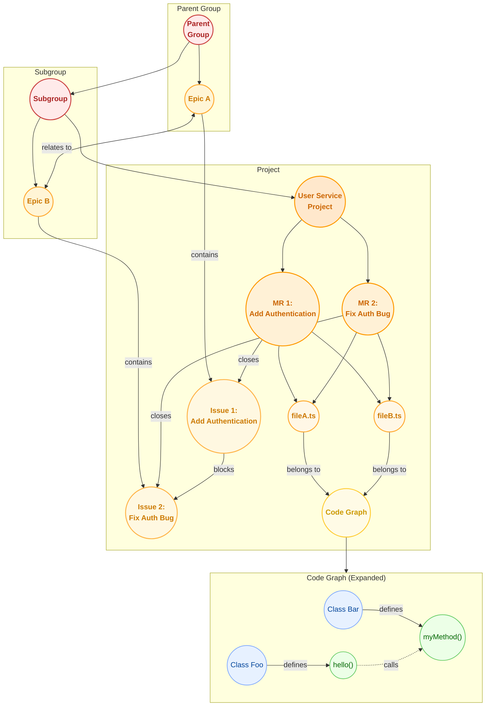
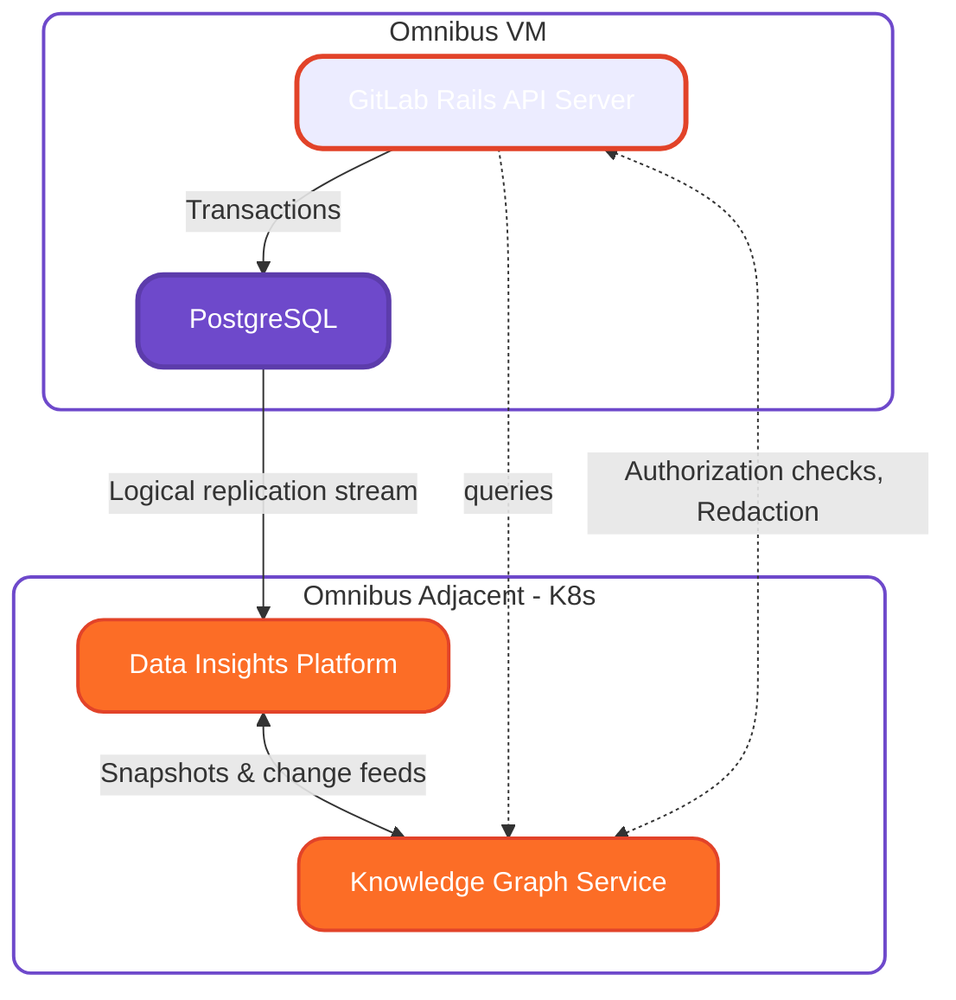
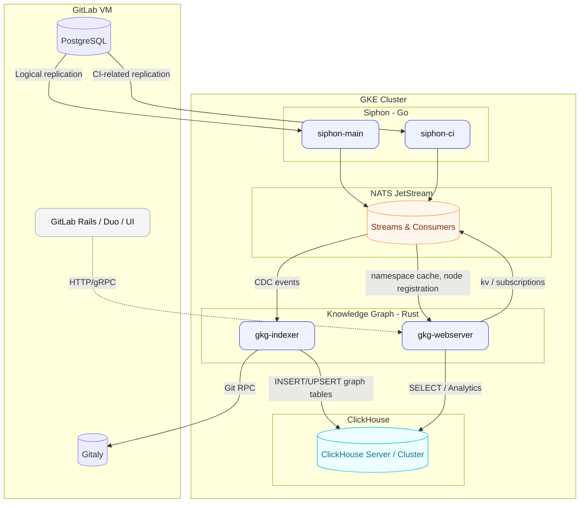

## Motivation

### Problem Statement

Modern software development operates across a complex web of repositories, issues, merge requests, CI/CD pipelines, deployment environments, infrastructure, and assets. Both code data and SDLC platform metadata are inherently interconnected network graphs. While GitLab is a single vehicle to deliver these collective features, our ability to consume and analyze this data is fragmented, forcing developers and AI agents to piece together context through dozens of API, GraphQL, and Agent-tool calls.

GitLab has hundreds of REST APIs and GraphQL Schema Elements. AI agents and data products need to be able to reason about GitLab's data in a way that is impractical with traditional data-fetching techniques.

### Solution

We aim to build the ***"Knowledge Graph as a service"***, which will be a separate service outside of GitLab Rails to index and query metadata. This service will expose a **unified** **data** **API layer** that enables developers and AI agents to query across the entire software development lifecycle.

What underlying technology will power this unified data layer? Graph technology empowers analytics, users, and AI agents to reason across a **wide range of data types**. We will model GitLab's data in a [**Property Graph**](https://pg-format.github.io/) format, which will be queried via a high-performance Graph Query Engine built on ClickHouse that we are calling **GitLab GraphHouse**.

The service will index three types of conceptual data in Property Graph Format:

- **Code:** Using our [high-performance Call Graph engine](https://gitlab.com/gitlab-org/rust/knowledge-graph) and the Data Insights Platform, we will index GitLab projects, code definitions, code references, and repository metadata.
- **SDLC**: Using the Data Insights Platform, we will index GitLab entities like MRs, CI Pipelines, Issues, Work Items, Groups, and Projects.
- **Custom Entities**: In the future, we intend to enable flexible data modeling to allow users to add arbitrary nodes to the graph.

With this service, we strive to transform how teams understand, navigate, and automate their software ecosystem.

### Current State

Today, we offer a local code-indexing CLI tool that agents can connect to via MCP. We currently include the following:

- The `gkg` CLI provides local indexing for workspaces, supports parallel parsing across multiple repositories, emits statistics, and comes with server controls plus developer tools for direct graph queries via `gkg server`, `gkg index`, and related commands; see [Usage guide](https://gitlab-org.gitlab.io/rust/knowledge-graph/getting-started/usage/) and [Server reference](https://gitlab-org.gitlab.io/rust/knowledge-graph/cli/server/).
- [`Kuzu`](https://kuzudb.com/docs/) ships statically linked inside the CLI so the graph runtime travels as a single binary for local MCP servers, while contributors can switch to dynamic linking for faster builds; see the [Build guide](https://gitlab-org.gitlab.io/rust/knowledge-graph/contribute/build/).
- The bundled Vue/Vite UI is embedded in the desktop HTTP server, letting users launch `gkg server start` and browse indexed projects through the local web experience; see the [Usage guide](https://gitlab-org.gitlab.io/rust/knowledge-graph/getting-started/usage/).
- We have a *full delivery pipeline* for all major OSs for the CLI, including Windows. See this [epic](https://gitlab.com/groups/gitlab-org/rust/-/epics/3) and the [release page](https://gitlab.com/gitlab-org/rust/knowledge-graph/-/releases) for more details.

### Why a Property Graph? Why not a REST and GraphQL layer?

While GitLab is powered by two primary data stores (Postgres and Git), GitLab data, including source code, can be represented in a network graph. See the diagram below as an example:



#### 1. AI Works Best with Property Graph Data Models

Our [research and live prototypes](https://gitlab.com/gitlab-org/rust/knowledge-graph/-/issues/263) showed that LLMs reliably generate property graph tool calls because their syntax directly mirrors natural “find-things-connected-to-X” reasoning.
For example, “find all issues closed by merge requests authored by @user within two hops of project Y” translates deterministically into a pattern like `MATCH (p:Project)<-[:CLOSES]-(m:MergeRequest)<-[:AUTHORED]-(u:User)`.

By contrast:

- GraphQL and REST require schema introspection and nested field expansion.
    LLMs struggle to reason about variable-depth recursion or dynamic joins inside those structures.
- Cypher exposes explicit graph patterns and bounded hop limits (*1..3) that match the mental model of “neighbor exploration.”

#### 2. We Need Arbitrary Neighbor Exploration and Path Finding (N-Hop Queries)

Many Knowledge Graph workloads involve **exploring neighbors** and **path finding** up to N levels deep—for example, finding “all pipelines triggered by MRs that close issues linked to epics under a group.”
Neither REST nor GraphQL provides a clean or efficient way to express variable-length traversal:

- REST would require chained requests or recursive pagination.
- GraphQL can express limited nesting but not dynamic-depth traversal (*..N); resolvers explode in complexity and performance cost.

Cypher’s MATCH (a)-[*1..N]->(b) semantics make such traversals first-class, optimized at the storage layer, and declarative.

#### 3. Aggregations and Analytics Are Essential

The Knowledge Graph is not just a document API—it is an analytical OLAP system.
We routinely need aggregations such as:

```cypher
MATCH (p:Project)-[:HAS_ISSUE]->(i:Issue)

RETURN p.name, count(i) AS issue_count ORDER BY issue_count DESC;
```

Implementing equivalent groupings via GraphQL or REST would either require bespoke endpoints or push heavy joins into the application layer. GitLab postgres times out on these queries today.

Cypher allows server-side execution with optimized graph planners, leveraging adjacency lists and columnar execution with ClickHouse.

#### 4. Schema Flexibility and Evolution are Essential

Customers will eventually need to be able to add their own data to the graph. Additionally, the Knowledge Graph’s schema must evolve rapidly as new GitLab SDLC entities (e.g., vulnerabilities, packages, runners) appear. 

GraphQL schemas require explicit type registration and backfilling, creating friction for iteration.
Cypher, being label-based, allows us to introduce new node or relationship labels without altering existing queries—`MATCH (n:Vulnerability)` returns zero rows until those labels exist. We can also use this to add custom data types in the future—something customers have shown strong interest in.

This makes property graphs a far more flexible and schema-tolerant choice for both AI-driven analytics and human consumers.

#### 5. Open Cypher (GQL) and Property Graphs are now Standard

The Knowledge Graph service is intentionally aligned with Open Cypher (GQL) and, most importantly, with Property Graphs, which are now standardized by [SQL 2023’s ISO/IEC 9075-16:2023)](https://www.iso.org/standard/79473.html) . Cypher-like patterns are the de facto standard for property-graph databases and Knowledge Graphs (Neo4j, Memgraph, Kùzu). By adopting it, we inherit a well-understood, declarative language for expressing complex traversals, aggregations, and pattern matching over graph data—operations required to fully leverage GitLab’s SDLC and code metaata.

> You can read more about how we will enable all LLMs to query under the [querying](./querying) documentation.

### Knowledge Graph is OLAP, not OLTP

The Knowledge Graph is an **OLAP application** over an OLTP one. The service is not required to provide transaction guarantees or real-time data for the first iteration. The Knowledge Graph initial iteration will serve as a **read-only** analytical data store and a data retrieval API for users and AI agents, providing access to code and SDLC metadata.

## Knowledge Graph Architecture High-Level Overview

Building a Knowledge Graph is a ***data engineering problem***. The Knowledge Graph service will build off of the **Data Insights Platform** to power both indexing code and SDLC metadata as a distributed system. For an end-to-end overview of the Data Insights Platform (logical replication, NATS JetStream, ClickHouse), see the [Data Insights Platform design doc](/handbook/engineering/architecture/design-documents/data_insights_platform/).

We will then build a secure query layer on top of the Data Insights Platform to allow developers and AI agents to query the graph for various product use cases. The Knowledge Graph tech stack will look like the following:

- [Siphon](https://gitlab.com/gitlab-org/analytics-section/siphon) acts as the CDC bridge, streaming PostgreSQL logical replication events into NATS.
- [NATS](https://docs.nats.io/) acts as the durable message broker between Siphon and ClickHouse. Additionally, we will leverage NATS to power all event-driven logic, high availability, and queuing, such as listening to [`push_event_payloads`](https://gitlab.com/gitlab-org/gitlab/-/blob/master/db/docs/push_event_payloads.yml) for listening to branch pushes in code indexing.
- [ClickHouse](https://clickhouse.com/) will act as the primary data store and data lake. With ClickHouse, we will build namespace property graphs and project-level indexes. We will never establish a direct connection to the OLTP database.
- **Knowledge Graph Web Server and Indexer** as a unified binary with two modes:
  - **`gkg-webserver`**: Serves web traffic requests coming from the Rails instance, executes GKG MCP tool calls, shares logic with the indexer, builds the graph queries, communicates with NATS for indexing status and namespace routing, and writes to ClickHouse to record customer usage for impact analytics and usage billing.
  - **`gkg-indexer`**: Performs SDLC ETL indexing for each customer's top-level namespace metadata by converting normalized tables into property graph tables, computing traversal_ids as needed for each entity type, and listening to branch push table events for fetching from Gitaly and indexing code, and leverages NATS as the distributed queuing and locking system across indexing types.
- **The Software Architecture Map (UI)** will be a Vue3-based visual explorer embedded directly into Rails and will communicate with the Knowledge Graph service. It will auto-discover components and dependencies from the Knowledge Graph to visualize lineage and ownership. Teams can use it for faster onboarding, blast radius and impact analysis during incidents/changes, and more precise service ownership boundaries for structural lineage. Additionally, we will use this same UI to power Knowledge Graph usage analytics and admin settings.



### Design Documents

Please see the following design documents for more details on the Knowledge Graph architecture:

- [Knowledge Graph Indexing Service](indexing/)
- [Knowledge Graph Querying Service](querying/)
- [Knowledge Graph Data Model](data_model.md)
- [Knowledge Graph Schema Management](schema_management.md)
- [Knowledge Graph Security](security.md)
- [Knowledge Graph Observability](observability.md)

## Binary Breakdown

Below is a breakdown of the components, their respective binaries, and their roles in the system.



### Database & Database Ops 

As a first iteration, the team aims to build **a [Graph Query Engine](/handbook/engineering/architecture/design-documents/gitlab_knowledge_graph/querying/graph_engine/) on ClickHouse** that translates basic Cypher (aka GQL) queries into SQL-compatible multi-hop graph traversals.

In October 2025, KuzuDB [was archived](https://www.theregister.com/2025/10/14/kuzudb_abandoned/) by maintainers. The Knowledge Graph Team spent time validating various database options against both Code Indexing and SDLC indexing, using the SLDC [dataset generator](https://gitlab.com/gitlab-org/rust/knowledge-graph/-/merge_requests/292) and pre-existing Code Index parquet files ([Database Selection Epic](https://gitlab.com/groups/gitlab-org/rust/-/epics/31)). We explored both new databases (Neo4J, FalkorBD, Memgraph, etc.) and already-deployed, approved GitLab databases (PostgreSQL and ClickHouse). 

Inspired by [Brahmand](https://www.brahmanddb.com/) and [SQL 2023’s Standardization of Property Graphs](https://www.iso.org/standard/79473.html) (ISO/IEC 9075-16:2023), the team created a modified version of the [Demo Instance](https://gitlab.com/gitlab-org/rust/knowledge-graph/-/issues/263) (which originally used Kuzu) and swapped it out with ClickHouse ([demo](https://gitlab.com/gitlab-org/rust/knowledge-graph/-/issues/268#note_2873427090), [code](https://gitlab.com/gitlab-org/rust/knowledge-graph/-/merge_requests/391)), proving that we can still get a functioning product with a ClickHouse/Postgres-backed Property Graph model. @andrewn also created a [Cypher to Postgres](https://gitlab.com/andrewn/opencypher-to-postgres#project-walkthrough) project that [passes 70%](https://gitlab.com/gitlab-com/gl-infra/sandbox/opencypher-to-postgres/-/merge_requests/20) of OpenCypher’s TCK suite, which much of the team can leverage.

Kùzu is a columnar system similar to modern read-optimized analytical DBMSs, like ClickHouse. The team conducted [research and benchmarking](https://gitlab.com/gitlab-org/rust/knowledge-graph/-/issues/267) against a ClickHouse and Postgres-backed Property Graph, which has alleviated our performance concerns. We achieved <300ms p95 query speeds for 3-hop traversals on a 20M+ row, 11GB dataset by leveraging CSR adjacency list index concepts from [KuzuDB’s whitepaper](https://www.cidrdb.org/cidr2023/papers/p48-jin.pdf). There is still much room for improvement, but the research so far gives us confidence in betting on ClickHouse. Postgres will be our backup, leveraging @andrewn work. 

#### Why a Graph Query Engine on ClickHouse? 

- The **Data Model** (Property Graphs with arbitrary nodes and edges) is the most critical aspect of this product and enables the “Knowledge Graph” capabilities, irrespective of the underlying database.
- GitLab has significantly **more operational experience** with ClickHouse and Postgres than with graph databases (Neo4j, FalkorDB). 
- By leveraging our existing stack, we have **one less database to deploy and maintain**, reducing SRE and DBRE costs. 
- More **engineering investment goes into ClickHouse** over building an ETL pipeline from ClickHouse -> Graph Database, meaning the GKG team can help with Siphon & NATS.
- **Faster Time to Market** with this query layer. 
- **Two-Way Door**: If we find that the Database does not suit our needs, we can still leverage the components we deploy (Siphon, NATS, ClickHouse) as the foundation for the data pipeline to a new graph database (e.g., Neo4j, Falkor, Memgraph)
- **Legal and Procurement Barriers**: Because of the unfriendly licenses, any new database will have to go through both legal and ZIP. See the legal section. 

View the [Graph Query Engine](/handbook/engineering/architecture/design-documents/gitlab_knowledge_graph/querying/graph_engine/) design document for more details.

### Legal and Procurement Barriers with Graph Native Databases

The team evaluated the following databases for our needs:

- Neptune (cloud only)
- SpannerGraph (cloud only)
- Neo4j (EE license)
- FalkorDB (SSPL and EE license)
- Memgraph (BSL and EE license)

After meeting with legal and procurement teams, we found that to proceed with any of these databases, we will need to purchase an enterprise edition license from the database provider in addition to the engineering challenges they introduce. This would have a minimum 30-day negotiation and procurement cycle. 

#### Why not fork Kuzu?

The team evaluated and considered this, but we found the risk from a security and maintenance perspective to be too high. We will keep an eye on [LadyBug](https://github.com/LadybugDB/ladybug), its most popular fork.

## Architecture Goals

We aim to build the Knowledge Graph service with the following goals in mind:

### Security

- Build a **multi-tenant architecture** so that supports isolating customer data in the database tables.
- Add **authorization layers** and **query filtering** throughout the service to restrict access to graph nodes to only the necessary data based on the user's permissions.
- Implement a **thorough review process** and **security tests** for SDLC metadata indexing algorithms to ensure customer data is not indexed incorrectly.
- **Sanitization, redaction, and validation** of all input queries to prevent injection and DDoS attacks.

Please see the [Security Design Document](/handbook/engineering/architecture/design-documents/gitlab_knowledge_graph/security/) for more details.

### Operational Observability

- Integrate **observability metrics** into the service to monitor the service and database health and performance.
- Add **logging** and **tracing** best practices (LabKit integration) to the service.
- Provide observability to both **self-managed** and **.com** customers.

Please see the [Observability Design Document](/handbook/engineering/architecture/design-documents/gitlab_knowledge_graph/observability/) for more details.

### Distributed Scalability & Reliability

- Build a **multi worker deployment architecture** to provide high availability and redundancy for the web service and indexing services.
- Leverage the same architecture and codebase for both Code Indexing and SDLC Metadata Indexing.

For how we will achieve this, please see the following design documents:

- See the [Indexing Service Design Document](/handbook/engineering/architecture/design-documents/gitlab_knowledge_graph/indexing/) for how the indexing service will index SDLC metadata and code.
- See the [Web Service Design Document](/handbook/engineering/architecture/design-documents/gitlab_knowledge_graph/querying/) for how the web service will serve queries.
- (Follow up MR) ClickHouse Cloud Clustering for scalability and reliability.

### FinOps & Maintainability

- Aim for **cost-effective storage and compute resource requirements** for self-managed customers with resource and budget constraints.
- For .com, aim to **scale up and down** based on demand.
- Build a flexible data model configuration layer for:
  - Handling Rails database migrations and schema changes.
  - Adding new data source entities to the graph.

Please see the [Knowledge Graph Data Model](/handbook/engineering/architecture/design-documents/gitlab_knowledge_graph/data_model/) design document for more details on the data model.

Follow up MR: New section/page on deployment resource requirements, and plan for operations past day 30.

### Maintainability & Delivery

- Aim for independent upgrade & security patching without Rails as a dependency to enable continuous delivery for both .com and self-managed customers.
- The design of the service should incorporate [Cells](/handbook/engineering/infrastructure-platforms/tenant-scale/cells_and_organizations/) architectural implications where applicable.
- Build a **data model configuration layer** for SDLC metadata sources to support Rails database migrations and schema changes, and to add new data source entities.
- Avoid requiring customers to run any scripts (rake tasks) to fix data state issues.

## Code Indexing vs SDLC Metadata Indexing

Our eventual goal is to have a unified Code Indexing and SDLC data graph. It's important to distinguish between the two to understand their conceptual differences and similarities. The primary point to understand is that both indexing pipelines and query services can reuse the **same** architecture and codebase.

Here are the differences and similarities between the two:

### Differences

- **Where the data starts**:
  - *Code indexing* reads repositories directly—no database required. Everything is inferred from the files themselves.
  - *Namespace indexing* listens to GitLab PostgreSQL through Siphon, stages CDC events and queries them in ClickHouse
- **What transformation looks like**:
  - *Code indexing* is parser-driven and produces a call graph plus file system hierarchy.
  - *Namespace indexing* is SQL-on-lake-driven, calculating nodes for namespaces, projects, issues, merge requests, pipelines, runners, and vulnerabilities, along with their relationships.
- **How the load phase runs**:
  - *Code indexing* writes ephemeral Parquet files, then creates or updates the indices in ClickHouse. Incremental updates are calculated by determining the ref's changed files and index deltas.
  - *Namespace indexing* will calculate the nodes and edges from GitLab data either through direct SQL ETL statements in ClickHouse, or perform ETL via ClickHouse queries and streaming, and insert the data back into ClickHouse.

### Similarities

- **What they share**:
  - Both indexing pipelines and query services can reuse the **same** architecture and codebase, as they can share the same graph technology, indexing patterns, and architectural components. Because we are leveraging the Data Insights Platform, we will be able to share the same ingesters, NATS JetStream, and database (ClickHouse). This allows us to have an event-driven platform for both Code Indexing and SDLC Metadata Indexing.
  - They will share all technology choices outlined in [ADR-001: FFI vs Dedicated Process Integration](/handbook/engineering/architecture/design-documents/gitlab_knowledge_graph/decisions/001_dedicated_processes.md), including the same codebase, [observability patterns](/handbook/engineering/architecture/design-documents/gitlab_knowledge_graph/observability/), and [security patterns](/handbook/engineering/architecture/design-documents/gitlab_knowledge_graph/security/).

## Iteration Plan

While the topics of Code Indexing and SDLC Indexing differ in how they index, the architecture above provides a platform for both Code Indexing and SDLC data.

Please see the [Code Indexing](./indexing/code_indexing) and [SDLC Metadata Indexing](./indexing/sdlc_indexing) design documents for more details.

### Phase 1 - SDLC Metadata Indexing and Project Level Code Graph Indexing

For the first phase, we will keep code graphs and SDLC metadata graphs separate, but they will share the same architecture, codebase, and API layer.

### Workstreams Roadmap

The first release of the Knowledge Graph will be delivered through three parallel workstreams. The successful deployment of these components is primarily dependent on aligning cross-team resourcing, as the core technical components are largely complete.

- **Producer-Only Siphon Production Deployment**: The goal is to deploy a producer-only Siphon to GitLab.com to validate end-to-end logical replication from PostgreSQL. This stream is currently blocked on DBRE and Infrastructure resourcing.

- **NATS Unit-Level Production Deployment**: Deploy NATS at the cell level for localized event distribution. NATS is already underway for global usage billing event tracking but further progress is blocked on engineering resources.

- **ClickHouse Work (Consumers + Data Modeling)**: This involves deploying consumers to ingest data from NATS, operationalizing ClickHouse as the data lake and extending the schema to cover SDLC and CI/CD data. This work is blocked by the NATS unit-level deployment.

#### Dedicated & Self-Managed

Work for Dedicated and Self-Managed customers is blocked until the GitLab.com deployments of Siphon and NATS are complete.

### Phase 2 - Multi-Project Code Graphs

In the second phase, we will allow users to query across multiple projects simultaneously. This is a challenging engineering problem, as we will need to handle the scale of the graph and the performance of queries based on the number of nodes and relationships.

We need to assess the benefits of cross-graph analysis before determining where MCP tools can handle most cases, or whether there are ways to create unified graphs in a federated manner.

### Phase 3 - Unified Code and SDLC Metadata Graphs

Phase 3 has similar engineering challenges as Phase 2, but with the added complexity of handling both code and SDLC metadata in unified queries.
