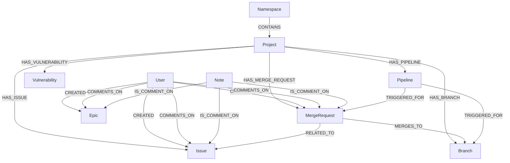
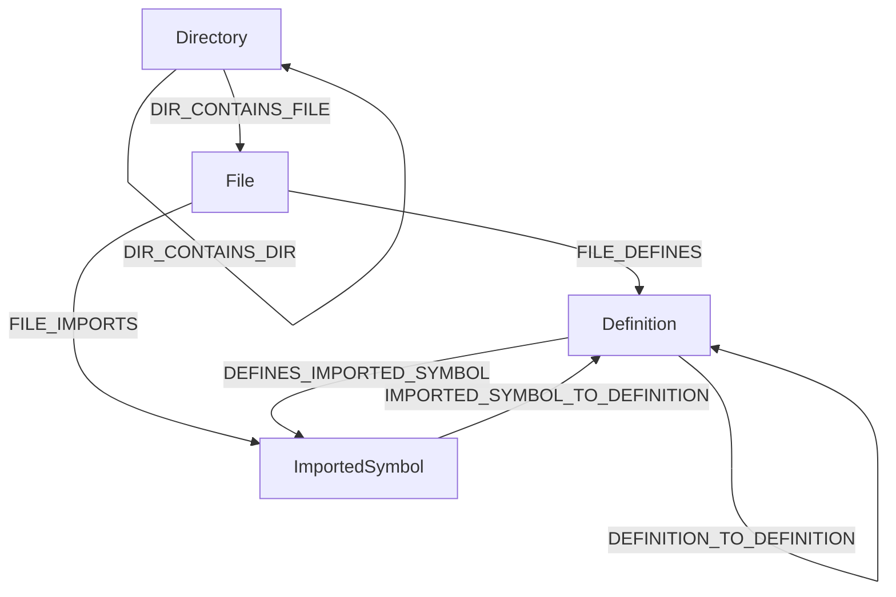

## Overview

The GitLab Knowledge Graph is composed of two primary sub-graphs that share a common schema foundation: the **Namespace (SDLC) Graph** and the **Code Graph**. This document details the data model for each, covering the nodes and relationships that constitute them.

The data model is designed to be intuitive and to mirror the mental model that developers and users have of the GitLab platform. By representing entities as nodes and their interactions as relationships, we can perform complex queries that would be difficult or inefficient with a traditional relational database.

The data model follows a [Property Graph](https://neo4j.com/blog/knowledge-graph/rdf-vs-property-graphs-knowledge-graphs/?utm_source=GSearch&utm_medium=PaidSearch&utm_campaign=CTEMEA_CRSearch_SREMEACentralDACH_Non-Brand_DSA&utm_content=PCCoreDB_SCCoreBrand_Misc&utm_term=&gad_source=1&gad_campaignid=20769286946&gclid=Cj0KCQjwo63HBhCKARIsAHOHV_VWAmKJQ19f0_UwVxL8wmIizWjsWahHddHN7Xs--Ao9FFd-wYQkBbMaApmGEALw_wcB) approach over an RDF approach, as GitLab data has strongly defined relationships between entities.

> We can enable custom node and relationship expansion in the future by following the Property Graph approach and building the correct schema management capabilities.

## Data Storage Location

The Knowledge Graph data will be stored in tables that are separate from the existing tables used for analytics.

- For GitLab.com, the Knowledge Graph tables will be stored in a dedicated ClickHouse instance.
- For dedicated or self-managed instances, the Knowledge Graph tables can be stored in a separate database or instance. This will be left to the discretion of the instance owner.

## Concepts to Know

- **Unified Schema**: Both the Code Graph and the SDLC Graph are built on the same foundational schema provided by `crates/database`. This allows for linking between the two graphs (e.g., a `Project` node from the SDLC graph can be linked to a `File` node from the Code Graph).
- **Entity as Node**: Every entity in the GitLab ecosystem (e.g., Project, Issue, File, Function Definition) is represented as a node.
- **Interaction as Edge**: Relationships between these entities (e.g., a User `COMMENTS_ON` an Issue, a `File` `CONTAINS` a `Definition`) are represented as directed edges.

---

## The Namespace Graph Data Model

The Namespace Graph represents the Software Development Life Cycle (SDLC) entities and their interactions within GitLab. It models how users, projects, issues, merge requests, and CI/CD components relate to one another.

### Example Node Types

| Node Type             | Description                                                                                             | Key Properties                                                              |
| --------------------- | ------------------------------------------------------------------------------------------------------- | --------------------------------------------------------------------------- |
| `Namespace`           | Represents a GitLab group or user namespace.                                                            | `id`, `name`, `full_path`, `type` (Group or User)                             |
| `Project`             | Represents a GitLab project/repository.                                                                 | `id`, `name`, `full_path`, `namespace_id`                                   |
| `Issue`               | Represents a GitLab issue.                                                                              | `id`, `iid`, `title`, `state`, `project_id`, `author_id`                      |
| `MergeRequest`        | Represents a GitLab merge request.                                                                      | `id`, `iid`, `title`, `state`, `source_branch`, `target_branch`, `project_id` |
| `Pipeline`            | Represents a CI/CD pipeline.                                                                            | `id`, `status`, `source`, `project_id`, `user_id`                             |
| `Vulnerability`       | Represents a security vulnerability finding.                                                            | `id`, `title`, `severity`, `state`, `project_id`                              |
| `User`                | Represents a GitLab user.                                                                               | `id`, `username`, `name`                                                    |
| `Note`                | Represents a comment on an issue, merge request, or epic.                                               | `id`, `body`, `author_id`, `project_id`                                     |
| `Epic`                | Represents a GitLab epic.                                                                               | `id`, `iid`, `title`, `state`, `group_id`, `author_id`                        |
| `Branch`              | Represents a Git branch.                                                                                | `name`, `project_id`                                                        |

### Relationship Visualization

### Relationship Types

| Relationship                        | From Node      | To Node        | Description                                                                                             |
| ----------------------------------- | -------------- | -------------- | ------------------------------------------------------------------------------------------------------- |
| `CONTAINS`                          | `Namespace`    | `Project`      | A namespace contains a project.                                                                         |
| `HAS_ISSUE`                         | `Project`      | `Issue`        | A project has an issue.                                                                                 |
| `HAS_MERGE_REQUEST`                 | `Project`      | `MergeRequest` | A project has a merge request.                                                                          |
| `HAS_PIPELINE`                      | `Project`      | `Pipeline`     | A project has a CI/CD pipeline.                                                                         |
| `HAS_VULNERABILITY`                 | `Project`      | `Vulnerability`| A project has a vulnerability finding.                                                                  |
| `HAS_BRANCH`                        | `Project`      | `Branch`       | A project has a branch.                                                                                 |
| `CREATED`                           | `User`         | `Issue`, `MR`... | A user created an entity.                                                                               |
| `COMMENTS_ON`                       | `User`         | `Issue`, `MR`... | A user commented on an entity (via a `Note`).                                                           |
| `IS_COMMENT_ON`                     | `Note`         | `Issue`, `MR`... | A note is a comment on a specific entity.                                                               |
| `MERGES_TO`                         | `MergeRequest` | `Branch`       | A merge request targets a specific branch for merging.                                                  |
| `RELATED_TO`                        | `MergeRequest` | `Issue`        | A merge request is related to or closes an issue.                                                       |
| `TRIGGERED_FOR`                     | `Pipeline`     | `MR`, `Branch` | A pipeline was triggered for a merge request or a branch push.                                          |

---

## The Code Graph Data Model

The Code Graph represents the structure and relationships within the source code of a repository. It models the file system hierarchy, code definitions, and the call graph.

### Node Types

| Node Type             | Description                                                                                             | Key Properties                                                              |
| --------------------- | ------------------------------------------------------------------------------------------------------- | --------------------------------------------------------------------------- |
| `Directory`           | Represents a directory within a repository.                                                             | `relative_path`, `absolute_path`, `repository_name`                         |
| `File`                | Represents a file within a repository.                                                                  | `relative_path`, `absolute_path`, `language`, `repository_name`             |
| `Definition`          | Represents a code definition (e.g., class, function, method, module).                                   | `fully_qualified_name`, `display_name`, `definition_type`, `file_path`      |
| `ImportedSymbol`      | Represents an imported symbol or module within a file.                                                  | `symbol_name`, `source_module`, `file_path`                                 |

### Relationship Visualization

### Relationship Types

| Relationship                        | From Node      | To Node        | Description                                                                                             |
| ----------------------------------- | -------------- | -------------- | ------------------------------------------------------------------------------------------------------- |
| `DIR_CONTAINS_DIR`                  | `Directory`    | `Directory`    | A directory contains another directory.                                                                 |
| `DIR_CONTAINS_FILE`                 | `Directory`    | `File`         | A directory contains a file.                                                                            |
| `FILE_DEFINES`                      | `File`         | `Definition`   | A file contains a code definition.                                                                      |
| `FILE_IMPORTS`                      | `File`         | `ImportedSymbol`| A file imports a symbol.                                                                                |
| `DEFINITION_TO_DEFINITION`          | `Definition`   | `Definition`   | Represents a call graph edge (e.g., a function calls another function, a class inherits from another).    |
| `DEFINES_IMPORTED_SYMBOL`           | `Definition`   | `ImportedSymbol`| A definition (e.g., an exported function) is the source of an imported symbol.                          |
| `IMPORTED_SYMBOL_TO_DEFINITION`     | `ImportedSymbol`| `Definition`   | An imported symbol resolves to a specific definition.                                                   |

---

## Cross-Graph Relationships

The power of the Knowledge Graph comes from its ability to link the SDLC and Code graphs. In future iterations, we will be able to link the two graphs together to create a unified graph. For the first iteration, we intend to keep the two graphs separate to keep the complexity of the engineering effort manageable.

Here is an example of how we can link the two graphs together:

| Relationship                        | From Node      | To Node        | Description                                                                                             |
| ----------------------------------- | -------------- | -------------- | ------------------------------------------------------------------------------------------------------- |
| `HAS_FILE`                          | `Project`      | `File`         | A project (from the Namespace Graph) contains a file (from the Code Graph).                             |
| `HAS_DIRECTORY`                     | `Project`      | `Directory`    | A project (from the Namespace Graph) contains a directory (from the Code Graph).                        |

These links allow for deep queries, like "Find all merge requests (`SDLC`) that touch files (`Code`) containing a specific function definition (`Code`)."
