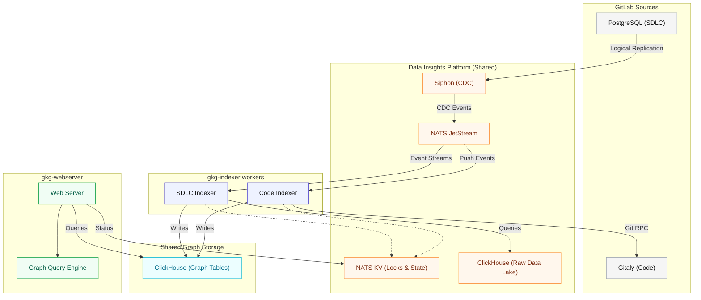

## Overview

The Knowledge Graph indexing architecture transforms GitLab's SDLC metadata and code repositories into a queryable property graph. The indexing service operates as a distributed ETL (Extract, Transform, Load) pipeline that leverages the Data Insights Platform to process both SDLC events and code changes.

This document outlines the general architecture, shared patterns, and components across both indexing domains. For detailed implementation specifics, see:

- [Code Indexing Architecture](code_indexing.md)
- [SDLC Indexing Architecture](sdlc_indexing.md)

## Architecture Goals

The indexing architecture achieves the following:

- Process GitLab SDLC metadata and code repositories into a unified property graph model
- Scale horizontally across multiple indexer workers without overlapping work
- Minimize operational load on production PostgreSQL databases
- Share infrastructure and patterns between code and SDLC indexing to reduce operational complexity
- Support incremental indexing for efficient updates

## Shared Architecture Components

Both code and SDLC indexing leverage the same foundational infrastructure from the Data Insights Platform and share patterns for distributed coordination, data storage, and query access.

### 1. Siphon (Change Data Capture)

**Role**: Streams data from PostgreSQL to NATS without impacting production database performance.

**Shared Use**:

- SDLC indexing: Receives events for issues, merge requests, pipelines, projects, namespaces, and other SDLC entities
- Code indexing: Receives `push_event_payloads` to trigger repository indexing

Siphon uses PostgreSQL's logical replication to capture changes from the write-ahead log (WAL), publishing them as protobuf messages to NATS JetStream. This decouples the Knowledge Graph from the production database.

### 2. NATS JetStream and NATS KV (Event Broker and Distributed Coordination)

**Role**: Provides durable event streaming and distributed coordination.

**Shared Use**:

- Delivers and distributes needed CDC events (like `events` and `push_event_payloads`) to indexing workers via NATS JetStream subjects.
- Distributes workload across multiple indexer replicas
- Provides NATS KV for distributed locking and state management for both code and SDLC indexing.

Both indexing pipelines subscribe to relevant NATS subjects and use the same NATS deployment for event distribution and coordination.

### 3. ClickHouse (Data Lake and Graph Storage)

**Role**: Acts as both the raw data lake and the final graph storage layer.

**Shared Use**:

- **Raw Data Lake**: SDLC indexers query raw CDC data from ClickHouse to build graph transformations
- **Graph Storage**: Both indexers write to property graph tables (nodes and edges) in ClickHouse
- **Query Backend**: The web server queries the same ClickHouse tables for both code and SDLC graphs

We will leverage ClickHouse's columnar storage and merge tree engines to provide bulk inserts, background merging, and adjacency list optimizations for graph traversals.

### 4. Shared Schema and Data Model

**Role**: Property graph schema that both indexers write to.

**Shared Tables**:

- Node tables for entities (e.g., `projects`, `files`, `definitions`, `issues`, `merge_requests`)
- Edge tables for relationships (e.g., `project_has_file`, `mr_closes_issue`, `definition_calls_definition`)

We will use the same schema defined in `crates/database` for both code and SDLC indexing. This allows for linking between the two graphs (e.g., a `Project` node from the SDLC graph can be linked to a `File` node from the Code Graph).
