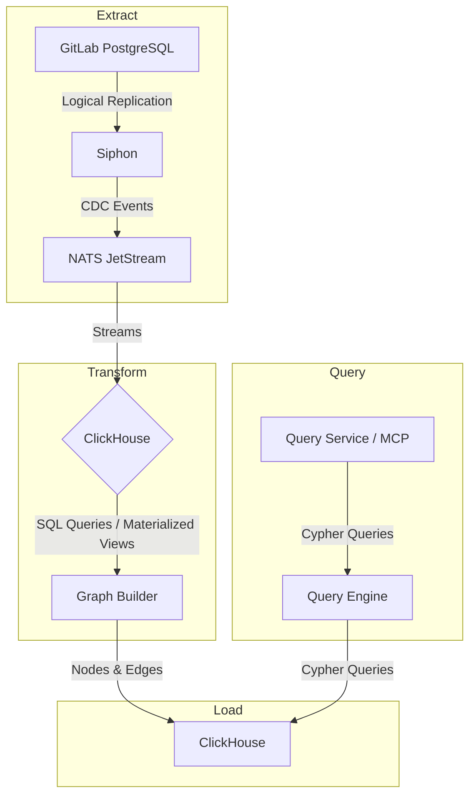
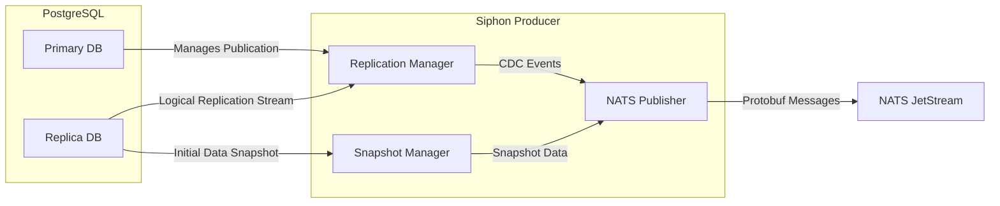

## Overview

The SDLC (Software Development Life Cycle) Graph, also known as the Namespace Graph, provides a queryable view of the interconnected entities and events within a GitLab namespace. It captures the relationships between projects, issues, merge requests, CI/CD pipelines, vulnerabilities, and more.

This document outlines the architecture of the indexing process, which functions as a large-scale ETL (Extract, Transform, Load) pipeline. This pipeline is designed to process a continuous stream of events from GitLab's production environment and transform them into a graph structure that can be efficiently queried by AI agents and other services.

## The SDLC Indexing Service ETL Pipeline

The indexing process is fundamentally an ETL pipeline that takes data from GitLab's primary PostgreSQL database and loads it into our OLAP database (like ClickHouse) after processing and transformation in a data lake.



### 1. Extract: Capturing Change Data with Siphon

The pipeline begins with **Siphon**, GitLab's in-house Change Data Capture (CDC) service written in Go. Its sole responsibility is to reliably replicate data from a PostgreSQL database to a NATS JetStream topic.

#### Siphon's Architecture

Siphon operates on a producer/consumer model, but for the purpose of the Knowledge Graph's ETL pipeline, we are primarily concerned with the **Siphon Producer**.



- **Replication Manager**: This is the primary component that connects to a PostgreSQL logical replication slot. It uses the `pgoutput` plugin to decode the Write-Ahead Log (WAL) into a stream of logical changes (inserts, updates, deletes). It's responsible for managing the replication slot and acknowledging the WAL position to the database, ensuring that processed data is not sent again.

- **Snapshot Manager**: To bootstrap the data lake, Siphon must first perform an initial, full copy of the existing data. The Snapshot Manager handles this by running `COPY` commands against the tables to be replicated. To avoid impacting the primary database, this snapshot can be configured to run against a separate read-replica (`snapshot_database`). *This aspect is critical to Knowledge Graph to enable backfilling of the data lake in the event of schema migrations, data corruption, or other issues*.

- **NATS Publisher**: Both the live replication events and the initial snapshot data are converted into a standardized protobuf format (`LogicalReplicationEvents`) and published to NATS JetStream.

- **Configuration-driven**: Siphon is configured via a YAML file that specifies the database connections, replication slot names, and, most importantly, a `table_mapping`. This mapping defines which tables to watch and which NATS subject to publish their changes to. This allows for precise control over what data enters the pipeline.

    ```yaml
    table_mapping:
      - table: issues
        schema: public
        subject: issues
      - table: merge_requests
        schema: public
        subject: merge_requests
    ```

By using Siphon, the Knowledge Graph's indexing pipeline is cleanly decoupled from the production PostgreSQL database. It receives a reliable, real-time stream of data changes without imposing a significant load on the source system.

### 2. Transform: Shaping Data in the Lake

The CDC events from NATS are consumed and written into ClickHouse, which allows for batch processing, historical analysis, and schema evolution.

#### ClickHouse as the Data Lake

**ClickHouse** is GitLab's standard OLAP (Online Analytical Processing) database, chosen for its high performance on large-scale analytical queries.

- **Ingestion**: A dedicated consumer reads the NATS streams and writes the data into corresponding tables in ClickHouse. To handle the high volume of writes, events are batched before being inserted. This is crucial for ClickHouse's `MergeTree` engine family, which performs best with fewer, larger inserts rather than many small ones.
- **Streaming Data Handling**: The batching mechanism is key to handling the stream of events without overwhelming memory or the database. Data is accumulated in memory or a local buffer by the consumer, and flushed to ClickHouse periodically or when a certain batch size is reached.
- **Raw Data Tables**: The initial landing zone in ClickHouse consists of raw tables that mirror the structure of the PostgreSQL source tables. These raw tables store the CDC events in their original form.

#### Graph Schema Design

We are going to transform the data from ClickHouse to a graph-like format by designing a set of tables:

- **Nodes**: We will define a table schema for each node type. For example, `namespaces`, `projects`, `issues`, `merge_requests`, `pipelines`, `runners`, `vulnerabilities`, etc. Each node table will contain:
  - The tenant ID
  - A unique identifier (typically the primary key from the source table)
  - Core attributes relevant to that entity type
  - Metadata fields (created_at, updated_at, deleted_at for soft deletes)

- **Edges**: We will define a table schema for each edge type. For example, `namespaces_projects`, `projects_issues`, `issues_merge_requests`, `merge_requests_pipelines`, `pipelines_runners`, `vulnerabilities_projects`, etc. Each edge table will contain:
  - The tenant ID
  - Source node identifier
  - Target node identifier
  - Edge type or relationship metadata

#### Transformation and Loading Logic

The transformation from CDC data to the graph schema will be handled by the ETL Indexer, a Rust-based pipeline designed to transform data into the desired format efficiently.

##### Core components

- `gkg-indexer`: The ETL pipeline for GitLab's SDLC data.
- `gkg-webserver`: The REST + MCP interface to query the Knowledge Graph.
- `NATS JetStream`: The message broker for the Knowledge Graph.
- `NATS KV`: The key-value store for the Knowledge Graph.
- `ClickHouse`: The OLAP database for GitLab and the Knowledge Graph.
- `PostgreSQL`: The main OLTP database for GitLab.

##### Data storage

The Knowledge Graph data is going to be stored in separate ClickHouse database.

- For `.com` this will probably be in a separate instance.
- For small dedicated environments and self-hosted instances, this can be done in the same instance as the main ClickHouse database. This choice ultimately depends on what the operators think is best for their environment.

##### Namespace Knowledge Graph access detection

The first step is to detect which top-level namespaces have access to the Knowledge Graph. This can be done following an approach similar to the one used for Zoekt, where they have a `zoekt_enabled_namespaces` tables that stores the namespaces that are enabled for Zoekt.

We will create a similar table for the Knowledge Graph in the main PostgreSQL database, called `knowledge_graph_enabled_namespaces`, which will store the namespaces that are enabled for the Knowledge Graph and various metadata about the namespaces. This table will then be replicated into ClickHouse database for the Knowledge Graph.

```sql
-- PostgreSQL
CREATE TABLE knowledge_graph_enabled_namespaces (
    id UUID PRIMARY KEY,
    root_namespace_id UUID NOT NULL,
    created_at TIMESTAMP NOT NULL DEFAULT CURRENT_TIMESTAMP,
    updated_at TIMESTAMP NOT NULL DEFAULT CURRENT_TIMESTAMP,
    active BOOLEAN NOT NULL DEFAULT FALSE,
    ...
);

-- ClickHouse
CREATE TABLE knowledge_graph_enabled_namespaces (
    id UUID PRIMARY KEY,
    root_namespace_id UUID NOT NULL,
    created_at TIMESTAMP NOT NULL DEFAULT CURRENT_TIMESTAMP,
    active BOOLEAN NOT NULL DEFAULT FALSE,
    last_indexed_at TIMESTAMP NULL,
    _siphon_replicated_at TIMESTAMP NULL,
    _siphon_deleted BOOLEAN NOT NULL DEFAULT FALSE,
    ...
);
```

If the table is not present, we will assume that no namespaces have access to the Knowledge Graph.

```sql
--- ClickHouse
SELECT * FROM knowledge_graph_enabled_namespaces;
```

##### NATS JetStream and KV orchestration

**Indexing job creation**

The `gkg-indexer` will be responsible for getting the namespace data for the Knowledge Graph. Periodically, a cron job will run to trigger the indexing process for the namespaces that are due for indexing. If a namespace is due for indexing, the cron job will create a job message and publish it to the appropriate NATS JetStream subject.

It is important to differentiate between initial and incremental indexing when publishing the jobs. We want to have workers with different priorities for each type of indexing. This will prevent resource starvation by big initial indexing jobs and ensure that the indexing process remains efficient.

Example NATS JetStream stream: `GKG_INDEXING_JOBS`

Example NATS JetStream subjects:

- `gkg.indexing.jobs.initial`
- `gkg.indexing.jobs.incremental`

**Picking up an indexing job**

NATS JetStream ensures that each message is delivered at least once. This means that if a worker fails to process a message, it will be redelivered to another worker. To avoid duplicate processing on the same message, we will use the NATS KV store to store to acquire a lock on the namespace at the start of the indexing job.

Example NATS KV:

- Key: `/gkg-indexer/indexing/{namespace_id}/lock`
- Value: `{ "worker_id": String, "started_at": Instant }`
- TTL: 1 hour (estimated based on the amount of resources)

If the lock is not present, the worker will acquire it and process the job. If the lock is present, the worker will check if the job has already started. If it has, the worker will proceed to the next job.

**Completing an indexing job**

When the worker has completed the indexing job, it will remove the lock from the NATS KV store and update the database to reflect the date of the last indexing alongside relevant metadata.

```sql
UPDATE knowledge_graph_enabled_namespaces
SET last_indexed_at = {started_at}, result = 'success | error', ...
WHERE id = '{namespace_id}';
```

On top of that, we will keep a record of the indexing job in the Knowledge Graph ClickHouse database. Each time a job is completed, an entry will be created in the `knowledge_graph_indexing_jobs` table.

```sql
-- ClickHouse
CREATE TABLE knowledge_graph_indexing_job_events (
    id UUID PRIMARY KEY,
    namespace_id UUID NOT NULL,
    type ENUM('initial', 'incremental') NOT NULL,
    status ENUM('started', 'completed', 'error') NOT NULL DEFAULT 'started',
    created_at TIMESTAMP NOT NULL DEFAULT CURRENT_TIMESTAMP,
    ...
);

-- ClickHouse
-- Job started event
INSERT INTO knowledge_graph_indexing_jobs (namespace_id, type, status, created_at) VALUES ('{namespace_id}', '{type}', 'started', NOW());

-- Job completed event
INSERT INTO knowledge_graph_indexing_jobs (namespace_id, type, status, created_at) VALUES ('{namespace_id}', '{type}', 'completed', NOW());

-- Job error event
INSERT INTO knowledge_graph_indexing_jobs (namespace_id, type, status, created_at) VALUES ('{namespace_id}', '{type}', 'error', NOW());
```

**Note:** From time to time we will need to re-create the table to get rid of the bloat. This triggered by a dedicated cron job that will be run periodically.

**Handling errors**

If the worker encounters a recoverable error, it should continue indexing the remaining data. The worker will update the database to reflect the error and the date of the last indexing alongside relevant metadata.

```sql
-- ClickHouse
UPDATE knowledge_graph_enabled_namespaces
SET last_indexed_at = NOW(), result = 'partial_success', ...
WHERE id = '{namespace_id}';

-- ClickHouse
INSERT INTO knowledge_graph_indexing_job_events (namespace_id, type, status, created_at) VALUES ('{namespace_id}', '{type}', 'completed', NOW());
```

If the worker encounters a non-recoverable error, it will update the database to reflect the error and the date of the last indexing alongside relevant metadata.

```sql
-- ClickHouse
UPDATE knowledge_graph_enabled_namespaces
SET last_indexed_at = NOW(), result = 'error', ...
WHERE id = '{namespace_id}';

-- ClickHouse
INSERT INTO knowledge_graph_indexing_job_events (namespace_id, type, status, created_at) VALUES ('{namespace_id}', '{type}', 'error', NOW());
```

If the worker fails unexpectedly, the KV lock will eventually expire and the job will be re-created in the next indexing cycle. This leverages eventual consistency which is acceptable since we're not aiming for real-time consistency.

##### ETL

**Data transformation**

The `gkg-indexer` will be responsible for querying the ClickHouse database and transforming it into the desired format.

Since we're going to do a `ClickHouse` to `ClickHouse` transformation and the amount of rows for each individual entity being relatively small (reaching the low millions per namespaces). This means that we can use a simple `SELECT` statement to get the data and write it to the Knowledge Graph database.

```sql
--- ClickHouse
SELECT
    id,
    organization_id,
    author_id,
    created_at,
    state,
    title,
    traversal_id
FROM sdlc.issues
WHERE organization_id = {organization_id} AND _siphon_replicated_at > {since_date}
```

To minimize the memory footprint of queries with large result sets, we will stream the query results to the `gkg-indexer` worker. This is supported by default in the [Rust ClickHouse client](https://clickhouse.com/docs/integrations/rust). For each row, we will transform the data into the desired graph format and write it to the Knowledge Graph database using either ClickHouse server-side or client-side Inserting APIs.

If we want to be extra cautious, we can use `LIMIT` and `OFFSET` to paginate the results, allowing us to process the data in chunks. This is typically done in a loop and avoids overwhelming the database with a large amount of data at once.

In the above example you may have noticed that we're using `{since_date}` to filter the data. This is important for both the initial and incremental indexing. Why? Because we want to set a rendez-vous point for the indexing process to avoid gaps in the data that could be caused by data added between the last insert statement and writing the `last_indexed_at` timestamp to the database. For the initial indexing, this value will be the date of the start of the indexing job, for incremental indexing, this value will be the date of the last indexing job.

**Data deletion**

Some entities may have been deleted from the database. This will be reflected by the `_siphon_deleted` column being set to `false`. Entities that marked as deleted in the Analytics ClickHouse database will need to be deleted from the Knowledge Graph database.

If we want to avoid deleting the entities immediately because of potential database performance concerns, we can filter the entities that are not marked as deleted at query time and then delete all the deleted entities at once in a deletion job.

```sql
DELETE FROM database_b.<table_name>
WHERE deleted = true;
```

##### Zero-downtime schema changes

**Main PostgreSQL to Lake**

The Knowledge Graph `gkg-indexer` will need to account for schema changes in the main ClickHouse database which we use as a data lake. There are many reasons why the main CLickHouse database tables may change over time; new columns may be added, columns may be renamed or dropped, etc. If the `gkg-indexer` is not aware of the schema changes, it could lead to service interruptions in production due to queries failing.

We will explicitly define the schema, containing which tables and columns are needed for the Knowledge Graph. For some columns, we will expose additional metadata where needed, such as Integer-to-Enum mappings (for example: issue status). The schema will be in a JSON document, generated by a Ruby script from the current PostgreSQL schema and Rails models.

We will write a CI job that detects schema changes by comparing the existing and a newly generated schema. This ensures that the schema is always up to date with the current version of GitLab. If a drift is detected, replace the current schema file with the new one.

In the Knowledge Graph, we will use this schema file to create the Knowledge Graph ClickHouse tables and build the indexing queries.

**Lake to Graph**

The Knowledge Graph schema is going to be declared in the `gkg-indexer` codebase. The schema needs to be versioned and the migrations need to be applied to the Knowledge Graph database.

The schema will need to be backward compatible with the previous version until the schema migration is complete for every namespace. A migration will be considered complete when the `schema_version` column is updated to the new version and all the data has been migrated or back-filled to the new schema.

There are multiple type of schema changes we will need to account for:

**New node/relationship type**

If we need to add a new entity type to the Knowledge Graph, we create a new table to the database and add the new entity type to the schema. The table will be filled on the next indexing job for the namespace.

```sql
CREATE TABLE database_b.<table_name> (
    id UUID PRIMARY KEY,
    ...
);
```

**New/Drop column**

If we need to add a new column to an existing entity type, we add the new column to the schema and the table. The column will be filled on the next indexing job for the namespace.

```sql
ALTER TABLE database_b.<table_name> ADD COLUMN <column_name> <column_type>;
ALTER TABLE database_b.<table_name> DROP COLUMN <column_name>;
```

**Major re-structure of an existing entity type**

If we introduce a change to a table that is not backward compatible or may cause downtime, we will use multi-step migration process which will be handled by the `gkg-indexer`.

We will start by creating a shadow table with the new schema. This shadow table will be backfilled with the data from the existing table. The previous table will still be available and used to serve queries. Once the shadow table is backfilled, we will `EXCHANGE` the shadow table to the new table name and drop the previous table.

**Initial schema creation**

The initial schema creation can be handled by the `gkg-indexer` or in the CI/CD pipeline via a custom migration tool which will be responsible for creating the schema.

**Schema updates**

The schema updates will be handled by the `gkg-indexer` or in the CI/CD pipeline via a custom migration tool which will be responsible for applying the schema changes to the database. The indexer will then be responsible for backfilling the data to the new schema on the next indexing job for the namespace.

**Schema update coordination**

When indexing requires a schema update, we need to coordinate the schema update to the `gkg-webserver` so it can refresh its schema cache. We will use NATS KV to coordinate the schema update process. When a migration is complete for a namespace, we will use NATS KV subscriptions from the `gkg-webserver` to invalidate the schema version for the namespace. This will trigger a schema refresh and the subsequent queries will use the new schema version.

The system will not perform any breaking action on the schema until all namespaces have been migrated to the latest version.

**Closing notes**

There is obviously a lot of complexity involved in writing the ETL pipeline in Rust. It requires significant code to be written and maintained, along with component orchestration to ensure robustness at scale.

However, we chose this approach instead of the SQL-based ETL because of the significant limitations identified with that method. The SQL approach offers limited control over data refreshing. Using a separate ClickHouse instance could cause performance bottlenecks on the main ClickHouse database due to table scans. Alternatively, using the same instance with a separate database would likely degrade insert performance due to materialized views.

In contrast, the Rust-based pipeline provides the necessary extensibility and control to support multiple data sources and efficient scaling, justifying the initial investment in complexity.

#### Data Integrity and Recovery

- **Idempotency**: All transformation and load operations are designed to be idempotent, allowing safe retries in case of failures.

- **Schema Evolution and Backfilling**: By keeping raw data separate from the transformed graph schema, we maintain flexibility to modify the graph structure without losing historical CDC data. If the graph schema changes, we can replay transformations from the raw data to backfill the entire graph from scratch.

- **Monitoring**: The indexer tracks metrics such as processing lag, batch sizes, error rates, and data freshness to ensure the graph database remains current and healthy.

Both strategies leverage ClickHouse's powerful query engine while maintaining the simplicity and debuggability of declarative data transformations. The resulting graph-structured data in ClickHouse serves as the optimized, queryable source for the Knowledge Graph's analysis and insight capabilities.
