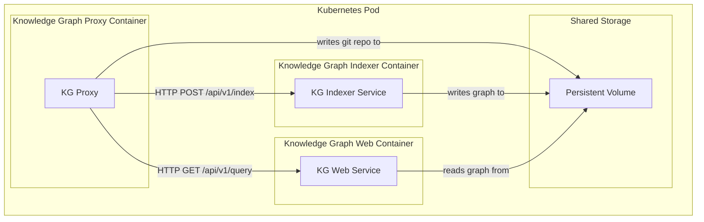
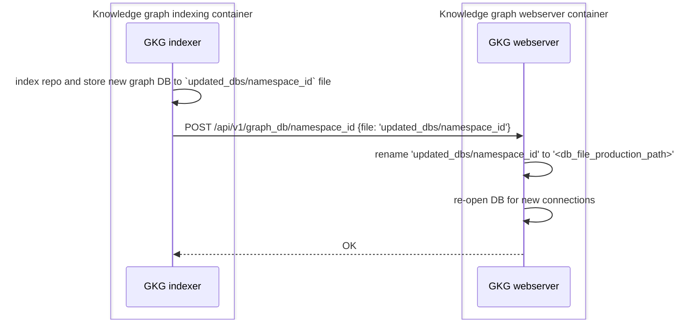
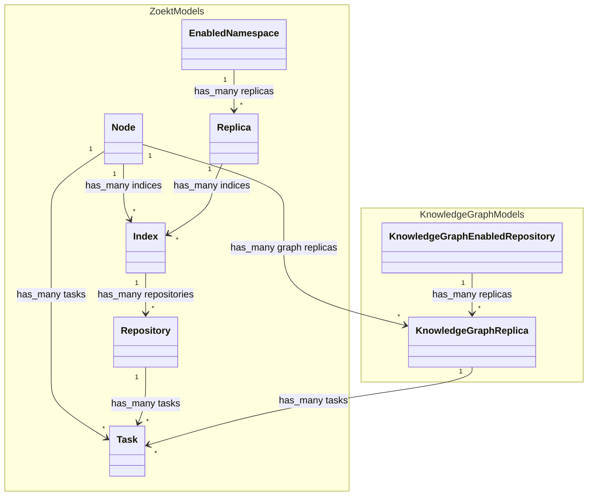
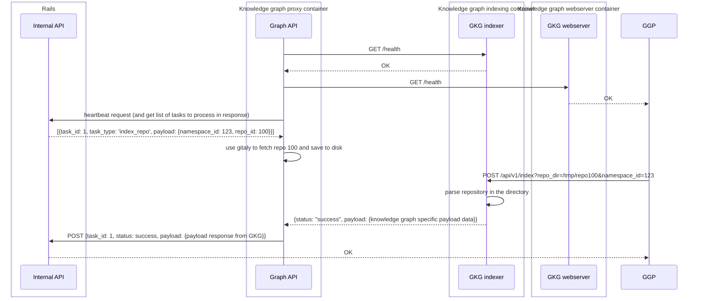
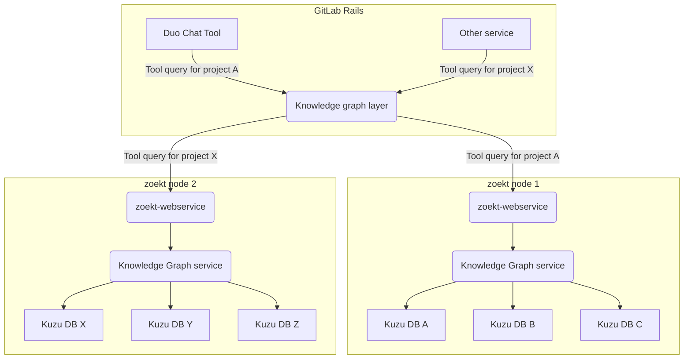
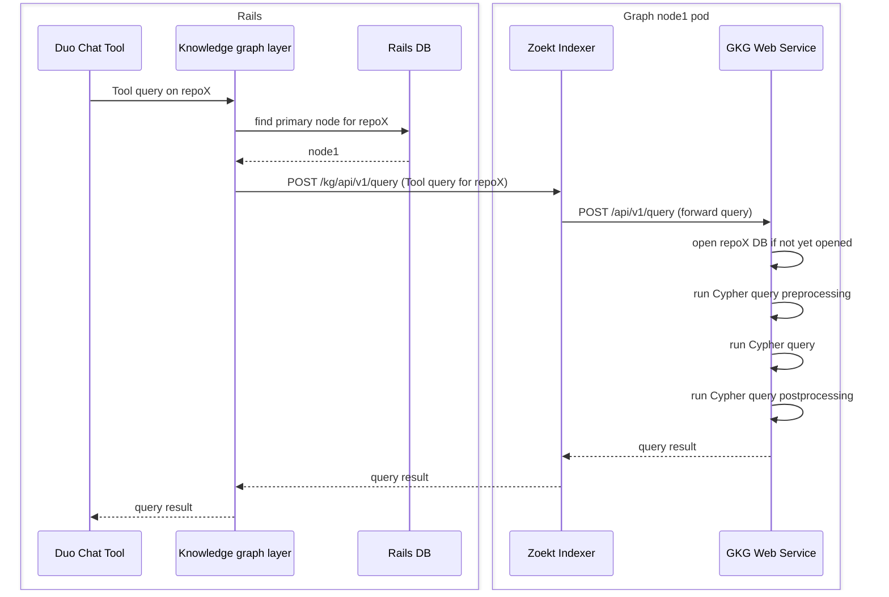



## Summary

This document proposes a new service that enhances repository insights by
creating and maintaining graph databases for repositories. Using
[Kuzu](https://docs.kuzudb.com/), a file-embedded graph database, the service
will store each repository's knowledge graph separately, enabling users to query
relationships between directories, files, classes, functions, and dependencies
through Cypher queries. The architecture includes a scalable approach with
primary nodes and replicas for high availability, with all requests routed
through GitLab Rails for authentication and authorization. This feature will
enable AI features to answer complex repository questions (like "where is method X
defined" or "what dependencies are used in file Y"), while also supporting
non-AI use cases such as repository statistics and related file discovery when
browsing code.

## Motivation

Currently, we don't have a tool which would provide enhanced repository
knowledge. We are able to search a repository code, but that's all. We don't
have a tool which could be used to get better insight into repository - what
entities (directories, files, classes, functions) are defined in the repository
and how are these entities connected with each other. Knowledge graph provides
this information.

For AI it will be especially useful for Duo Chat to answer user's questions
about repository (for example "where is defined XYZ method", "from where we call
method XYZ", "what dependencies are used in a file", "are there any unused
methods", "what are commonly used functions"). So one of primary use-cases will
be usage in Duo Chat.

Having a knowledge graph will also be useful for non-AI use-cases - e.g. for
repository statistics or showing related files when browsing through repository.

### Goals

- Make available insight information about repository to other services and
  relationships between entities in the repository. For now we focus on creating
  knowledge graph primarily for source code repositories:
  - entities defined in the repository such as directories, files, classes, functions, dependencies
  - relationships between these entities - where is each class or function
    defined, what methods are defined in a class, what functions are called from
    another function, what dependencies are used in a file...
- But in future iterations we can expand knowledge graph beyond the source code
  (and track also other relationships - relationships with issues, merge
  requests and other entities).
- Allow querying graph DB using pre-defined [MCP tools](https://gitlab-org.gitlab.io/rust/knowledge-graph/mcp/tools/)

### Non-Goals

- Implementation of repository parser. For more details on the parser, see the
  [Knowledge Graph First iteration](https://gitlab.com/groups/gitlab-org/-/epics/17514)
  and [Knowledge Graph Core Indexer](https://gitlab.com/groups/gitlab-org/-/epics/17517).
  For purposes of this document, the expectation is that the repository
  parser will be a either a standalone service which will be
  used on graph nodes. It will accept repository files (or location where these
  files are stored) and produce
  parsed data (graph nodes and edges) in a format accepted by graph DB service,
  for example CSV or JSON files.

## Proposal

- Store knowledge graphs for repositories in file-embedded Kuzu DBs (each
  repository will have its own graph DB)
- Build a thin API service which runs on graph nodes and which takes care of
  serving incoming query requests (and also takes care of DB management tasks).
- To avoid building graph nodes infrastructure from scratch, we will use Zoekt
  nodes for indexing and querying also graph databases. We will extend the existing
  [gitlab-zoekt](https://gitlab.com/gitlab-org/gitlab-zoekt-indexer) service
  instead of creating a separate new service.
- Create an abstraction layer on GitLab Rails side which can be used by other
  services to query graph databases using MCP tools.

## Design and implementation details

Because there is already [Exact Code Search (Zoekt)](/handbook/engineering/architecture/design-documents/code_search_with_zoekt)
which uses similar architecture as knowledge graph, it would be best to make the
existing Zoekt infrastructure more generic so it will support both Zoekt
searching and providing access to knowledge graph. The major benefit is that we can
re-use existing Zoekt logic (nodes management on Rails side) and infrastructure
(deployment of Zoekt nodes) and node logic itself (Zoekt service).

### Graph node

Each repository will be stored in a separate [Kuzu graph database](https://kuzudb.com/). Kuzu is a
file-embedded graph DB and each graph is stored in a separate file on disk.
These graph DB files will be stored on nodes. Each node will run the GitLab
Knowledge Graph (GKG) service which will manage creation of these graphs
(indexing) and accessing these graphs (querying). Each node will also run the
Zoekt service which will act as a proxy between Rails and the GKG service.

These services will run in separate containers within the same Kubernetes Pod.

#### Container Architecture

The pod contains the following containers:

- `gkg-proxy` act as lightweight proxy handling authentication,
  node registration, and task orchestration. Running the same code as the zoekt indexer, but in different mode.
- `gkg-indexer` - long-running Rust service for Knowledge
  Graph indexing jobs via internal HTTP API
- `gkg-webserver` - long-running Rust HTTP server for graph
  queries and MCP (Model Context Protocol)

All containers will share the same persistent volume for data storage. This enables Knowledge Graph services to access the same data plan as the Zoekt Services, which is how the GKG services will operate on the gitaly fetched and saved by the Zoekt indexer.

The main reason for running `gkg-indexer` and `gkg-webserver` as separate
services in separate containers is better isolation of indexing from querying
and being able to set different resource limits for both services.

Kuzu database will be used also on [client side](https://gitlab.com/groups/gitlab-org/-/epics/17516),
so in future we can consider also re-using server-side database on client
(client would just download the graph DB instead of re-indexing the repository
if re-indexing would be more expensive than downloading it).

[Issue 534843](https://gitlab.com/gitlab-org/gitlab/-/issues/534843) contains
performance measurements when accessing Kuzu DB depending on number of
concurrent requests. Based on these measurements, we should:

- Store Kuzu databases on fast SSDs on the same node which will serve the graph
  DB requests (instead of using e.g. NFS mounted filesystem)
- Keep pool of opened DB connections for recently used repositories

#### Zoekt-only / graph-only nodes

We should also add a setting to our "Zoekt node" models to mark them as "zoekt
only", "kuzu only", or "zoekt and kuzu". A "kuzu only" node will not be
allocated new zoekt indexes and vice versa. This will give our operators the
most flexibility to roll out changes while keeping as much infrastructure shared
as possible. It also keeps deployment simple for self-managed as they can choose
to use a single "zoekt and kuzu". This will be particularly useful during our
early rollout as we move more quickly with the knowledge graph rollout without
fear of taking down our GA Zoekt service. Additionally it may help with long
term scalability if the different processes require different resources (e.g.
memory or CPU). Furthermore it could simplify our monitoring as separate
services would be easier to correlate resource usage (or incidents) with changes
in a specific service.

#### Storage estimation

In [issue 534843](https://gitlab.com/gitlab-org/gitlab/-/issues/534843#note_2451753797)
are listed sizes of kuzu DBs depending on repository size. Although the final
size of Kuzu DB may vary (depending on additional indexes we create and final
parser we use), it's probable that for most of repositories DB size should not
exceed 10MB. Statistics about repository sizes can be found in
[this comment](https://gitlab.com/groups/gitlab-org/-/epics/16584#note_2369932118).

Rough estimation is that we will need 1GB to index 100 repositories, so 1TB to
index 100 000 repositories.

#### Graph DB management

Apart from serving graph DB queries, the API layer on graph node will also allow
graph DB management - creation, update, deletion of graph DBs.

On repository creation/update, a graph node (Knowledge Graph Proxy service) will accept a
task to parse the repository. Parsing will be done on the graph node. Because
Kuzu doesn't support multiple read-write connections to the same DB, a new DB
for the repository will be created in a separate directory and then when import
is finished we just replace directories. Running the parser and DB management
(replacing DB with a new one, deletion of DB) will be controlled by
GKG indexer and webserver services.

Because GKG indexer and GKG webserver are separate services, DB management will
require coordination of both services.

DB file deletion can use either a separate endpoint for notification or the same
with different parameter to distinguish update and delete operations (file would
be missing anyway).

DB file replacement with a new file should be safe operation because this
operation just unlinks the old file and replaces it with new file, so any
processes with open DB connections will continue using the old file and any new
connections will use the new file.

The diagram above serves just to demonstrate possible flow, both API and notify
approach is a subject to be changed during implementation. Another option is
just using simpler polling or inotify as discussed in
[design issue](https://gitlab.com/gitlab-com/content-sites/handbook/-/merge_requests/15644#note_2719525072).

The above plan expects that both services will have access to the shared storage
where DB files are stored. Re-opening DB connections.

#### Authentication and authorization

Knowledge graph service will not implement any authorization checks (whether a
user can access a repository), any permissions checks should be done on Rails
side. Access to knowledge graph service should be allowed only from GitLab
Rails. For authenticating requests on graph node we could use JSON Web tokens
similarly to how we use them between other components.

### Knowledge graph layer

Access to graph nodes will be allowed only from GitLab Rails. On Rails side
there will be an abstraction layer which:

- As an input it accepts an MCP tool query and project ID
- It returns query result in response. It takes care of all business logic
  related to sending/processing the request.

### Scalability and high availability

Scaling of graph nodes will depend on:

- available disk space on each node (this will be the main factor, at least for
  the beginning)
- number of open database connections at the same time: each database connection
  reserves a certain memory space - this is configurable when opening the
  database connection and we can choose how much memory will be used. For
  example we can allocate 100MB memory for big graph databases and 10MB memory
  for small databases.

  For a node with 64GB RAM, we could keep >500 concurrently opened connections
  to big databases or >5000 connections to small databases.

There are multiple ways how to implement high availability for knowledge graph
service, but we should make sure that:

- Kuzu DBs should be stored directly on the same node as knowledge graph service
  because of latency
- Queries for the same repository should be served by the same node
  (even if there are multiple replicas of the repository) because knowledge
  graph service will keep open DB connections for recently used DBs

Because of similarities between knowledge graph and Zoekt searching, we will
extend existing [Zoekt infrastructure](/handbook/engineering/architecture/design-documents/code_search_with_zoekt)
to serve also graph databases:

- on the server side, Zoekt search models and services will be separate from graph
  models and services. But because we want to re-use Zoekt infrastructure, the Zoekt
  Node model will be associated both with Zoekt models and also with knowledge
  graph models. It might look like this:

Because for graph database, we don't need to keep repositories from same
namespace on the same node, replication strategy will be simpler compared to
Zoekt search. Models schema may change depending on needs, but the main point is
to illustrate separation of Zoekt and konwledge graph models, while still
re-using Zoekt Node model for both services.

#### Creating or updating a repository

Indexing will be done on Zoekt nodes using a dedicated process approach.
[Knowledge graph indexer](https://gitlab.com/gitlab-org/rust/knowledge-graph/)
will be used for indexing a repository and creating / updating Kuzu database for
the repository.

Based on the evaluation in [issue #168](https://gitlab.com/gitlab-org/rust/knowledge-graph/-/issues/168),
the team has decided to move away from FFI-based integration and adopt a dedicated
process model. The GitLab Knowledge Graph (GKG) functionality will be encapsulated within its
own long-running processes and deployed as a "sidecar" containers within the same
Kubernetes pod as the Zoekt container.

The existing `gitlab-zoekt-indexer` service will evolve to act as a proxy
responsible for JWT authentication, node registration, task management, and
Gitaly interaction, while forwarding all knowledge graph-specific indexing and
querying requests to the dedicated Rust process over an internal API. It's
called "Knowledge Graph Proxy" in diagram below. In the future
we plan to re-evaluate if this proxy is still needed or if it's better to move the
remaining logic to the GKG services.

When a graph database for a project repository should be updated:

- For each repository GitLab maintains: a primary node for the repository, a list
  of replicas where the repository is synced, a list of replicas where the repository
  should be synced and a list of nodes from where the repository should be removed
- The GKG proxy service periodically sends heartbeat requests to GitLab Rails,
  in response it receives indexing tasks, fetches git repositories (using Gitaly)
  and stores them to a directory, then sends an
  HTTP request to index the repository to the GKG indexing service.
- The GKG indexer service stores the parser's output data in the graph database
- The GKG proxy service reports the indexing result back to Rails
- Rails updates replica's status in DB and schedules tasks for other replica nodes
- For providing more replicas for a repository, we just schedule indexing
  task also for other replica nodes where the repository should be available. In
  other words, instead of distributing indexed repository from one node to
  another, we just re-index the repository on each node. The reason is that
  this is less complex solution and re-indexing should be fast (especially for
  incremental updates).

**Note**: The GKG Proxy will periodically check health status of both GKG
containers. If any of them will not respond, it will not send heartbeat requests
to rails, so this node will be considered as "unavailable" both for idnexing and
querying.

#### Adding a new graph node

When we need to add a new graph node for some reason (e.g. to better load-balance
requests or because of storage space):

- A new graph node is created and it self-registers to GitLab
- GitLab maintains rebalancing of repository DBs by updating list replicas and
  primary node for each repository in GitLab Rails DB. For repositories which
  should use the new node as a primary node, steps for each repository will be:
  - GitLab adds the new graph node to the list of replicas where the repository
    should be synced
  - When replication is finished, it sets the new node as primary node for the
    repository
  - Optionally it adds old/previous node to the list of nodes from where the
    repository should be deleted

#### Removal of a graph node

When a graph node is removed or when the node stops periodically checking-in,
then GitLab will consider this node as removed. GitLab will update database
records accordingly:

- For repositories which have the node set as primary node, it sets the primary
  node to one of replicas
- For repositories which have the node set as a replica, it removes the node from
  replicas and adds another node to the list of replicas (which triggers
  synchronization)

#### Concurrent database connections limits

By default Kuzu DB doesn't expect hundreds of concurrently opened DB connections
on the same host. Number of concurrently opened DB connections on one host is
limited by following factors:

- Virtual memory allocation - by default Kuzu allocates 8TB of virtual memory
  for each DB connection (to assure that even really huge DBs could be used).
  Because Linux virtual memory limit per one process is 128TB we would be able
  to open only 15 DB connections before hitting virtual memory limit. Because we
  don't need to support such huge DBs we can limit virtual memory by compiling
  Kuzu DB with DEFAULT_VM_REGION_MAX_SIZE set to 1GB. All performance tests were
  done with 1GB setting.
- Memory buffer pool size - parameter used when opening DB connection which sets
  memory buffer allocated for the DB connection. It shouldn't be too small to
  make sure that Kuzu can perform also complex queries. During testing 50MB pool
  size was used, but we can use `(total memory) / (max number of connections)`.
- [Performance testing](https://gitlab.com/gitlab-org/gitlab/-/issues/534843#note_2449718894)
  also showed that Kuzu performs well even for higher number of concurrent
  connections if DB is already opened. If DB connection is not pre-opened, then
  performance degrades with number of concurrent requests and is sensitive to
  disk speed (because we attempt to load many DBs at the same time). But timings
  are still decent for 10 concurrent requests. In future, this can be mitigated
  by either pre-opening DBs which we expect to be used (for example when user
  opens a project in IDE or opens Duo Chat) or by horizontal scaling of graph
  nodes.

### Querying knowledge graph

For now, only MCP tools exposed by GKG service will be used for querying a graph. Originally we
planned to support also LLM-generated Cypher queries but this option will not
be available for now because of concerns discussed in
[this discussion](https://gitlab.com/gitlab-com/content-sites/handbook/-/merge_requests/15644#note_2719077871).
We will re-evaluate later if the ability to run LLM-generated queries will be
added or not.

All requests to graph nodes go through GitLab Rails which handles authentication
and authorization. The requests are then routed through the Go proxy to the
dedicated Knowledge Graph web service.

- In GitLab Rails there is a simple abstraction layer/interface for querying
  knowledge graph for a repository. This layer handles permission checks, finds
  the primary node for the repository, and sends the request to the graph node
  via the Go proxy.
- The Zoekt Webserver forwards query requests to the dedicated GKG web service
  running in the same pod, or an alternative option we are considering is that we
  add JWT authentication to GKG-webserver and Zoekt will not act as a proxy for
  query requests (because for querying there is no other logic we use on Zoekt
  side other than authentication)
- The GKG web service maintains connection pools and handles all Kuzu database
  operations
- Kuzu databases are opened in read-only mode for security reason (write mode is only
  used during indexing by the separate indexer service)
- There should be limits set for running DB queries to avoid resource exhaustion, such as:
  a timeout for query requests (e.g. 10s), a per-user or per-agent rate-limit,
  a limit on maximum number of DB connections.

#### Query Flow

#### Graph database schema versioning

Graph database schema will evolve during time. Ideally the repository parser
(which will return graph nodes and edges) should be also versioned and this
version should be part of the parser output. For each graph DB and each graph
node will track in Rails database what schema version was used for parsing
the repository.

### Communication protocol

The architecture uses HTTP REST APIs for communication between components.

### Known limitations

Because separate file-embedded databases are used, this approach is not suitable
for running a query across high number of repositories (for searching all
repositories in a big group structure).

### Observability

The dedicated process architecture provides enhanced observability compared to the
previous FFI approach, with each service exposing its own metrics, health checks,
and structured logging.

Both Zoekt and GKG services will expose an endpoint for checking its liveness and readiness.

GKG service will expose an endpoint for Prometheus metrics such as:

**KG Indexer Service**:

- Indexing job duration and success rate
- Repository parsing time
- Database creation/update time

**KG Web Service**:

- Query execution time and success rate
- Number of open database connections
- Connection pool utilization

**Shared Infrastructure Metrics**:

- Disk usage for graph databases
- Memory usage per container
- Network traffic between services

#### Logging

- **Structured Logging**: JSON-formatted logs with correlation IDs
- **Distributed Tracing**: OpenTelemetry integration for request tracing across services
- **Log Aggregation**: Centralized logging with service-specific log streams

#### Monitoring Integration

The services will integrate with existing GitLab monitoring infrastructure:

- Prometheus metrics collection
- Grafana dashboards for KG-specific metrics
- Alert rules for service health and performance thresholds
- Integration with existing Zoekt monitoring for unified observability

## Architecture Decision Records

This design document includes the following architecture decisions:

- [ADR-001: FFI vs Dedicated Process Integration](/handbook/engineering/architecture/design-documents/gitlab_knowledge_graph/decisions/001_dedicated_processes.md) - Decision to move from FFI-based integration to dedicated process model

## Alternative Solutions

### Use one graph database per root namespace

All repositories in a top-level namespace would be stored in single graph database.
A downside is that then we would still need to handle authorization in graph
database, specifically on graph node level which would be much more complex
(more details about this complexity are in "One graph database" section below).

### One graph database

An alternative approach is deploying a graph database which would be used for
storing knowledge graphs for all repositories. We originally planned this
approach but it has some major downsides:

- Security: if one graph database is used, then all repositories would have to
  be stored in one big graph (we didn't find an open source solution where use
  multi-tenancy on repository level). This means that then we would have to make
  sure that each query accesses only nodes/edges which belong to the selected
  repository. Although we plan to use pre-defined MCP tools for querying
  knowledge graphs, this solution would be prone to
  query injections and there is a risk that a query could access other
  repositories. If we decide later to add support of LLM-generated queries, then
  this approach would be a blocker for it - more details about complexity of this task can be found in
  [this comment](https://gitlab.com/gitlab-org/code-creation/repo-knowledge-grapher/-/issues/13#note_2413607378)
- Scalability: for SaaS there can be millions of repositories, if we eventually
  want to keep a knowledge graph for each repository, the database would be
  really huge - it would contain billions of nodes and edges. For Apache AGE
  (which was our primary choice) we noticed performance degradation on creation
  of new records with growing size of database. [This issue](https://gitlab.com/gitlab-org/gitlab/-/issues/526014)
  contains more details about performance measurements done on Apache AGE.

### One graph per node

[comment](https://gitlab.com/gitlab-com/content-sites/handbook/-/merge_requests/15644#note_2730046488)

Another option could be having one database per node. We would still use
multi-node Zoekt architecture, but instead of having many separate DBs, we would
have one big DB per node.

The benefit is that we do not have to operate one big DB, we still have the
flexibility and scalability provided by Zoekt architecture. Also because
databases would be smaller, this would also perform better.

There are still some major downsides:

- Scalability: Apache AGE could not scale well even if we use DB-per-node. The
  amount of data would be still too big to perform fast. We would need to use
  a different graph DB tool/project to our techstack.
- Security: same as with "One graph database"
