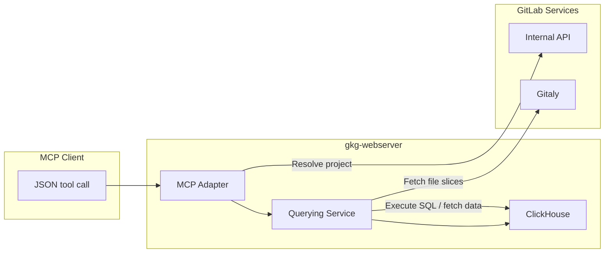

## Overview

The deployed HTTP server (`gkg-webserver`) exposes a REST + MCP surface so agents can run graph queries without having to write Cypher or SQL directly. This server adds three major capabilities:

- A **dedicated web server** (`gkg-webserver`) that serves queries by connecting to ClickHouse, NATS, and Gitaly to build the graph queries and serve the results.
- A **graph query engine** that compiles high‑level graph operations into ClickHouse SQL and executes them directly on adjacency‑ordered edge tables and typed node tables.
- An **intermediate query language** expressed as JSON schemas that LLMs or UI clients can fill in deterministically. These schemas translate into parameterized ClickHouse SQL executed by the graph query engine.

### Graph Query Engine

View the [Graph Query Engine](/handbook/engineering/architecture/design-documents/gitlab_knowledge_graph/querying/graph_engine/) design document for more details on the graph query engine.

### Intermediate Query Language

View the [Intermediate Query Language](./intermediary_llm_query_language.md) design document for more details on the intermediate LLM query language.

## Web Server Architecture

The web server will expose endpoints for GitLab Rails to consume. This will power the following features:

- API endpoints for GitLab Rails to query the graph directly, for Knowledge Graph or Analytics products.
- MCP interface for LLMs and UI clients to query the graph.
- Software Architecture Map (UI) to visualize the graph.

### Request Routing and Query Execution

- **REST endpoints** under `/api/graph/*` and `/api/v1/*` serve code graph workflows (symbols, references, dependencies) and namespace graph analytics. Each handler resolves the target scope (tenant/namespace/project), constructs a `DatabaseQueryingService`, executes parameterized SQL, and optionally enriches results with Gitaly content.
- **MCP interface** mounts under `/mcp`. The adapter shares the same query services, exposing the intermediate JSON language so agents receive both the generated SQL (for transparency) and the actual query results.
- **Web server process** (`gkg-webserver`) runs as the query front end in deployed environments. It connects to ClickHouse in read‑only mode, ensuring the query tier cannot mutate graph state while still serving low‑latency requests across multiple replicas.

## Additional Notes

- All query paths reuse the shared schema and query helpers in `crates/database`, so code and namespace graphs adhere to the same table/relationship definitions.
- SQL generation is guard-railed: hop limits (max three for namespace traversals), explicit relationship lists, and schema-driven validation prevent runaway queries.
- The response format will be explicitly defined: rows of JSON objects plus the SQL string if needed. That allows callers to audit what executed, retry manually, or feed the statement into alternative tools.
