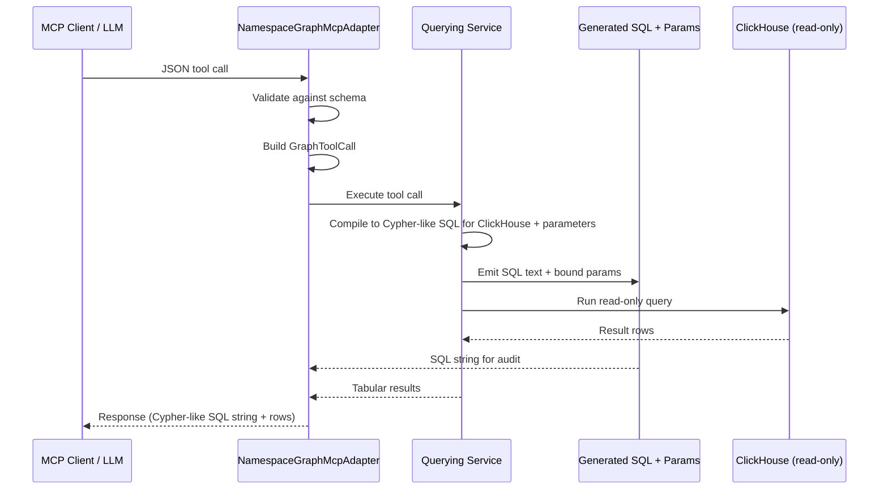

## Overview

We will encode Knowledge Graph tools as JSON schemas that describe intent, required fields, and guardrails. Inside `namespace_graph/tools/registry.rs` each tool implements a `ToolDefinition` containing:

- `name` and `description` for LLM guidance.
- `parameters`: a JSON Schema structure (types, enums, max hops, property filters, etc.) that constrains input.

Example snippets:

```json
{
  "type": "object",
  "required": ["node_label"],
  "properties": {
    "node_label": {"type": "string"},
    "limit": {"type": "integer", "default": 30, "maximum": 30}
  }
}
```

```json
{
  "type": "object",
  "required": ["start_node"],
  "properties": {
    "start_node": {
      "type": "object",
      "required": ["label", "node_id"],
      "properties": {
        "label": {"type": "string"},
        "node_id": {"type": "integer"}
      }
    },
    "max_hops": {"type": "integer", "default": 2, "maximum": 3}
  }
}
```

During runtime the MCP adapter (`namespace_graph/mcp_adapter.rs`) publishes these definitions to Model Context Protocol clients. When an agent selects a tool, the adapter:

1. Validates the JSON arguments against the schema and returns a validation error if the JSON is invalid. We will not attempt to fix the JSON.
2. Converts the JSON payload into a strongly typed `GraphToolCall` (labels, filters, relationship selectors).
3. Uses the namespace querying service (`namespace_graph/querying`) to compile ClickHouse SQL and a parameter map.
4. Executes the SQL against ClickHouse and returns:
   - The generated SQL string (for observability / debugging).
   - Tabular results (rows + properties) as JSON.



This design gives LLMs a stable vocabulary—“find_nodes”, “traverse_relationships”, “find_paths”, etc.—while 
allowing the backend to enforce hop limits, relationship allow-lists, sanitization, and projection logic. The same schema 
surfaces through the CLI and HTTP API, so manual consumers can provide JSON bodies that map 1:1 to the tool 
contracts.

## Available Knowledge Graph LLM Tools

The Knowledge Graph provides eight primary tools for querying the graph. Each tool is designed for specific graph query patterns while enforcing security and performance constraints.

### 1. `get_graph_schema`

Retrieves the complete schema of the knowledge graph including all node types, their properties, and all relationship types with their directionality. This tool helps agents and users discover what data exists and how entities connect. 

This tool will not return the underlying ClickHouse or Postgres schema. 

To reduce context window size, we will only return node types and relationship types, with the ability to expand the schema's nodes and relationship properties via a parameter (example):

```json
{
  "type": "object",
  "parameters": {
    "type": "object",
    "properties": {
      "expand_schema": { "type": "boolean", "default": false },
      "expand_nodes": { "type": "array", "items": { "type": "string" } },
      "expand_relationship_types": { "type": "array", "items": { "type": "string" } }
    },
    "additionalProperties": false
  }
}
```

Expected output (LLM-optimized JSON):

Minimal response (default):

```json
{
  "format": "knowledge_graph.schema.v1",
  "revision": "2025-11-24T00:00:00Z#abcdef",
  "node_types": [
    { "name": "gl_group" },
    { "name": "gl_issue" },
    { "name": "gl_mr" },
    { "name": "gl_project" },
    { "name": "gl_user" }
  ],
  "relationship_types": [
    { "name": "AUTHORED_ISSUE", "from": "gl_user", "to": "gl_issue" },
    { "name": "ISSUE_IN_PROJECT", "from": "gl_issue", "to": "gl_project" },
    { "name": "MR_TO_PROJECT", "from": "gl_mr", "to": "gl_project" }
  ]
}
```

Partial expansion (when `expand_nodes=["gl_issue"]`):

```json
{
  "format": "knowledge_graph.schema.v1",
  "revision": "2025-11-24T00:00:00Z#abcdef",
  "node_types": [
    { "name": "gl_group" },
    {
      "name": "gl_issue",
      "properties": [
        { "name": "id", "type": "int64", "nullable": false },
        { "name": "iid", "type": "int32", "nullable": false },
        { "name": "title", "type": "string", "nullable": false },
        { "name": "state", "type": "enum", "values": ["opened", "closed"] },
        { "name": "created_at", "type": "datetime" },
        { "name": "updated_at", "type": "datetime" }
      ],
      "relationships": {
        "outgoing": ["ISSUE_IN_PROJECT", "ISSUE_ASSIGNED_TO", "ISSUE_AUTHORED_BY", "ISSUE_TO_MERGE_REQUEST"],
        "incoming": ["MENTIONED_IN_NOTE"]
      }
    },
    { "name": "gl_mr" },
    { "name": "gl_project" },
    { "name": "gl_user" }
  ],
  "relationship_types": [
    { "name": "AUTHORED_ISSUE", "from": "gl_user", "to": "gl_issue" },
    { "name": "ISSUE_IN_PROJECT", "from": "gl_issue", "to": "gl_project" },
    { "name": "MR_TO_PROJECT", "from": "gl_mr", "to": "gl_project" }
  ]
}
```

Expanded response (when `expand_schema=true`):

```json
{
  "format": "knowledge_graph.schema.v1",
  "revision": "2025-11-24T00:00:00Z#abcdef",
  "node_types": [
    {
      "name": "gl_issue",
      "properties": [
        { "name": "id", "type": "int64", "nullable": false },
        { "name": "iid", "type": "int32", "nullable": false },
        { "name": "title", "type": "string", "nullable": false },
        { "name": "state", "type": "enum", "values": ["opened", "closed"] },
        { "name": "created_at", "type": "datetime" },
        { "name": "updated_at", "type": "datetime" }
      ],
      "relationships": {
        "outgoing": ["ISSUE_IN_PROJECT", "ISSUE_ASSIGNED_TO", "ISSUE_AUTHORED_BY", "ISSUE_TO_MERGE_REQUEST"],
        "incoming": ["MENTIONED_IN_NOTE"]
      }
    },
    {
      "name": "gl_project",
      "properties": [
        { "name": "id", "type": "int64" },
        { "name": "name", "type": "string" },
        { "name": "description", "type": "string" },
        { "name": "created_at", "type": "datetime" },
        { "name": "updated_at", "type": "datetime" }
      ],
      "relationships": {
        "incoming": ["ISSUE_IN_PROJECT", "MR_TO_PROJECT"]
      }
    }
  ],
  "relationship_types": [
    {
      "name": "ISSUE_IN_PROJECT",
      "from": "gl_issue",
      "to": "gl_project",
      "properties": [
        { "name": "created_at", "type": "datetime" },
        { "name": "updated_at", "type": "datetime" }
      ]
    }
  ]
}
```

### 2. `find_nodes`

Gets nodes in the graph by their type and property values to use as a starting point for other queries. This is the most flexible search tool, allowing filtering by any combination of node properties with support for operators like equality, comparison, containment, and null checks. We can later expand this to support search via Elasticsearch or other search engines (Zoekt).

### 3. `traverse_relationships`

Follows relationships from starting nodes to discover connected entities. Supports multi-hop traversal and variable-length paths. This is the primary tool for navigating the graph along known relationship types.

### 4. `explore_neighbors`

Discovers all nodes connected to a starting node within a specified number of hops, regardless of relationship type or direction. This provides an exploratory view of everything related to an entity. LLMs will also be able to filter by node type, relationship type, and property values.

### 5. `find_paths`

Finds specific paths (sequences of nodes and relationships) connecting two known nodes. This reveals how entities are related through intermediate connections, useful for impact analysis and dependency tracking. LLMs will also be able to filter by node type, relationship type, and property values.

### 6. `aggregate_nodes`

Performs aggregations like count, sum, average, minimum, and maximum on nodes, optionally grouped by their relationships to other nodes. This is the analytics tool for understanding patterns and metrics.

## Compilation Security

From a security perspective, all JSON inputs will be appropriately validated and sanitized based on their contents. That will be a hard requirement for related MR reviews.

Assuming the following JSON shape for a traversal request:

- `from`: `{ label, ids?, filters? }`
  - `label`: node table name (e.g. `gl_issue`, `gl_project`, `gl_user`, `gl_mr`)
  - `ids`: optional list of starting node IDs
  - `filters`: optional property filters on the starting nodes
- `relationships`: `[{ type, direction?, max_hops? }]`
  - `type`: relationship type name (e.g. `AUTHORED_ISSUE`, `ISSUE_IN_PROJECT`, `PROJECT_TO_GROUP`)
  - `direction`: one of `outgoing | incoming | both` (optional, default `outgoing`)
  - `max_hops`: integer 1–3 (optional, default 1)
- `to`: `{ label, filters? }`
  - `label`: target node table name
  - `filters`: optional property filters on the destination nodes
- `limit`: integer (default 30, max 30)

We will handle compilation + safety in the following ways at minimum:

- **Typed JSON → internal AST → SQL**
  - We will never concatenate user/LLM strings into raw SQL.
  - The JSON will be first deserialized into strongly-typed Rust structs that match the schema above.
  - From those structs, we build an internal query AST (nodes, relationships, filters, limits).
  - The SQL/Cypher generator only accepts this AST; it cannot take arbitrary strings. This prevents the LLM from "inventing" SQL fragments.

- **Parameterization of all user-supplied values**
  - All **user-supplied scalar values** (e.g. node IDs, filter values like `state = 'opened'`, date ranges, etc.) will always be passed as **bound parameters** to ClickHouse.
  - The query builder only interpolates **placeholders** in the SQL and binds the actual values out-of-band via the driver, so there is no injection point.
  - This applies equally whether the request comes directly from a user, an LLM, or another service.

- **Enum / identifier validation as string literals**
  - All **enum-like fields** (e.g. node `label`, relationship `type`, `direction`) are **validated against strict allow-lists**:
    - Node labels must be one of the known table names (`gl_issue`, `gl_mr`, `gl_project`, `gl_group`, `gl_user`, etc.).
    - Relationship types must be one of the known edge types in our schema (`AUTHORED_ISSUE`, `ISSUE_IN_PROJECT`, `MR_TO_PROJECT`, etc.).
    - Directions must be one of the explicit enum values (`outgoing`, `incoming`, `both`).
  - If the value is not in the allow-list, we reject the request with a validation error rather than passing it through to SQL.
  - This means the LLM cannot introduce new table names, join arbitrary system tables, or call random functions.

- **Path length and fan-out limits**
  - Each relationship step has a hard-coded `max_hops` cap (1–3), and the tool schema enforces the same bounds.
  - We apply additional limits on:
    - Maximum number of relationship steps in `relationships`.
    - Maximum `limit` (number of rows returned).
  - These bounds protect us against unbounded graph explosions and resource exhaustion from a single request.

- **Read-only, tenant-scoped execution**
  - The generated SQL is executed using a **read-only** database user that:
    - Can only run `SELECT` (no `INSERT/UPDATE/DELETE/DDL`).
    - Is restricted to the Knowledge Graph tables.
  - We also, as noted elsewhere in the docs, inject **permission predicates** (e.g. `traversal_id` filters) based on the caller's JWT, so the resulting query is still subject to GitLab's authorization model.
  - This makes it harder for an LLM-originated query to read cross-tenant data or modify storage.

- **Property filter sanitization**
  - `filters` objects (both on `from` and `to`) are treated as structured input:
    - Only known columns for the given label can be filtered on.
    - Operators are limited to a small, explicit set (e.g. `=`, `IN`, `>=`, `<=`, maybe `LIKE`), represented as enums in the AST.
    - Values are, again, bound parameters; we never splice them directly into SQL.

- **Resource and abuse controls**
  - We will enforce:
    - Per-request timeouts and max result size.
    - Per-user and per-token rate limiting for traversal endpoints.
    - Logging/metrics on generated ASTs and compiled SQL, so we can audit or block abusive patterns.
  - Because the Graph Query Engine is the **only** path from JSON/Cypher into SQL, we have a single choke point for enforcing these controls.
  
> **Note:**: limits like Path length and result size will be set by the team as we collect data and usage patterns, with an initial focus of avoiding abuse and runaway queries specced out at review time.

The "compilation" step will be a controlled JSON→AST→SQL translation inside the Knowledge Graph service. All free-form values are parameterized, all enum-like inputs (node labels, edge types, directions) are validated against allow-lists, the database role is read-only and tenant-scoped, and we cap traversal depth and result sizes to protect the underlying infrastructure.
