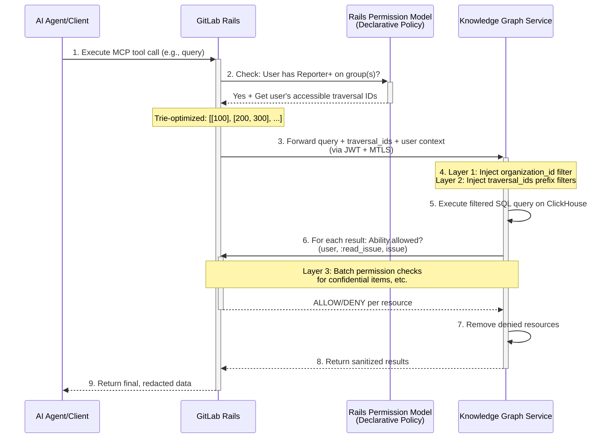
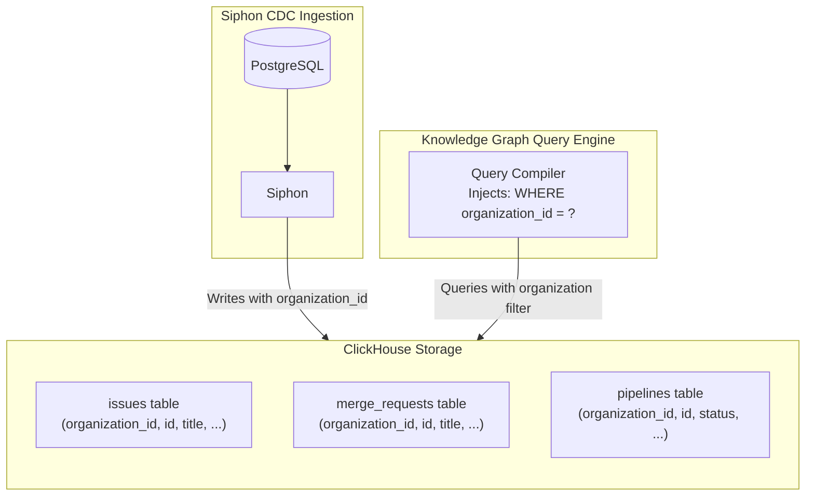
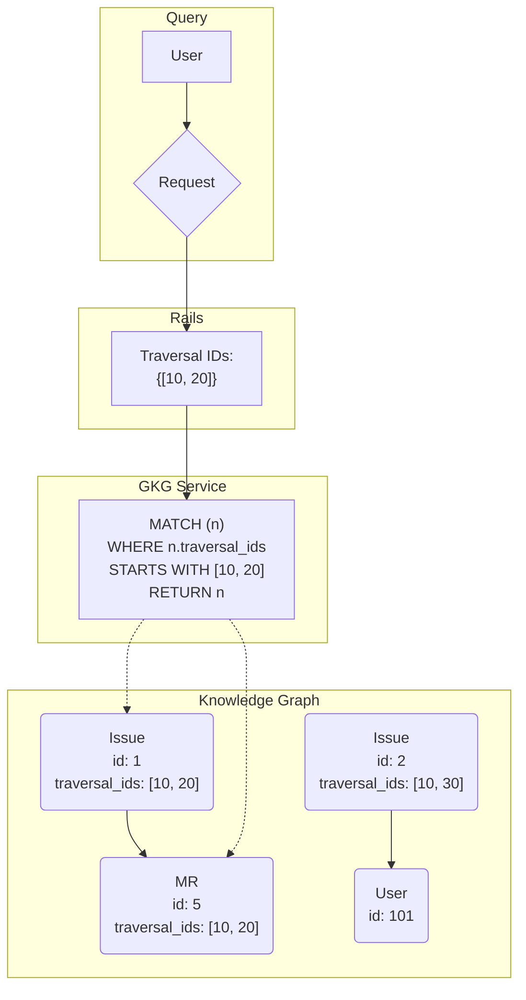
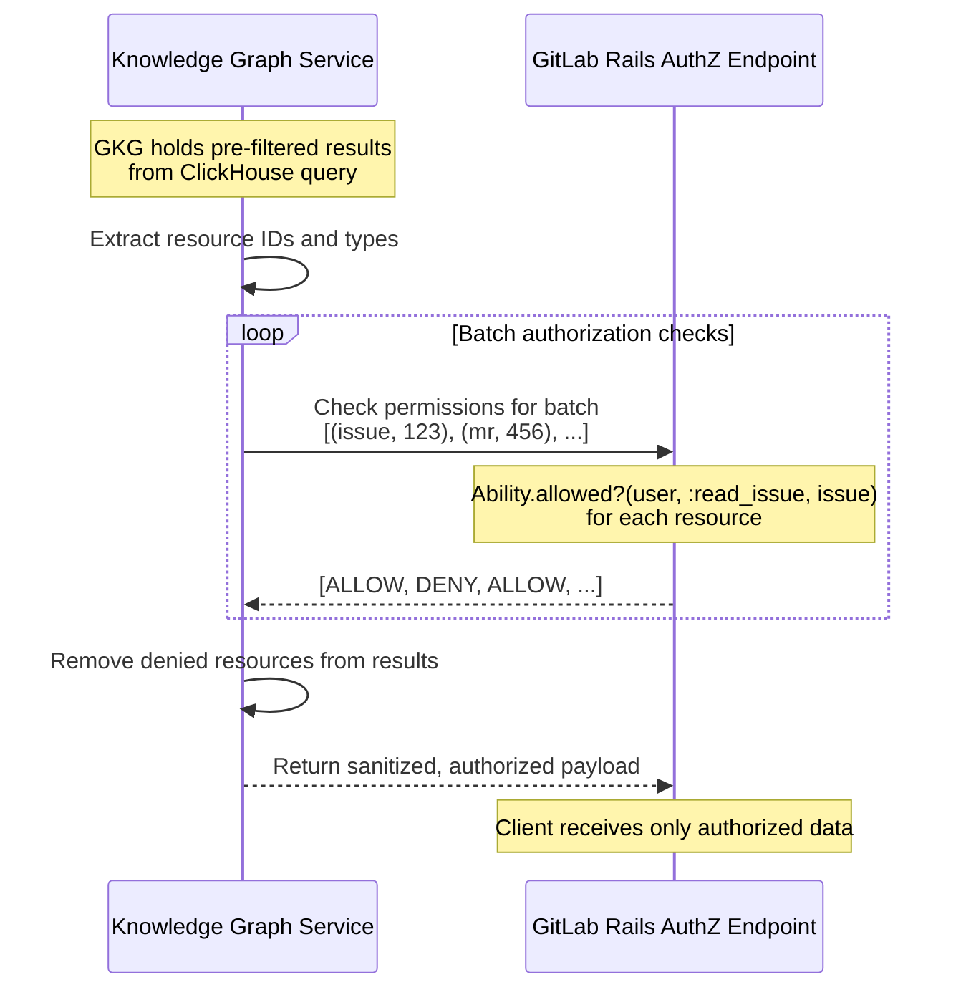

## Overview

The Knowledge Graph unlocks querying capabilities across an entire GitLab namespace. To ensure data is never exposed to unauthorized users, the architecture implements a multi-layered security model that is enforced on every query. This document outlines the three layers of defense that work together to protect user data:

- Logical tenant segregation at the storage layer via indexed columns.
- Query-time filtering using traversal IDs.
- Final redaction at the application layer via Rails authorization checks.

All access to the Knowledge Graph is proxied through GitLab Rails, which acts as the primary authentication and authorization gateway. This ensures no user or agent can bypass GitLab's existing permission model. As part of the broader Auth Architecture program, these controls will evolve to integrate with GitLab's future auth services. Until we have a finalized auth service, Rails remains the enforcement point and source of truth.

## Initial Access Model: Reporter+ at Group Level

For the initial release, the Knowledge Graph enforces a simplified permission model to ensure security while enabling rapid delivery:

- **Group-level Reporter+ access required**: Users must have at least Reporter role on a group to query any data within that group's hierarchy.
- **Hierarchical access**: GitLab's permission model is hierarchical. If you have Reporter+ access to a group, you automatically have access to all subgroups and projects beneath it in the namespace tree. The Knowledge Graph honors this hierarchy.
- **No sparse permissions in V1**: The first iteration does not support individual project-level access or item-level permissions (e.g., access to a single project without group access). This simplification aligns with GitLab's existing Analytics products, which require the same Reporter+ group-level access.
- **Incremental filtering still applies**: Even with Reporter+ access, the system still filters results based on traversal IDs and performs final redaction checks to handle edge cases like confidential issues and runtime checks (like SAML/IP).

### Request Flow

The following diagram illustrates the end-to-end flow of a secure query, from the initial tool call to the final, redacted response.



## Layer 1: Logical Tenant Segregation by Organization

The first security boundary is logical tenant segregation enforced through database schema design and query predicates. All SDLC data (issues, merge requests, pipelines, etc.) is stored in ClickHouse tables with a `organization_id` column representing the organization.

This layer is primarily intended for .com customers to ensure that they can only query data within their own organization.

**Component**: Knowledge Graph Query Engine (`gkg-webserver`) and indexer (`gkg-indexer`)

**How It's Enforced**:

- **At the ClickHouse Storage Layer**: When Siphon streams data from PostgreSQL, the indexer writes each row with a `organization_id` column that identifies the top-level organization it belongs to.
- **Query-Level Enforcement**: The query compiler automatically injects `WHERE organization_id = ?` predicates into every generated SQL query before execution. The `organization_id` value is extracted from the authenticated JWT token passed by Rails.
- **Multi-Tenant Queries Blocked**: The query planner explicitly rejects any attempt to query across multiple organization_ids in a single request (e.g., `WHERE organization_id IN [1, 2]`). Each query is scoped to exactly one top-level organization.
- **Parameterization**: All queries are parameterized; the organization_id is bound as a parameter, never concatenated into SQL strings.

**Code Review Requirements**:

- Every query generation function must call a `inject_organization_id_filter()` or similarly named method.
- Unit tests must verify that queries without organization filters are rejected.
- Integration tests must verify cross-organization queries are blocked.
- Fuzz tests must verify that queries with invalid organization_ids are rejected.

**Detection and Monitoring**:

- **Metric**: `gkg.query.organization_filter_applied` (counter) - tracks queries with organization filtering applied.
- **Metric**: `gkg.query.multi_tenant_rejected` (counter) - increments when a multi-tenant query is blocked.
- **Audit Logging**: All queries are logged with `organization_id`, `user_id`, and `query_hash` for security audit trails.
- **Alert**: Trigger critical alert if cross-tenant access attempts are detected.



## Layer 2: Query-Time Filtering with Traversal IDs

While Layer 1 isolates top-level namespaces, Layer 2 provides fine-grained filtering within a namespace based on the user's group memberships. We leverage GitLab's hierarchical permission model using `traversal_ids`.

### Understanding Traversal IDs and Hierarchical Access

As documented in the [GitLab Namespace documentation](https://docs.gitlab.com/development/namespaces/#querying-namespaces), the `traversal_ids` array represents the full ancestor hierarchy for any given namespace. For example, a project namespace with ID `300` inside a subgroup with ID `200` under a top-level group with ID `100` would have `traversal_ids` of `[100, 200, 300]`.

**Hierarchical Access Model**: GitLab's permission system is hierarchical. If a user has Reporter+ access to a group, they automatically have access to all resources in that group and all nested subgroups and projects beneath it. The Knowledge Graph respects this hierarchy through traversal ID prefix matching.

For example:

- User has Reporter+ on group `[100]` → Can access all resources with traversal_ids starting with `[100]`, including `[100, 200]`, `[100, 200, 300]`, etc.
- User has Reporter+ on subgroup `[100, 200]` → Can access resources with traversal_ids starting with `[100, 200]`, but NOT resources under sibling group `[100, 300]`.

### How It Works

**Component**: GitLab Rails (computation) + Knowledge Graph Query Engine (enforcement)

During indexing, we enrich every entity (Issue, MR, Pipeline, etc.) with the `traversal_ids` of its parent project or group. When a user initiates a query:

1. **Rails computes accessible groups**: Rails queries the user's group memberships with Reporter+ role: `user.groups.where('members.access_level >= ?', Gitlab::Access::REPORTER)`.
2. **Optimize with trie structure**: Rails converts these groups into their `traversal_ids` arrays and optimizes them using a trie structure to avoid redundancy. For example, if a user has access to `[100]`, we don't need to also include `[100, 200]` since it's already covered.
3. **Pass to GKG**: This minimal set of traversal ID prefixes is passed to the Knowledge Graph service (in the JWT payload, with JWT+MTLS for enhanced security).
4. **Inject filters**: The query engine generates ClickHouse SQL with prefix matching predicates: `WHERE arrayExists(prefix -> startsWith(traversal_ids, prefix), allowed_prefixes)`.

**Code Review Requirements**:

- Rails service must validate that only Reporter+ memberships are included.
- GKG query compiler must inject traversal_id filters for all entity queries (issues, MRs, pipelines, etc.).
- Unit and integration tests must verify that users cannot access resources outside their traversal_id scope.

**Detection and Monitoring**:

- **Metric**: `gkg.query.traversal_filter_applied` (counter) - increments on every query with traversal filtering.
- **Metric**: `gkg.rails.traversal_ids_computed` (histogram) - tracks the number of traversal IDs computed per user.
- **Audit Logging**: Log queries with the `traversal_ids` filter applied and the number of prefixes used.
- **Alert**: Trigger warning if a user has more than 100 distinct traversal ID prefixes (indicates potential permission explosion).

The query engine then uses this list to pre-filter the query, ensuring that only nodes belonging to accessible namespace hierarchies are considered.



While this serves as an efficient first pass of authorization and reduces the result set, it does not account for resource-specific permissions like confidential issues, which is why a final redaction layer is required.

### Additional Query Safeguards

**Component**: Knowledge Graph Query Engine (`gkg-webserver`)

In addition to authorization filtering, the query engine implements further safeguards to protect against resource exhaustion:

**Controls**:

- **Depth Caps**: Traversals limited to max 3 hops. Enforced in query compiler; queries exceeding this are rejected with error.
- **Relationship Allow-Lists**: Only pre-defined relationship types are allowed. Unknown relationships trigger validation errors.
- **Row Limits**: Max 1000 rows per query (configurable). Enforced in SQL generation: `LIMIT 1000`.
- **Query Timeouts**: All ClickHouse queries have a 30-second timeout via `max_execution_time` setting.
- **Rate Limiting**: Per-user rate limiting enforced at the GKG web server level (e.g., 100 queries per minute).

**Detection and Monitoring**:

- **Metric**: `gkg.query.depth_limit_exceeded` (counter) - queries rejected for exceeding depth limit.
- **Metric**: `gkg.query.timeout` (counter) - queries that timed out.
- **Metric**: `gkg.query.rate_limited` (counter) - queries rejected due to rate limiting.
- **Alert**: Trigger warning if timeout rate exceeds 5% of total queries.

## Layer 3: Final Redaction Layer via Rails Authorization

The final and most authoritative security layer is executed by the Knowledge Graph service calling back to GitLab Rails for granular permission checks. After the query engine returns pre-filtered results (from Layers 1 and 2), the Knowledge Graph service performs a final authorization pass before returning data to the client.

### Why This Layer Is Necessary

While traversal IDs provide coarse-grained filtering at the group/project level, they cannot account for resource-specific permissions such as:

- Confidential issues (only visible to project members and issue participants)
- Runtime checks (such as SAML group links or IP restrictions)
- Custom roles or fine-grained permissions that may be added in the future

Layer 3 closes these gaps by consulting Rails' authoritative permission model for each returned resource.

### How It Works

The Knowledge Graph service uses the same permission check mechanism as GitLab's Search Service. GitLab's [SearchService](https://gitlab.com/gitlab-org/gitlab/-/blob/master/app/services/search_service.rb) implements a `redact_unauthorized_results` method that filters search results based on user permissions:

```ruby
def visible_result?(object)
  return true unless object.respond_to?(:to_ability_name) && DeclarativePolicy.has_policy?(object)

  Ability.allowed?(current_user, :"read_#{object.to_ability_name}", object)
end

def redact_unauthorized_results(results_collection)
  redacted_results = results_collection.reject { |object| visible_result?(object) }
  # ... removes unauthorized results from collection
end
```

The `Ability.allowed?` method is the single source of truth for resource-level permissions in GitLab. It evaluates all declarative policies, custom roles, and special cases including runtime checks (such as SAML group links or IP restrictions).

**Component**: Knowledge Graph Service (`gkg-webserver`) + GitLab Rails Authorization Endpoint

The flow is:

1. **GKG holds pre-filtered results** from the ClickHouse query.
2. **Batch permission checks**: GKG extracts tuples of `(resource_type, resource_id)` from the result set and makes batched RPC calls to Rails' authorization endpoint: `POST /api/internal/knowledge_graph/authorize` with payload `[{type: "issue", id: 123}, {type: "mr", id: 456}]`.
3. **Rails evaluates**: For each resource, Rails runs `Ability.allowed?(user, :read_<resource_type>, resource)` and returns an array of boolean values: `[true, false, true, ...]`.
4. **GKG sanitizes**: The Knowledge Graph service removes any denied resources from the result set.
5. **Final response**: Only the sanitized results are returned to Rails for delivery to the client.

**Code Review Requirements**:

- GKG redaction module must be called for all non-aggregation queries before returning results.
- Rails authorization endpoint must use `Ability.allowed?`, not custom permission checks.
- Integration tests must verify confidential issues are filtered out.
- Performance tests must verify batch sizes and latency for large result sets.

**Detection and Monitoring**:

- **Metric**: `gkg.redaction.checks_performed` (counter) - total authorization checks performed.
- **Metric**: `gkg.redaction.resources_denied` (counter) - resources filtered out by Layer 3.
- **Metric**: `gkg.redaction.batch_size` (histogram) - size of authorization batches sent to Rails.
- **Metric**: `gkg.redaction.latency` (histogram) - time taken for Rails authorization checks.
- **Audit Logging**: Log all denied resources with `{user_id, resource_type, resource_id, reason}`.
- **Alert**: Trigger warning if `gkg.redaction.resources_denied` rate exceeds 20% of total results (may indicate traversal_id filtering is ineffective).



This final check guarantees that:

- No matter what the graph query returns, users only see data they are explicitly authorized to view.
- Any bugs or gaps in traversal ID filtering are caught before data is exposed.
- Future permission model changes in Rails automatically apply to Knowledge Graph queries without service changes.
- Rails remains the single source of truth for all authorization decisions.

## Service-to-Service Authentication and Authorization

Communication between GitLab Rails and the Knowledge Graph service will use a defense-in-depth approach combining multiple security mechanisms:

### JWT for Request Authentication

**Component**: GitLab Rails (issuer) + Knowledge Graph Service (verifier)

JSON Web Tokens (JWTs) are used to authenticate requests from Rails to the Knowledge Graph service and carry user context:

- **Signing**: Rails signs each JWT with a shared secret key using HS256 algorithm (similar to the pattern used for Exact Code Search/Zoekt).
- **User Context**: The JWT payload includes: `{user_id, username, organization_id, traversal_ids, iat, exp}`.
- **Transport**: The JWT is passed in the `Authorization: Bearer <token>` header.
- **Verification**: The Knowledge Graph service verifies the JWT signature using the same shared secret before processing any request.
- **Token Expiry**: JWTs include short expiration times (5 minutes) to limit the window of potential token misuse.

**Detection and Monitoring**:

- **Metric**: `gkg.auth.jwt_verification_failed` (counter) - failed JWT verifications.
- **Metric**: `gkg.auth.jwt_expired` (counter) - expired tokens received.
- **Audit Logging**: Log all authentication failures with `{timestamp, source_ip, user_id, reason}`.
- **Alert**: Trigger warning if JWT verification failure rate exceeds 1% of requests.

### MTLS for Transport Security

**Component**: GitLab Rails + Knowledge Graph Service (both)

- **Infrastructure**: Kubernetes service mesh (Istio/Linkerd) or manual TLS configuration.
- **Configuration**: Certificate management via cert-manager or GitLab's existing certificate infrastructure.

In addition to JWT authentication, the system will use Mutual TLS (MTLS) to establish cryptographically verified connections between services:

- **Service Identity**: Both Rails and the Knowledge Graph service present certificates that prove their identity.
- **Encrypted Transport**: All traffic between services is encrypted, protecting sensitive data in transit.
- **Certificate Validation**: Each service validates the other's certificate before establishing a connection.

This dual approach provides zero-trust security:

- **MTLS** ensures we're talking to the right service at the network level.
- **JWT** ensures we're processing requests with the right user context and permissions.

### Database Access Controls

The Knowledge Graph service connects to ClickHouse with restricted privileges:

- **Read-Only Role**: The database user has SELECT-only permissions, preventing any writes or schema modifications.
- **Table-Level Restrictions**: Access is limited to Knowledge Graph tables only; the role cannot access system tables or other tenant data.
- **Connection Pooling**: Connections are pooled and rate-limited to prevent resource exhaustion.

## Handling Aggregations

For aggregation queries (counts, averages, etc.), the Reporter+ group-level access model provides the necessary security boundary. Since aggregations do not return individual resource details, the final redaction layer is not applicable. Instead:

- **Pre-filtering Only**: Aggregation queries rely on Layers 1 and 2 (organization_id and traversal_id filtering) to ensure users can only aggregate over data they have group-level access to.
- **No Item-Level Redaction**: We do not perform post-aggregation filtering, as this would be ineffective (e.g., you cannot "redact" a count after it's been computed).
- **Query Shape Restrictions**: The query planner may restrict certain aggregation patterns to prevent information leakage through timing attacks or result patterns.

This approach aligns with GitLab's existing Analytics products, which use the same Reporter+ group-level access model for aggregations.
