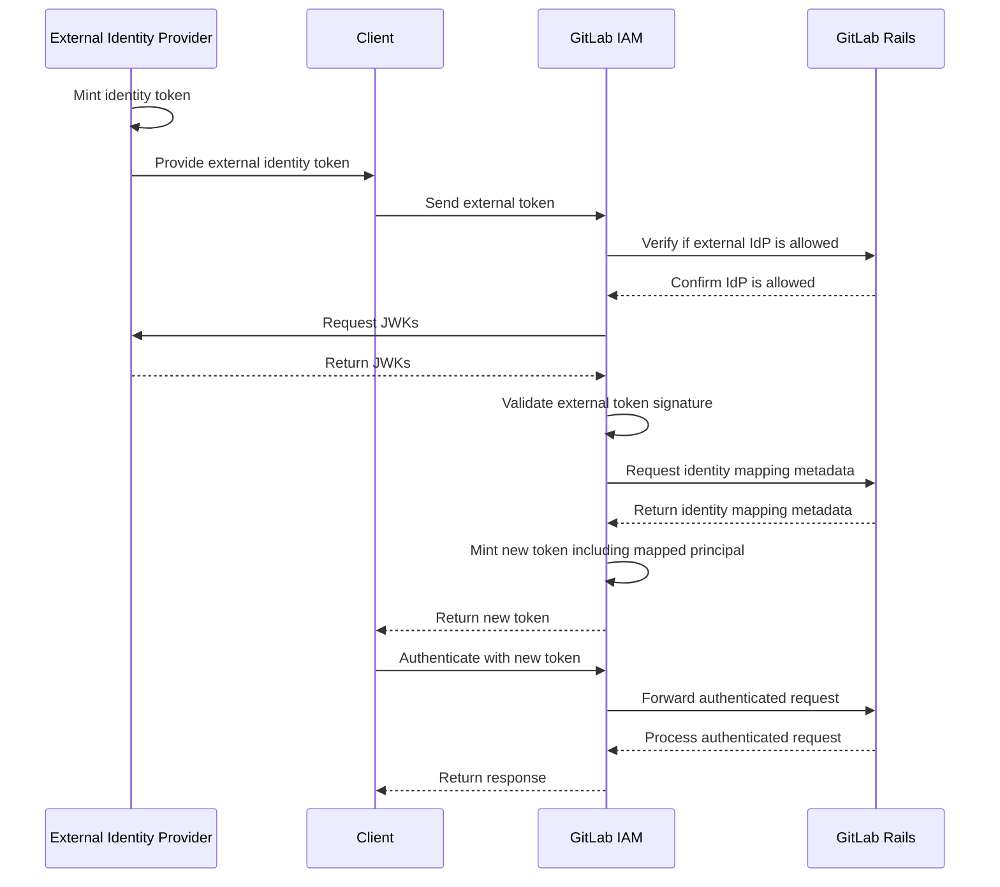



## Summary

Currently, the primary method for machine-type identities to interact with GitLab is through
Personal Access Tokens (PATs). Since PATs are relatively long-lived, there is a significant
risk of them being leaked or stolen by malicious actors.

While users sometimes use OAuth access tokens for shorter-lived credentials, this approach is not
ideal. A widely adopted alternative in the industry is [workload identity federation](https://cloud.google.com/iam/docs/workload-identity-federation),
which is built on top of OpenID Connect (OIDC). GitLab users already use this method to authenticate
with platforms like Google Cloud Platform and AWS, but there is no way to authenticate with GitLab
using identity federation.

This design document outlines the path toward implementing GitLab Workload Identity Federation.
This will enable GitLab users to grant access to a GitLab instance to external identities by
mapping external principals to GitLab identities and defining rules for their authentication
and authorization.

## Goals

The main goal is to add support for GitLab to recognize external identities and map them to
GitLab principals using OIDC identity tokens from external identity providers.

## Requirements

1. GitLab users can define a list of external identity providers that are allowed to access
   GitLab resources within configured groups and projects.
1. GitLab users can map external identities onto GitLab service accounts.
1. GitLab users can define rules for the mapping using claims from external identity tokens.
1. GitLab users can audit access granted to external identities through audit logs.
1. External identity tokens can be used to authenticate with GitLab APIs, provided the external
   identity provider is properly configured in GitLab.

## Proposal

The proposed solution is to build a token exchange service that reads GitLab Workload Identity
Federation rules from the GitLab API. Based on this metadata, the service will recognize and
validate identity tokens from external identity providers. The claims in these tokens will be
used to map an external identity to a GitLab principal. After a successful mapping, the GitLab
Secure Token Service (STS) will mint a new token that client SDKs can use to interact with
GitLab APIs.

## Dependencies

GitLab Workload Identity Federation has a few dependencies, notably it depends
on [The New Auth Stack](../new_auth_stack/).

1. **IAM Services**: Required for storing and retrieving external identity
   provider configurations, identity mapping rules, and service account
   metadata.
1. **Secure Token Service (STS)**: Core component responsible for minting access
   tokens based on external identity tokens, used for API access.
1. **Service Accounts**: External identities must map to GitLab service accounts
   for authorization.

## Relationship to Cells Architecture

GitLab Workload Identity Federation is designed to be compatible with the
[Cells architecture](../cells/). External identity token exchange occurs at the
appropriate GATE layer, and identity provider configurations replicate across
the IAM database hierarchy to enable cross-cell access patterns.

## Decisions

1. [STS-001: Open-source the GLGO service built for GCP integration](decisions/001_open_source_glgo.md)
1. [STS-002: Merge GLGO into IAM service](decisions/002_merge_glgo_into_iam_service.md)
1. STS-003: Implement mapping from external identities to GitLab service accounts
1. STS-004: Add support for accessing GitLab APIs with JWTs minted by the GitLab STS
