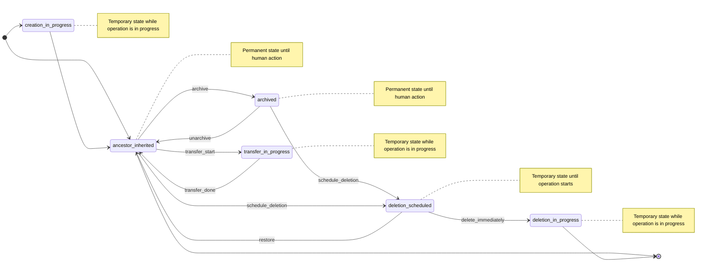

## Context

As detailed in the [current issues section of the design document](../_index.md#motivation), Groups and Projects currently have inconsistent state management implementations that
create poor user experience, increased support burden, difficulty in auditing and compliance, and maintenance overhead from duplicated code.

## Decision

We will implement a unified state management system for all namespace types using:

1. **Core State Model**:

   - `namespaces.state` (SMALLINT) - State identifier
   - `namespace_details.state_metadata` (JSONB) - Associated metadata

2. **Standardized States**:

   - `0` - ancestor_inherited (State inherited from ancestor or normal operational state)
   - `1` - archived (Archived but recoverable)
   - `2` - deletion_scheduled (Marked for deletion with grace period)
   - `3` - creation_in_progress (Currently being created)
   - `4` - deletion_in_progress (Currently being deleted)
   - `5` - transfer_in_progress (Currently being transferred)
   - `6` - maintenance (In maintenance mode, similar to archived but it's a temporary state that should be reverted to the previous state at some point)

3. **State Metadata Structure:**

    ```json
    {
      "last_updated_at": "2025-05-26T10:00:00Z",
      "last_changed_by_user_id": 12345,
      "last_error": "Transfer failed: insufficient permissions"
    }
    ```

    The JSON schema will be validated to ensure data consistency and maintainability:

    ```ruby
    validates :state_metadata, json_schema: { filename: "namespace_state_metadata" }
    ```

### State transitions



### Implementation Approach

```ruby
module Namespaces
  module Stateful
    extend ActiveSupport::Concern

    included do
      STATES = {
        ancestor_inherited: 0,
        archived: 1,
        deletion_scheduled: 2,
        creation_in_progress: 3,
        deletion_in_progress: 4,
        transfer_in_progress: 5,
        maintenance: 6
      }.with_indifferent_access.freeze

      state_machine :state, initial: :ancestor_inherited, initialize: false do
        event :creation_done do
          transition creation_in_progress: :ancestor_inherited
        end

        event :archive do
          transition :ancestor_inherited => :archived
        end

        event :unarchive do
          transition archived: :ancestor_inherited
        end

        event :schedule_deletion do
          transition [:ancestor_inherited, :archived] => :deletion_scheduled
        end

        event :restore do
          transition deletion_scheduled: :ancestor_inherited
        end

        event :deletion_start do
          transition deletion_scheduled: :deletion_in_progress
        end

        event :transfer_start do
          transition ancestor_inherited: :transfer_in_progress
        end

        event :transfer_done do
          transition transfer_in_progress: :ancestor_inherited
        end

        event :maintain do
          transition ancestor_inherited: :maintenance
        end

        event :unmaintain do
          transition maintenance: any
        end

        state :ancestor_inherited, value: STATES[:ancestor_inherited]
        state :archived, value: STATES[:archived]
        state :deletion_scheduled, value: STATES[:deletion_scheduled]
        state :creation_in_progress, value: STATES[:creation_in_progress]
        state :deletion_in_progress, value: STATES[:deletion_in_progress]
        state :transfer_in_progress, value: STATES[:transfer_in_progress]
        state :maintenance, value: STATES[:maintenance]
      end
    end
  end
end
```

## Consequences

### Positive Consequences

- **Consistency**: Unified behavior across all namespace types
- **Performance**: State inheritance eliminates need for descendant propagation, reducing database writes
- **Maintainability**: Single codebase for state management reduces duplication
- **Scalability**: Supports asynchronous operations for heavy state changes

### Technical Consequences

- **Database Changes**: Requires adding new columns and indices to existing tables
- **Migration Complexity**: Iterative migration approach needed to backfill historical data
- **API Compatibility**: Must maintain backward compatibility during transition
- **State Machine Implementation**: Requires implementing state transitions with validation guards

## Alternatives

### Alternative 1: Separate state tables per type

- **Pros**: Clear separation of concerns, type-specific optimizations
- **Cons**: Maintains current inconsistency, duplicated logic, no unified querying

### Alternative 2: Event sourcing approach

- **Pros**: Complete audit trail, time-travel capabilities
- **Cons**: Significant complexity increase, performance overhead, steep learning curve

### Alternative 3: Do nothing

- **Pros**: No development effort, no migration risks
- **Cons**: Performance issues persist, inconsistency continues, technical debt accumulates
