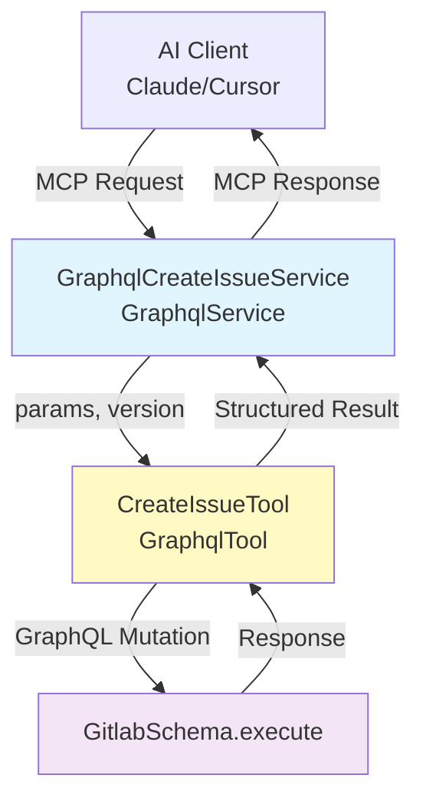



## Summary

This design introduces a reusable pattern for creating Model Context Protocol
(MCP) tools that leverage GitLab's GraphQL API. The solution provides
a two-layer architecture: a reusable `GraphqlTool` class that handles GraphQL
execution and error processing, and service wrappers extending `GraphqlService`
that handle validation and response formatting.

This pattern enables developers to create new GraphQL-powered MCP tools with
minimal boilerplate while maintaining consistent security and error handling
practices.

The implementation allows AI clients (like Duo agent platform, Claude, Cursor)
to perform complex operations on GitLab resources through GraphQL mutations and
queries, while reusing existing GraphQL schema definitions and
authorization logic.

## Motivation

### Current State

GitLab's MCP implementation uses a route-based architecture with
`route_setting :mcp` that exposes REST API endpoints as MCP tools.
While effective for REST operations, this approach has limitations for GraphQL
integration:

- No built-in pattern for GraphQL-based MCP tools
- Developers must manually wire GraphQL execution
- Inconsistent error handling between REST and GraphQL tools
- No reusable abstraction for common GraphQL operations
- No support for atomic multi-operation requests

### Goals

1. **Reusability**: Create a base class that eliminates boilerplate for GraphQL-based MCP tools
1. **Consistency**: Maintain uniform error handling, and response formatting across all GraphQL tools
1. **Developer Experience**: Enable creation of new GraphQL MCP tools in under 50 lines of code
1. **Security**: Leverage existing GraphQL authorization
1. **Type Safety**: Use static GraphQL schema definitions to prevent runtime errors
1. **Maintainability**: Keep GraphQL operations separate from business logic for easier testing
1. **Atomicity**: Support multiple mutations in a single request

### Non-Goals

- Replacing the existing route-based MCP architecture
- Creating a GraphQL proxy or query builder
- Implementing automatic schema introspection for tool generation
- Supporting GraphQL subscriptions (real-time updates)
- Creating a generic GraphQL client library
- Parallel mutation execution (GraphQL executes mutations sequentially)

## Solution

Introduce a **two-layer architecture** for GraphQL-based MCP tools:

**Layer 1: GraphQL Tool Classes** (`Mcp::Tools::GraphqlTool`)

- Define GraphQL operations (queries/mutations) as static constants
- Support single mutation or multiple mutations in one request
- Transform input parameters to GraphQL input format
- Execute operations against `GitlabSchema`
- Standardize result processing and error handling

**Layer 2: Service Wrappers** (`Mcp::Tools::*Service < GraphqlService`)

- Extend `GraphqlService` which provides user validation and GraphQL tool execution
- Implement version-specific logic using `Versionable` concern
- Define tool metadata (description, input schema) per version
- Call Layer 1 GraphQL tools via `execute_graphql_tool`
- Format responses for MCP protocol
- Handle service-level errors and logging

### Architecture Diagram



### Data Flow

```plain
1. MCP Client Request
   ↓
2. Service.execute(params)
   ├─ Validate current_user exists
   ├─ Call super (BaseService.execute)
   │  ├─ Validate arguments against input_schema
   │  └─ Call perform(arguments)
   ↓
3. perform method calls execute_graphql_tool(arguments)
   ├─ Build GraphQL query/mutation with static schema
   ├─ Transform params → GraphQL input variables
   ├─ Execute GitlabSchema.execute(graphql_operation, variables)
   └─ Process result (success/errors)
   ↓
4. Format response
   ├─ Success: Response.success(message, payload)
   └─ Error: Response.error(message)
   ↓
5. Return to MCP Client
```

## Design and Implementation Details

### Layer 1: GraphQL Tool Base Class

**File**: `app/services/mcp/tools/graphql_tool.rb`

**Purpose**: Base class for GraphQL-based MCP tools that handles GraphQL
execution, error processing, and versioning.

```ruby
module Mcp
  module Tools
    class GraphqlTool
      include Mcp::Tools::Concerns::Versionable

      attr_reader :current_user, :params

      def initialize(current_user:, params:, version: nil)
        @current_user = current_user
        @params = params
        initialize_version(version)
      end

      # Override in subclasses or use version metadata
      def graphql_operation
        raise NotImplementedError unless self.class.version_metadata(version)[:graphql_operation]

        self.class.version_metadata(version)[:graphql_operation]
      end

      def operation_name
        self.class.version_metadata(version)[:operation_name] ||
        raise(NotImplementedError, "operation_name must be defined")
      end

      # Can be overridden with version-specific methods
      def build_variables
        raise NotImplementedError, "build_variables must be implemented"
      end

      def execute
        result = GitlabSchema.execute(
          graphql_operation_for_version,
          variables: build_variables_for_version,
          context: execution_context
        )

        process_result(result)
      end

      private

      def execution_context
        {
          current_user: current_user,
          is_sessionless_user: false
        }
      end

      def process_result(result)
        # Handle GraphQL-level errors (syntax, validation, etc.)
        if result['errors']
          error_messages = extract_error_messages(result['errors'])
          return ::Mcp::Tools::Response.error(error_messages.join(', '))
        end

        operation_data = result.dig('data', operation_name)

        return ::Mcp::Tools::Response.error("Operation returned no data") if operation_data.nil?

        # Check for operation-specific errors
        operation_errors = operation_data['errors']
        if operation_errors&.any?
          error_messages = extract_error_messages(operation_errors)
          return ::Mcp::Tools::Response.error(error_messages.join(', '))
        end

        formatted_content = [{ type: 'text', text: Gitlab::Json.dump(operation_data) }]
        ::Mcp::Tools::Response.success(formatted_content, operation_data)
      end

      def extract_error_messages(errors)
        errors.map do |error|
          if error.is_a?(String)
            error
          elsif error.is_a?(Hash)
            error['message'] || error.to_s
          else
            error.to_s
          end
        end
      end
    end
  end
end
```

**Key Design Decisions**:

- **Immutable operations**: GraphQL strings defined as constants prevent runtime modification
- **MCP Response format**: Returns `Mcp::Tools::Response` objects (success or error)
- **Flexible operation support**: Supports both mutations and queries
- **Context isolation**: Each tool instance is independent (no shared state)
- **Framework agnostic**: Works with any GraphQL operation type
- **Error extraction**: Handles both GraphQL-level and operation-level errors

### Layer 2: GraphqlService Base Class

**File**: `app/services/mcp/tools/graphql_service.rb`

**Purpose**: Provides a specialized base service for GraphQL-based MCP tools with user validation, versioning support, and GraphQL tool execution.

```ruby
module Mcp
  module Tools
    class GraphqlService < BaseService
      include Mcp::Tools::Concerns::Versionable
      extend Gitlab::Utils::Override

      def initialize(name:, version: nil)
        super(name: name)
        initialize_version(version)
      end

      override :set_cred
      def set_cred(current_user: nil, access_token: nil)
        @current_user = current_user
        _ = access_token # access_token is not used in GraphqlService
      end

      override :execute
      def execute(request: nil, params: nil)
        return Response.error("#{self.class.name}: current_user is not set") unless current_user.present?

        super
      end

      protected

      # Subclasses should override this to return their GraphQL tool class
      def graphql_tool_class
        raise NotImplementedError, "#{self.class.name}#graphql_tool_class must be implemented"
      end

      # Default implementation - can be overridden in subclasses
      def perform_default(_arguments = {})
          raise NoMethodError, "No implementation found for version #{version}"
      end

      private

      def execute_graphql_tool(arguments)
        tool = graphql_tool_class.new(
          current_user: current_user,
          params: arguments,
          version: version
        )

        tool.execute
      end
    end
  end
end
```

**Key Features**:

- **Extends BaseService**: Inherits MCP protocol support and validation
- **Versionable**: Supports multiple versions with `register_version`
- **User validation**: Ensures `current_user` is set before execution
- **GraphQL tool integration**: Provides `execute_graphql_tool` helper to instantiate and execute GraphQL tools
- **Template pattern**: Subclasses define `graphql_tool_class` and version-specific `perform_X_Y_Z` methods

### Versionable Concern Enhancements

**File**: `app/services/mcp/tools/concerns/versionable.rb`

**GraphQL-Specific Methods:**

```ruby
# Retrieve GraphQL operation from version metadata
def graphql_operation
  version_metadata.fetch(:graphql_operation) do
    raise NotImplementedError, "GraphQL operation not defined for version #{version}"
  end
end

# Retrieve operation name from version metadata
def operation_name
  version_metadata.fetch(:operation_name) do
    raise NotImplementedError, "operation_name must be defined"
  end
end

protected

# Get operation with fallback to method override
def graphql_operation_for_version
  version_metadata[:graphql_operation] || graphql_operation
end

# Call version-specific build_variables method or fallback
def build_variables_for_version
  method_name = "build_variables_#{version_method_suffix}"
  respond_to?(method_name, true) ? send(method_name) : build_variables
end
```

**Version-Specific Variable Building:**

Tools can define version-specific variable building methods:

```ruby
# Default implementation
def build_variables
  { input: { projectPath: params[:project_path] } }
end

# Version 2.0.0 specific implementation
def build_variables_2_0_0
  {
    input: {
      projectPath: params[:project_path],
      includeArchived: params[:include_archived]
    }.compact
  }
end
```

### Service Wrapper Pattern

**File**: `app/services/mcp/tools/graphql_create_issue_service.rb`

**Purpose**: Provides input validation, MCP protocol compliance, and version
management. Authorization is delegated to GraphQL layer.

```ruby
module Mcp
  module Tools
    class GraphqlCreateIssueService < GraphqlService
      # Register version 0.1.0 with metadata
      register_version '0.1.0', {
        description: 'Create a new issue in a GitLab project using GraphQL mutation',
        input_schema: {
          type: 'object',
          properties: {
            project_path: { type: 'string', description: 'Full project path or ID' },
            title: { type: 'string', description: 'Issue title' },
            description: { type: 'string', description: 'Issue description' }
          },
          required: ['project_path', 'title']
        }
      }

      protected

      # Specify which GraphQL tool class to use
      def graphql_tool_class
        Mcp::Tools::CreateIssueTool
      end

      # Version 0.1.0 implementation
      def perform_0_1_0(arguments = {})
        execute_graphql_tool(arguments)
      end

      # Fallback to 0.1.0 behavior for any unimplemented versions
      override :perform_default
      def perform_default(arguments = {})
        perform_0_1_0(arguments)
      end
    end
  end
end
```

**Key Design Decisions**:

- **Inheritance from GraphqlService**: Provides user validation and GraphQL tool execution infrastructure
- **Version registration**: Uses register_version to define tool metadata per version
- **Version-specific methods**: Implement perform_0_1_0, perform_0_2_0, etc. for different versions
- **GraphQL tool class**: Override `graphql_tool_class` to specify which tool to use
- **Simplified perform methods**: Just call `execute_graphql_tool(arguments)` which handles tool instantiation and execution
- **Response handling**: Tool execution returns MCP Response directly

### Mutation Tool Example

**File**: `app/services/mcp/tools/create_issue_tool.rb`

**Use Case**: Create an issue with basic fields.

```ruby
module Mcp
  module Tools
    class CreateIssueTool < GraphqlTool
      # Register version with GraphQL operation in metadata
      register_version '0.1.0', {
        operation_name: 'createIssue',
        graphql_operation: <<~GRAPHQL
          mutation($input: CreateIssueInput!) {
            createIssue(input: $input) {
              issue {
                id
                iid
                title
                description
                webUrl
                state
              }
              errors
            }
          }
          GRAPHQL
        }

      # Can register additional versions with different operations
      register_version '0.2.0', {
        operation_name: 'createIssue',
        graphql_operation: <<~GRAPHQL
          mutation($input: CreateIssueInput!) {
            createIssue(input: $input) {
              issue {
                id
                iid
                title
                description
                webUrl
                state
                createdAt
                updatedAt
              }
              errors
            }
          }
        GRAPHQL
      }

      # Default variable building (used by v0.1.0)
      def build_variables
        {
          input: {
            projectPath: params[:project_path],
            title: params[:title],
            description: params[:description],
            confidential: params[:confidential]
          }.compact
        }
      end

      private

      # Version-specific variable building for v0.2.0
      def build_variables_0_2_0
        {
          input: {
            projectPath: params[:project_path],
            title: params[:title],
            description: params[:description],
            confidential: params[:confidential],
            labelIds: params[:label_ids]
          }.compact
        }
      end
    end
  end
end
```

### Composite Tool Example

Composite tools combine multiple related operations into a single, cohesive MCP tool.
Instead of creating separate tools for each different resources, a composite
tool provides a unified interface with operation-specific parameters.

**Important Limitation**: You can only perform one mutation operation per tool
invocation.

**Benefits of composite tools**:

- **Reduced tool proliferation**: Fewer tools for AI clients to discover and manage
- **Consistent interface**: Related operations share common parameters
- **Better discoverability**: Logical grouping makes it easier for users to find related functionality
- **Simplified maintenance**: Shared validation and error handling logic

**Example use cases**:

- **Create work item notes (mutation)** - A single tool that handles creating notes (comments) on work items, with flexible identification methods (URL, project/group ID + IID)
- **Get work item notes (query)** - A single tool that handles retrieving notes (comments) on work items, with flexible identification methods (URL, project/group ID + IID)

**Implemented issues**:

- [#581890](https://gitlab.com/gitlab-org/gitlab/-/issues/581890) - GraphQL-based MCP mutation tool for creating notes (comments) on work items
- [#581892](https://gitlab.com/gitlab-org/gitlab/-/issues/581892) - GraphQL-based MCP query tool for retrieving notes (comments) from work items

### Security Model

**Authorization Flow**:

1. MCP client calls `service.execute(request:, params:)`
1. `GraphqlService.execute` validates current_user presence
1. `BaseService.execute` calls `perform(arguments)`
1. `perform` method calls `execute_graphql_tool(arguments)`
1. GraphQL tool executes mutation/query
1. GraphQL enforces authorization via `authorize` directive in mutations/resolvers

**GraphQL Context**:

- `current_user`: Set on every GraphQL execution
- `is_sessionless_user: false`: Marks as API/MCP request
- Context is consistent across all mutations in a multi-mutation request

### Error Handling Strategy

**Three Error Levels**:

1. **Service-level errors** (GraphqlService):
   - Missing `current_user`
   - Returns: `Response.error(message)`
2. **GraphQL-level errors** (syntax, validation):
   - Invalid GraphQL syntax
   - Type mismatches
   - Returns: `Response.error(joined_messages)`
3. **Mutation-level errors** (business logic):
   - Validation failures (e.g., empty title)
   - State conflicts
   - Returns: `Response.error(joined_messages)`

**Error Propagation**:

```plain
GitlabSchema.execute → GraphqlTool.process_result →
GraphqlService.execute_graphql_tool → Response.error → MCP Client
```

**Multiple Mutation Error Handling**:

- **Failure**: If any mutation fails, the entire operation is marked as failed
- **Error aggregation**: Errors from all mutations are collected and returned together
- **Example**: If `createIssue` succeeds but `updateIssue` fails:
  - Overall result: `Response.error(...)`
  - Errors include: `"updateIssue: Title can't be blank"`

### Creating New Tools - Step-by-Step Guide

**Step 1: Define GraphQL Tool Class**

```ruby
# app/services/mcp/tools/your_graphql_tool.rb
module Mcp
  module Tools
    class YourGraphqlTool < GraphqlTool
      # Register version with operation in metadata
      register_version '0.1.0', {
        operation_name: 'yourMutation',
        graphql_operation: <<~GRAPHQL
          mutation($input: YourInput!) {
            yourMutation(input: $input) {
              result { id title }
              errors
            }
          }
        GRAPHQL
      }

      # Implement variable building
      def build_variables
        {
          input: {
            projectPath: params[:project_path],
            title: params[:title]
          }.compact
        }
      end

      # Optional: Version-specific variable building
      private

      def build_variables_0_2_0
        {
          input: {
            projectPath: params[:project_path],
            title: params[:title],
            extraField: params[:extra_field]
          }.compact
        }
      end
    end
  end
end
```

**Step 2: Create Service Wrapper**

```ruby
# app/services/mcp/tools/your_service.rb
module Mcp
  module Tools
    class YourService < GraphqlService
      # Register version with metadata
      register_version '0.1.0', {
        description: 'Description of what this tool does',
        input_schema: {
          type: 'object',
          properties: {
            project_path: { type: 'string', description: '...' },
            title: { type: 'string', description: '...' }
          },
          required: ['project_path', 'title']
        }
      }

      protected

      # Specify the GraphQL tool class to use
      def graphql_tool_class
        Mcp::Tools::YourGraphqlTool
      end

      # Version 0.1.0 implementation
      def perform_0_1_0(arguments = {})
        execute_graphql_tool(arguments)
      end

      # Fallback to 0.1.0 behavior for any unimplemented versions
      override :perform_default
      def perform_default(arguments = {})
        perform_0_1_0(arguments)
      end
    end
  end
end
```

**Step 3: Register Tool in Manager**

GraphQL tools are registered separately from custom tools in Mcp::Tools::Manager:

```ruby
GRAPHQL_TOOLS = {
  'your_tool_name' => ::Mcp::Tools::YourService
}.freeze
```

**Step 3: Add Tests**

- Unit tests for GraphQL tool
- Integration tests for service
- Update test in `ee/spec/services/ee/mcp/tools/manager_spec.rb`
- Update tests in `spec/requests/api/mcp/handlers/list_tools_spec.rb` and `ee/spec/requests/api/mcp/handlers/list_tools_spec.rb`

## Alternative Solutions

### Alternative 1: Direct GraphQL Execution in Services

**Approach**: Execute GraphQL directly in service classes without abstraction layer.

```ruby
class GraphqlCreateIssueService < GraphqlService
  def perform_0_1_0(params)
    result = GitlabSchema.execute(MUTATION, variables: params, context: {...})
    # Handle result inline
  end
end
```

**Pros**:

- Fewer abstraction layers
- All logic in one file

**Cons**:

- **Code duplication**: Error handling repeated in every service
- **No reusability**: GraphQL operations can't be used elsewhere
- **Testing complexity**: Must test GraphQL execution in every service test
- **Inconsistent patterns**: Each developer implements differently

**Decision**: Rejected due to maintainability concerns.

### Alternative 2: GraphQL Proxy Service

**Approach**: Generic service that accepts arbitrary GraphQL queries from MCP clients.

```ruby
class GraphqlProxyService < GraphqlService
  def perform_0_1_0(params)
    query = params[:query]
    GitlabSchema.execute(query, variables: params[:variables], context: {...})
  end
end
```

**Pros**:

- Maximum flexibility for clients
- No need to create new tools

**Cons**:

- **Security risk**: Clients could execute unauthorized queries
- **No schema validation**: Can't enforce required fields
- **Performance concerns**: No query complexity limits
- **No discoverability**: MCP clients can't know what operations are available

**Decision**: Rejected due to security and authorization concerns.

### Alternative 3: Auto-Generated Tools from GraphQL Schema

**Approach**: Automatically generate MCP tools by introspecting GraphQL schema.

**Pros**:

- No manual tool creation
- Always in sync with schema

**Cons**:

- **Generic descriptions**: Auto-generated docs less useful than hand-written
- **Over-exposure**: Would expose all mutations, not just approved ones
- **Parameter complexity**: Hard to simplify complex nested inputs
- **Maintenance burden**: Schema changes break all tools simultaneously

**Decision**: We will consider this in the next iteration.
Manual tool creation provides better control and documentation.

## Performance Considerations

**Query Complexity**: GraphQL tools inherit GitLab's query complexity limits (200 by default).

**Caching**: GraphQL resolver-level caching applies automatically.

**Batch Loading**: GraphQL's built-in batch loading prevents N+1 queries for nested fields.

**Monitoring**: All GraphQL executions logged via existing `GraphqlLogger`.

## Success Metrics

- **Adoption**: Number of GraphQL-based MCP tools created
- **Developer velocity**: Time to create new tool
- **Code reuse**: Lines of code saved vs. alternative approaches

## Future Enhancements

- **Multiple Mutations**: Support multiple mutation GraphQL calls. This can be implemented by calling different tools from the service class and aggregating the responses
- **Dependent mutations**: Execute multiple graphQL calls to support dependent mutations
- **Auto-Generated Tools**: Automatically generate MCP tools by introspecting GraphQL schema
