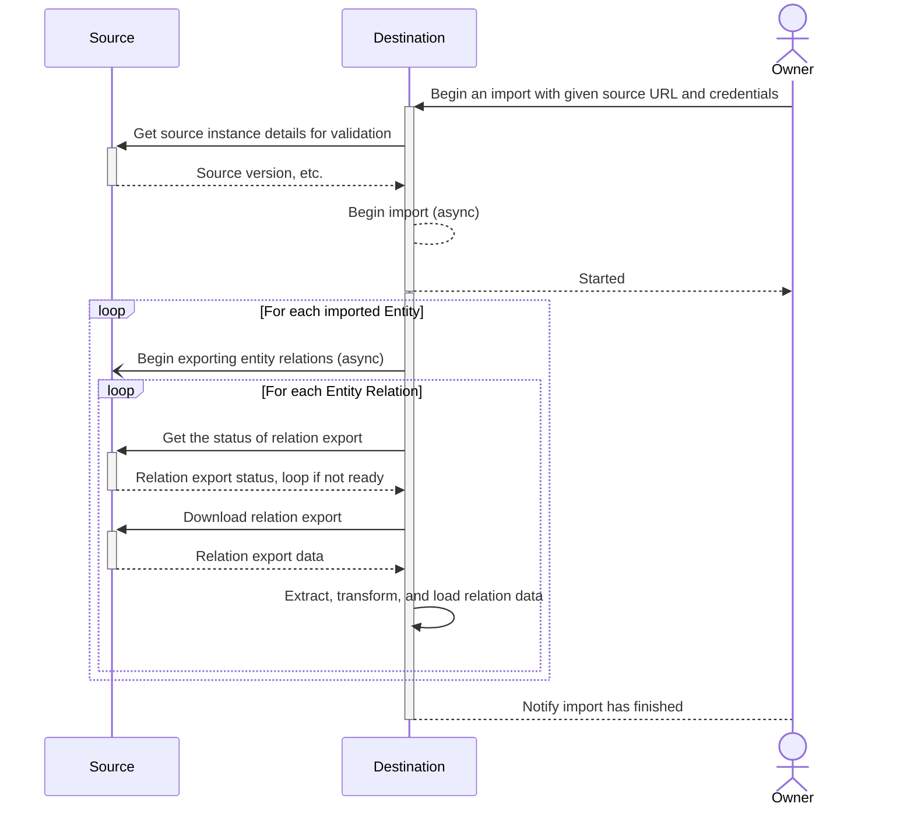
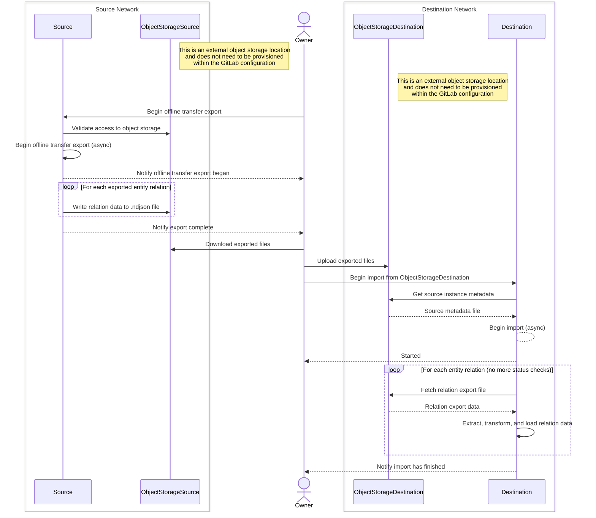
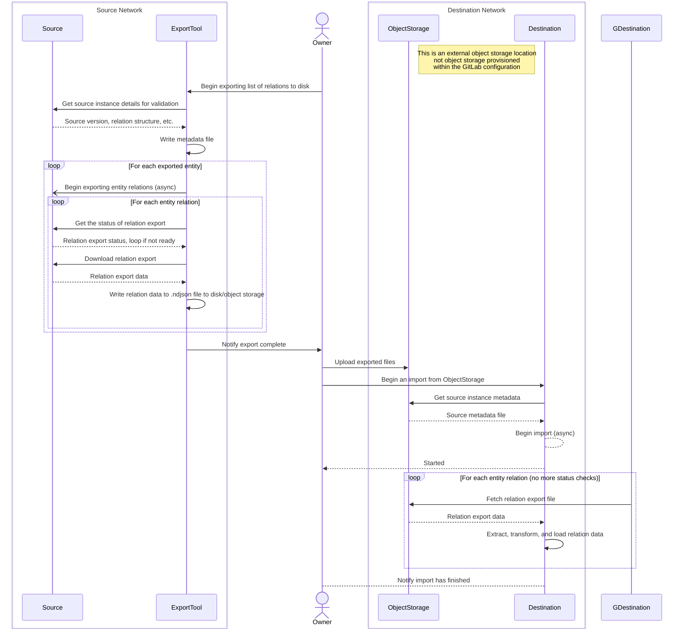
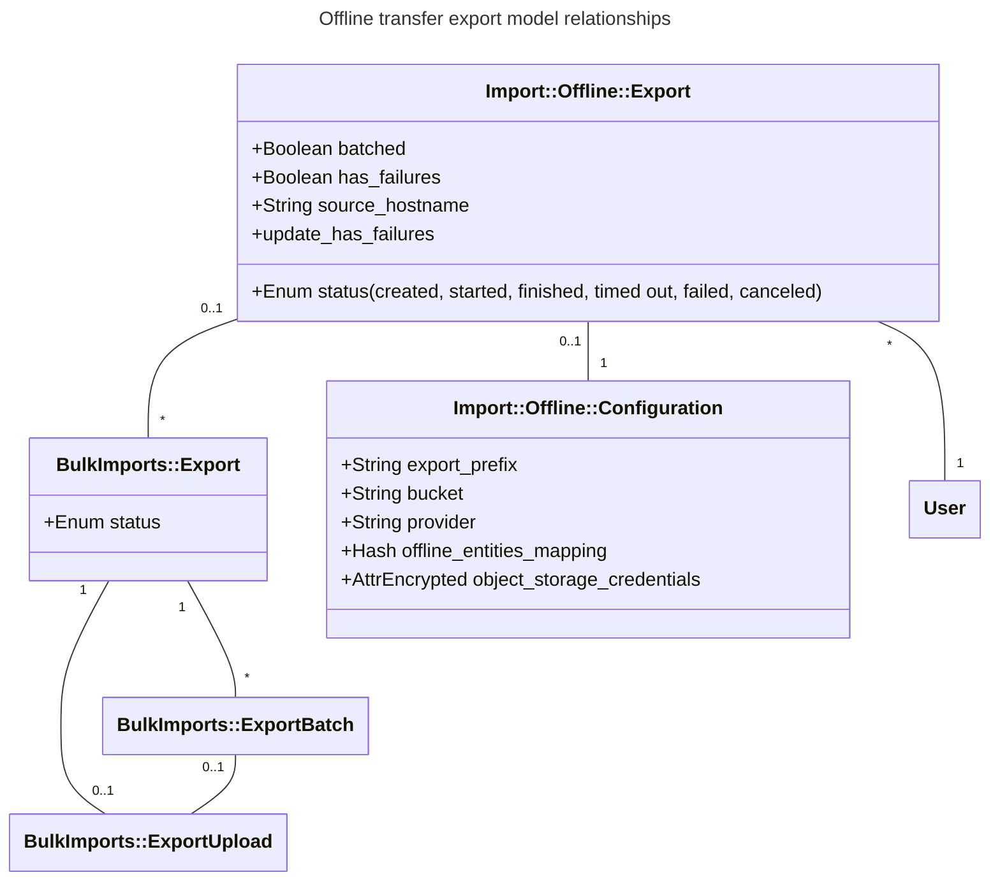

---
# This is the title of your design document. Keep it short, simple, and descriptive. A
# good title can help communicate what the design document is and should be considered
# as part of any review.
title: Offline Transfer
status: proposed
creation-date: "2025-02-26"
authors: [ "@SamWord" ]
coaches: []
dris: [ "@SamWord" ]
owning-stage: "~devops::create"
participating-stages: []
# Hides this page in the left sidebar. Recommended so we don't pollute it.
toc_hide: true
---

<!-- Design Documents often contain forward-looking statements -->
<!-- vale gitlab.FutureTense = NO -->

<!-- This renders the design document header on the detail page, so don't remove it-->


<!--
Don't add a h1 headline. It'll be added automatically from the title front matter attribute.

For long pages, consider creating a table of contents.
-->

## Summary

This blueprint describes changes to direct transfer to build a new tool, offline transfer, which will allow data to be exported from one GitLab instance and imported to another without a network connection between them.

Currently, direct transfer requires a network connection between the source and destination GitLab instances throughout the migration process. This change would allow GitLab data to be exported on an isolated GitLab instance and manually moved and imported into a destination instance, regardless of the network policies on either end. This change also maintains the functionality and efficiency of direct transfer migrations for those who can take advantage of it.

## Current Status

Due to a team reorganization in 18.1, priorities for the Import group have shifted away from this feature for the time being. However, there has been significant collaboration on the topic so far that have spun off several issues to refine this proposal further:

- Determining offline transfer export architecture within the GitLab project: https://gitlab.com/gitlab-org/gitlab/-/issues/536631
- Determining how to implement user contribution mapping in offline transfer: https://gitlab.com/gitlab-org/gitlab/-/issues/545824

See the merge request that implemented this proposal for all discussions before the shift in team priorities for full context on where this proposal left off: https://gitlab.com/gitlab-com/content-sites/handbook/-/merge_requests/12056.

Once these topics have been addressed in the proposal, if accepted, the issues representing the work needed to implement this proposal can be finalized. Issues that have already been made have the label `~"offline transfer:import"` or `~"offline transfer:export"`.

## Glossary of terms

In the past, we've had confusion over terms used within our importers. Here's a glossary of terms to help clear up what some terms mean:

- **Air-gapped network**: A network isolated from the public internet. See [offline GitLab docs](https://docs.gitlab.com/topics/offline/) for more information. For the purposes of offline transfers, we should assume that both the source and destination instances are 100% air-gapped and no connection between the source and destination instances can be established. However, customers don't need to be on an air-gapped network to use this feature.
- **Destination:** The instance where group or project data is imported.
- **Entity:** A group or project. An entity has many relations, such as milestones, labels, issues, merge requests, etc.
- **Entity prefix**: A replacement string for an entity path to avoid extremely long file keys in object storage.
- **Offline transfer**: The name of the proposed feature. It is a migration between GitLab instances where the destination instance is unable to make HTTP requests to the source to perform a regular direct transfer.
- **Relation:** A resource, generally a model, that belongs to an entity. Relations include things like milestones, labels, issues, merge requests. A relation can also be a self relation (attributes on the entity itself), or more abstract concepts such as user contributions.
- **Source**: The source instance where Group or Project data is exported from.

## Motivation

Customers with no network connectivity between their GitLab instances or with strict network policies are unable to use direct transfer. These customers must use file-based import/export to manually export and import each group separately. It's a tedious process and [file-based group transfer is deprecated](https://docs.gitlab.com/user/project/settings/import_export/#migrate-groups-by-uploading-an-export-file-deprecated).

### Goals

This feature should enable customers with the following restrictions to do convenient, semi-automated migrations:

- Outside access to or from their network is disallowed
- Cannot quickly and easily get an IP added to their firewall system
- Have strict restrictions on what lives on the external machines that can connect to their networks (must have this specific VPN, antivirus, etc)

#### Additional Requirements

- Users should be able to use direct transfer API to export groups and projects into an object storage location and to import groups and projects from an object storage location. This should be available first, before UI.
- Users should be able to use UI to choose groups and projects they want to migrate. That means direct transfer should support migration of many groups and projects at the time.
  - It should be possible to transfer subgroups and projects.
- The process cannot be fully automated, but it should be straightforward and convenient.
- Customers with most strict security requirements ("data cannot leave our network") need to be supported.
- Support optional encryption.
- Support offline transfers for customers who are unable to use third party object storage due to organization data policies, etc.

### Non-Goals

- Continuous syncs: direct transfer should support one-off migrations, but not syncing the diffs as the source changes. This is another opportunity requested by customers, but not the focus of this architecture. This work should not prevent it, but this capability is out of scope.
- Backup/restore: although offline transfer creates what could be considered "export" files, this is not a data backup solution or any other form of disaster recovery.

### Nice-to-haves

- Workarounds for older instances: Older versions of GitLab will not be supported, but workarounds may be possible. See [Compatible GitLab versions](#compatible-gitlab-versions) for more details. As with all changes to direct transfer, older versions should be considered when possible.
- Supporting an importer platform: This is not a requirement, but something that has been floated as an idea. Now that the importing side of direct transfer needs to support previously exported data, this is an opportunity to allow imports from any source, as long as the exported data fits a particular data schema. It would be ideal to open up this opportunity based on this proposal, but not a requirement the complexity is significantly increased compared to a simpler option.

## Proposal

With an offline transfer, the export and import sides of direct transfer will be separated into two sequential steps: export entities to files, then import those files into another instance. The user can manually move the files to an external object storage provider if the source is unable to upload them directly on export. Offline transfers won't be able to benefit from the same efficiency as online migrations that concurrently import and export entities, but it will allow them to be possible.

Building offline transfer based on direct transfer architecture will provide more value to users than relying on
[migrations using file exports](https://docs.gitlab.com/user/project/settings/import_export/) because file-based group import and export:

- Is deprecated and does not support migrating as many group items as direct transfer.
- Does not support bulk migrations for multiple groups and projects at once and transferring large groups or projects does not scale well. Adapting
  direct transfer architecture will provide improved scalability, reliability, and migrate more data for a smoother migration experience.
- Does not support [user contribution mapping](https://docs.gitlab.com/development/user_contribution_mapping/) using placeholder users, which provides
  enhanced security and requires no user management before migrating.

**Note:** The model names, class names, file names, and bounded contexts specified in this document might be changed during implementation. However, the implementation should strive to use the `Import` bounded context and maintain consistency in naming conventions. Because offline transfer is quite similar to direct transfer, the implementation should also follow naming patterns already used in direct transfer when possible.

### Proposed user flow

1. The user on the source instance calls an offline transfer export API endpoint to export groups and projects to an object storage location.
1. Groups and projects begin exporting to the provided object storage location. The user can check on the status of the export using another API endpoint.
1. The user is notified by email that the export has completed.
1. If the object storage location is not accessible by the destination instance, the user moves the export files over to another object storage location accessible to the destination. This step cannot be automated by offline transfer and may require manual data transfer by the user in accordance with their organization's data security policies.
1. On the destination, the user begins an offline transfer import via an API endpoint by providing the accessible object storage configuration and credentials. They also provide a list of paths to entities on the source and a destination name and namespace, exactly the same as starting a direct transfer via the API. All entity relation files for the entities passed in the API parameters must exist in the provided object storage bucket, and their full source paths must be mapped in the metadata file before the import begins. However, not all entities in the bucket need to be imported. Users using disk storage will need an alternative method of making the export data available locally to each Sidekiq node (likely network storage), which is still to be determined in the API call to refer to local disk for exported files.
1. The bulk import will begin to process using the object storage bucket in place of a connection to the source instance. The the remaining user flow will be the same as an online direct transfer migration.

**Note:** We have not yet defined the flow for users who cannot use external object storage providers. For the first iteration, the focus will be on implementing import into and out of an AWS S3-compatible object storage bucket. See [Storage providers](#storage-providers) for more information.

#### Current direct transfer process

This diagram vastly simplifies direct transfer, however it shows how frequently the source and destination instances communicate via network requests. Not all entities download relation files, some make GraphQL queries or REST requests to the source instead. Entities and their relations can be processed concurrently within each stage with online migrations ([group stages](https://gitlab.com/gitlab-org/gitlab/-/blob/master/lib/bulk_imports/groups/stage.rb), [project stages](https://gitlab.com/gitlab-org/gitlab/-/blob/master/lib/bulk_imports/projects/stage.rb)).



#### Proposed offline transfer process

This is similarly simplified, but it demonstrates how the export and import processes are now split and no requests to either instance need to be made. If both the source and destination have access to the same object storage, the user does not need to manually move export data to another object storage location. However, offline transfer is not currently intended to parallelize the export and import process even when exporting and importing from the same location.



### Compatible GitLab versions

**Minimum destination version**

The earliest GitLab version where offline transfer imports are supported.

**Minimum source version**

The earliest GitLab version where offline transfer exports are supported. Compatibility with earlier versions may be accomplished through the use of an export tool, such as [Congregate](https://gitlab-org.gitlab.io/professional-services-automation/tools/migration/congregate/project_readme/) or an external script, but will not be officially supported by the Import team.

While out of scope of this architecture, it's possible that Congregate can be updated to act as an export orchestrator for earlier versions of GitLab, replacing the role of API calls from the destination instance. A potential flow using Congregate or other export tool to orchestrate offline exports would look something like this:



## Design and implementation details

### New Import Architecture

#### Offline API design

Once data has been exported from the source instance, the user will be able to input the credentials of the object storage instance that contains their exported data.

- Create a new file download service for bulk imports similar to `BulkImports::FileDownloadService` that downloads from S3 configuration. Validations such as file size, type, etc. on remote file can be done in this service. These services abstract the work to fetch relation files away from the pipelines themselves.
- When the user begins an offline import on the destination, they query a new API endpoint to begin an offline export with the following params:

  ```ruby
  # These params may change depending on object storage implementation
  requires :configuration, type: Hash, desc: 'Object storage configuration' do
    requires :access_key_id, type: String, desc: 'Object storage access key ID'
    requires :secret_access_key, type: String, desc: 'Object storage secret access key'
    requires :bucket_name, type: String, desc: 'Object storage bucket name where all files are stored'
  end
  requires :entities, type: Array, desc: 'List of entities to import' do
    requires :source_type,
    type: String,
    desc: 'Source entity type',
    values: %w[group_entity project_entity]
    requires :source_full_path,
    type: String,
    desc: 'Relative path of the source entity to import'
    requires :destination_namespace,
    type: String,
    desc: 'Destination namespace for the entity'
    optional :destination_slug,
    type: String,
    desc: 'Destination slug for the entity'
    optional :migrate_projects,
    type: Boolean,
    default: true,
    desc: 'Indicates group migration should include nested projects'
    optional :migrate_memberships,
    type: Boolean,
    default: true,
    desc: 'The option to migrate memberships or not'
  end
  ```

The main difference between this new API is this endpoint accepts params for an object storage storage bucket instead of source instance configuration. It may also call a new service to handle creating the `BulkImport` record for offline imports if it's substantially different from `BulkImports::CreateService`.

#### Import metadata file structure

**WIP: Do not rely on this specification for development until it's finalized**

Offline transfers will need a metadata file to map entity source paths to file keys in object storage. Since object storage is always a flat structure, and disk storage is always a nested structure, opting for a flat object storage with information on how to link entities seems best.

The metadata file holds the following information:

- `instance_version`: Version of the source instance.
- `instance_enterprise`: Whether or not the source instance was enterprise edition.
- `export_prefix`: Prefix for all files included in the current export. This allows multiple exports of the same entities to exist in object storage at the same time.
- `source_hostname`: Source hostname specified by the user.
- `batched`: Whether or not relations were exported in batches. In the current architecture, either all relations are exported in batches or none is exported. There is no way to batch some relations but not others.
- `entities_mapping`: Hash of entity full paths as keys to its object storage entity prefix. This shortens full paths into a short key to avoid excessively long object storage keys. It has no effect on the order that entities are imported or on the hierarchy of the entities. Entity prefixes are the entity type and its ID (for example, `project_52` or `group_28`).

Example metadata file:

```json
{
  "instance_version":"17.0.0",
  "instance_enterprise":true,
  "export_prefix":"export_2025-09-18_1hrwkrv",
  "source_hostname":"https://offline-environment-gitlab.example.com",
  "batched":true,
  "entities_mapping":
  {
    "top_level_group":"group_1",
    "top_level_group/group":"group_2",
    "top_level_group/group/first_project":"project_1",
    "top_level_group/group/second_project":"project_2",
    "top_level_group/another_group":"group_3"
  }
}
```

File keys in object storage follow the format `#{export_prefix}/#{entity_prefix}/#{relation_name}.ndjson`. Relation names are defined in each `group/import_export.yml` and `project/import_export.yml`. Archive file relations and batched relations include their `.tar.gz` files and batch files in a relation folder. For example:

- `group_1-self.json` - `self` relations are exported as JSON files
- `group_1-milestones.ndjson` - an example of a non-batched tree relation export
- `project_1-issues/batch_1.ndjson` - an example of a batch of s tree relation export
- `project_1-repository.tar.gz` - an example of a non-batched, non-tree relation export
- `project_1-uploads/batch_1.tar.gz` - an example of a batched, non-tree relation export

#### Importing user contributions in offline transfer vs direct transfer

The `user_contributions` relation export file was implemented in direct transfer, but was never fully used in the import process in direct transfer. This file will be necessary in offline transfer because no API calls can be made to the source instance to fetch missing source user attributes. This means fetching user contribution data will be notably different between direct transfer and offline transfer:

- The `user_contributions` relation can be skipped entirely for direct transfer exports.
- A new pipeline for `user_contributions` will need to be implemented for offline transfer and must only run in offline transfer imports.
- `SourceUsersAttributesWorker` does not need to be enqueued at all for offline exports unless source users are created before importing from `user_contributions.ndjson`. In that case, the worker must run a new service that references `user_contributions.ndjson` instead of making API calls to the source.

### Export Architecture

#### Current export limitations

In direct transfer, the destination instance periodically queries the status of exporting relations. There's no export-side process to determine when relation exports are done and ready to be transferred to an object storage location accessible to the destination instance. New models will need to be made within GitLab so that export progress can be tracked, the user can be notified when the export is complete, and export errors can be better tracked.

#### New offline transfer models and relationships

We will introduce two new models:

- `Import::Offline::Export`
- `Import::Offline::Configuration`

`Import::Offline::Export` connects all related `BulkImports::Export` records and determines an overall export status. `Import::Offline::Export` would also serve as a source of truth for compiling export metadata to be written to `metadata.json`.

`Import::Offline::Configuration` stores object storage credentials and a hash of mappings to tie `source_full_path` to `object_storage_file_prefix`. These mappings are stored in a metadata file.

`BulkImports::Export` and `BulkImports::ExportBatch` will continue to be used for offline exports, but `BulkImports::ExportUpload` records will not be created. Instead, compressed export files will be uploaded directly to the object storage location configured in `Import::Offline::Configuration`.



#### Backend export process

The process for exporting relations will be nearly identical to the export process in direct transfer. However, a new worker on the source instance will orchestrate exporting entities instead of the destination instance:

1. The user calls an API endpoint with object storage credentials, configuration, and a list of entities to export.
1. The API endpoint executes a new service, `Import::Offline::Export::CreateService`, to create `Import::Offline::Export`.
1. `Import::Offline::Export::CreateService` validates the configuration, the user's permissions for the entities, and access to the object storage provider. If any are invalid, an error is returned to the user.
1. When validations pass, `Import::Offline::Export::CreateService` creates a new `Import::Offline::Export`. It begins the export using a new async worker, `Import::Offline::ExportWorker`, and returns a success message to the user. This new worker will function similarly to `BulkImportWorker`.
1. `Import::Offline::ExportWorker` executes a new service, `Import::Offline::Export::ProcessService`, which executes `BulkImports::ExportService` for each entity provided. This worker re-enqueues itself on a delay while exports are still processing.
1. `BulkImports::Export` is created and exported like in direct transfer. However, export files are written to the configured object storage instead of creating `BulkImports::ExportUpload` objects.
1. When the exports are complete, `Import::Offline::Export::ProcessService` writes `metadata.json` based on `Import::Offline::Export` attributes, its `BulkImports::Export`, instance metadata, and `Import::Offline::Configuration`. A new service might be the best approach for writing `metadata.json` files.
1. `Import::Offline::Export::ProcessService` sets the status of `Import::Offline::Export` to `complete` and sends a notification email to the exporting user.

The offline export process supports canceling and stopping exports that have unexpectedly failed or timed out. Direct transfer has established patterns for these actions, which should be followed for consistency when possible:

- When a user cancels an offline transfer export, no new relation exports should begin.
- Similar to `BulkImport` records, `Import::Offline::Export` records that have not been updated in over 24 hours are considered stale and are cleaned up. It might be possible to reuse the existing `BulkImports::StaleImportWorker` to clean up these records.
- A failing `BulkImport::Export` should not automatically fail the entire `Import::Offline::Export`. Instead, `has_failures` should be set to `true` on the `Import::Offline::Export` record. `Import::Offline::Export` is only considered `failed` when all exported relations fail.

#### Storage providers

Offline transfer will initially support AWS S3 as an upload target because:

- AWS S3 is well documented and widely adopted.
- Open-source self-hosted options like [MinIO](https://www.min.io/) are compatible with the same interface, enabling us to support them with minimal extra effort.
- GitLab's [object storage](https://docs.gitlab.com/administration/object_storage/) already supports AWS S3, so no additional libraries are required.

As we primarily use [Fog](https://github.com/fog/fog) to interact with object storage, which aims to provide a simple interface for multiple cloud providers, the overhead of supporting other providers like GCP or supporting local storage is reduced. Where Fog is not suitable, other clients can be used.

Details on how local storage will be implemented are still undefined.

### User Contribution Mapping

[User contribution and membership mapping](https://docs.gitlab.com/user/project/import/#user-contribution-and-membership-mapping) relies on a source hostname to map a real user to a placeholder user. In the current import process, a source hostname is the host of the import URL used to import groups and projects. Each importer must make repeated, successful API calls to the source host to complete the import. Offline transfer, however, never contacts the source instance directly, raising unique challenges for user contribution mapping that are not a concern in online transfers:

- The destination instance never contacts the source instance directly, making it impossible to determine where the export data originated from with certainty. Additionally, the data can be maliciously manipulated.
- One object storage location may have data from multiple hosts.
- An incorrect or vague hostname does not allow reassigned users to be confident in what contributions they may be accepting, opening an opportunity for abuse.
- Hostnames are required and cannot be blank for user contribution mapping. Users who do not want to expose the source hostname for security or privacy reasons must choose some alias for the hostname.

**Proposed solution:**

Given these challenges, exporting users must provide a source hostname when generating an offline transfer export. For convenience, it will be written to `metadata.json` so the importing user does not need to re-specify it. The export UI, when it comes time to implement it, must warn the user that this is the hostname users will see on the destination when accepting their placeholder user reassignments. Using a different hostname on subsequent imports will result in users having to accept placeholder reassignments a second time.

Additionally, the email to accept user contributions must be updated to display a warning that the source hostname was manually entered by a user and it should not be trusted. It should also explicitly tell the user that the import type was offline transfer. This way, a malicious user can't send a reassignment request to a user from offline transfer where the source hostname was manually set to a trusted domain like `https://github.com`.

**Potential user mapping enhancements:**

- Allow offline transfer migrations to set `source_hostname` as a plain string so that users who wish to not expose the source instance hostname can use any alias they wish.
- Ideally, individual users should be able to limit who can send them requests for reassignment (for example, specific users or owners of a trusted group) or to opt out entirely.
- For offline exports out of GitLab.com, set the hostname to `https://gitlab.com` and do not allow the user to edit it in the UI. A user can always edit the export files manually, but it could provide a bit of convenience and consistency for regular users.
- Implement a mechanism to verify ownership of a source hostname and prevent placeholder user reassignment from non-verified hosts. This may be impossible to implement.

## Iterations

**First release steps:**

- Define and document metadata and export file structures.
- Build components necessary to export groups and projects to object storage with API support to begin offline exports on the source.
- Convert data that is currently imported into the destination using API calls directly to the source instance into file exports so they will be supported by offline transfer.
- Begin work to update the import side according to file discovery and metadata definitions. Offline transfer imports can be developed in parallel with offline transfer exports, but caution must be taken to ensure consistency across relations.

**After first release iterations:**

- Build a UI in GitLab to export groups offline for a better user experience.
- Implement flexibility in export upload locations. In theory, it doesn't matter where we fetch export files from, as long as it's accessible to the destination instance and connection to the storage location is secure. Possible support could include:
  - Object storage providers other than AWS S3
  - Network storage (Self-Managed only)
  - Local disk storage (Self-Managed only)
