This design changes the current GitLab's login flow to introduce
multi-step approach that does support organization-specific login pages.

## Current Login Experience

### How Users Sign In Today

GitLab currently uses a traditional single-step (or two-step when 2FA was configured)
authentication process:


**Current Login Page:**

```text
┌─────────────────────────────────────┐
│        GitLab Sign In               │
│                                     │
│  [Username/Email Field]             │
│  [Password Field]                   │
│  [Sign in Button]                   │
│                                     │
│  OAuth Options:                     │
│  [Google] [GitHub] [Other IdPs]     │
│                                     │
│  [Remember me] [Forgot password?]   │
└─────────────────────────────────────┘
```

### Limitations of Current Approach

- Single authentication endpoint for all users
- The lack of support for Organizations on another Cells
- No organization-specific branding or policies
- Limited support for organization-specific authentication methods
- No routing based on user's organizational context

## New Multi-Step Authentication System

### Other's implementation

**Google's Authentication Flow:**

1. User enters email → System identifies workspace/domain → Workspace-specific authentication

**Slack's Authentication Flow:**  

1. User enters email → System identifies workspace → Workspace-specific authentication
2. Alternative: Direct workspace access via `company.slack.com`

**Microsoft's Authentication Flow:**

1. User enters email → System identifies tenant → Tenant-specific authentication

**New GitLab Multi-Step Flow:**

1. User enters email → Topology Service identifies organization → Organization-specific authentication
2. Alternatively: Direct organization login access via `gitlab.com/o/<org-path>/users/sign_in`
3. Retain: Username based login for global sign_in for backward compatibility via `gitlab.com/users/sign_in`

### Step 1: Email-Based User Identification


**New Multi-Step Page:**

```text
┌─────────────────────────────────────┐
│        Sign in to GitLab            │
│                                     │
│  [Email/Username Field]             │
│  [Continue Button]                  │
│                                     │
│  OAuth Options:                     │
│  [Google] [GitHub] [Other IdPs]     │
│                                     │
│  "Sign in with your organization"   │
└─────────────────────────────────────┘
```

**Backward Compatibility:**

- **Email input**: Routes to user's organization via Topology Service
- **Username input**: Continues to work for default organization users on legacy cell
- **Direct access**: Users can always access `o/<org-path>/users/sign_in` directly

### Step 2: Organization-Specific Authentication


**Organization Login Page:**

```text
┌─────────────────────────────────────┐
│     [Org Logo] Acme Corporation     │
│                                     │
│  user@acme.com (prefilled)          │
│                                     │
│  ✓ Sign in with SAML                │
│  ┌─────────────────────────────────┐│
│  │ [Continue with SAML]            ││
│  └─────────────────────────────────┘│
│                                     │
│  ✓ Password Authentication          │
│  ┌─────────────────────────────────┐│
│  │ [Password Field]                ││
│  │ [Sign in Button]                ││
│  └─────────────────────────────────┘│
│                                     │
│  [← Change email address]           │
└─────────────────────────────────────┘
```

## Email Uniqueness

### Core Principle

The system enforces that **each email address belongs to exactly one organization** across all GitLab instances and cells.

System will also enforce that the particular e-mail domain can belong only to one organization, user would not be able to register into another organization with the e-mail domain belonging to the organization.


## Alternative Access Methods

### Direct Organization Access

Users can bypass email identification by directly accessing:

- `o/<org-path>/users/sign_in` - Direct to organization login
- `o/<org-path>` - Organization page (redirects to login if private)

In such case the organization login page would only limit login
to that particular organization.

### Comparison with Industry Standards

| Product | Primary Access | Alternative Access | Custom Domains |
|---------|---------------|------------------|----------------|
| **Google** | Email-based | Direct workspace URL | mail.company.com |
| **Slack** | Email-based | company.slack.com | Custom domains |
| **Microsoft** | Email-based | Tenant URLs | Custom domains |
| **GitLab** | Email-based | `o/org-path/users/sign_in` | Future option |

### Future: Custom Alias Domains

Similar to Gmail's alias domains, organizations could configure `gitlab.company.com`.

It could route the `gitlab.company.com` to organization page (`gitlab.com/o/org-path`), where depending whether the organization is public or private
would show either organization dashboard or organization branded login page.

## Browser Path Workflows

### Workflow 1: Organization User with Email

```mermaid
graph TD
    A["🌐 User visits<br/>gitlab.com/users/sign_in"] --> B["📧 User enters email<br/>user@acme.com"]
    B --> C["🔄 Topology Service lookup"]
    C --> D["↩️ Browser redirects to<br/>gitlab.com/o/acme-corp/users/sign_in?login=user@acme.com"]
    D --> E["🏢 Organization login page loads<br/>with Acme Corp branding"]
    E --> F["🔐 User completes authentication"]
    F --> G["✅ Success → Dashboard"]
    
    style A fill:#fff3e0
    style D fill:#e8f5e8
    style G fill:#e1f5fe
```



### Workflow 2: Legacy User with Username

```mermaid
graph TD
    A["🌐 User visits<br/>gitlab.com/users/sign_in"] --> B["👤 User enters username<br/>john_doe"]
    B --> C["🔄 No Topology Service lookup<br/>(username detected)"]
    C --> D["📍 Stays on<br/>gitlab.com/users/sign_in"]
    D --> E["🔐 Legacy authentication flow<br/>on same page"]
    E --> F["✅ Success → Dashboard"]
    
    style A fill:#fff3e0
    style D fill:#ffebee
    style F fill:#e1f5fe
```



### Workflow 3: Direct Organization Access

```mermaid
graph TD
    A["🌐 User directly visits<br/>gitlab.com/o/acme-corp/users/sign_in"] --> B["🏢 Organization login page loads<br/>immediately"]
    B --> C["📧 User enters email<br/>(may be prefilled)"]
    C --> D["🔐 Organization authentication"]
    D --> E["✅ Success → Dashboard"]
    
    style A fill:#e8f5e8
    style B fill:#e8f5e8
    style E fill:#e1f5fe
```



### Workflow 4: Enterprise Domain Signup

```mermaid
graph TD
    A["🌐 User visits<br/>gitlab.com/users/sign_in"] --> B["📧 User enters new email<br/>newuser@acme.com"]
    B --> C["🔄 Topology Service lookup<br/>(user doesn't exist)"]
    C --> D["🏢 Domain matches enterprise org<br/>with signup enabled"]
    D --> E["↩️ Browser redirects to<br/>gitlab.com/o/acme-corp/users/sign_in?signup=newuser@acme.com"]
    E --> F["🆕 Enterprise signup page<br/>with IdP options"]
    F --> G["🔐 IdP authentication required"]
    G --> H["✅ Account created → Onboarding"]
    
    style A fill:#fff3e0
    style E fill:#e8f5e8
    style F fill:#fff3e0
    style H fill:#e1f5fe
```



### Workflow 5: Public vs Private Organization Access

#### Public Organization

```mermaid
graph TD
    A["🌐 User visits<br/>gitlab.com/o/acme-corp"] --> B["🏢 Public organization page<br/>shows immediately"]
    B --> C["🔗 User clicks 'Sign In'"]
    C --> D["↩️ Navigate to<br/>gitlab.com/o/acme-corp/users/sign_in"]
    D --> E["🔐 Organization authentication"]
    E --> F["✅ Success → Dashboard"]
    
    style A fill:#e8f5e8
    style B fill:#e8f5e8
    style F fill:#e1f5fe
```



#### Private Organization

```mermaid
graph TD
    A["🌐 User visits<br/>gitlab.com/o/acme-corp"] --> B["🔒 Access check<br/>(private organization)"]
    B --> C["↩️ Automatic redirect to<br/>gitlab.com/o/acme-corp/users/sign_in"]
    C --> D["🔐 Organization authentication"]
    D --> E["✅ Success → Private org page"]
    
    style A fill:#e8f5e8
    style C fill:#e8f5e8
    style E fill:#e1f5fe
```



## Authentication Scenarios

### URL Parameter Patterns

**Organization User Redirect:**

- From: `gitlab.com/users/sign_in`
- To: `gitlab.com/o/acme-corp/users/sign_in?login=user@acme.com`

**Enterprise Signup Redirect:**

- From: `gitlab.com/users/sign_in`
- To: `gitlab.com/o/acme-corp/users/sign_in?signup=newuser@acme.com`

**Private Organization Access:**

- From: `gitlab.com/o/acme-corp`
- To: `gitlab.com/o/acme-corp/users/sign_in`

### Scenario 1: SAML-Only Organization


**Browser Path:**

1. `gitlab.com/users/sign_in` → User enters email
2. `gitlab.com/o/org-path/users/sign_in?login=email` → Organization page
3. `idp.company.com/saml/sso` → SAML authentication
4. `gitlab.com/groups/my-group/-/saml/callback` → Return from SAML (existing callback maintained)
5. `gitlab.com/dashboard` → Success

Application would show button for all configured SAML applications in a Organization.

### Scenario 2: Multiple Authentication Methods


**Browser Paths:**

*SAML Path:*

1. `gitlab.com/users/sign_in` → User enters email
2. `gitlab.com/o/org-path/users/sign_in?login=email` → Organization page
3. `idp.company.com/saml/sso` → SAML authentication
4. `gitlab.com/groups/my-group/-/saml/callback` → Return (existing callback maintained)
5. `gitlab.com/dashboard` → Success

*Password Path (Multi-Step):*

1. `gitlab.com/users/sign_in` → User enters email
2. `gitlab.com/o/org-path/users/sign_in?login=email` → Organization page
3. `gitlab.com/o/org-path/users/sign_in` → Password entry
4. `gitlab.com/dashboard` → Success

*Password Path with 2FA (Additional Step):*

1. `gitlab.com/users/sign_in` → User enters email
2. `gitlab.com/o/org-path/users/sign_in?login=email` → Organization page
3. `gitlab.com/o/org-path/users/sign_in` → Password entry
4. `gitlab.com/o/org-path/users/sign_in` → 2FA challenge (separate screen)
5. `gitlab.com/dashboard` → Success

### Scenario 3: Enterprise Domain Signup


**Browser Path for Enterprise Signup:**

1. `gitlab.com/users/sign_in` → User enters new email
2. `gitlab.com/o/org-path/users/sign_up?login=newemail@company.com` → Signup page
3. `idp.company.com/oauth/authorize` → IdP authentication
4. `gitlab.com/oauth/callback` → Account creation (existing callback maintained)
5. `gitlab.com/o/org-path` → Organization onboarding
6. `gitlab.com/dashboard` → Success

**Browser Path for Existing User:**

1. `gitlab.com/users/sign_in` → User enters existing email
2. `gitlab.com/o/org-path/users/sign_in?login=user@company.com` → Regular login
3. Continue with normal authentication flow

## Callback Path Backward Compatibility

### OAuth Callbacks

**Current Behavior:** OAuth callbacks use existing paths like `gitlab.com/oauth/callback`

**Future State:** This design maintains existing OAuth callback paths to avoid breaking changes. Users will be routed appropriately after callback processing based on their organization membership.

### SAML Applications

**Current Behavior:** SAML callbacks use group-scoped paths like `gitlab.com/groups/my-group/-/saml/callback`

**Backward Compatibility:** Existing SAML callback paths will continue to work exactly as they do today.

**Future Enhancement:** The system will scope callbacks to their appropriate context:

- Group-level SAML: `gitlab.com/groups/my-group/-/saml/callback` (unchanged)
- Organization-level SAML: `gitlab.com/o/org-path/-/saml/callback` (future enhancement)

This ensures that callbacks remain contextually appropriate to where the SAML configuration was defined, while maintaining full backward compatibility with existing integrations.

Application would show button for all configured SAML applications in a Organization:

- Organization-scoped SAML application if configured.
- Organization having many top-level groups, with multiple SAML applications.

## Technical Implementation

- **Legacy Cell serves**: Initial `/users/sign_in` page
- **Rails integration**: Legacy Cell calls Topology Service
- **Seamless routing**: Users don't see which cell serves initial page
- **Username backward compatibility**: Username input continues to work for default organization users on legacy cell
- **Organization access**: Users always have access to `o/<org-path>/users/sign_in` for direct organization login
- **Callback preservation**: All existing OAuth and SAML callback paths remain unchanged

## Benefits

### User Experience

- **Familiar Pattern**: Matches Google, Slack, Microsoft multi-step workflows
- **Organization Branding**: Branded login experience
- **Flexible Authentication**: Organization-specific auth methods

### Technical Benefits

- **Clean Architecture**: Clear separation between organizations
- **Scalable Design**: Supports distributed cell architecture
- **Stateless Routing**: Simple, reliable user classification
- **No Breaking Changes**: Maintains existing callback paths and integrations

### Security Benefits

- **Deterministic Routing**: No authentication ambiguity
- **Secure Defaults**: Organization-specific security policies
- **Clean Token Management**: No complex cross-cell token sharing (eg. CSRF)
- **Scoped Callbacks**: Future callback scoping aligns with configuration context

## Additional Notes and Remarks

### Authentication Method Coverage

- **2FA Definition**: Throughout this document, "2FA" includes various methods such as TOTP, hardware keys, passkeys, and other multi-factor authentication options
- **OAuth Flows**: OAuth authentication flows are out of scope for this document and will be defined at later point

### Technical Considerations

- **Callback Paths**: All existing OAuth and SAML callback paths are preserved to maintain backward compatibility
- **User Experience**: 2FA challenges appear as separate screens after successful password authentication
- **Organization Routing**: The Topology Service provides deterministic routing based on email or domain mapping

### Future enhancements

- Define behavior when GitLab is used as SP in OAuth flows
- Define behavior when GitLab is used as IdP in OAuth flows
- Validate behavior of SAML
