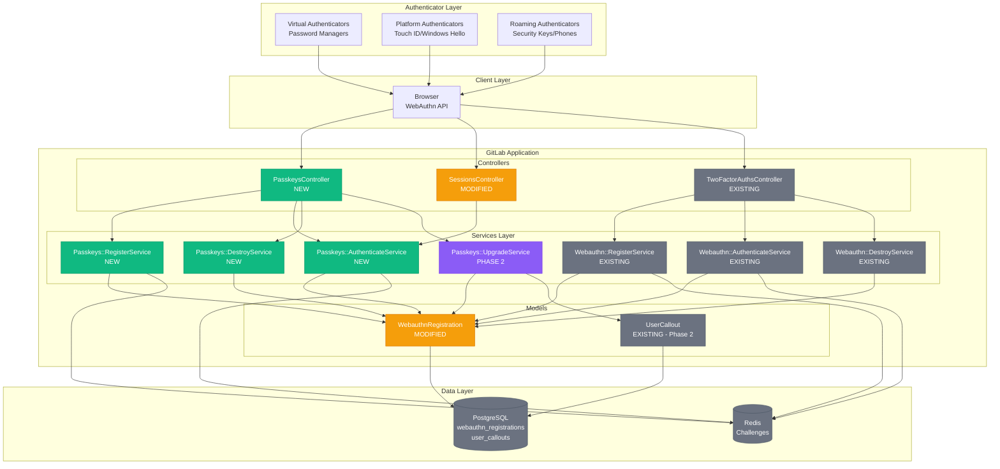
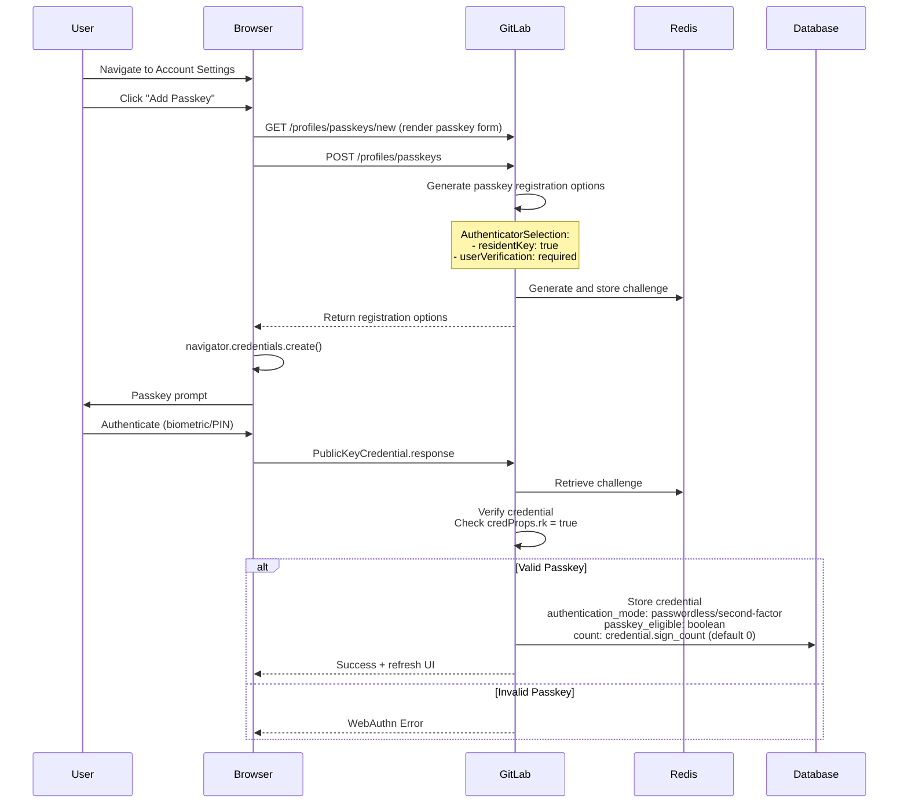
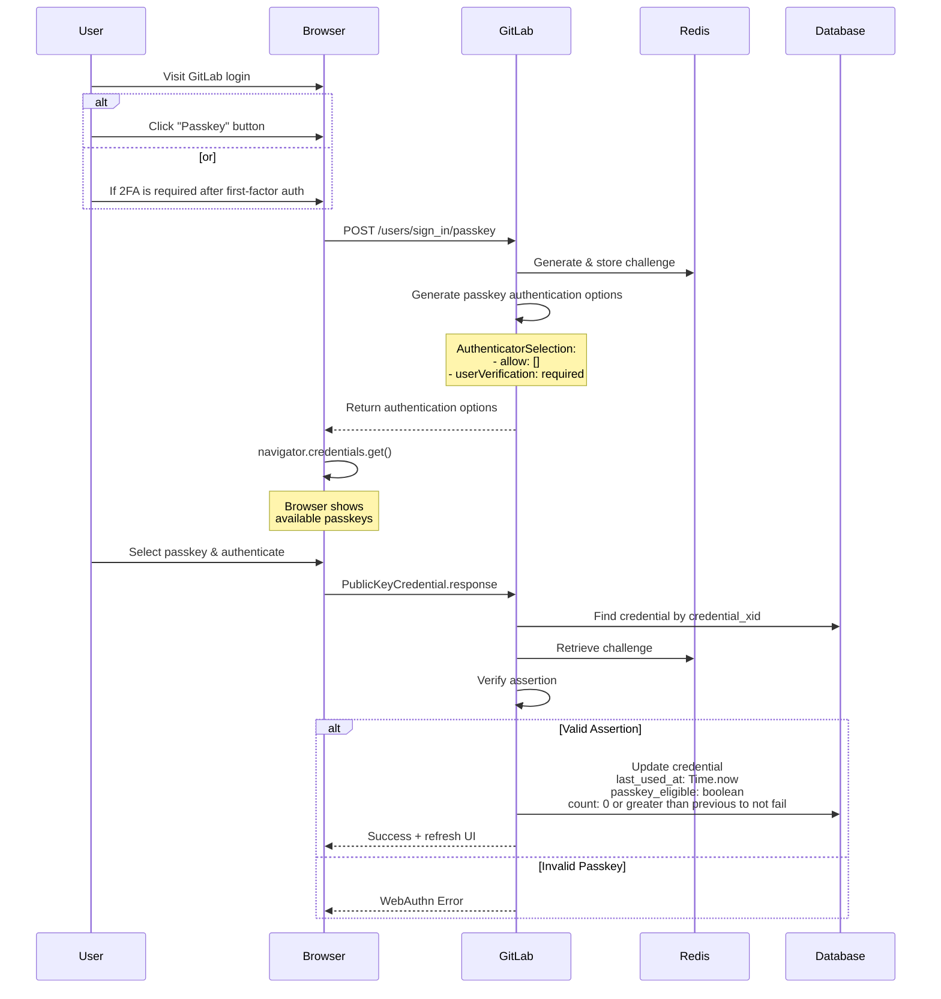

## Table of Contents

- [Summary](#summary)
- [Motivation](#motivation)
  - [Goals](#goals)
    - [Phase 1](#phase-1)
    - [Phase 2](#phase-2)
  - [Non-Goals](#non-goals)
- [Proposal](#proposal)
  - [Technical Foundation](#technical-foundation)
  - [Implementation Details](#implementation-details)
- [Design and Implementation Details](#design-and-implementation-details)
  - [Key Design Decisions](#key-design-decisions)
  - [UX Designs](#ux-designs)
  - [Architectural Diagram](#architectural-diagram)
  - [Sequence Diagrams](#sequence-diagrams)
    - [Add Passkey Flow](#add-passkey-flow)
    - [Passwordless Authentication Flow](#passwordless-authentication-flow)
  - [Development](#development)
    - [Database](#database)
    - [Passkey Heroes](#passkey-heroes)
    - [Upgrading Eligible Devices To Passkeys](#upgrading-eligible-webauthn-devices-to-passkeys)
  - [Instrumentation](#instrumentation)
  - [Audit Events](#audit-events)
  - [Documentation](#documentation)
- [Application Security](#application-security)
- [Alternative Solutions](#alternative-solutions)
  - [Multi-table Implementation](#multi-table-implementation)
  - [Domain Binding](#domain-binding)

## Summary

This document proposes implementing [FIDO2/WebAuthn](https://fidoalliance.org/fido2/) compliant [passkey](https://developers.google.com/identity/passkeys) support to enable [passwordless authentication](https://auth0.com/docs/authenticate/passwordless) and be a [two-factor authentication](https://docs.gitlab.com/user/profile/account/two_factor_authentication/) alternative in GitLab. Passkeys provide a more secure and user-friendly replacement to username & passwords, by leveraging [cryptographic keys](https://en.wikipedia.org/wiki/Public-key_cryptography) stored on user [authenticators](https://www.w3.org/TR/webauthn-2/#authenticator).

The implementation extends our existing WebAuthn infrastructure, maintaining full backward compatibility with current 2FA implementations while enabling users to authenticate without passwords using [platform](https://www.w3.org/TR/webauthn-2/#platform-authenticators) (Touch ID, Windows Hello), [roaming](https://www.w3.org/TR/webauthn-2/#roaming-authenticators) (security keys), or [virtual authenticators](https://developers.google.com/identity/passkeys/supported-environments#virtual-authenticators) (password managers).

## Motivation

The authentication landscape is evolving from traditional passwords toward more secure passwordless authentication using passkeys. This shift is being accelerated by [widespread early adoption across the DevSecOps industry](https://www.passkeys.io/who-supports-passkeys). Passkeys offer phishing-resistant sign-in while protecting users from weak password vulnerabilities and [credential breaches](https://cybernews.com/security/billions-credentials-exposed-infostealers-data-leak). Given our existing compatible infrastructure, adopting passkeys is a logical next step.

### Goals

#### Phase 1

- Enable passwordless authentication using passkeys
- Support passkeys as an enhanced 2FA option
- Make passkeys the default 2FA method once a user has at least [one Gitlab 2FA method](https://docs.gitlab.com/user/profile/account/two_factor_authentication/#enable-two-factor-authentication) enabled
- Maintain full backward compatibility with existing WebAuthn 2FA credentials
- Support passkey email notifications
- Instrument usage adoption of passkeys
- Gated behind a feature flag for a controlled rollout plan
- Thorough documentation to educate the user base to prepare for Mandatory MFA

#### Phase 2

- Implement `Add` and `Upgrade` passkey heroes
- Support `upgrading` a webauthn device to a passkey
- Support WebAuthn authenticator attestation to obtain authenticator names for UX ([mds](https://fidoalliance.org/metadata/) and [non-mds](https://github.com/passkeydeveloper/passkey-authenticator-aaguids/blob/main/aaguid.json) authenticators)
- Allow deletion of WebAuthn devices and/or passkeys in Gitlab to [also delete](https://developer.mozilla.org/en-US/docs/Web/API/PublicKeyCredential/signalUnknownCredential_static) its credential on the user's authenticator
- Add admin/top-level-group owner configuration settings for granular passkey authentication control
- Implement audit events
- Support multiple feature flags for each sub-feature (i.e. add & upgrade passkey heroes, upgrade webauthn device to passkey)

NB: This ADR will focus on Phase 1 goals

### Non-Goals

- Deprecate existing authentication methods (passwords/2FA remain available)
- Force passkeys first authentication adoption (remains optional)
- Modify existing WebAuthn 2FA user experience (passkeys only add onto it)

## Proposal

Extend the existing `webauthn_registrations` table to support passkeys while maintaining clear separation between 2FA and passkey usage through an `authentication_mode` field. This approach minimizes risk by leveraging existing infrastructure while providing a clear upgrade path.

### Technical Foundation

- Continue with the usage of the [webauthn-ruby](https://github.com/cedarcode/webauthn-ruby) gem
- Use [W3C WebAuthn Level 2](https://www.w3.org/TR/webauthn-2/) as the central source of truth for any passkeys and WebAuthn API related documentation
  - This will change after the full release of [W3C WebAuthn Level 3](https://www.w3.org/TR/webauthn-3/) with more passkey support
- Build upon this [POC](https://gitlab.com/gitlab-org/gitlab/-/merge_requests/202701) with reference to these community contributions [[1](https://gitlab.com/gitlab-org/gitlab/-/merge_requests/135324), [2](https://gitlab.com/gitlab-org/gitlab/-/merge_requests/169365)]
- Follow this [UX](https://www.figma.com/design/h8xsQafKqKr205RSsJU5Wk/Passkeys) document as the central source of truth for any passkeys related UX designs

### Implementation Details

All phased work will be managed and tracked via this [epic](https://gitlab.com/groups/gitlab-org/-/epics/10897), with its implementation being handled across multiple milestones. See the sub-epics below for the full-stack and cross team breakdown:

- [Phase 1](https://gitlab.com/groups/gitlab-org/-/epics/18185)
- [Phase 2](https://gitlab.com/groups/gitlab-org/-/epics/18887)

**Pros:**

- Leverages existing WebAuthn infrastructure and database schema, minimizing risk
- Clear upgrade path for users with existing 2FA devices
- POCs provide proven implementation patterns
- Single source of auth devices simplifies user mental model

**Cons:**

- The webauthn_registrations serves dual purpose (2FA & passkeys), which could complicate future queries and cause performance issues
- Requires careful data modeling to prevent authentication type confusion
- Migrations of existing records needs careful consideration

## Design and implementation details

### Key Design Decisions

**Single Table Approach**

- Reuse webauthn_registrations table to avoid data duplication
- Add a `passkey_eligible` column to store a boolean for passkey eligibility
- Add an `:authentication_mode` column to store an enumerable attribute to differenciate between passkeys (passwordless) and all other webauthn credentials (second-factor)

**Backward Compatibility**

- Gated behind feature flags
- Default `authentication_mode: 'second_factor'` maintains existing 2FA behavior
- No breaking changes to existing queries

### UX Designs

Similar to the implementation details, the UX flows are segmented into phased work. See the designs [here](https://www.figma.com/design/h8xsQafKqKr205RSsJU5Wk/Passkeys).

### Architectural Diagram



### Sequence Diagrams

#### Add Passkey Flow



#### Passwordless Authentication Flow



### Development

#### Database

```sql
ALTER TABLE webauthn_registrations
ADD COLUMN authentication_mode integer DEFAULT 0 NOT NULL,
ADD COLUMN passkey_eligible boolean DEFAULT false NOT NULL,
ADD COLUMN last_used_at timestamp with time zone,
```

```ruby
enum :authentication_mode, %i[passwordless second_factor].index_with(&:to_s)
```

```ruby
Feature.enabled?(:passkeys)      
Feature.enabled?(:passkey_upgrade)             
Feature.enabled?(:passkey_add_hero)
Feature.enabled?(:passkey_upgrade_hero)
```

#### Passkey Heroes

Use [user_callouts](https://docs.gitlab.com/development/callouts/) to implement the following flow:

- Prompt passkey addition to account
- Skip it
- Ask again in 14 days
- Skip it
- Never ask again

#### Upgrading Eligible WebAuthn Devices To Passkeys

During the registration of a new WebAuthn device for 2FA, we would send a request to the WebAuthn API to retrieve the [credProps](https://developer.mozilla.org/en-US/docs/Web/API/Web_Authentication_API/WebAuthn_extensions#credprops) client extensions.

If it returns `credProps.rk == true`, it confirms that the user's credential is discoverable(passkey) and their authenticator is `passkey_eligible`.

This means that after phase 1's release, users will have to [re-register](https://www.w3.org/TR/webauthn-2/#sctn-authenticator-credential-properties-extension) their existing 2FA WebAuthn devices before we can suggest upgrading to passkeys.

The request options will be:

```ruby

def base_webauthn_request_params
  {
    user: { 
      id: current_user.webauthn_xid,
      name: current_user.username,
      displayName: current_user.name 
    },
    exclude: current_user.existing_webauthn_credentials,
    authenticator_selection: { 
      user_verification: 'discouraged',
      residentKey: 'preferred' # This will try to create a passkey if applicable, else non-discoverable (current default)
    },
    rp: { name: 'GitLab' },
    extensions: { credProps: true } # This will give us the credProps response hash to check if `rk: true` in the WebAuthn::RegistrationService
  }
end

```

The `WebAuthn::RegistrationService` will check `credProps.rk` and update `passkey_eligible` if needed.

Finally, when a user wants to upgrade their webauthn device to a passkey, the `WebAuthn::UpgradeService` will change `authentication_mode: second_factor` to `authentication_mode: passwordless` if `passkey_eligible: true`.

### Instrumentation

Instrument the adoption of passkeys with the following suggested metrics:

- Number of unique users who signed up for passkeys
- Number of unique users who authenticate with passkeys
- Number of unique users who upgraded to passkeys

### Audit Events

All passkey operations logged with context as audit-events.

### Documentation

Collaborate with UX, Technical Writing, and Product teams to create comprehensive documentation that educates users about the phased release. See this [issue](https://gitlab.com/gitlab-org/gitlab/-/issues/569727) for more details.

## Application Security

See https://gitlab.com/gitlab-org/gitlab/-/issues/532450.

## Alternative Solutions

### Multi-table Implementation

To account for future user growth and passkey adoption, we can create a separate passkeys table that belongs to each user. What we lose in duplication, we gain in scalable growth.

### Domain Binding

Although we currently use implicit domain binding with our WebAuthn implementation, there is an opportunity for us to restrict a list of domains per passkey under the control of a top-level-group owner (enterprise users verified domains) and self-managed administrator (self-hosted domains) with authenticator attestation data.
