

## Summary

Security Policies are currently managed through repository-based Security Policy Projects (SPPs), creating complexity and scalability challenges for organizations managing policies at scale. This design document outlines Security Policies v2, a database-first approach that transforms policy management from a distributed, repository-centric model to a centralized, database-driven architecture.

The initiative moves away from storing all policies in single YAML files managed through merge requests, to atomic policy management with proper RBAC permissions and intuitive UI-driven workflows. Policy templates can be created at both organization and top-level group levels (with subgroup support planned), with a clean separation between policy configuration (templates) and policy application (scope assignments).

This architectural evolution maintains the same powerful policy enforcement capabilities while dramatically simplifying the management experience, enabling organizations to scale their policy adoption while maintaining complete reversibility through a switchable v1/v2 model.

## Motivation

### Current Challenges with Policies v1

Organizations using GitLab Security Policies face significant management overhead as they scale their policy adoption:

- **Repository Fragmentation**: Multiple Security Policy Projects scattered across groups make it difficult to maintain consistency and visibility
- **Complex Workflow**: Every policy change requires merge request creation and approval, creating friction for security teams
- **Single File Bottleneck**: All policies stored in one YAML file per repository creates merge conflicts and parsing complexity
- **Permission Complexity**: Policy management rights are tied to repository access, making it difficult to implement proper separation of duties
- **Limited Visibility**: No central view of organization-wide policy enforcement and compliance status
- **Sync Complexity**: Complex logic required to detect policy changes in files and trigger appropriate database updates

These challenges become particularly acute for enterprise customers managing hundreds of projects across multiple groups.

### Goals

- **Centralized and Simplified Management**: Enable policy creation at organization and top-level group levels with organization-wide visibility and control
- **Separate RBAC Permissions**: Implement dedicated policy roles independent of GitLab repository hierarchy, enabling proper separation of duties
- **Better UX**: Replace MR-based workflows with direct UI editing that works like other GitLab settings
- **Simplified Processing Logic**: Move from complex file parsing to atomic policy updates with simple database change tracking
- **API-First Approach**: Provide REST API enabling programmatic policy management and future integrations
- **Reduce Current Friction**: Eliminate MR overhead for policy updates while maintaining audit trails and version control
- **Flexible Adoption Model**: Enable reversible switching between Policies v1 and v2 at organization level, allowing risk-free adoption
- **Scalable Architecture**: Prepare foundation to handle thousands of policies through background processing

### Non-Goals

- Changing the underlying policy enforcement engine or altering how policies are evaluated during CI/CD execution
- Modifying existing policy YAML schema, policy types, or their enforcement behavior
- Replacing group-level policy management capabilities - both organization and group-level management will coexist
- This initiative focuses solely on policy **management**, not policy **functionality** or **enforcement**

## Proposal

Transform Security Policies from a repository-centric model to a database-first architecture that separates policy configuration from policy application while maintaining enforcement consistency.

```mermaid
flowchart TB
    subgraph architecture["🏗️ High-Level Architecture"]
        subgraph users["👥 Users"]
            org_admin["Organization Admin<br/>📊 Central oversight"]
            policy_admin["Policy Admin<br/>📝 Template creation"]
            group_owner["Group Owner<br/>🎯 Local management"]
        end

        subgraph system["💾 Policies v2 System"]
            ui["🖥️ Policy Management UI<br/>Direct editing interface"]
            api["🔌 REST API<br/>Programmatic access"]
            db["🗄️ Database<br/>Policy templates & applications"]
            workers["⚙️ Background Workers<br/>Batch processing"]
        end

        subgraph integration["🔗 Integration Points"]
            enforcement["⚡ GitLab Policy Engine<br/>(Unchanged - same enforcement)"]
            projects["📁 Groups & Projects<br/>Policy application targets"]
            optional_repo["📂 Optional Repository<br/>Policy-as-code sync"]
        end
    end

    org_admin --> ui
    policy_admin --> ui
    group_owner --> ui

    ui --> api
    api --> db
    api --> workers
    workers --> db

    db --> enforcement
    enforcement --> projects
    optional_repo -.-> api
```



### Core Architecture Changes

**Policy Templates**: Reusable policy configurations created at organization or top-level group levels (with subgroup support planned for future), stored as individual database entities rather than bundled in single files.

**Policy Applications**: Separate scope-specific assignments that define where templates are applied, enabling the same template to be used across multiple groups or projects.

**Centralized Database Storage**: Single source of truth for all policy data, with optional repository sync for customers wanting policy-as-code workflows.

**Atomic Management**: Each policy managed as separate entity with individual change tracking, eliminating complex file parsing logic.

**Background Processing**: Asynchronous application of policies to large scopes with progress tracking and service-level objectives.

### User Experience Transformation

- **Organization Admins** gain central dashboard with complete visibility and can nominate Policy Admins
- **Policy Admins** create reusable templates and apply them across authorized scopes
- **Group Owners** can create group-scoped templates and apply available templates to their projects
- **Project Owners** can apply available templates to their projects but cannot create project-level templates
- **All Users** benefit from direct UI editing replacing merge request workflows

## Design and implementation details

### System Overview

The Policies v2 system transforms policy management from a distributed, repository-based approach to a centralized, database-first architecture while maintaining the same enforcement mechanisms.

### Architecture Evolution: v1 → v2

```mermaid
flowchart TB
    subgraph comparison["🔄 Architecture Evolution: Policies v1 → v2"]

        subgraph v1_side["❌ Policies v1 (Current - Repository-based)"]

            subgraph v1_management["Policy Management"]
                v1_user["👤 Policy Admin"]
                v1_spp1["📂 Security Policy Project A<br/>Group A policies (all in 1 file)"]
                v1_spp2["📂 Security Policy Project B<br/>Group B policies (all in 1 file)"]
                v1_spp3["📂 Security Policy Project C<br/>Group C policies (all in 1 file)"]
            end

            subgraph v1_challenges["Challenges"]
                v1_c1["🔴 Multiple repositories to manage"]
                v1_c2["🔴 All policies in single YAML file"]
                v1_c3["🔴 Complex project permissions"]
                v1_c4["🔴 All updates via MR workflow"]
                v1_c5["🔴 No central visibility"]
                v1_c6["🔴 Complex trigger logic for DB updates"]
            end

            subgraph v1_flow["Data Flow"]
                v1_user -->|"Creates MR"| v1_spp1
                v1_user -->|"Creates MR"| v1_spp2
                v1_user -->|"Creates MR"| v1_spp3
                v1_spp1 -->|"Complex sync logic"| v1_db["🗄️ Read Models<br/>(Single file parsing)"]
                v1_spp2 -->|"Complex sync logic"| v1_db
                v1_spp3 -->|"Complex sync logic"| v1_db
                v1_db --> v1_engine["⚡ Policy Engine"]
            end
        end

        subgraph v2_side["✅ Policies v2 (New - Database-first)"]

            subgraph v2_management["Policy Management"]
                v2_org_admin["👤 Organization Admin"]
                v2_policy_admin["👤 Policy Admin"]
                v2_group_owner["👤 Group Owner"]
                v2_ui["🖥️ Centralized Policy UI"]
                v2_api["🔌 REST API"]
            end

            subgraph v2_benefits["Benefits"]
                v2_b1["✅ Single point of management"]
                v2_b2["✅ One policy per file/entity"]
                v2_b3["✅ Proper RBAC permissions"]
                v2_b4["✅ Direct UI editing"]
                v2_b5["✅ Complete org visibility"]
                v2_b6["✅ Simple atomic updates"]
            end

            subgraph v2_flow["Data Flow"]
                v2_org_admin -->|"Direct editing"| v2_ui
                v2_policy_admin -->|"Direct editing"| v2_ui
                v2_group_owner -->|"Apply policies"| v2_ui
                v2_ui --> v2_api
                v2_api --> v2_db["🗄️ Policies Database<br/>(Single source of truth)"]
                v2_workers["⚙️ Background Workers<br/>(Batched processing)"]
                v2_api --> v2_workers
                v2_workers --> v2_db
                v2_db --> v2_engine["⚡ Policy Engine<br/>(Same as v1)"]

                v2_repo["📂 Optional Repository<br/>(Policy-as-code)"]
                v2_sync["🔄 Sync Service"]
                v2_repo -.->|"Simple cron sync"| v2_sync
                v2_sync -.-> v2_api
            end
        end
    end

    subgraph migration["🚀 Migration Path"]
        mig_tool["🔧 Data Transformation Service"]
        mig_audit["📊 Audit Trail"]

        v1_spp1 -->|"One-time conversion"| mig_tool
        v1_spp2 -->|"One-time conversion"| mig_tool
        v1_spp3 -->|"One-time conversion"| mig_tool
        mig_tool --> v2_db
        mig_tool --> mig_audit
    end

    subgraph scale_comparison["📈 Process Comparison"]
        subgraph v1_process["v1 Process Complexity"]
            v1_limit1["🔴 All changes require MR creation"]
            v1_limit2["🔴 Single file creates merge conflicts"]
            v1_limit3["🔴 Complex logic to detect policy changes"]
            v1_limit4["🔴 Repository permissions = policy permissions"]
        end

        subgraph v2_process["v2 Process Simplicity"]
            v2_scale1["✅ Direct UI editing like other settings"]
            v2_scale2["✅ Atomic policy management"]
            v2_scale3["✅ Simple change detection per policy"]
            v2_scale4["✅ Role-based policy permissions"]
        end
    end

    v1_side -.->|"EVOLUTION"| v2_side

    classDef v1_style fill:#ffebee,stroke:#c62828,stroke-width:2px
    classDef v2_style fill:#e8f5e8,stroke:#2e7d32,stroke-width:2px
    classDef migration_style fill:#e3f2fd,stroke:#1565c0,stroke-width:2px
    classDef challenge_style fill:#ffcdd2,stroke:#d32f2f,stroke-width:1px
    classDef benefit_style fill:#c8e6c9,stroke:#388e3c,stroke-width:1px

    class v1_spp1,v1_spp2,v1_spp3,v1_db,v1_engine v1_style
    class v2_ui,v2_api,v2_db,v2_workers,v2_engine v2_style
    class mig_tool,mig_audit migration_style
    class v1_c1,v1_c2,v1_c3,v1_c4,v1_c5,v1_c6,v1_limit1,v1_limit2,v1_limit3,v1_limit4 challenge_style
    class v2_b1,v2_b2,v2_b3,v2_b4,v2_b5,v2_b6,v2_scale1,v2_scale2,v2_scale3,v2_scale4 benefit_style
```



| Aspect | Policies v1 | Policies v2 |
|--------|-------------|-------------|
| **Data Storage** | Multiple repositories, single YAML files | Centralized database, atomic policies |
| **User Interface** | MR creation and approval | Direct UI editing |
| **Permissions** | Repository-based access | Dedicated RBAC roles |
| **Change Detection** | Complex file parsing logic | Simple database change tracking |
| **Scalability** | Limited by repository sync | Background processing with SLO |
| **Visibility** | Fragmented across repositories | Organization-wide dashboard |

### Policy Management Workflows

```mermaid
flowchart TD
    subgraph actors["👥 Actors & Permissions"]
        OA["👤 Organization Admin<br/>• Manages org policies<br/>• Nominates Policy Admins<br/>• Full visibility"]
        PA["👤 Policy Admin<br/>• Creates policy templates<br/>• Applies policies (with scope permissions)<br/>• Manages at org/group level"]
        GO["👤 Group/Project Owner<br/>• Can apply available policies<br/>• Only to owned scope<br/>• Cannot modify templates"]
        DEV["👤 Developer<br/>• Views applied policies<br/>• Sees audit logs<br/>• No policy management"]
    end

    subgraph lifecycle["🔄 Policy Lifecycle"]

        subgraph creation["📝 1. Policy Template Creation"]
            TC["Template Creation<br/>• Policy configuration<br/>• No scope defined<br/>• Validation & versioning"]
            TPM["Template Permission<br/>Management<br/>• Who can edit template<br/>• Audit trail"]
        end

        subgraph application["🎯 2. Policy Application"]
            SA["Scope Assignment<br/>• Select target groups/projects<br/>• Define auto-apply rules<br/>• Permission validation"]
            BA["Batch Application<br/>• Async processing<br/>• Progress tracking<br/>• SLO-based delivery"]
            PR["Policy References<br/>• Database relationships<br/>• Scope tracking"]
        end

        subgraph enforcement["⚡ 3. Policy Enforcement"]
            PE["Policy Engine<br/>• Same as v1 (unchanged)<br/>• Reads from database<br/>• Real-time enforcement"]
            PP["Project/Pipeline<br/>Execution<br/>• Policy evaluation<br/>• Enforcement decisions"]
        end
    end

    subgraph boundaries["🛡️ Permission Boundaries"]

        subgraph org_level["🏢 Organization Level"]
            OT["Organization Templates<br/>• Available to all groups<br/>• Managed by Org Admin<br/>• Can delegate to Policy Admins"]
        end

        subgraph group_level["👥 Group Level"]
            GT["Group Templates<br/>• Available within group<br/>• Managed by Group Policy Admin<br/>• Scoped to group hierarchy"]
        end

        subgraph project_level["📁 Project Level"]
            PA_PROJ["Applied Policies<br/>• Inherited or directly applied<br/>• Viewed by all members<br/>• Cannot be modified at project level"]
        end
    end

    subgraph storage["💾 Data Storage & Sync"]
        DB["🗄️ GitLab Database<br/>• Policy templates<br/>• Policy applications<br/>• Scope references<br/>• Audit logs"]
        REPO["📂 Optional Repository<br/>• Policy-as-code<br/>• One-way sync to DB<br/>• Cron job sync"]
        AUDIT["📊 Audit System<br/>• All policy changes<br/>• Permission changes<br/>• GitLab Audit Events"]
    end

    OA -->|"Creates org-level templates"| TC
    PA -->|"Creates org/group templates<br/>(with permission)"| TC
    TC --> TPM
    TPM --> DB

    PA -->|"Applies policies<br/>(scope permission required)"| SA
    GO -->|"Applies available policies<br/>(to owned scope only)"| SA
    SA --> BA
    BA --> PR
    PR --> DB

    DB -->|"Policy data"| PE
    PE --> PP
    PP -->|"Enforcement results"| AUDIT

    SA -.->|"Validates permissions"| boundaries

    REPO -.->|"Syncs YAML<br/>(cron job)"| TC

    TC --> AUDIT
    SA --> AUDIT
    TPM --> AUDIT

    org_level --> group_level
    group_level --> project_level

    classDef actor fill:#e1f5fe,stroke:#0277bd,stroke-width:2px
    classDef creation fill:#f3e5f5,stroke:#7b1fa2,stroke-width:2px
    classDef application fill:#e8f5e8,stroke:#2e7d32,stroke-width:2px
    classDef enforcement fill:#fff3e0,stroke:#ef6c00,stroke-width:2px
    classDef storage fill:#fafafa,stroke:#424242,stroke-width:2px
    classDef boundary fill:#f1f8e9,stroke:#558b2f,stroke-width:2px

    class OA,PA,GO,DEV actor
    class TC,TPM creation
    class SA,BA,PR application
    class PE,PP enforcement
    class DB,REPO,AUDIT storage
    class OT,GT,PA_PROJ boundary
```

```mermaid
flowchart TD
    subgraph workflows["🔄 Policy Management Workflows"]

        subgraph org_workflow["🏢 Organization Admin Workflow"]
            org_start["👤 Organization Admin<br/>Logs into GitLab"]
            org_dashboard["📊 Organization Dashboard<br/>Views all policies across org"]
            org_nominate["👥 Nominate Policy Admins<br/>Grant policy management rights"]
            org_template["📝 Create Organization Templates<br/>Available to all groups"]
            org_visibility["👁️ Monitor Policy Applications<br/>Track compliance across org"]
            org_audit["📋 Review Audit Logs<br/>Policy changes & applications"]

            org_start --> org_dashboard
            org_dashboard --> org_nominate
            org_dashboard --> org_template
            org_dashboard --> org_visibility
            org_dashboard --> org_audit
        end

        subgraph policy_admin_workflow["👨‍💼 Policy Admin Workflow"]
            pa_start["👤 Policy Admin<br/>Access granted scope"]
            pa_browse["🔍 Browse Available Templates<br/>Org & group level policies"]
            pa_create["📝 Create Policy Template<br/>Define configuration"]
            pa_validate["✅ Template Validation<br/>Schema & rules check"]
            pa_apply["🎯 Apply to Target Scope<br/>Select groups/projects"]
            pa_batch["⚙️ Batch Processing<br/>Background application"]
            pa_monitor["📈 Monitor Progress<br/>Track application status"]

            pa_start --> pa_browse
            pa_browse --> pa_create
            pa_browse --> pa_apply
            pa_create --> pa_validate
            pa_validate --> pa_apply
            pa_apply --> pa_batch
            pa_batch --> pa_monitor
        end

        subgraph group_owner_workflow["👥 Group/Project Owner Workflow"]
            go_start["👤 Group/Project Owner<br/>Views available policies"]
            go_available["📋 See Available Policies<br/>Templates they can apply"]
            go_select["☑️ Select Policies<br/>Choose relevant templates"]
            go_permission["🔐 Permission Check<br/>Validate scope access"]
            go_apply["✅ Apply to Scope<br/>Enable for group/project"]
            go_track["📊 Track Applications<br/>Monitor policy status"]

            go_start --> go_available
            go_available --> go_select
            go_select --> go_permission
            go_permission --> go_apply
            go_apply --> go_track
        end

        subgraph developer_workflow["👨‍💻 Developer Workflow"]
            dev_start["👤 Developer<br/>Working in project"]
            dev_view["👁️ View Applied Policies<br/>See active policies"]
            dev_understand["📖 Understand Requirements<br/>Policy details & scope"]
            dev_comply["✅ Work Within Policies<br/>Follow policy rules"]
            dev_feedback["💬 Policy Impact Feedback<br/>Report issues if needed"]

            dev_start --> dev_view
            dev_view --> dev_understand
            dev_understand --> dev_comply
            dev_comply --> dev_feedback
        end
    end

    subgraph data_interactions["💾 Data & System Interactions"]

        subgraph ui_layer["🖥️ User Interface Layer"]
            policy_ui["Policy Management UI<br/>• Template creation<br/>• Policy application<br/>• Status monitoring"]
            org_ui["Organization Dashboard<br/>• Central visibility<br/>• Permission management<br/>• Audit logs"]
        end

        subgraph api_layer["🔌 API Layer"]
            rest_api["REST API<br/>• CRUD operations<br/>• Permission validation<br/>• Batch processing"]
        end

        subgraph processing_layer["⚙️ Processing Layer"]
            template_mgr["Template Manager<br/>• Validation<br/>• Versioning<br/>• Storage"]
            application_mgr["Application Manager<br/>• Scope validation<br/>• Batch processing<br/>• Progress tracking"]
            permission_svc["Permission Service<br/>• Role validation<br/>• Scope checking<br/>• Access control"]
        end

        subgraph storage_layer["💽 Storage Layer"]
            main_db["GitLab Database<br/>• Policy templates<br/>• Applications<br/>• Audit logs<br/>• User permissions"]
        end
    end

    subgraph optional_flows["🔄 Optional Flows"]

        subgraph policy_as_code["📂 Policy-as-Code Flow"]
            repo_user["👤 Advanced User<br/>Prefers YAML management"]
            optional_repo["📁 Optional Repository<br/>YAML policy files"]
            sync_service["🔄 Sync Service<br/>Cron job sync"]

            repo_user -->|"Commits YAML"| optional_repo
            optional_repo -->|"Every few minutes"| sync_service
            sync_service -->|"Creates DB entities"| template_mgr
        end

        subgraph mcp_integration["🤖 MCP Integration Flow"]
            llm_user["👤 User with LLM<br/>Natural language requests"]
            mcp_server["🔌 GitLab MCP Server<br/>LLM interface"]

            llm_user -->|"Natural language"| mcp_server
            mcp_server -->|"API calls"| rest_api
        end
    end

    org_dashboard --> org_ui
    pa_create --> policy_ui
    pa_apply --> policy_ui
    go_available --> policy_ui
    dev_view --> policy_ui

    org_ui --> rest_api
    policy_ui --> rest_api

    rest_api --> template_mgr
    rest_api --> application_mgr
    rest_api --> permission_svc

    template_mgr --> main_db
    application_mgr --> main_db
    permission_svc --> main_db

    pa_permission["Permission Check"] -.-> permission_svc
    go_permission -.-> permission_svc
    pa_batch -.-> application_mgr
    org_visibility -.-> main_db

    classDef workflow fill:#e3f2fd,stroke:#1565c0,stroke-width:2px
    classDef ui fill:#f3e5f5,stroke:#7b1fa2,stroke-width:2px
    classDef processing fill:#e8f5e8,stroke:#2e7d32,stroke-width:2px
    classDef storage fill:#fff3e0,stroke:#ef6c00,stroke-width:2px
    classDef optional fill:#f1f8e9,stroke:#558b2f,stroke-width:2px

    class org_workflow,policy_admin_workflow,group_owner_workflow,developer_workflow workflow
    class policy_ui,org_ui,rest_api ui
    class template_mgr,application_mgr,permission_svc processing
    class main_db storage
    class policy_as_code,mcp_integration optional
```





#### Organization Admin Journey

1. **Central Dashboard**: View all policies across organization
2. **Permission Management**: Nominate Policy Admins and manage roles
3. **Template Creation**: Create organization-wide policy templates
4. **Compliance Oversight**: Monitor policy applications and audit changes

#### Policy Admin Journey

1. **Template Creation**: Define reusable policy configurations at organization or top-level group level
2. **Scope Application**: Apply policies to specific groups/projects (within permitted scope)
3. **Progress Monitoring**: Track batch application status

#### Group Owner Journey

1. **Group Templates**: Create policy templates scoped to their top-level group
2. **Policy Application**: Apply available templates (org and group) to owned scope
3. **Status Tracking**: Monitor policy enforcement in projects

### Data Model Overview


#### Key Design Principles

- **Policy Templates**: Reusable configurations created at organization or top-level group level
- **Policy Applications**: Scope-specific assignments of templates (stored in `policies` table)
- **Policy References**: Track all GitLab entities referenced in policies
- **Hierarchical Access**: Organization templates available to all groups; group templates scoped to group hierarchy
- **Separation of Concerns**: Template configuration separate from application scope

#### Implementation Note: Database Schema

This blueprint presents the architectural vision for v2. Implementation can leverage existing database tables where appropriate:

- `security_policy_templates` corresponds to current `security_policies` table concept
- `policies` (applications) corresponds to current `security_policy_project_links` concept
- Actual implementation should evaluate whether to reuse existing tables or create new ones based on complexity and compatibility

The priority is clarity of the architectural concept; integration with existing structures is a detailed implementation decision.

### REST API Design

#### Policy Templates

```text
# Organization-level templates
GET    /api/v4/organizations/:id/policy_templates
POST   /api/v4/organizations/:id/policy_templates
GET    /api/v4/organizations/:id/policy_templates/:template_id
PUT    /api/v4/organizations/:id/policy_templates/:template_id
DELETE /api/v4/organizations/:id/policy_templates/:template_id

# Top-level group templates
GET    /api/v4/groups/:id/policy_templates
POST   /api/v4/groups/:id/policy_templates
GET    /api/v4/groups/:id/policy_templates/:template_id
PUT    /api/v4/groups/:id/policy_templates/:template_id
DELETE /api/v4/groups/:id/policy_templates/:template_id
```

#### Policy Applications

```text
# Organization-level applications
GET    /api/v4/organizations/:id/policies
POST   /api/v4/organizations/:id/policies
DELETE /api/v4/organizations/:id/policies/:policy_id

# Group-level applications
GET    /api/v4/groups/:id/policies
POST   /api/v4/groups/:id/policies
DELETE /api/v4/groups/:id/policies/:policy_id
```

#### Policy Scope Management

```text
POST   /api/v4/policy_templates/:id/apply
GET    /api/v4/projects/:id/applied_policies
GET    /api/v4/groups/:id/applied_policies
GET    /api/v4/groups/:id/available_templates
GET    /api/v4/organizations/:id/available_templates
```

### Migration Strategy: Data Transformation

#### Adoption Model: Reversible Policies v1 ↔ v2

Policies v2 uses a switchable model where Organization Admins can toggle between v1 and v2:

**Switching to Policies v2:**

1. Organization Admin initiates v2 migration
2. System performs data transformation: converts all existing Security Policy Projects' policies to organization-level templates with appropriate scopes
3. System makes all links between SPPs and groups/projects obsolete
4. Repository files with policies remain untouched for audit trail
5. All policy enforcement switches to v2 database-driven model
6. Complete reversibility available at any time

**Switching back to Policies v1:**

1. Organization Admin initiates v1 reversion
2. System removes all v2 policies from database
3. System reactivates links between original SPPs and groups/projects
4. Policy enforcement reverts to repository-based model
5. Original YAML files in repositories become active again

**Key Principles:**

- Both v1 and v2 can coexist during transition period (not simultaneously for same org)
- Repository files are never deleted during migration
- Complete audit trail maintained throughout
- Both directions are reversible until organization commits to full v2 adoption

#### Data Transformation Components

**One-Time Transformation Service**

- **Input**: Existing Security Policy Projects (v1)
- **Process**: Convert YAML files to database entities, create organization-level templates with group/project scopes, validate configurations
- **Output**: Policy templates and applications in database (v2)
- **Audit**: Complete logging of all transformations

**Feature Flag Strategy**

- **`policies_v2_enabled`**: Controls access to new UI and API endpoints per organization
- **Reversible Toggle**: Easy switching between v1 and v2 at organization level
- **Rollback Mechanism**: Quick revert if issues discovered

### Audit and Compliance

#### Comprehensive Audit Logging

All policy-related changes must be logged to GitLab Audit Events:

**Template Changes:**

- Template creation, modification, deletion
- Policy configuration updates
- Template permission changes
- Template enable/disable events

**Application Changes:**

- Policy application creation
- Policy scope modifications
- Policy application removal
- Auto-apply rule changes

**Permission Changes:**

- Policy Admin nominations
- Permission grant/revocation
- Role assignments

**Enforcement Events:**

- Initial policy template creation
- Each policy application to scope
- Each MR Approval Policy enforcement

All audit entries include:

- Timestamp of change
- User who made the change
- Organization/group context
- Detailed change description
- Previous and new values where applicable

#### Approval Workflows: UI vs Repository

**Direct UI Editing (Default)**

- Policy changes do NOT require approval by default
- Only Policy Admins and Organization Admins can modify templates
- Governance achieved through:
  - **Role-Based Access Control**: Limited to authorized users
  - **Comprehensive Audit Trail**: Every change is logged and visible
  - **Change Tracking**: Full history of template versions available
  - **Read-Only Modes**: Organizations can restrict Policy Admin creation for tighter control

**Optional Repository-Based Workflows**

- Organizations requiring approval workflows can use optional policy-as-code sync
- Repository commits to policy files can be configured with required approval rules
- Changes propagate to v2 database after approval
- Maintains familiar MR-based review process for organizations that need it

This dual approach allows flexibility:

- Organizations comfortable with RBAC + audit → Use direct UI editing
- Organizations requiring approval workflows → Use optional repository sync

### Performance & Scale Requirements

#### Service Level Objectives

The following service-level objectives (SLOs) define expected performance targets:

**Policy Application Propagation:**

- For typical deployments (10k-100k projects), policy updates should propagate to 95% of target systems within 30 minutes
- For larger deployments or during peak load periods, propagation time scales approximately 1 minute per 100k additional projects in the affected scope
- **Initial Release Limits**: 20 policies of each type per Organization, 20 policies of each type per Top-Level Group
- **Long-Term Vision**: System prepared to handle thousands of policies as infrastructure and performance optimizations allow

**API Response Time:**

Policy CRUD operations should complete within 2 seconds

**UI Responsiveness:**

Policy dashboard should load within 3 seconds

**System Reliability:**

Target 99.9% uptime for policy management services

**Caveat:**

These SLOs assume standard infrastructure configurations and are subject to adjustment based on actual deployment parameters, network topology, and concurrent policy operations. The team will establish definitive SLOs during implementation planning after assessing real-world propagation patterns.

#### Scalability Design

- **Background Processing**: All large-scale operations handled asynchronously
- **Database Optimization**: Proper indexing on policy applications and references
- **Caching Strategy**: Redis caching for frequently accessed policy data
- **Horizontal Scaling**: Sidekiq workers can scale based on queue depth
- **Scope Coverage**: Support for policy applications targeting groups with 200k+ projects in single operations
- **Initial Limits**: Conservative starting point (20 per type per org/group) with planned increases

### Security & Permissions

#### RBAC Model

| Role | Create Templates | Edit Templates | Apply Policies | View Audit Logs |
|------|------------------|----------------|----------------|-----------------|
| **Organization Admin** | ✅ | ✅ | ✅ | ✅ |
| **Policy Admin** | ✅ (with permission) | ✅ (scoped) | ✅ (scoped) | ✅ (scoped) |
| **Group Owner** | ✅ (group level) | ✅ (own templates) | ✅ (owned scope) | ❌ |
| **Project Maintainer** | ❌ | ❌ | ✅ (owned projects) | ❌ |
| **Developer** | ❌ | ❌ | ❌ | ❌ |

#### Permission Validation

- **Organization Templates**: Require organization-level policy management roles
- **Group Templates**: Require group ownership or delegated policy management rights
- **Template Operations**: Validate user has appropriate permissions for template scope
- **Application Operations**: Validate user has access to target scope
- **Audit Trail**: Complete logging of all policy changes and applications

### User Interface Changes

#### New Components

- **Organization Policy Dashboard**: Central view of all organization-level policies and their applications
- **Policy Template Editor**: Current Policy UI Editor without the Policy Scope element (scope handled separately)
- **Application Manager**: Extended and improved Policy Scope component for applying policies to groups/projects
- **Permission Management**: Members-style controls for managing policy-specific roles (similar to Project/Group members UI)

#### Modified Components

- **Group/Project Policies Pages**: Show both local and applied policies
- **Security & Compliance Settings**: Integration with policy management
- **Organization Settings**: Organization policy oversight

#### UX Improvements

- **Direct Editing**: No more MR creation for policy changes
- **Real-time Validation**: Immediate feedback on policy configuration
- **Progress Tracking**: Visual indicators for policy application status
- **Audit Visibility**: Clear history of all policy changes

## Implementation Considerations

Before beginning implementation, the following areas require detailed design work beyond this blueprint's scope. These are common implementation challenges identified through architectural review and should guide the design phase:

### Critical Implementation Areas

**1. State Consistency & Reversibility Protocol**

- The reversible v1↔v2 switching mechanism requires detailed state transition protocols
- Design must address: partial failures during migration, in-flight policy applications during switch, policies created in v2 with no v1 equivalent
- Implement checkpoint-based recovery for batch operations
- Define locked periods during transitions and monitoring windows post-switch

**2. Policy Scope Mutability & Re-evaluation**

- Scope changes (narrowing, expansion, replacement, filter changes) require different handling strategies
- Design must address: identifying affected projects, handling existing MR approval rules, grace periods for superseding old applications
- Implement scope versioning and change notification system

**3. Failure Recovery & Partial State Management**

- Background batch processing can fail at various stages
- Design must address: worker crash recovery, database connection loss, permission validation failures, resource exhaustion
- Implement checkpoint system, circuit breakers, and compensation strategies (rollback vs partial acceptance)

**4. Policy Conflict Resolution & Composition**

- Multiple policies from different hierarchy levels can apply to same project
- Design must define: precedence rules per policy type, composition strategy (most restrictive vs union), conflict detection and audit
- Implement hierarchy traversal and conflict visualization in UI

**5. API Rate Limiting & Quota Management**

- REST API endpoints need protective measures against abuse and resource exhaustion
- Design must define: per-organization quotas, per-user rate limits, batch operation throttling, quota increase process
- Phase 1 recommended starting limits: 100 org templates, 500 total applications per org

**6. Hierarchy Mutation Handling**

- Group reorganization (moves, subgroup creation) must not break policy applications
- Design must address: detecting hierarchy changes, re-validating policy scopes, handling invalid applications, auto-applying policies to new subgroups
- Subscribe to group hierarchy events and update applications accordingly

**7. Version Control & Rollback Mechanism**

- Policy templates should be versioned with ability to rollback previous changes
- Design must implement: immutable version history, side-by-side version comparison, selective rollback without affecting all projects
- Use version references in policy applications (don't auto-upgrade existing projects to new versions)

**8. Testing & Phased Rollout Strategy**

- Reversibility mechanism and state transitions require extraordinary testing
- Plan: internal testing (2 months) → beta opt-in (2-4 weeks) → gradual rollout (1-3 months) → full availability
- Define validation checklists for both v1→v2 migration and v2→v1 reversion

**9. Disaster Recovery & Data Protection**

- Implement: daily backups with 30-day retention, soft-delete for policies (with 30-day recovery window), immutable audit trails
- Define: RTO <4 hours, RPO <1 day, safeguards for bulk operations (require confirmation for >10 policy deletions)

**10. Scalability Roadmap Beyond Phase 1**

- Phase 1 intentionally conservative (100 org templates, 50 group templates) to ensure stability
- Plan Phase 2 (3 months): increase to 500/200, dedicated Sidekiq queues per organization
- Plan Phase 3 (6 months): reach 1000/500 templates, implement database sharding

---

## Propagation Limitations & Considerations

While Policies v2 significantly simplifies policy management through atomic database updates, certain propagation challenges persist and should be understood:

### What v2 Solves

- Eliminates complex file parsing and diffing logic for detecting policy changes
- Simplifies initial policy-to-project linking through atomic database operations
- Enables direct policy changes without MR overhead
- Allows fast identification of which policies have changed

### What v2 Does Not Solve

- **MR Evaluation Complexity**: When policy rules change (e.g., adding `high` severity to existing `critical` policy), all open merge requests in affected projects must still be re-evaluated and updated with new approval rules
- **Finding Compliance Issues**: Re-evaluating existing findings against updated policy rules requires computation over potentially large datasets
- **Scope Re-evaluation**: If policy scope changes, related projects and their MRs may need re-evaluation

### Related Work

Improvements to these remaining challenges are being addressed through the **Approval Rules v2 initiative** (Epic #12955), which aims to reduce the overhead of updating individual MR approval rules. However, this work is independent and not a blocker for v2 adoption.

### Implications

Organizations should expect:

- Fast policy creation and template changes (~30 minutes propagation with SLO)
- Fast policy application to new scopes (~30 minutes propagation with SLO)
- Potential delays in re-evaluation of existing work (subject to Epic #12955 improvements)

---

## Alternative Solutions

### Continue with Repository-Based Approach (v1)

**Pros**:

- No migration effort required
- Familiar workflow for current users
- Policy-as-code maintained as primary workflow

**Cons**:

- Scalability issues remain unresolved
- Complex permission management continues
- Administrative overhead continues to grow with adoption
- Limited visibility and centralized control

### Hybrid Repository-Database Approach

**Pros**:

- Gradual transition possible
- Maintains both workflows simultaneously

**Cons**:

- Increased complexity maintaining two systems
- Potential consistency issues between repository and database
- Does not solve core scalability and UX problems

The proposed database-first approach with reversible v1/v2 switching provides the best balance of scalability improvements, user experience enhancements, architectural simplicity, and adoption safety while maintaining complete backward compatibility through optional reversion.

---

### Success Metrics

#### Adoption Metrics

- **Migration Success Rate**: 80% of existing policies successfully migrated within first year after GA
- **API Usage**: Growth in programmatic policy management

#### Performance Metrics

- **System Reliability**: 99.9% uptime for policy management services
- **User Experience**: <3 second average response time for policy operations

#### Business Impact

- Reduction in policy management overhead
- Faster policy deployment across organization
- Reduced friction in security policy compliance

### Future Opportunities

#### Enhanced Capabilities

- **Subgroup Support**: Extend policies to subgroup-scoped templates and applications (planned post-GA)
- **GitLab MCP Integration**: Extend existing MCP server to support policy management via LLM interfaces
- **Policy Templates**: Pre-built policy configurations for common use cases
- **Advanced Scoping**: Integration with Security Attributes for more flexible targeting
- **Compliance Reporting**: Organization-wide policy compliance dashboards

#### Organization Entity Integration

The database-first approach provides a clean foundation for future organization-level features:

- Seamless migration from instance-level to organization-scoped policies
- Multi-organization policy management for large enterprises
- Cross-organization policy sharing and templates

---

## Contributors & Reviewers

This architectural blueprint was developed collaboratively with feedback and input from:

- **Reviewers**: @mcavoj (Martin Čavoj), @sashi_kumar (Sashi Kumar Kumaresan), @bauerdominic (Dominic Bauer), @imam_h (Imam Hossain), @Andyschoenen (Andy Schoenen)
- **Team Members**: @gitlab-org/security-risk-management/security-policies/backend, @gitlab-org/security-risk-management/security-policies/frontend, @g.hickman
- **Architecture Coach**: TBD
