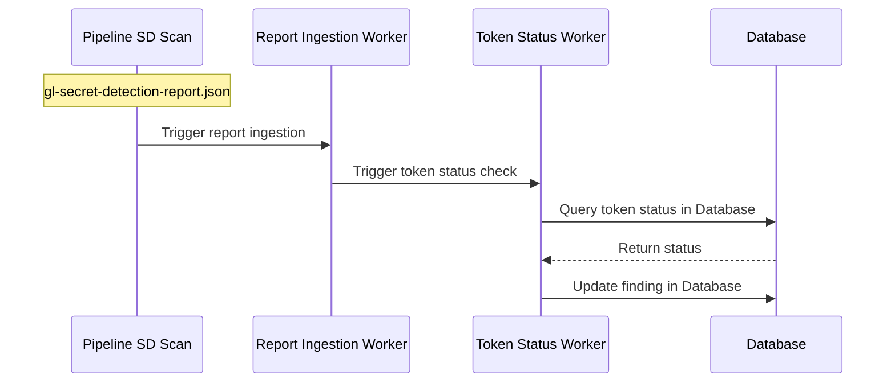
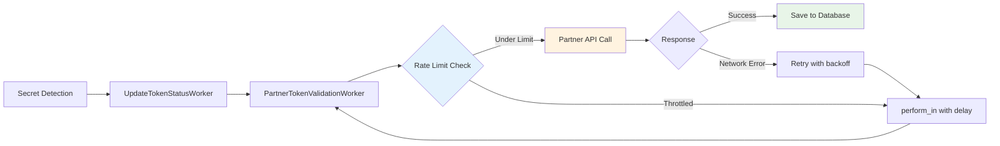
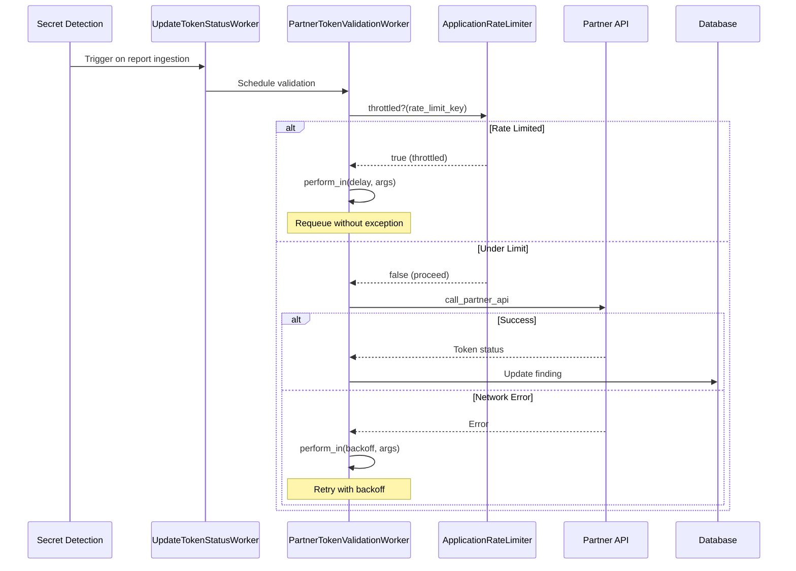



## Summary

Verify the validity and liveness of Secret Detection findings by programmatically checking them against their issuing services. This enables security teams to prioritize remediation of active secrets over revoked or inactive credentials.

See the [Verify validity/liveness of Secret Detection findings epic](https://gitlab.com/groups/gitlab-org/-/epics/13988) for more details.

## Motivation

### Goals

- **Provide token validity status** for both GitLab and partner tokens to Ultimate customers
- **Enable partner token validation** (AWS, GCP, Postman etc.) with strict rate limit compliance  
- **Support both SaaS and self-managed** deployments without additional infrastructure
- **Preserve error budgets** by treating rate limits as expected conditions rather than failures

### Non-Goals

- Cross Scanner Integration (extend to DAST)
- Extending support to other [target types](../secret_detection/#target-types)
- Building a generic API gateway service
- Supporting arbitrary third-party validation endpoints  
- Real-time synchronous validation during scan execution

## Proposal

We will automate the verification process for tokens discovered during security scans. This feature will:

- Verify token status (Active, Inactive, Unknown) of both GitLab and partner tokens, and display results on vulnerability pages
- Enable sorting and filtering findings by token status
- Support GitLab and partner platform tokens
- Work for cloud and self-managed/air-gapped instances
- Include telemetry to measure usage and effectiveness

Customers can opt in using Security Configurations. Once enabled, discovered tokens will be automatically verified against issuing services, with status information displayed in the Vulnerability details page and Security Dashboard, allowing security teams to prioritize remediation of active credentials.

## Decisions

- [001: Use Sidekiq worker approach for token status checking](decisions/001_use_sidekiq_worker_approach_for_token_status_checking.md)
- [002: Use REST over gRPC for SDRS communication](decisions/002_use_rest_over_grpc_for_sdrs_communication.md) *(Obsolete)*
- [003: Use Secret Detection Response Service](decisions/003_use_sdrs_service.md) *(Superseded)*
- [004: Use direct partner API calls instead of SDRS](decisions/004_use_direct_partner_api_calls.md)

## Challenges

- **Rate limit compliance**: Partner API limits are restrictive (e.g., Postman: 5 req/s)
- **Error budget preservation**: Must distinguish between rate limiting and actual failures
- **Refresh endpoint abuse protection**: Manual token status refresh functionality must be protected against malicious or excessive usage
- **Feature-level abuse prevention**: Overall validity checks feature requires safeguards to prevent abuse, particularly around partner token status checking volume and frequency
- **Future scalability**: May need dedicated partner endpoints for GitLab.com scale

## Design and implementation details

The validity checks capability relies on a three-phase rollout: Experiment, Beta, and GA. Each phase builds upon the previous to deliver a comprehensive token status checking experience.

### Experiment Phase - GitLab Token Status Display

The experiment phase focuses on GitLab tokens only and implements token status checking using a Sidekiq worker approach.
When a Secret Detection scan is executed and its report is ingested, a Sidekiq worker will be triggered automatically. This worker will:

- Process all GitLab tokens discovered during the scan
- Check each token's current status in the Database
- Assign one of three status values to the corresponding vulnerability finding:
  - Unknown: Status check could not be completed
  - Active: Token is currently active
  - Inactive: Token is no longer active

### Beta Phase - Enhanced User Experience and Controls

The Beta phase focuses on improving user experience and providing customer controls for the validity checks feature.

### GA Phase - Partner Integration

The GA phase expands token status verification to include partner platform tokens, providing comprehensive visibility across GitLab and partner services.

### Architecture Overview

### Execution Flow

## Security Considerations

Based on security analysis in [#562364](https://gitlab.com/gitlab-org/gitlab/-/issues/562364), we've identified and mitigated the following risks:

### Denial of Service (DoS) Protection

**Risk:** Malicious users could flood Sidekiq with verification requests by generating `gl-secret-detection-report.json` files with numerous secrets across multiple pipelines.

**Mitigations:**

- Implement per-project rate limiting for token validation requests
- Add circuit breaker pattern for partner API failures
- Monitor and alert on unusual validation patterns

### Response Parsing Security

**Risk:** Parsing third-party API responses exposes the monolith to malformed data injection and unexpectedly large responses.

**Mitigations:**

- Strict response size limits (max 10KB per response)
- Response schema validation before parsing
- Timeout enforcement on API calls
- Sanitize all data before storage

### Credential Management

**Risk:** Partner API keys stored in monolith could be exposed in self-managed instances.

**Mitigations:**

- Current partner APIs (AWS, GCP, Postman) use public endpoints - no credentials needed
- For future private APIs, use encrypted settings with key rotation
- Implement allowlist of permitted partner endpoints
- Audit logging for all partner API configuration changes

### Input Validation

**Risk:** Malicious or malformed tokens could exploit partner APIs or our validation logic.

**Mitigations:**

- Token format validation before API calls
- Length limits on token values (max 4KB)
- Character set validation
- Rate limiting per token pattern to prevent enumeration

### Monitoring and Alerting

Implement comprehensive monitoring to detect security issues

## Alternative Solutions

### SDRS Service Approach (Withheld)

Initially proposed separate service architecture. Rejected after discovering:

- All partner APIs are public
- No protected credentials needed
- Added infrastructure complexity for self-managed
