## Context

As part of an offsite, the following request flows and Kubernetes-specific
architecture diagrams were created.

## Request Flow

### Runner Fetch Secret

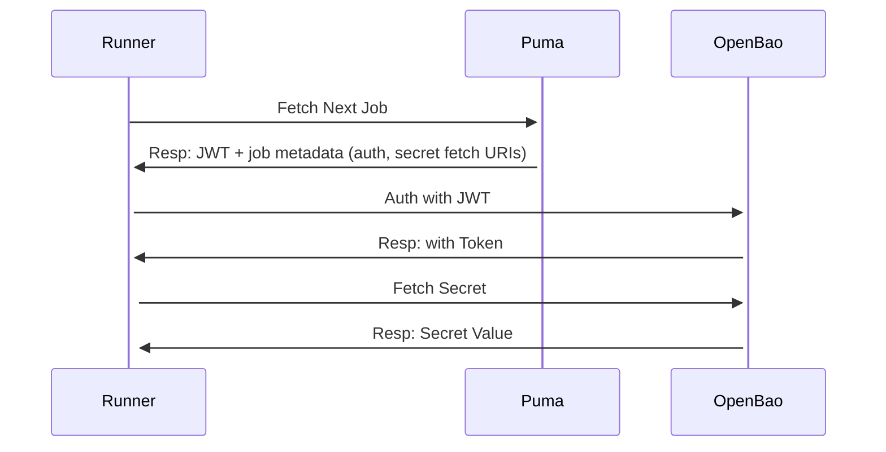

### User->Rails Management Interactions

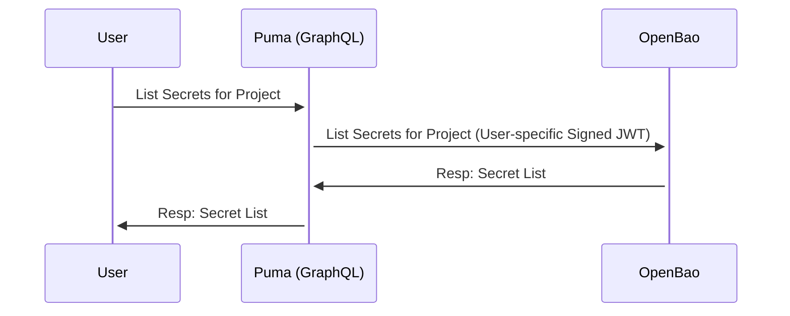

### User->Rails Provisioning Step

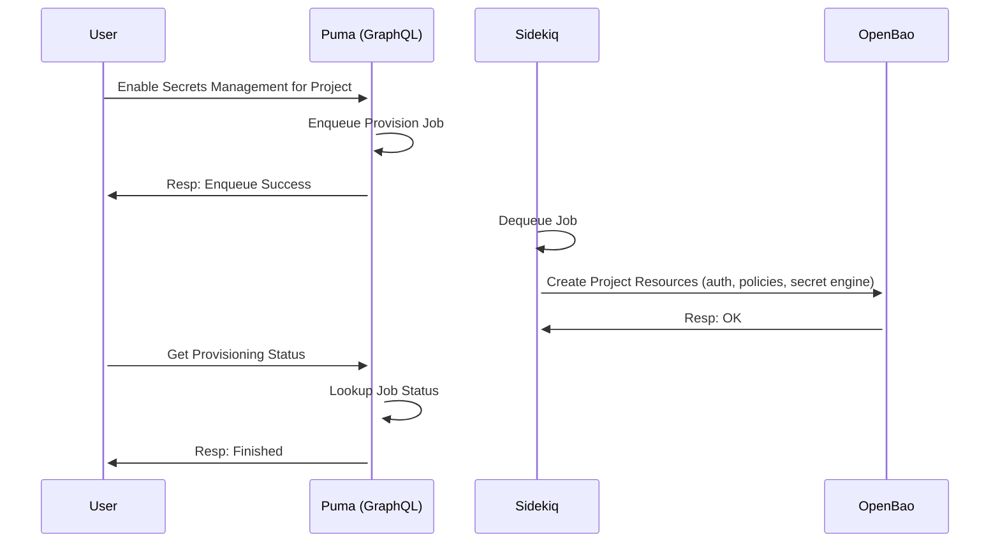

### Request Forwarding Flow

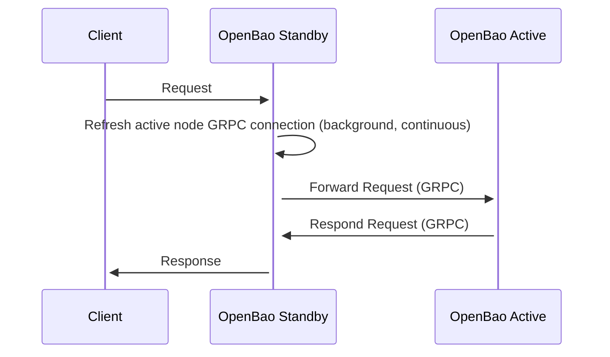

Presently (through upcoming OpenBao v2.3.0; ending likely v2.4.0), this flow happens regardless of request type; every request is handled exclusively by the active node.

### Internal Active Node Request Flow

For GitLab, everything labeled `OpenBao` will be part of the single active node process.

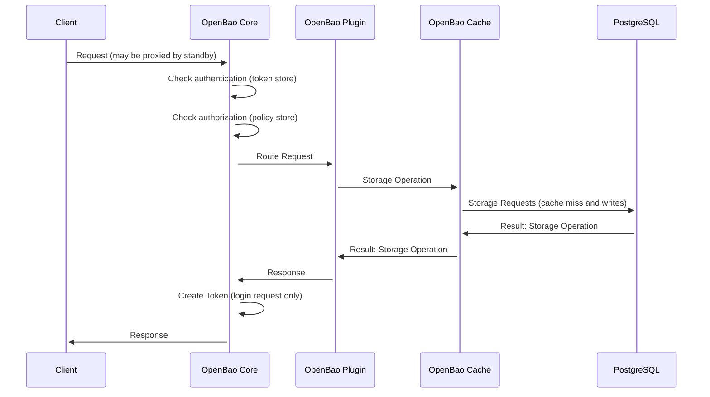

Cache is separated so we know (in a scalable environment) that we'll need to handle invalidations when storage has changed under us. This is handled by Raft today in a clustered manner. In PostgreSQL, we do not have a mechanism to do so. This may be GRPC but will be determined by the upstream OpenBao Horizontal Scalability Working Group.

### OIDC Registration Behavior

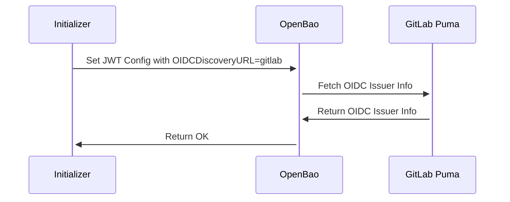

When doing authentication:

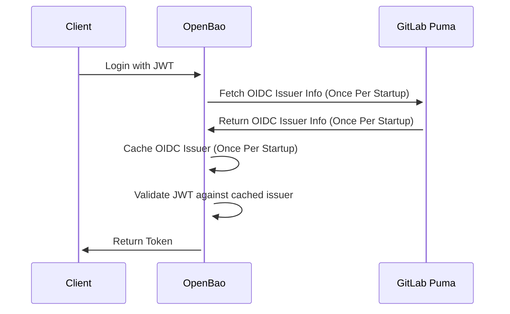

---

In the future, we'd like this to be:

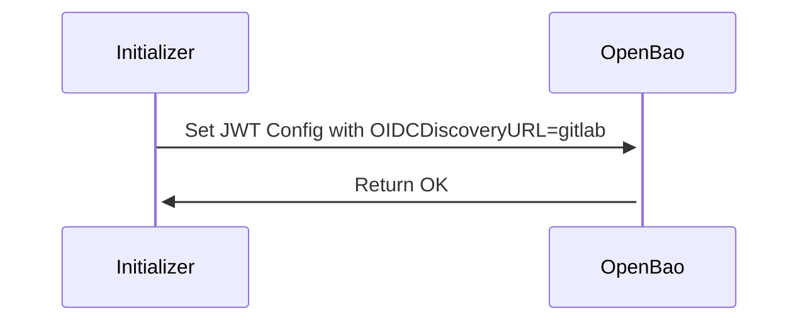

and only fetch issuer info when doing authentication or on a manual `jwt/config/verify` endpoint. That should be handled by [openbao#1306](https://github.com/openbao/openbao/pull/1306) and part of v2.3.0.

### Audit Log

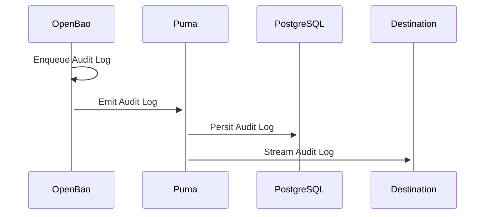

See [audit event streaming](https://docs.gitlab.com/administration/compliance/audit_event_streaming/)
documentation for more information.

## Architecture

### Kubernetes without KMS

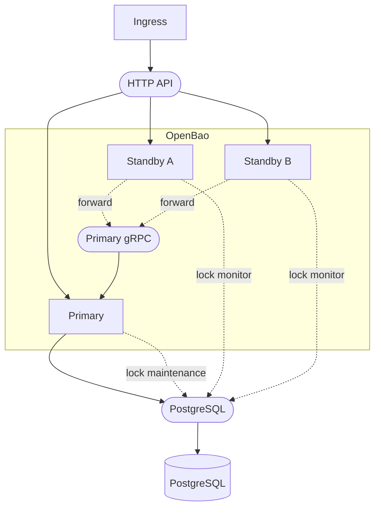

In this case, Kubernetes secrets will be used to provision static secrets for
auto-unseal in addition to database access credentials.

### Kubernetes with KMS

Additional diagram with KMS or HSM:

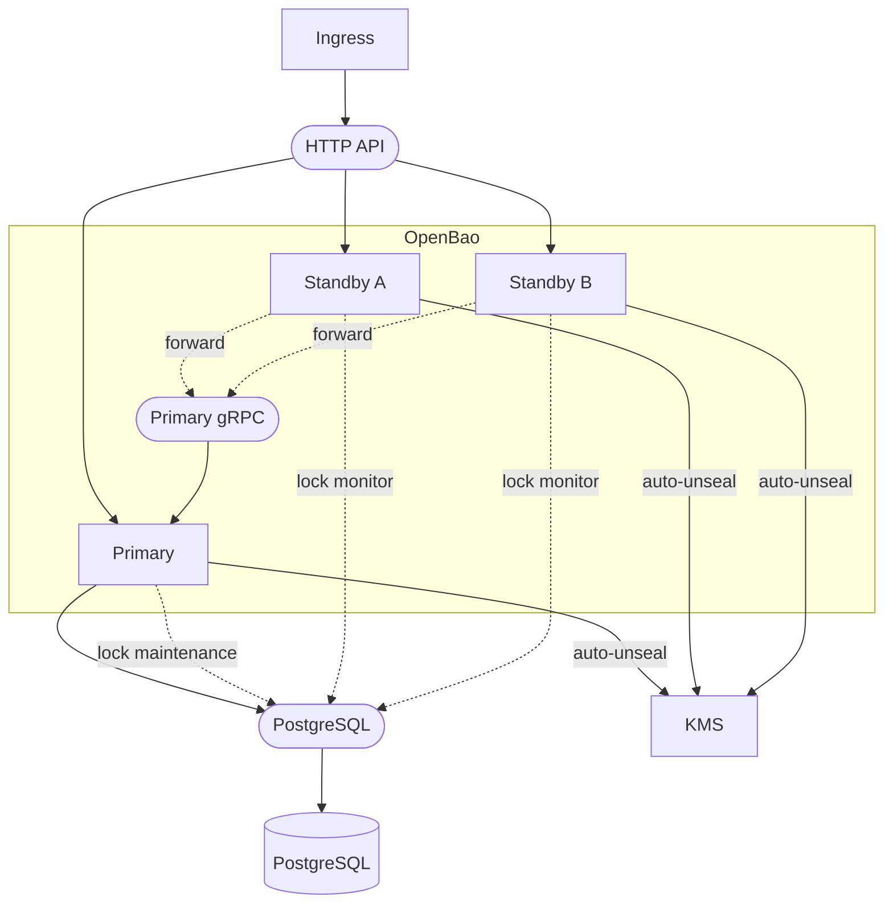

Functionally, all KMS/HSM flows are equivalent. KMS may be separate instances _as long_ as all key material is the same.

Standby nodes require auto-unseal functionality to ensure that they are ready to participate in failover resiliency in a timely fashion.
