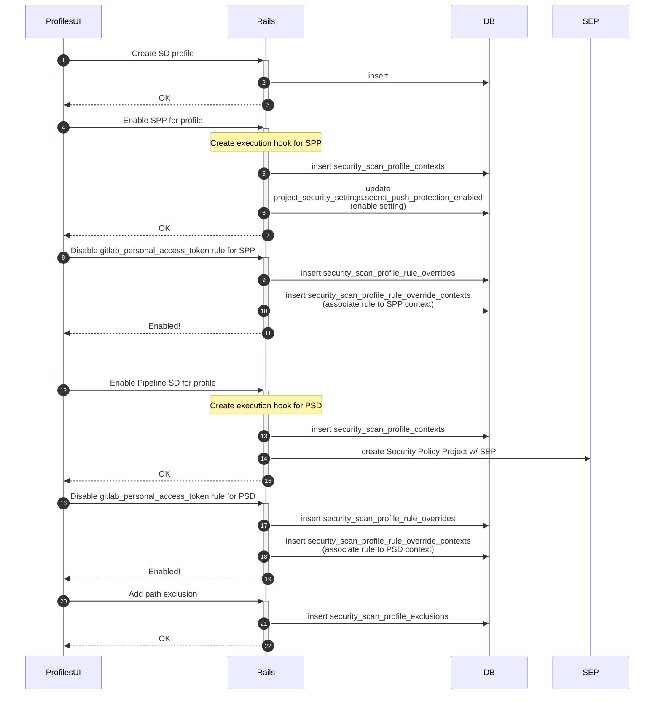
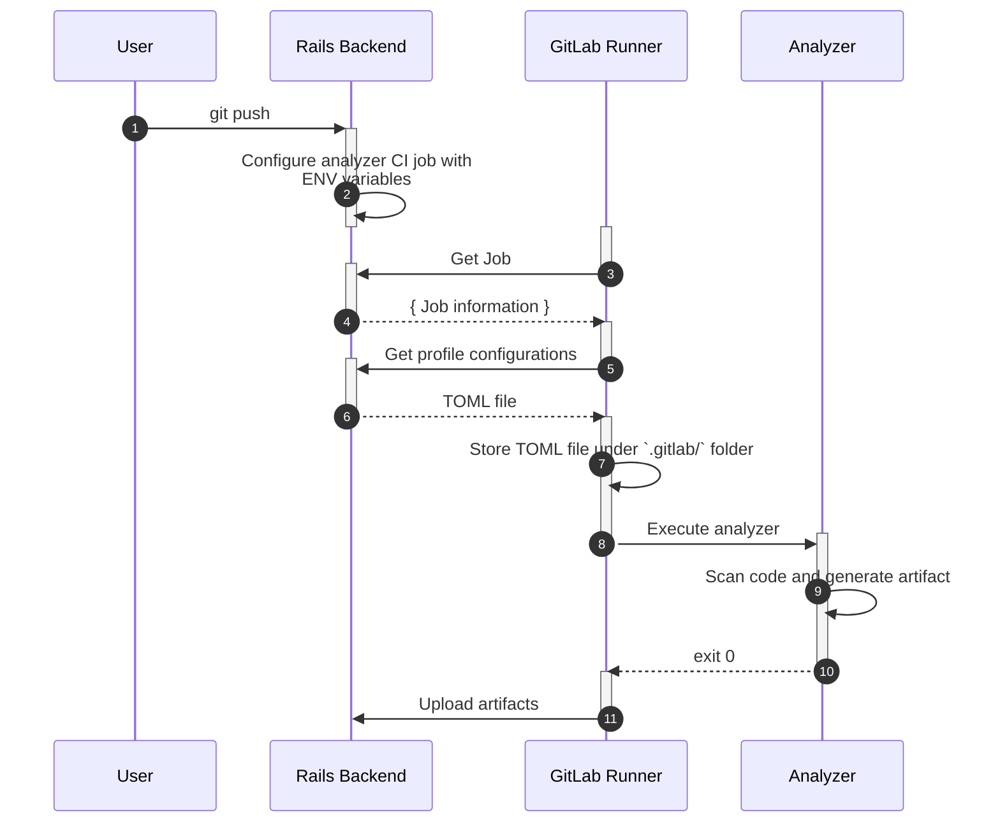
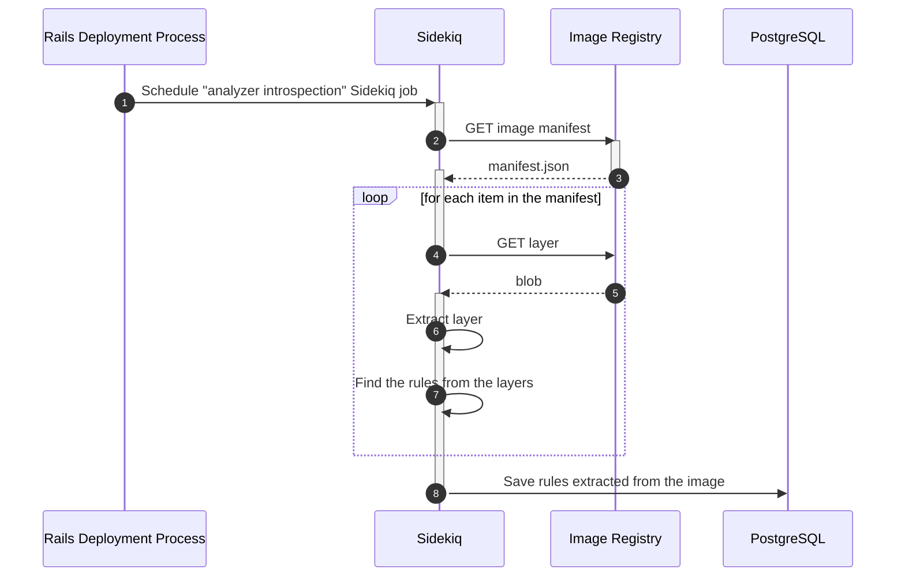
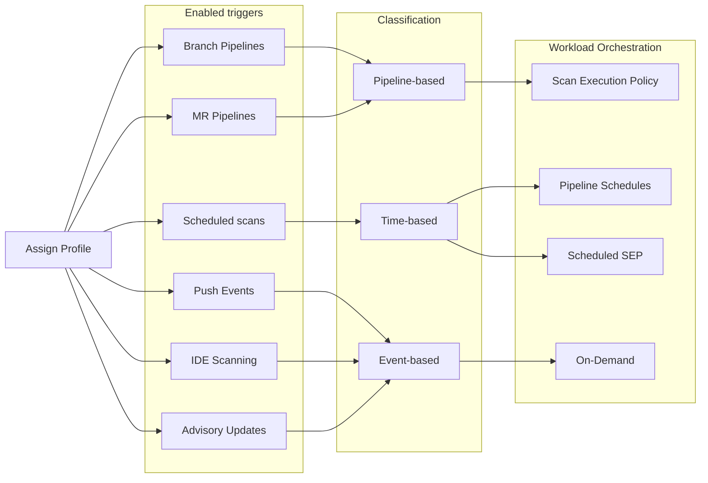
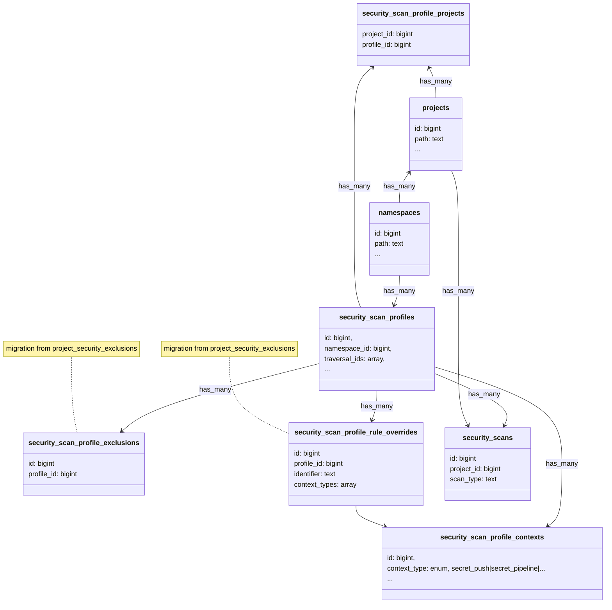



## Summary

We need a scalable way of storing and injecting analyzer configuration between security analyzers
and GitLab Rails. By introducing persisted configuration profiles we can provide an explicit and injectable
list of configuration options to be used when executing a security scan.

## Motivation

Configuration is a comprehensive categorical definition of all user-modifiable behavior around execution of GitLab's security scans.
This includes log levels, file path exclusions, number of cores utilized, and the rules under test.

Analyzer configuration was first designed for CI-based scans, but increasingly, GitLab security
analyzers are moving outside of pipelines. For CI-based analyzers, we have traditionally relied on exposing
CI variables in the corresponding components and templates which are passed to each analyzer for configuring
the execution of a scan.

There are several challenges with this approach:

- Difficulty in configuring scans performed outside of CI contexts (e.g. Secret Push Protection and Continuous Vulnerability Scanning)
- Inconsistent configuration profiles between different scan contexts
- Inability to store user-defined configurations uniformally
- Inability to scale shared configuration to organization-wide levels

There’s also a growing need to standardize configuration and store user-defined configurations in a consistent and scalable manner.

### Goals

Provide GitLab users with a way to:

- Securely store user-defined analyzer configurations within GitLab
- Manage multiple configuration profiles
- Inject configuration profiles into all possible scan contexts
- Validate all possible configuration values for each supported analyzer
- Manage configuration profiles at a group and project level
  - Excludes organization profiles
- Get visibility into what has been configured, and to which projects that configuration has been applied

#### Use cases

### Sequence for profile scan context configuration



### Sequence for CI-based scans utilizing custom rule exclusions

Here we are describing the process of configuring analyzers without requiring any changes on the analyzer side.

**Note:** This approach doesn't require any changes to analyzers, but the analyzer teams must document the folder structure of rules for each analyzer version. This is required because the rule extraction job will look for rules in image layers based on this information.



The CI template for each analyzer will have the following `script` section to pull configurations;

```yaml
script:
  - wget ${CI_API_V4_URL}/projects/${CI_PROJECT_ID}/security_profiles/${PROFILE_ID}/configurations -O .gitlab/analyzer-config.toml
  - /analyzer run
```

### Sequence for CI-based scans utilizing custom configuration parameters

Here we are describing the process of storing the rulesets from analyzers without requiring any changes on the analyzer side.



The aforementioned process would work on self-hosted installations as long as the instance has access to the image registry.

### Non-Goals

- Configuration Profiles are focused on the way in which an analyzer executes its scan. The configuration and triage of the results is out of scope of initial design
- Configuration profiles are not enforced for third-party scans, but are made available if a compliant scan wishes to consume them

## Terminology

- *Scan* - Execution of software that scans for vulnerabilities (see [Analyzer and Scanner glossary](https://docs.gitlab.com/user/application_security/terminology/#analyzer))

- *Rule modification* - changes to a single predefined rule used by a analyzer; i.e. severity overrides or rule pattern augmentation
- *Ruleset* - the collection of rules a single analyzer uses; for example "GitLab Advanced SAST's ruleset is composed of 100 rules"
- *Rule* - A collection of patterns associated with an identifiable vulnerability. A rule has a unique identifier and metadata (i.e. severity).
- *Rule augmentation* - A rule whose pattern has been modified to increase specificity or scope of detection
- *Rule exclusion* - A rule that has been disabled for a given scan profile configuration
- *Rule override* - A rule whose metadata properties have been overridden; i.e. a change in severity

- *Enablement* - When an analyzer has been configured to run by default for a given project and detection context
- *Enforcement* - When an analyzer has been "enabled" and can only be disabled by elevated permissions
- *Execution* - When a scan has been triggered for a given analyzer

### Terms to Avoid

The following terms are broad, multifacted, and can lead to confusion in overlapping intent. They should be avoided without qualifiers.

- Configuration
- Customization

For example:

- Prefer: "In Q1, we will support Scan Configuration Profiles. In Q2, we will support Scan Configuration Enforcement"
  - Not: "In Q1, we will support Scan Configuration"
- Prefer: "In Q1, we will support Rule Exclusions. In Q2, we will support Rule Overrides"
  - Not: "In Q1, we will support Rule Customization"

## Proposal

1. Persistent Configuration Profiles
    1. Define data model for persisting customizable group-level configuration profiles
    1. Support exclusions
        1. Associate path and value-based exclusions with configuration profiles
        1. Associate rule customization with configuration profiles
1. Scan ruleset management
    1. Define syncing mechanism for persisting scan rules to GitLab Rails
1. Scan configuration settings
    1. Define JSON schema encompassing all supported scan configuration options
    1. Develop API for persisting and managing user preferences as configuration profiles (validated against schema)
    1. Develop UI for persisting and managing user preferences as configuration profiles (validated against schema)
    1. Inject chosen** configuration profile into scan contexts (starting with CI)
    1. Update analyzers to prefer injected configuration settings, prioritizing over ENV and defaults
    1. Update analyzers to provide `configuration` used to execute each scan
    1. Generate audit events on configuration profile changes
    1. Create both a new default and new custom role for scan configuration profile modification

### Requirements

1. [Core data model](#profiles-db-schema)
1. [Workload orchestration of scan triggers](#workload-orchestration-of-scan-triggers)
1. Migration strategy - from existing enablement to profiles
1. Migration strategy - from profiles to advanced configuration
1. Persistence of configuration parameter overrides - [Flow](#sequence-for-ci-based-scans-utilizing-custom-configuration-parameters) is largely defined, but data model needs further definition. This is a blocker for DAST and DS auto-remediation, but nice to have for general behavioral config

### Phase 1 - enablement-only profiles

For this phase, we provide read-only profiles meant to facilitate rapid onboarding.

1. Predefined instance-wide configuration profiles, defined per scanner
1. Profiles are associated to individual projects
1. Profiles have *predefined scan triggers*; i.e. "Secret Detection Push Protection Profile" and  "Secret Detection Pipeline Protection Profile"
1. Profiles *cannot* customize exclusions, rules under test, and scanner parameters
1. When a profile is applied, an on-demand scan is immediately triggered. Subsequently, the [trigger condition](#workload-orchestration-of-scan-triggers) is used to inform future scans.

### Phase 2 - customizable profiles

Customizable configuration profiles, per scanner that can be enabled for each project.

1. Profiles are defined at the group-level, inheritable by subgroups
1. Profile can have many scan triggers
1. Profiles can customize exclusions, rules under test, and scanner parameters
1. When a profile is applied, an on-demand scan is immediately triggered. Subsequently, the [trigger condition](#workload-orchestration-of-scan-triggers) is used to inform future scans.

### Workload orchestration of scan triggers

Profiles include a definition of the triggers by which a scan must run. Alongside [persistence of trigger conditions](#profiles-db-schema), we need an orchestration layer capable of scheduling and initiating scan using several criteria:

1. Event-based executions, such as git push events, advisory updates, or deployments
1. Time-based executions, such as scheduled pipelines
1. Pipeline-based executions, such as branch and MR pipelines

These strategies will be further explored in [[Spike] Profile Workload Orchestration](https://gitlab.com/gitlab-org/gitlab/-/issues/573723)



### Configuration JSON schema

Example schema:

```json
{
  "$schema": "https://json-schema.org/draft/2020-12/schema",
  "$id": "",
  "title": "Security Scan Configuration Options",
  "description": "Mapping of all possible configuration options for GitLab security scans",
  "type": "object",
  "properties": {
    "additional_ca_cert_bundle": {
        "description": "Bundle of CA certs that you want to trust.",
        "type": "string"
    },
    "log_level": {
        "description": "Set the minimum logging level. Messages of this logging level or higher are output. From highest to lowest severity, the logging levels are: fatal, error, warn, info, debug",
        "type": "string",
        "enum": ["fatal, error, warn, info, debug"],
        "default": "info"
    },
    "secret_detection_historic_scan": {
        "description": "Flag to enable a historic Gitleaks scan",
        "type": "boolean",
        "default": false
    },
  }
}
```

### Profiles DB Schema


