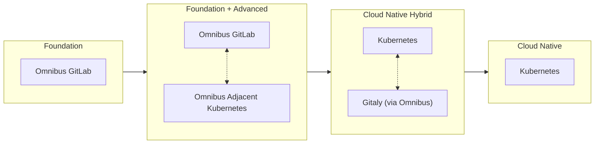
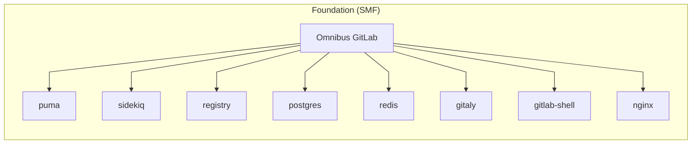
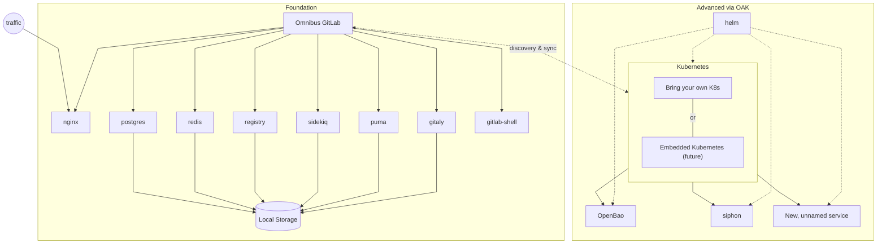
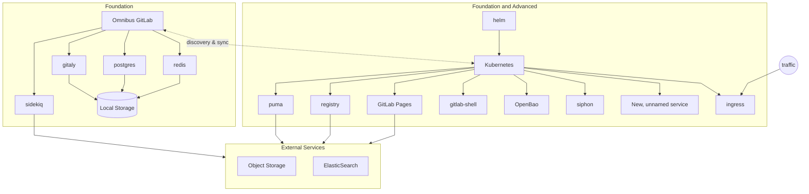
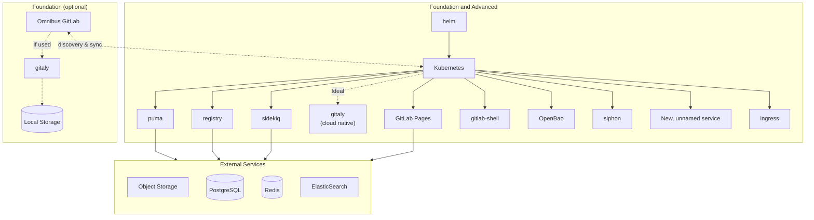

<!--
Document statuses you can use:

- "proposed"
- "accepted"
- "ongoing"
- "implemented"
- "postponed"
- "rejected"

-->

<!-- Design Documents often contain forward-looking statements -->
<!-- vale gitlab.FutureTense = NO -->



## Summary

This proposal recommends segmenting our Self-Managed offerings into two distinct tiers of components: Foundation (`SMF`) and Advanced (`SMA`),
and modifying the General Availability requirement so that only Foundation components will be included in Omnibus.
We intend to significantly limit the addition of new components to Omnibus, implementing only Foundation components that new features might require.

Any future path for Self-Managed must retain a simple initial adoption, once referred to as "Initial Delight", which has built our customer base so successfully over time.
[Analysis of Usage Ping data](https://docs.google.com/presentation/d/1iIDrMYXrw48A6Kj3PK9AeZ6x3YKYmes4mu2jXm5H8us/edit?slide=id.g35e93cc924b_0_58#slide=id.g35e93cc924b_0_58)
clearly shows GitLab's customer base has grown very accustomed to the reliability and consistency of the Omnibus experience, which has earned a reputation of reliable simplicity.
The Omnibus GitLab has succeeded in its mission, however that massive success has directly delivered us a challenge.

Customers, paid or unpaid, expect the same simple, reliable experience they've always had, while our roadmap increasingly requires complex underlying architecture to deliver new capabilities.

> _"Great Momentum requires Gradual Change"_

The current approach to adding components for consumption by Self-Managed customers is hindering the rate at which we can deliver features to our customers.
This is made clear by the current backlog of components that are yet to be supported by our current Omnibus + Cloud Native GitLab architecture.
While we do not expect our components list to expand indefinitely, the backlog is highly impacted by the complexity of the services which need to be configured, and the highly manual nature of configurations and inter-connections.
We must consider what methods are available to us today which provide us a means to accelerate and unplug the backlog of inbound components in service of feature delivery.
A strategic segmentation will enable us to deliver cutting-edge features to customers with modern infrastructure through Advanced, while maintaining support for current customers with traditional deployment requirements through Foundation.

Throughout this proposal, we describe implementing a form of [Option 2: Prioritize/favour Hybrid Kubernetes Going Forward](https://docs.google.com/document/d/1f8Ty_AE9IX2cawkyCLsEy7DkjD9zIgcifN7yQBgs2Uo/edit?tab=t.0#bookmark=id.cke52h57bu0i)
of the Cloud Native GitLab session from FY26 CTO Summit, while facilitating faster delivery through focused priority on cloud-native implementations of
supplemental enterprise feature requirements. It is focused on the [Omnibus-Adjacent Cluster](https://docs.google.com/document/d/1agZVZkbDrL8Zocp-PLiunQHFNWedEErUy_-fNEAeD2Y/edit?tab=t.0#heading=h.ro7ivridf2pb)
described in "Navigating a route towards cloud native", though we will refer to "[Omnibus-Adjacent Kubernetes](#omnibus-adjacent-kubernetes-oak)" for clarity regarding supported platforms.

The Omnibus GitLab package will not be abandoned, but we will require cloud-native implementation for future optional components, spanning all offering SKUs including Free and CE.

## Motivation

The current Self-Managed option has been built and perfected to lower the entry point of operating GitLab. All optimizations over the past 10 years have been done in order to serve all infrastructure designs under a single feature launch umbrella.
This creates significant engineering complexity as we try to deliver advanced features (for example: Security features as part of Ultimate) across vastly different infrastructure environments.
As a specific example, we have several features in the pipeline that will require ClickHouse being available. ClickHouse is not implemented within the Omnibus today due to inherent complexities of scale.
Our customers love the simplicity of Omnibus, but this has started to impede our ability to drive change quickly and cohesively. All this in an effort to integrate and manage everything in service to our customers' experience.

Cloud-native deployments enable critical capabilities we desire: auto-scaling, self-healing, and efficient resource sharing.
These are not efficiently supported by traditional OS-level installations.
We do not have the engineering bandwidth to deliver to all deployment methods, at the expected quality, within an appropriate span of time.
The Omnibus monolithic package can not continue to grow in size (already over 1.5 GB compressed), and the complexity and burden of maintaining its contents compounds with every addition.

Traditional Omnibus-based architectures face fundamental scalability challenges, requiring dedicated system resources and separate process management for each component.
Unlike modern containerized workloads that efficiently share resources and scale dynamically, the Linux package model forces static resource allocation and cannot adapt well to load patterns.
We saw these challenges with the implementation of GitLab.com, and we have seen it again across the implementation of the Reference Architectures.
Basing a scaled instance upon the Omnibus, we are forced to make use of a node-per-component strategy with dedicated nodes for each core service.
Providing High Availability for components further multiplies the resource consumption, resulting in even modest deployments demanding over 20 VMs. Enabling Geo for Disaster Recovery doubles this, with a full mirror infrastructure for each supplemental region.
As the number of components continues to grow, the Omnibus-based approach further proves to be unsustainable and costly, consuming excess resources.
These limitations and efficiency concerns have become a common focal point in customer conversations.

GitLab.com has already demonstrated that cloud-native deployments enable scaling GitLab with significantly more efficiency.
Our customers that are making use of the Reference Architectures in the Cloud Native Hybrid forms have experienced this first-hand.
To service our customers of higher complexity and larger scale, we should focus our Premium/Ultimate feature releases to Advanced, which is cloud-native first.
To service our customers who continue to thrive with the Omnibus, we must continue to support them through Foundational components, while also providing evidence of the value-add Advanced components bring.
Through Advanced, we incentivize a conversion of all customers to fully cloud native architectures.

### Goals

Provide a means to accelerate delivery of components and features, especially to cloud native capable Self-Managed users.
Do this, while not forcing excessive change or pressure upon our existing customer install base which demonstrably favors
some variation of Omnibus-based architecture on traditional infrastructure, as a percentage of total paid and unpaid install base.

In particular, this aims to:

- **Accelerate Innovation** by facilitating the integration of supplemental components to the overall [GitLab architecture](https://docs.gitlab.com/development/architecture/#component-diagram) in a streamlined manner.
- Provide **Clear Expectations** through transparent differentiation between deployment methods.
- Increase **Engineering Efficiency** by reducing the complexity of maintaining compatibility across disparate environments.
- Improve the **Upgrade Path** by providing a clear path for customers seeking advanced capabilities.
- Ultimately, reduce the number of deployment configuration permutations which GitLab needs to support. Over time, encouraging new Premium/Ultimate installations in cloud native environments.

We aim to explicitly avoid:

- Deprecating Premium/Ultimate GitLab running on Omnibus. This product will remain for the foreseeable future, and the only reason to revisit the existing functionality is to ensure that it can scale effectively. However, new optional Advanced components, such as OpenBao and ClickHouse, would not be supported in Omnibus, only as cloud native components.
- Forcibly converting traditional Omnibus into cloud native "under the hood". We would rather encourage consumers to expand their skillsets by incentivising internal transformation to cloud-native.
- Unexpectedly increase customer infrastructure costs and consumption. We must communicate these changes well.
- Alienate consumers of any kind, by forcing large architectural refactors upon them. We should rather show them the value of the shift to cloud-native instead.

### Non-Goals

This proposal is meant to facilitate accelerating timelines for component additions, while driving towards the North Star of Cloud Native.
In absolutely no way are we willing to facilitate a "Cambrian Explosion" of components and services.
We can not expect GitLab administrators across thousands of deployments to continually add, maintain, backup new services with each release.
We can not expect customers to be accepting of ever increasing resource demands, exponential complexity, and operational cost growth.

In no way are we advocating for, or intending to facilitate the product moving towards microservice based architecture.

The same considerations for feature and component additions that have always been present, will still be present.
See [Component Ownership Model](../../../infrastructure/production/component-ownership-model/) and Readiness Assessments.

#### Orthogonal Topics

There are several topics that are related to, or intersect with those of this proposal.
We intend to keep those separate, as they are important but not directly impacted by or impactful to this proposal.

- Discussion of [air-gapped](https://en.wikipedia.org/wiki/Air_gap_(networking)) vs non-air-gapped environments.
- Omnibus GitLab meta-packaging initiatives.
- Per-component versioning, and tracking of aligned versions.
- Discussions about new Premium/Ultimate components as separate paid SKUs are out of scope for this proposal.
- Deciding on a particular method of deploying a Kubernetes cluster for a customer, or to require the customer to bring their own for OAK.

## Related Initiatives

- [Component Ownership Model](../../../infrastructure/production/component-ownership-model/)
- [Technical Strategy for Self-Managed Runway](https://gitlab.com/gitlab-com/gl-infra/platform/runway/team/-/issues/413)
- [Cloud Native First Reference Architectures](https://gitlab.com/groups/gitlab-com/gl-infra/software-delivery/framework/-/epics/36)
- [Navigating a path towards Cloud Native: Approach Evaluation](https://gitlab.com/groups/gitlab-org/-/epics/17606)

## Proposal

The implementation of this segmentation has practical implications. We do not aim to enforce
cloud native deployments in order for Advanced to have value. In order to address this concern,
we must facilitate mixed environments, where the existing monolith provides services already
present and can be attached to supplemental components deployed in Kubernetes. This would
serve as a bridge between Foundation and Advanced, such that a customer can expand their existing
Omnibus into a truly scalable environment by providing the necessary platform (Kubernetes),
and deploying the extended Advanced feature components into that.

Segment the Self-Managed options into two distinct tiers of components, thus features:

|    | Self-Managed Foundation (SMF) | Self-Managed Advanced (SMA) |
| :- | :---------------------- | :-------------------------- |
| Technology Base | Operating system packages | Containerized cloud native deployment architecture. |
| Target Customer | CE/EE Free; Foundational feature set | Free with technical skills for cloud native; Premium and Ultimate. |
| Target Environment | Traditional infrastructure (bare metal, VMs) | Containerized infrastructure with Kubernetes, IaaS cloud (such as GCP, AWS) or on-prem. Driven by Helm and possibly Operator in future. |
| Value Proposition | Foundational product capabilities with essential features, existing Ultimate features available. | Full access to all product capabilities, current and future, as well as significantly better scaling. |
| Feature Guarantee | New Ultimate features are not guaranteed. Components required for new features may be unavailable in Omnibus. | All new Ultimate functionality guaranteed. |

It should be noted that no part of this proposal prevents features being added within existing components from being delivered to either tier.
If a new feature requires no changes or additions to components, such as some combination of Rails, frontend, and Sidekiq jobs, there will be no blocking these rollouts.
If a new component is required to be deployed in GitLab (Foundation component), then it will still be required to be included in Omnibus packaging, GET and Cloud Native GitLab.

Here is an outline of a potential workflow for new features, considering an assumption that Runway can operate on Kubernetes for Self-Managed.
Until that is possible, a similar flow will be described around the choices of "Premium only?" and "Stateless?", as applicable to Foundation and Advanced.

:link: _[original Lucid diagram](https://lucid.app/lucidchart/6bcd26c7-84e8-4b97-ae14-646306b31dfa/edit?page=0_0#)_

## Design and Implementation Details

We explored several paths after the discussions of the FY26 CTO Summit, within [Navigating a route towards cloud native](https://docs.google.com/document/d/1agZVZkbDrL8Zocp-PLiunQHFNWedEErUy_-fNEAeD2Y/) (future, `NRTCN`).
[That exploration](https://docs.google.com/document/d/1a_3GAdXnCB0l8f6OR-bSft6BPZ5pWuCyw76ShsKpgfM/edit?tab=t.0)
facilitated this proposal, presenting a plan to expect a single tenant Kubernetes cluster adjacent to an existing Omnibus.
We believe that this pattern can form the basis of the Self-Managed Advanced for customers not yet operating their instances with cloud native patterns.

Essentially, existing functionality and foundational features will be easily available to these customers in their current infrastructure design.
As they seek to consume new Premium and Ultimate features, they will implement and familiarize themselves with cloud native infrastructure as they bring Kubernetes into play for the auxiliary services of GitLab.
Over time, they will see the benefits to cloud native infrastructure and begin to transition away from the Omnibus entirely.

For those customers who are already operating with cloud native patterns, but are not operating their GitLab instance(s) within them, this will encourage them to transition their GitLab instances to cloud native.

In practical summary, we use Foundation and Advanced to encourage customer conversion to fully cloud-native over time, incentivizing the transition while simplifying our engineering and support experience.

### Omnibus (Foundation only)

Omnibus's existing scope should grow in an an extremely limited fashion, incorporating only Foundation components.
New services and functionality via new components are to be added primarily via Kubernetes deployments, as Advanced.

In the future, we will investigate moving advanced configurations such as High Availability, Geo, and Zero Downtime deployments from Omnibus to cloud-native methods, with the intent
to significantly simplify the Omnibus' feature set to the SMF ideal of smaller, less complex instances.
This is in alignment with [Project Flow](https://docs.google.com/document/d/10f7i-y9aJKo1Lo1IW106ov-OuUXAywNGQg7uPYGOP44/edit?tab=t.0#heading=h.rci2kr8welcp),
aiming to drive the Reference Architectures to a simplified, cloud-native first future.

An important note: Features delivered to Advanced will often require configuration of clients within Omnibus.
Implementation of that configuration will still occur, as that facilitates the _use_ of the feature, not the _operation_ of the feature itself.

### Omnibus-Adjacent Kubernetes (OAK)

Omnibus-Adjacent Kubernetes (OAK) is a _single tenant, single application_ Kubernetes cluster, intended for the exclusive use by the GitLab instance.
We strongly recommend the separation of concerns, as GitLab is often a tier-0 service used to manage and deploy workloads to Kubernetes environments.
By separating GitLab from clusters it may control, we prevent circular dependencies and possible catastrophic complications to customers' production environments.

This Kubernetes cluster could be facilitated by an embedded distribution such as k3s or k0s, or a customer provided cluster from any origin.

If GitLab chooses to implement a meta-package capable of deploying an embedded distribution of Kubernetes, we need to take great care in considering such a choice.
By bundling Kubernetes, our GitLab Delivery stage will effectively become Kubernetes distributors.
This creates ongoing maintenance responsibilities including testing Kubernetes upgrades, applying security patches of various severity, and ensuring compatibility across different deployment environments.
Meeting these requirements will demand staff with specialized Kubernetes expertise, and a heavy reliance on Product Security.
Further, the primary candidates for embedded Kubernetes do not provide any FIPS certifications, which would be of significant concern.

### Illustrated Stages of Transition to Cloud Native, via Segmentation

The stages presented below are based upon our current application components, and those known to be on the roadmap as of today.

#### Self-Managed Foundation

The simplest form, as experienced today, is Foundation based on Omnibus.
This is the "smallest" footprint, and a very common entry point for small instances to land, before expanding.
Here we find only the core of GitLab's mandatory functional components, the very Foundation of GitLab.

#### Early Self-Managed Advanced (SMA)

In the earliest stages and simplest forms of Advanced, all foundational components are operated within the Omnibus
while all supplemental components are operated within the OAK.
All inbound, web-based services come through Foundation _exclusively_ and are directed into OAK.

#### Transitioning to Cloud Native GitLab

Transitional phase where most client-accessible services have been moved into the OAK.
Disk based storage has been transitioned to object storage, as necessitated.
We move all inbound, web-based services to OAK _exclusively_.

Demonstrated here:

- Keeping Sidekiq, a known noisy-neighbor workload, within Foundation until customers understand their load well.
- Operating stateful data services via Omnibus before migration to external providers.

#### Cloud Native Scalability

The final stage is the Cloud Native Hybrid Reference Architecture deployments of today.
All state is on the Omnibus and/or external provider, and all stateless services are operated in Kubernetes.

Future: Gitaly is also within Kubernetes, pending GA of Gitaly on Kubernetes, removing the need for Omnibus.

### Interconnection of Mixed Environments

A consequence of implementing Advanced components via OAK will be the need to further ensure inter-component communication is easy to configure, and properly secured.
Care must be taken in the architecture and design to facilitate reducing the load of both of these concerns.

Configuring the many components of GitLab to speak to each other is a very manual process today which is facilitated greatly for Omnibus based architecture by the GitLab Environment Toolkit (GET), and highly simplified by the Kubernetes platform on which Cloud Native GitLab operates.
We must solve these problems at a lower level than GET, knowing that not all customer instances make use of GET and many customers _will not_ make use of GET for various reasons.

#### Service Endpoint Configuration

GitLab's architecture is often described in a [greatly simplified](https://docs.gitlab.com/development/architecture/#simplified-component-overview) manner.
In reality, the size and complexity of our total application stack is quite [large](https://docs.gitlab.com/development/architecture/#component-diagram).
A common complexity of GitLab instances is the need to configure endpoints across scaled, distributed architectures.
This is quite simple on a single node Omnibus, where all services could talk over localhost or even UNIX sockets.
The complexity of component interconnections grows with the size of the instance, complicating the configuration.
GET handles a significant amount of complexity on behalf of consumers, masking this through automation.
When all components are in Kubernetes, we simply configure all endpoints to consume the Service object names and rely upon DNS within the Kubernetes cluster to "solve" this problem for us.

We can greatly simplify the complexity if we implemented a service discovery mechanism for all components of GitLab.
The approach we take to implementing such mechanism should intend to support both unintelligent clients who are only informed via DNS,
as well as those components capable of dynamic reconfiguration.
Any such mechanism should not become a mandatory implementation item, without careful evaluation of impact on performance and maintenance complexity.

#### Securing Communications

Current implementations include support inter-component TLS, though a significant portion of this manual.
This is [relatively easy](https://docs.gitlab.com/charts/advanced/internal-tls/) when a minimal number of components live
outside of Kubernetes, but it does still require manual action.
It would be valuable to investigate appropriate auto-configuration of TLS via an mTLS coordination service, but this
should not be considered a blocking item, due to available existing documentation.
Any option which is investigated must be evaluated by our security teams, and for usability within FIPS and FedRAMP environments.

#### Implement Service Discovery and mTLS Automation

The combination of concerns could be addressed by a service mesh and proxy orchestration tool, capable of automated mTLS.
We have many customers who have implemented these, and several that can example their use with our Cloud Native GitLab today.
One such option, which customers sought explicit support for was [Istio](https://istio.io/latest/docs/).
It can [blend the two deployment types](https://istio.io/latest/docs/ops/deployment/vm-architecture/), facilitate the interconnection, and secure the communication as described within the projects documentation.

There are several other works ongoing at GitLab, such as [the new authentication stack](https://gitlab.com/groups/gitlab-org/-/epics/17711),
which are likely to involve mTLS and service discovery.
This work may be best left to those projects, and observed closely by this proposal.

### Consistency Across GitLab Produced Helm Charts

The Helm ecosystem is flexible but rife with disparities of form, function, and convention.
We should settle on, and converge towards, a set of patterns to be expected across all Helm charts produced and maintained by GitLab.
We must implement guidelines and best practices across all our works, following consistent patterns and styles.
These should be informed by maintainability, flexibility, and customer experience.

Many of these immediate concerns can be implemented through [a set of standardized tooling for Helm charts](https://gitlab.com/gitlab-com/gl-infra/mstaff/-/issues/460), and implementation of automation through CI components.
We will also need to lay out a set of style guides and patterns for components to follow, with the existing GitLab Helm chart
[development documentation](https://docs.gitlab.com/charts/development/) being a reasonable start.

### Definition of Supported Kubernetes Versions

We will need to define a company-wide description of supported versions on which the components of GitLab are expected to operate well.
We should be careful to note the difference between support by components and the support of operating the application itself.
In order to examine what that timeline should be, we must first look to the customer experience of Kubernetes as a platform.

The below points indicate that our customers may expect GitLab to function on a Kubernetes version for _up to_ 2 years, but we largely focus upon supporting any Kubernetes version for just over 1 year.
This indicates we should follow the Kubernetes release schedule closely, and any offerings should clearly note that supported range.
We should not look to expand past 4 versions, without extensive validation of return on investment and risk.

#### Investigating Kubernetes Versions to Support

Kubernetes releases happen [3 times per year](https://kubernetes.io/releases/release/#the-release-cycle), and officially receive [1 year of patch support](https://kubernetes.io/releases/).

Major cloud providers often support K8s versions for another year beyond the official release of the Kubernetes project itself:

- GKE [describes release channels](https://cloud.google.com/kubernetes-engine/docs/release-schedule) for GKE, including the "Extended" channel which adds approximately 1 year.
- AWS [delineates](https://docs.aws.amazon.com/eks/latest/userguide/kubernetes-versions.html) "standard support" and "extended support", which adds 1 year.
- Azure [specifically describes](https://learn.microsoft.com/en-us/azure/aks/supported-kubernetes-versions) their [Long Term Support](https://learn.microsoft.com/en-us/azure/aks/supported-kubernetes-versions?tabs=azure-cli#long-term-support-lts) https://learn.microsoft.com/en-us/azure/aks/supported-kubernetes-versions) as adding 1 year.

Helm v3 [defines `n-3`](https://helm.sh/docs/topics/version_skew/) as their supported Kubernetes versions.

The current tooling to deploy cloud-native GitLab, via Helm through various means, [prefers the use of Helm v3.17](https://docs.gitlab.com/charts/installation/tools/#helm).
This indicates support for Kubernetes `1.29` through `1.32`, though we know that some customers are operating on older versions on Kubernetes successfully.
This indicates 1-2 years of Kubernetes releases are currently to be supported, in some degree.

GitLab components such as GitLab Agent for Kubernetes ("KAS") clearly define [their supported versions](https://docs.gitlab.com/user/clusters/agent/#supported-kubernetes-versions-for-gitlab-features)
as aligned with the upstream Kubernetes release cycle, though slightly behind for the sake of testing.

### Considerations of GET and Dedicated Platforms

[GitLab Dedicated](https://docs.gitlab.com/subscriptions/gitlab_dedicated/) operates upon GET as a stepping stone, deploying cloud-native hybrid environments.
These Dedicated environments can quickly implement supplemental functionality through the use of cloud-native components, provided that the support for them has been integrated into GET.
Generally speaking, Dedicated can enable and scale components in alignment with customer usage.
It is important to the Dedicated use case that cloud-native is a distinct focus of product delivery.

[GitLab Dedicated for Government](https://docs.gitlab.com/subscriptions/gitlab_dedicated_for_government/) takes this one step further,
by implementing controls and configuration appropriate to operating within our FedRAMP certification.
Some components may not meet the criteria for operating within this environment upon their initial inclusion as a part of a GitLab release.

### Upskill Needs of the Support and Customer Success Organizations

Our Support Engineers, CSM teams, and possibly thousands of third-party consultancies in the wider GitLab ecosystem, have intricate knowledge using Omnibus.
We know that we and our partners need to be able to provide the same level of support that our customers have come to expect when using the Omnibus GitLab.
We, the whole of GitLab, will need to ensure that our documentation is expanded to include the appropriate information required for installing, operating,
debugging and supporting all components as cloud-native. We must build and disseminate new runbooks and guides for existing components, and ensure that all
new features and components meet this need as a part of their readiness work.

The expansion will be necessary to develop in parallel to the engineering work, but _must_ be executed on for product success.

## User Journeys

### Existing Customer, cloud-based, Omnibus all-in-one without GET, seeking to deploy Advanced components

This customer profile would initially qualify as a consumer of Self-Managed Foundation.
In order for them to deploy the supplemental functionality of Self-Managed Advanced (OpenBao, NATS, ClickHouse),
they will need to provide an Omnibus-Adjacent Kubernetes (OAK) in which to place those components.

As this customer is based within the cloud, they would have a few options:

- Consume a cloud provider's Kubernetes as a Services such as EKS, GKE, or AKS
- Provide an Kubernetes cluster of their own provisioning
- Consume a GitLab deployed embedded distribution of Kubernetes
  - _We are not guaranteed to create this offering, and it would be likely be separated from Omnibus GitLab._

Once a customer has chosen a means to provide an OAK, they would proceed with moving from [Self-Managed Foundation](#self-managed-foundation) to the [Early Self-Managed Advanced](#early-self-managed-advanced-sma) model.
Experience running OAK for Advanced components should drive them to transition further towards Cloud Native GitLab over time.

### Existing Customer, on-premise, Omnibus and external PostgreSQL, seeking to deploy Advanced components

This customer profile is nearly identical to a cloud-based customer in the same position.
The distinct difference here is that their choices are reduced, as no cloud provider services for Kubernetes are available.

### New Customer, cloud-based, looking to onboard with OAK experience from the outset

This case will behave nearly identical to an existing customer looking to deploy Advanced components.
See that journey, above.

### Dedicated Environment Automation Engineer, deploying Advanced components

GitLab Dedicated's customer environments make use of the current Cloud Native Hybrid architectures, as described in
[GitLab Dedicated architecture](https://docs.gitlab.com/administration/dedicated/architecture/).
An Environment Automation Engineer's experience deploy Advanced's cloud-native components will be straightforward.
Dedicated engineers maintain Switchboard, Amp, and Instrumentor in order to build on top of GET and the GitLab Helm chart within.

For an example case, we will make use of enabling OpenBao for [GitLab Secrets Manager](../secret_manager/).

The consumption of GitLab Secrets Manager is a project setting, available to all instances and exposed when the expected level of GitLab license is present alongside the instance's access to an OpenBao deployment.
A customer would ask to enable OpenBao, [currently as a support ticket](https://docs.gitlab.com/administration/dedicated/configure_instance/).
A Dedicated engineer would take action upon the raised ticket support ticket, performing an appropriate action via Switchboard.
From that point forward, Dedicated's automation takes action through Amp, Instrumentor, and Tenctl.
All functional requirements for OpenBao are provisioned, and the application is configured to communicate with the OpenBao within the Kubernetes of the instance during the next maintenance window.
Assuming that the customer has configured an appropriate license, each project will have the ability to enable GitLab Secrets Manager.

The functional requirements for this feature are:

- Internal network access from Rails to OpenBao for API calls.
- External network access to OpenBao through Ingress, as the GitLab Runner will speak directly to it.
- A PostgreSQL database for OpenBao to consume.
- An appropriate KMS provisioned for sealing.
- An appropriate license level to enable this feature on the instance.

Pre-requisite work to this functionality:

1. [`gitlab/openbao` Helm chart](https://gitlab.com/gitlab-org/cloud-native/charts/openbao) is [integrated into the GitLab Helm chart](https://gitlab.com/groups/gitlab-org/distribution/-/epics/112).
1. Configuration is implemented via GET, [alongside provisioning](https://gitlab.com/gitlab-org/gitlab-environment-toolkit/-/blob/main/docs/environment_provision.md) of the backing PostgreSQL database and any KMS.
1. Instrumentor updates the wrapped GET, including this functionality and the ability to enable it. [gitlab-org/gitlab#473893](https://gitlab.com/gitlab-org/gitlab/-/issues/473893)
1. Switchboard exposes optional control over deployment.

### GitLab Development team, seeking to add a feature requiring a new component

For this Journey, we will represent a development team within GitLab seeking to add a component to GitLab.
We will examine OpenBao, for [GitLab Secrets Manager](../secret_manager/).

This follows the flow as presented in the [proposal outline](#proposal) above.

Walking the decision tree, we get the following:

- GitLab Secrets Manager wishes to consume OpenBao, which we do not currently provide.
- OpenBao is thus deemed a new component to be added.
- GitLab Secrets Manager is deemed to be a Premium feature.
- OpenBao can be deployed on Runway, but Runway is not yet viable for Self-Managed.
- The OpenBao application is stateless, as it stores data within a PostgreSQL database.
  - Caveat: OpenBao does manage state, but not within itself - This will require provisioning, replication, and resiliency concerns to be addressed.
- The component will be services via Advanced, as a stateless Helm chart.
- The component will then be enabled for operate for GitLab.com as Experimental maturity, before proceeding through the feature development lifecycle to General Availability.

Work to be done, progressing through [feature maturity](https://docs.gitlab.com/policy/development_stages_support/):

1. Development
    - Engage with the [Readiness Workflow](https://gitlab.com/gitlab-org/architecture/readiness#overview)
    - An OpenBao container is made, with distroless UBI, and a FIPS build.
    - An OpenBao Helm chart is made, consuming the new container.
1. Experimental
    - Integrate the Helm chart with the [GitLab Helm chart](https://gitlab.com/gitlab-org/charts/gitlab) for GitLab.com to consume.
1. Beta
    - Integrate the configuration and provisioning with the [GitLab Environment Toolkit](https://gitlab.com/gitlab-org/gitlab-environment-toolkit)
    - Coordinate with GitLab Dedicated teams to implement appropriate assessments and enablement within Dedicated, Cells, and USPubSec environments.
1. General Availability

## Impacts on Product Development

If a feature on any component of GitLab depends on an Advanced component, then that feature should gracefully handle that component not being present.
This is especially true of the Rails monolith.

Components must always be designed with supported skew of dependency Minor +/-1, and with
appropriate feature gating and graceful handling in mind.
This supports the capability of independent deployment and decoupling of component versioning,
allowing de-risking of upgrade processes in complex environments like Cells.

### Expansion on Component Classification

The most simplistic way to describe determining if a given component is Foundation or Advanced:
Will this component be a core, mandatory function of the product?

Foundation components will need implementation in Omnibus.
All Advanced are explicitly targeted for cloud native, first.
Implementation of Advanced components within Omnibus should be a rare occasion, and doing so will be predicated on executing on Omnibus meta-packaging.

## Alternative Solutions

### Strangler Fig

In FY26Q1's CTO Summit, we considered the possibility of slowly converting the Omnibus into a
means of deploying all items within Kubernetes. This could have been accomplished in a number
of possible ways. We looked specifically into a [strangler fig pattern](https://en.wikipedia.org/wiki/Strangler_fig_pattern)
by way of packaging a micro-distribution of Kubernetes into the Omnibus, then slowly switching
all components to be deployed into that cluster.
While that [exploration](https://docs.google.com/document/d/1a_3GAdXnCB0l8f6OR-bSft6BPZ5pWuCyw76ShsKpgfM/edit?tab=t.0)
was a worthwhile exercise, we acknowledge that the impact on complexity, resource requirements,
and supplemental customer experience requirements give us pause. This is concern is compounded when
accounting for the maintenance burden's onus and risk placed upon GitLab to deliver regular builds,
security patches, security hardening, and functional FIPS validation.

Implementing a strangler fig pattern into the Omnibus GitLab in this
way would specifically cause several of the problems that this proposal aims to prevent,
as well place significant onus and risk upon GitLab for maintenance.

Instead of pursuing this route, we aim to use a similar concept to _encourage_ customers to
migrate their architecture over time, _incentivizing_ building or obtaining experience
in operating Cloud Native environments for GitLab to operate within. That can be done through the use
of Omnibus-Adjacent Kubernetes cluster, as a goal of this proposal.

### Change Nothing

Continuing as-is with our current behaviors and the challenges they present, would leave us
open to stagnation of a growing backlog. While we have several ongoing efforts to streamline the means
to include functionality into the Omnibus GitLab and the Cloud Native GitLab methods, there
remains the simple fact that including new features via Kubernetes deployment methodologies
is simpler for our wider organization. Making Cloud Native the first priority does not negate the
concerns of stateful data services and requirements that we face today. We must remain
vigilant of the customer SRE experience and do our best to ensure data security.

## Deprecate the Omnibus GitLab

We could, if so chosen, entirely deprecate the Omnibus. Stop making it as a major version, after a major announcement.
Provide tooling to migrate to cloud native deployments, and essentially force all existing customers to transition.
Effectively, the "mother of all" breaking changes.

This was deemed to be far to detrimental to the customer base, and to our community as stewards of an open core product.
