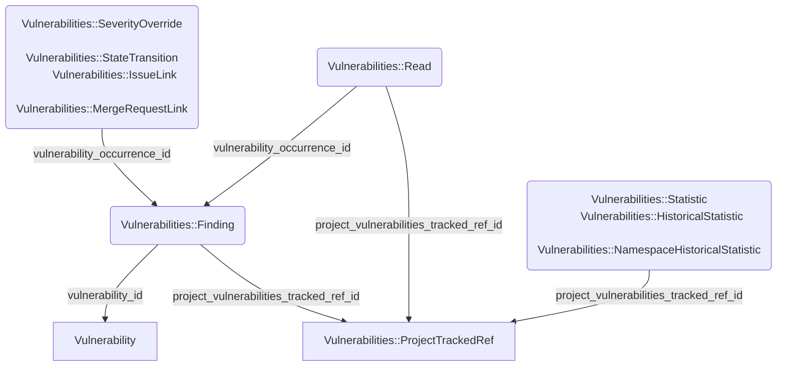



## Summary

Perhaps one of the most in demand Sec features for GitLab currently is the ability to [track vulnerabilities across multiple branches](https://gitlab.com/groups/gitlab-org/-/epics/3430). While the current implementation of vulnerability management features in GitLab offers a lot of power, the implementation is very inflexible. As a result, workflows which may involve running different versions of an application, be that old releases or modified versions are unable to track vulnerabilities without forking the code to seperate projects entirely.

Unfortunately, GitLab's current code is not built to facilitate this need, so we need to consider changes to make it possible without endangering the stability of the system.

## Motivation

One of the primary examples provided by users seeking tracking of vulnerabilities across multiple branches is that our users frequently deploy or provide multiple versions of a system or product at a time.

Under this model, an application which an organisation may continue to provide bug and security fixes for older versions is unable to easily manage vulnerabilities in multiple supported versions of code using GitLab's integrations. This can lead to users either being forced to use GitLab in unintended ways to facilitate their security scans, or opt to use other scanning tools to avoid this inconvenience.

### Goals

- Facilitate multi-branch vulnerability monitoring and historical tracking
- Provide this functionality in a simple, consistent and cohesive way
- Ensure this functionality is well designed and does not pose a risk to GitLab's stability now or in the long term

## Implementation

### Ref Tracking

The intent with static ref tracking is to maintain the current methodology by which GitLab tracks vulnerabilities for the default branch, but expand this behaviour out to additional branches. Fundamentally this will require us to make some substantial modificaitons to some of our core tables to support this new data paradigm. Specifically the purposes of some tables will be slightly redefined, and we will need to be able to store what git refs will be tracked for vulnerabilities.

Additionally we will need to update a substantial amount of code to account for branches holding identical vulnerabilities, as these interactions need to disambiguate between the branches.

The key changes necessary to make this possible can be sumarised as:

- A new table called `security_project_refs` will be created. This table will act as the join relationship between a project and the ref names in it for which vulns will be tracked. It's ID will then be the context by which other tables will define their branch/tag relationship.
- The `vulnerability_occurrences` table will become a representation of a vulnerability, as it occurs on a specific branch. As such, it will get a reference to the the `security_project_refs` table.
- The `vulnerabilities` table will become a higher level representation of the concept of a vulnerability, which may then exist in various forms across multiple branches.
- Supporting information tables, such as `vulnerability_severity_overrides` and `vulnerability_state_transitions` will be related to the `vulnerability_occurrence`, not the `vulnerability`, as these details are specific to the context of where the vulnerabilty occurs.
- Information that is/is not specific to vulnerabilities will be moved between `vulnerabilities` and `vulnerability_occurrences` to reflect this paradigm shift.
- `vulnerability_reads` will become a reflection of `vulnerability_occurrences`, with additional supporting information and indexes to optimise it specifically for the Vulnerability Report. This aligns with a new schema intent to create more normalized data as sources of truth, and then have tables that act as optimized denormalizations to support specific features.
- Update the vulnerability ingestion process to consider if the pipeline was executed on a tracked ref, and if so, ingest vulnerabilities for the specified pipeline, associated with that branch.
- Update all interaction services to account for the branch context of the vulnerability being interacted with so that the appropriate record is updated.
- Update all API's and interfaces that currently present vulnerability information such that they can search, filter and present their information with a branch context.
- Partitioning of `vulnerabilities` and `vulnerability_occurrences`, as the expanded branch tracking count will likely push both of these tables over the size for which Postgres vacuuming can effectively handle for a single table.

NOTE: Because implementation can change based on greater understanding as the work is done, the intent is not to exhaustively list the DB design here, but to give a high level understanding of how it will be configured and why. For specific implementation details, rather consult the epics/issues.

#### Vulnerability/Occurrence differentiation example

Conceptually, a Vulnerability is intended to represent the definition of a vulnerability, regardless of where it's found, while a Occurrence/Finding is meant to represent an instance of a vulnerability as it was found in a particular ref. This will look something like the below example.

---

Vulnerability:

- ID: 1
- Primary Identifier: CVE-2025-49007
- Title: ReDoS Vulnerability in Rack::Multipart handle_mime_head
- Description: Lorem Ipsum Dolor
- Severity: Critical
- CVSS: ...
- Scanner: SAST
- Solution: ...
- CVE: ...
...

---

Finding(Occurrence)

- Vulnerability ID: 1
- UUID: '00000000-0000-0000-0000-000000000000'
- Location: app/services/user_auth_service.rb
- Ref: 'development'
- State: :detected
- Initial/Latest Pipelines: 123
...

---

With this differentiation, we can limit the amount of data duplication per occurrence of single vulnerability for our Source of Truth tables, but then construct out any necessary view patterns we may need to best support features dependent on this data.

### Querying

This information effectively serves as the source of truth regarding the presence and state of a vulnerability in a respective branch. However, in order to present this information to our users and allow them to query and filter it, we need to materialize the information into a state that can be effectively indexed and filtered. Due to a history of performance issues, the current Vulnerability Report works by virtue of a highly denormalized table called `vulnerability_reads` which contains all the information related to vulnerabilities in a single row, allowing for effective indexing and filtering.

To minimalise the amount of processing we will need to do on demand, we need to store vulnerability reports for different branches in a similar way, effectively "caching" the output for users to filter and query. This is achievable using the existing Vulnerability::Reads paradigm, however we have to acknowledge that we will need substantial storage of denormalised records to make this possible. Each additional branch we wish to track for a project would require us to duplicate their entire body of vulnerabilities, plus or minus the differences specific to the branch.

This should be possible to facilitate by making the following changes to our database structure:

- Partitioning of the Vulnerability Reads table.
  - Tables over a certain size begin to face a wide variety of performance problems. The current size of `vulnerability_reads` is already over the threshold which starts facing these problems, so to ensure stable performance going forward we would need to partition.
  - Additionally, per the restrictions at GitLab regarding the adding of columns and indices to tables over a certain size, `vulnerability_reads` contravenes both these conditions currently. So partitioning is not optional in that regard. Though we may have to seek approval to add the additional column.
- Addition of a `project_vulnerability_tracked_ref_id` column to the Vulnerability Reads table to be able to filter by branch.
- Addition of a `partition_number` to the `vulnerability_reads` table.
  - This would allow us to use a sliding list partition strategy for `vulnerability_reads`, and can dynamically add new partitions as GitLab scales and users adopt our vulnerability management features to a greater extent.
  - A partition number should be allocated by project/namespace/organisation to minimise data fragmentation. A new partition number should be used when the last partition exceeds 75GB, as this will allow already allocated projects space to grow without exceeding 100GB.
  - Should it be necessary, it should be possible to do partition rebalancing if a particular allocation becomes too heavy.
  - We may consider alternative partitioning strategies yet. Please consult the respective [issue](https://gitlab.com/groups/gitlab-org/-/epics/16174) for up to date information regarding the partitioning implementation.

### Scalability, Storage and Performance

Tracking vulnerabilities across multiple branches will require N * more everything to facilitate. Materializing vulnerabilities for the vulnerability report so that they can be effectively index and filtered will require as much space again on the `vulnerability_reads` table as it took to track the default branch's vulnerabilities. (Plus a bit more for the new ref column and associated changes to indices that will be necessary)

Ingestion of vulnerabilities to update the reports will continue to be an iterative update process associated with the ingestion of security reports from pipelines, so the processing necessary should be nominal in that regard.

However, it is likely that we would not want to keep a materialization of the report at the ready for every branch on every project at all times due to cost reasons. To mitigate this, we can limit the amount of refs that are actively tracked, and then expand this based on our comfort with performance, scalability and cost.

As a mitigation to avoid holding redundant vulnerability report data forever when a user may need it only temporarily, we can probably use the vulnerability history to generate a ref's report on demand, with some UI/UX elements to ask the user to wait while we process and generate the necessary materialised rows. This may mitigate the need to hold too much data when it may only be needed for a short duration.

There are several ways we can tradeoff between branch coverage and the associated storage costs. This tradeoff is not currently in-scope for this design doc. We will chose a justifiable starting point for branch coverage and review our position at a later date.

Because `vulnerability_reads` are essentially just a materialzed view of information from our source of truth tables, there's no danger in destructing and rebuilding it (as long as we don't disrupt users). As such, should usage grow to such an extent that we need dedicated storage for this denormalized information, this table could be very easily decomposed to a dedicated database.

### Retention

A very important subject in GitLab currently is the correct application of retention policies to data to avoid eternal storage of unused information. We are already in the process of implementing a [retention policy for vulnerability](https://gitlab.com/groups/gitlab-org/-/epics/12229) information based on the age of the vulnerability.

Because of this new approach to handle vulnerability retention, there should not be any impact on our currently intended 12 month retention policy. Detecting a vulnerability's presence on any branch will refresh the vulnerabilities presence in the codebase and refresh it's retention lifetime.

### How to handle history for branch changes

If a branch is deleted for any reason (manually or due to automation when merged), the vulnerability information for that branch becomes historical. As long as the project continues to set the ref name as tracked for vulnerabilities, we should maintain this data in accordance with the standard retention policy. If the user asks for the branch to then stop being tracked, we can warn them that we will drop the history for the branch, and perhaps allow them to archive it first.

### SBOM dependency tracking for package advisories

In order to track vulnerabilities from package advisories on multiple branches, it becomes necessary to track the dependencies present on all tracked refs as well. This has been determined to be an important part of providing a fully realized implementation of vulnerability tracking across multiple refs.

Sbom dependencies are represented by by `sbom_components` and `sbom_occurrences` in a similar way to the `vulnerabilities` and `vulnerability_occurrences`. Components are the name of the dependency, and an occurrence represents a specific occurrence of a specific version of that component. However, sbom records do not change substantially between refs. As a result, using a new record to distinctly track a unique occurrence per branch would result in a large amount of duplicated data with no value. As such, we will introduce a new `sbom_occurrence_refs` join table to better normalize this data and avoid redundancy.

Once this join is introduced, it should be possible to begin ingesting dependencies reports per branch when the ref has been set to be tracked in the [`security_project_refs`](https://gitlab.com/gitlab-org/gitlab/-/issues/555971) table.

Dependency reports and graphs should then be viewable per tracked ref in the same way as vulnerabilities, and consequent functionalities like package advisories can then loop through the sbom occurrences that exist per ref to provide necessary vuln reports per branch in the same way they currently do for the default branch.

If a branch is removed from the vulnerability tracked refs list, the sbom dependencies data will be deleted for that graph. Because SBOM data does not have direct user interactions, it can be treated as ephemeral. Users can regenerate this data on demand by setting the ref to be tracked and then running a pipeline to trigger data ingestion.

#### SBOM model split example

Unlike to the vulnerability model split, the below is an example of the data difference expected to be tracked between `sbom_components`, `sbom_occurrences` and `sbom_occurrence_refs` to represent the relationship between dependency definition, and contextual occurrence information.

This is just an example to represent direction. For the final implementation details, consult the [epic](https://gitlab.com/groups/gitlab-org/-/epics/18587).

---

Sbom Component:

- ID: 1
- Component Name: Active Record
- License: [MIT]
- Ancestors: [x, y, z]
...

SBOM Occurrence

- Dependency ID: 1
- Input File Path: gemfile.lock
- Commit Sha: xyz
- Package Manager: Bundler
- Component Version: 7.1
- UUID: '00000000-0000-0000-0000-000000000000'
...

SBOM Occurrence Ref:

- Ref: 'development'
- Commit-Sha: xyz
- Pipeline ID: 123

---

## Why this approach?

When we first began considering the architecture for tracking vulnerabilities across multiple branches, we were highly concerned about the impact on the database in terms of CPU activity and database storage. As a result, a substantial amount of discussion went into understanding the risks and benefits of Static Branch Tracking vs the alternative proposal of Entry/Exit tracking, in which we would attempt to track the points in the commit history that vulnerabilities entered and exited the repository.

Entry/Exit tracking appeared to be promising in terms of reducing the amount of records we would need to store and maintain, curing the concerns of DB CPU and storage to a large degree. Unfortunately further investigation made us realize that the implementation would require a substantial amount of new system logic to handle a variety of corner cases related to scans and commit history not lining up perfectly. For example, when multiple commits are included in a single push, we cannot easily determine which one was the entry point of a given vulnerability.

Additionally, we did some projections of data impact of Static Branch tracking and determined that while the amount of data we will need to store will be very substantial, the growth room afforded to us by the Sec Database Decomposition places that growth into a feasible space. As a result, we can safely proceed with the Static Branch analysis.

Using the Static Branch Tracking approach reduces the risk of the implementation, as long as we are careful and intentional about the limits we apply to number of branches tracked, and the design of our models to ensure effective data normalization that will keep performance and storage in good stead.

For greater context about the concerns and complexity relating to Entry/Exit tracking, please consult [this thread](https://gitlab.com/gitlab-com/content-sites/handbook/-/issues/498#note_2572581685).
