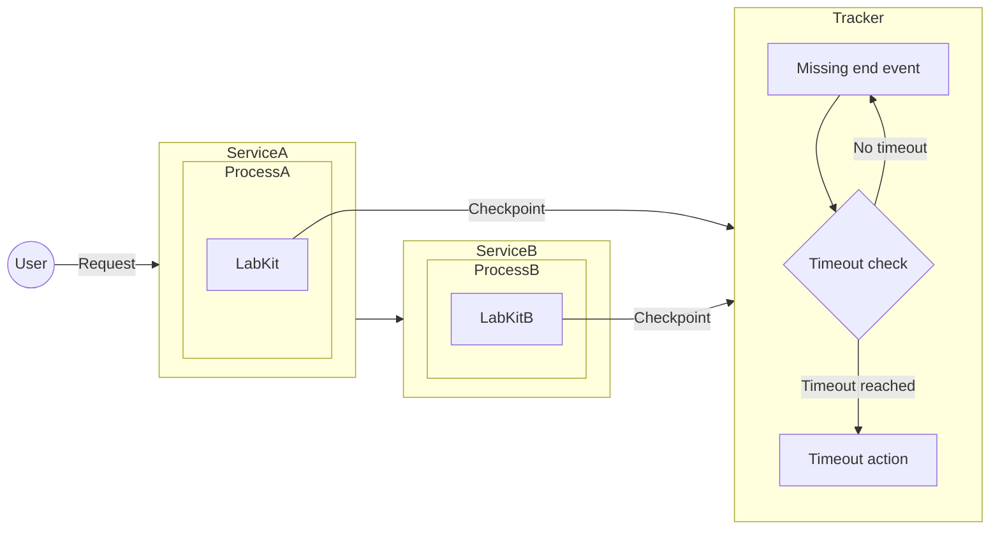
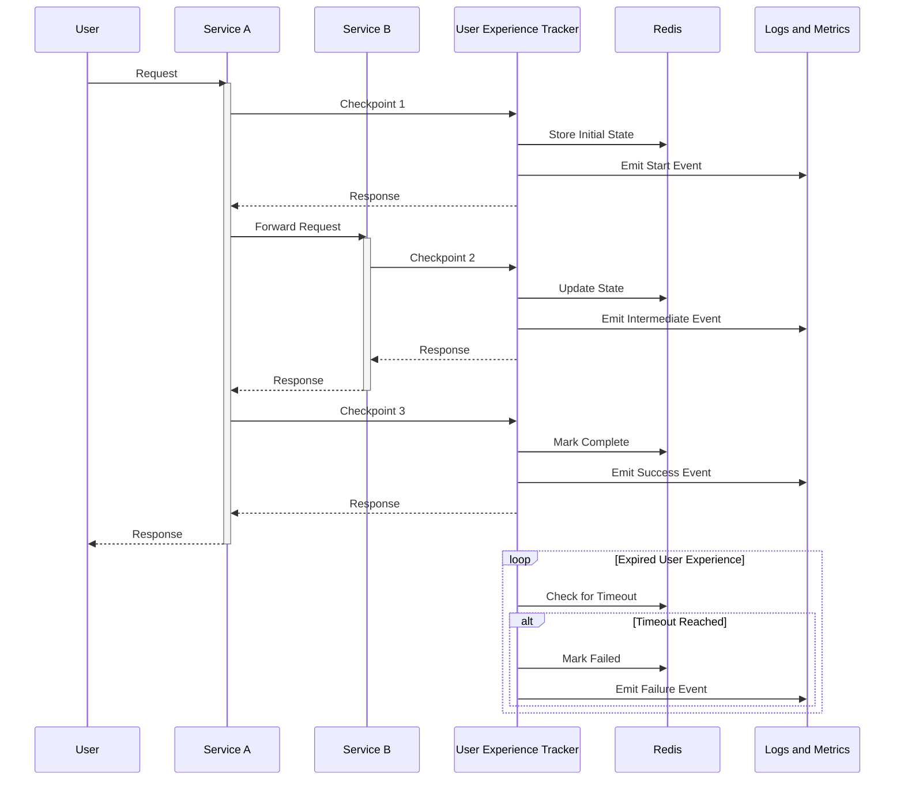
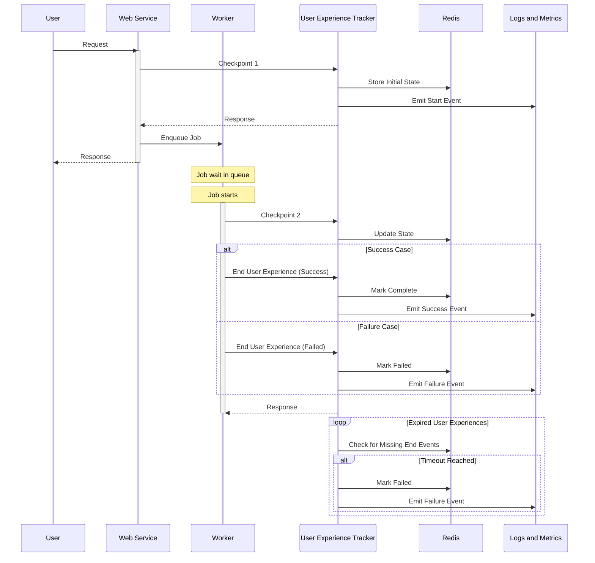

<!-- vale gitlab.FutureTense = NO -->

<!-- This renders the design document header on the detail page, so don't remove it-->


## Motivation

Continuing the work from [User Experience SLIs](_index.md), this addendum focus on the augmentation of the User Experience Framework
by introducing a new service, the User Experience Tracker, that will add the capability of tracking User Experiences that
never complete (due to errors mid journey), or do not complete within its expected lifetime.

This is being kept separate from the main blueprint for the reason that it is subject to change. The content presented here is aspirational only.

## Scope

The [User Experience Tracker](#user-experience-sli-tracker) is going to be responsible for the User Experience time out verification --
especially relevant for tracking the asynchronous User Experience SLIs.

With the SDK consolidated, we can move and centralize the functionality of emitting events to this service, removing the complexity from the SDK.

The project will consist of:

1. [User Experience SLI Tracker](#user-experience-sli-tracker)
2. [LabKit SDK](#sdk-requirements)

Example:

The project work items are scoped in the [epic #1540](https://gitlab.com/groups/gitlab-com/gl-infra/-/epics/1540).

## User Experience SLI Tracker

- Centralized User Experience SLI state tracking
- Sensible time to live (TTL) threshold for User Experience duration
- State is stored and managed by Redis. Allowing the querying of stale User Experiences, timing out after configured threshold.
- [Authentication](#authentication)
- Deployments:
  - Runway service for GitLab.com
  - Runway hosted service for Dedicated

It will serve an endpoint that will respond to the client generated payload:

| Field               | Type              | Required           | Description                                                                                                   | Example                            |
|---------------------|-------------------|--------------------|---------------------------------------------------------------------------------------------------------------|------------------------------------|
| correlation_id      | string (ULID)     | Yes                | Unique identifier for the user experience                                                                     | "01JP0EM7HB39WSJNR4662MYZ6V"       |
| user_experience_id  | string            | Yes                | Identification of the User Experience                                                                         | "http_request"                     |
| checkpoint          | string            | Yes                | Which step in the lifecycle                                                                                   | "start" \| "end" \| "intermediate" |
| checkpoint_category | string            | No                 | A domain specific category for the checkpoint. TBD: impose limited cardinality.                               | "authorize"                        |
| type                | string            | Yes                | Service/component generating the event                                                                        | "web", "database"                  |
| feature_category    | string            | Yes                | [GitLab feature category](https://docs.gitlab.com/development/feature_categorization/#feature-categorization) | "source_code_management"           |
| urgency             | string            | Yes                | How quickly a process needs to complete based on user expectations                                            | "sync_fast"                        |
| client_timestamp    | string (ISO-8601) | Yes                | Timestamp when event occurred                                                                                 | "2025-02-06T14:30:00Z"             |
| server_timestamp    | string (ISO-8601) | No (Response only) | Server processing timestamp                                                                                   | "2025-02-06T14:30:00.123Z"         |
| meta                | object            | No                 | i.e. https://docs.gitlab.com/development/logging/#logging-context-metadata-through-rails-or-grape-requests    |                                    |

A background process verifies all stale User Experience SLIs and clears them out, emitting failure events.

Components interactions given a synchronous User Experience:

Components interactions given an asynchronous User Experience:

### Authentication

Authentication between the SDK and the User Experience SLI Tracker is required to prevent the sending of unexpected events that could distort the reliability metrics of GitLab features.
E.g. the ai-gateway [authentication and authorization](https://gitlab.com/gitlab-org/modelops/applied-ml/code-suggestions/ai-assist/-/blob/884ec8a1e92c1db13f12a1b0093e4e82aa50cad7/docs/auth.md).

## SDK Requirements

- Trigger events towards the Tracker, instead of directly pushing events
- Automatic retries with exponential backoff for sending events to the User Experience SLI Tracker
