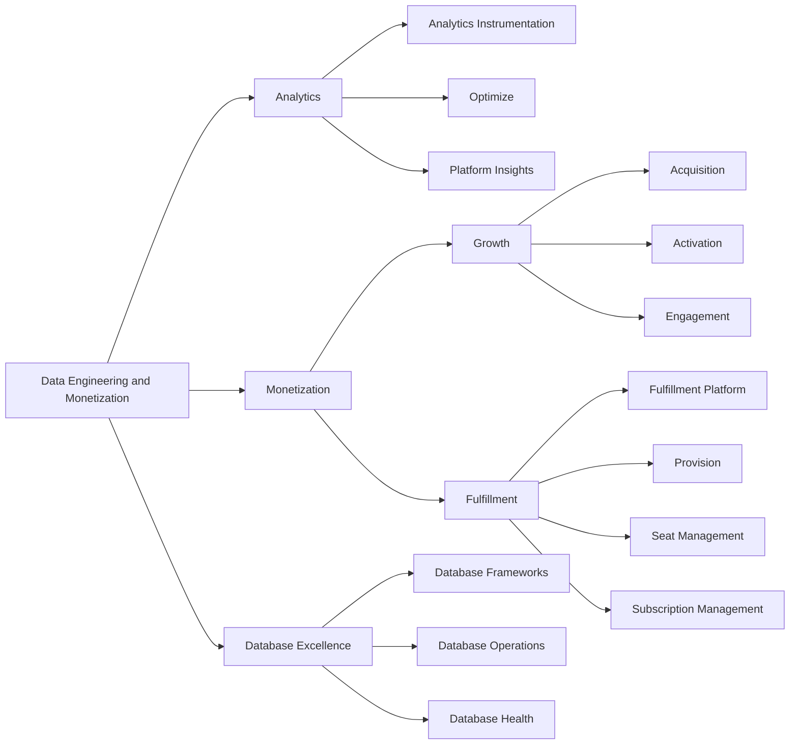

## Mission

We build the unified data foundation, both operational and analytical, that scales GitLab across every deployment model and unlocks intelligent monetization. By connecting fragmented systems into a seamless, low-touch ecosystem and ensuring zero data issues during migrations and upgrades, we enable customers to adopt new features faster while transforming raw data into leading indicators across customer journeys that accelerate growth and competitive advantage.

## Vision

We envision GitLab to define Developer-Led Economy: A global shift where software developers, empowered by agents and data-driven platforms, are the core drivers of innovation, growth, and competitive advantage—similar to how oil defined industrial power in the 20th century.

## Organization Structure

