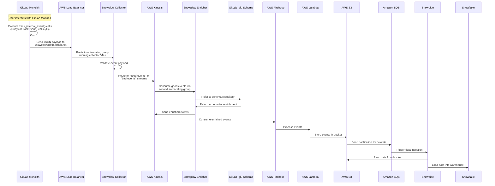
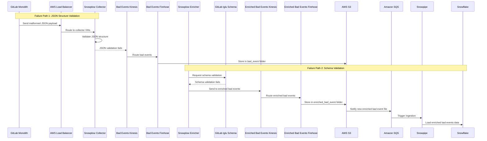

## Overview

The Internal events data flow varies based on the following factors:

**Deployment Types:**

- **Self-Managed**: Customer-hosted GitLab instances
- **GitLab Dedicated**: Single-tenant cloud instances managed by GitLab
- **GitLab.com (SaaS)**: Multi-tenant cloud offering

**Services:**

- **[GitLab Monolith](https://gitlab.com/gitlab-org/gitlab)**: Core GitLab application and primary service
- **[AI Gateway](https://gitlab.com/gitlab-org/modelops/applied-ml/code-suggestions/ai-assist)**: Service handling AI-powered features and requests
- **[GitLab Language Server](https://gitlab.com/gitlab-org/editor-extensions/gitlab-lsp)**: Language support and code intelligence service
- **[Switchboard](https://gitlab.com/gitlab-com/gl-infra/gitlab-dedicated/switchboard)**: Service that allows GitLab Dedicated customers to manage their tenant environments

## Self-Managed Instance Data Flow (GitLab Monolith)

### Happy Path Data Flow

The following sequence diagram shows how Internal Events data flows from feature usage to the data warehouse for self-managed GitLab instances:

### Data Flow Explanation

Internal events tracking requires GitLab 18.0+ and customer opt-in for self-managed instances.

**Event Generation**: User interactions with instrumented features trigger `track_internal_event()` calls in Ruby or `trackEvent()` calls in JavaScript (which wrap the Ruby method via API).

**Collection**: Events are sent as JSON payloads to the Snowplow collector at `snowplowprd.trx.gitlab.net`. The endpoint is an AWS Load Balancer that routes traffic to Snowplow collector VMs running in an autoscaling group.

**Validation & Routing**: The collector validates JSON structure and routes events to AWS Kinesis streams - "good events" for valid data and "bad events" for invalid data.

**Enrichment**: A second autoscaling group running Snowplow enricher VMs consumes good events from Kinesis, references the GitLab Iglu schema repository for validation and enrichment, then sends processed events back to Kinesis.

**Storage Pipeline**: AWS Firehose consumes the enriched Kinesis events, Lambda functions process them, and finally, Firehose writes the transformed data to S3 buckets.

**Data Warehouse**: S3 file arrivals generate event notifications sent to Amazon SQS, which triggers Snowpipe to automatically load the data into Snowflake for analytics.

### Failure Path Data Flow

The following diagram shows the two validation failure paths that can occur during event processing:

#### Failure Path Explanation

There are two validation failure points in the internal events pipeline:

**JSON Structure Validation Failure**: The first autoscaling group (collectors) validates the basic JSON structure of incoming payloads. When validation fails, events are routed to a dedicated "bad events" Kinesis stream, then processed by Firehose and stored in the `bad_event` folder in S3. Payloads that land in the `bad_event` folder are not ingested into Snowflake.

**Schema Validation Failure**: The second autoscaling group (enrichers) validates events against GitLab's Iglu schema repository. When schema validation fails, events are sent to an "enriched bad events" Kinesis stream, processed by Firehose, and stored in the `enriched_bad_event` folder in S3. These events follow the downstream processing pipeline - S3 notifications trigger Snowpipe via SQS, which ingests the enriched bad event data into Snowflake for analysis and debugging.
