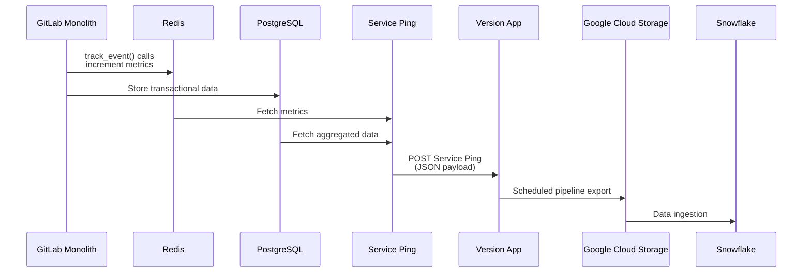

## Overview

This document shows how Service Ping data flows across GitLab's different deployment types and metric sources. Service Ping is GitLab's mechanism for collecting and aggregating usage analytics and operational metrics from GitLab instances.

The data flows vary across two key dimensions:

**Deployment Types:**

- **GitLab.com (SaaS)**: Multi-tenant cloud offering
- **Self-Managed**: Customer-hosted GitLab instances
- **GitLab Dedicated**: Single-tenant cloud instances managed by GitLab

**Metric Source Types:**

- **Database**: Aggregated counts and statistics from the GitLab database
- **Redis HLL**: HyperLogLog counters stored in Redis for unique count tracking
- **System**: System-level metrics and configuration data
- **Internal Events**: Event-based tracking and analytics
- **Redis**: General Redis-based counters and metrics
- **License**: Subscription and licensing information
- **Prometheus**: Infrastructure and application performance metrics

## Self-Managed Instance Data Flow

The following sequence diagram shows how Service Ping data flows from feature usage to the data warehouse for self-managed GitLab instances:

### Data Flow Explanation

The Service Ping data flow for self-managed instances follows a multi-stage process:

1. **Data Generation**: As users interact with GitLab features, two types of data are generated:
   - **Analytics tracking**: Ruby code executes `track_event()` calls and JavaScript code executes `trackEvent()` calls (which hit an API endpoint that wraps `track_event()`) to increment metrics stored in Redis clusters
   - **Transactional data**: Regular user interactions with the system (creating issues, commits, etc.) are stored in the PostgreSQL database as part of normal application operations

2. **Periodic Collection**: On a weekly schedule, the Service Ping process fetches metrics from both Redis and PostgreSQL. This includes retrieving counters, aggregated statistics, and other usage data.

3. **Payload Construction**: The collected data is assembled into a structured JSON payload containing all the metrics organized by their source types (database, redis_hll, system, internal events, redis, license, prometheus).

4. **Transmission**: The JSON payload is sent via HTTP POST to the Version App endpoint, which serves as the central collection point for Service Ping data from all GitLab instances.

5. **Storage and Export**: Version App stores the received data in its database. A scheduled pipeline job then exports this data to Google Cloud Storage, making it available for further processing.

6. **Data Warehouse Ingestion**: Finally, the data is ingested from Google Cloud Storage into Snowflake, where it becomes available for analytics, reporting, and business intelligence purposes.
