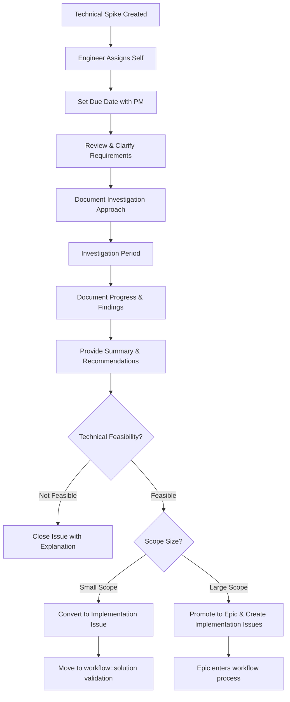

## Technical exploration ("Spike") guidelines

Occasionally, the team will be asked to dedicate time to exploring or "spiking" a technical solution to a problem or opportunity area deemed a priority by Growth PM. Technical spikes are fundamentally different than our typical work items as the result is more commonly a recommendation on a technical direction or solution rather than code, yet they still require dedicated developer focus and should be accounted for in our development workflows. As such, we've determined the following guidelines and responsibilities for individual Growth Engineers to follow when addressing a technical spike in our workflow:

Note: Technical spikes will serve as the single source of truth for implementation and will have one of three outcomes: conversion into a development implementation issue, promotion to an epic with additional implementation issues, or closure if determined not technically feasible.

**Inputs**

As a technical spike is prioritized and available for pickup in `~workflow::ready for development`, complete the following steps:

- Assign yourself, apply ~spike label, set the milestone and set the workflow label to `~workflow::in dev`
- Connect with the responsible PM to align on a reasonable due date for the technical spike and assign it accordingly. Duration will be dependent on the subject matter and Growth's familiarity with the topic.
- Review the contents of the technical spike issue body. Add any comments to clarify outstanding questions with the responsible PM. Identify potential needs for cross-team collaboration, subject matter expertise, or other important inputs for the technical spike.
- Add with your proposed approach and note any desired PM checkpoints.

**During the technical spike investigation period**

- Document your progress with detailed notes to support our async collaboration model and maintain an inclusive environment.
- Share any discoveries that might impact the spike's duration or scope with the responsible PM.
- If approaching the due date and needing more time, proactively discuss next steps with the responsible PM.

**Outputs**

As the technical spike work comes to a completion, complete the following steps to close out the spike process:

- Provide a summary comment with detailed learnings of your investigation and recommended path(s) for the solution in the spike issue. Include an outline of the recommended next step issues and/or epics to be created for the next phase of work.
- Tag in the responsible PM, EM, and Growth Engineering team (`@gitlab-org/growth/engineering` team) for review.
- Confirm with the responsible PM that the spike requirements have been met within the allotted duration time.

Based on your findings, proceed with one of these three outcomes:

1. **For technically infeasible solutions:** Close the issue with a clear explanation of the technical limitations discovered.

2. **For single-issue implementations:** Refine the technical details in the current issue and move it back into `~workflow::solution validation` for PM guidance.

3. **For multi-issue implementations:** Promote the spike to an epic and create the necessary implementation issues to break down the work. As the engineer who performed the spike, you are responsible for creating these implementation issues.

For outcomes 2 and 3, ensure technical details are sufficiently documented to support implementation once it re-enters later `workflow` stages.
