## What is Tier 2 On-Call?

Think of incident response like a triage system in a hospital:

Tier 1 is the first responder and they respond to all alerts across all systems. They determine what's actually broken and how serious it is.

Tier 2 (SME Specialists) are the experts who get called in when an issue requires deep knowledge of a specific domain or service. You know the code, architecture, and quirks of your particular system inside and out.

When Tier 1 encounters something complex in your domain, they escalate to you. You're the specialist they trust to fix it.

## How Does This Fit Into Our Organization?

Our incident response has multiple layers to make sure the right person is handling the right problem at the right time:

```mermaid
graph TD
    A["🚨 Alert Triggered"] --> B["Tier 1 On-Call<br/>First Responders"]
    B --> C{"Requires Domain<br/>Expertise?"}
    C -->|No| D["✅ Tier 1 Resolves"]
    D --> E["📝 Document & Close"]
    C -->|Yes| F["📞 Escalate to Tier 2"]
    F --> G["Tier 2 SME<br/>Domain Specialist<br/>YOU"]
    G --> H["🔍 Investigate &<br/>Apply Deep Knowledge"]
    H --> I{"Complex<br/>Escalation?"}
    I -->|No| J["✅ Tier 2 Resolves"]
    I -->|Yes| K["📞 Escalate to<br/>Management"]
    J --> L["📝 Document & Close"]
    K --> L
    
    style A fill:#ff6b6b
    style B fill:#4ecdc4
    style G fill:#ffe66d
    style D fill:#95e1d3
    style J fill:#95e1d3
    style E fill:#c7f0d8
    style L fill:#c7f0d8
    style K fill:#f38181
```

## What Does Tier 2 On-Call Actually Involve?

When you're on-call, you're responsible for being reachable during your shift (we'll define exact hours for your rotation), responding within 15 minutes when you get paged with a critical issue, investigating and resolving problems in your domain, communicating progress and next steps during incidents, documenting what happened so others can learn from it, and handing off to the next on-call engineer when your shift ends.

You're not expected to know everything or fix every problem instantly. You're expected to be available, engaged, and willing to dig into issues when they arise.

## Why Do We Have Tier 2 On-Call?

This program exists to keep the platform stable by having experts ready to respond to domain-specific problems, balance the load so not everyone gets paged for every issue, develop engineers by giving you ownership and experience with production issues, and build institutional knowledge by documenting what breaks and how we fix it.

## Who Is Involved?

The Tier 2 on-call program involves you and your teammates as Tier 2 engineers, your rotation leader who manages the schedule and escalation paths, Tier 1 on-call who are the first responders that will page you, the IMOC who coordinates during complex incidents, and management who provides support and handles escalations.

### Related Pages

- [Your First Shift](/handbook/engineering/devops/oncall/your-first-shift) — Prepare for your first on-call rotation
- [Communication and Culture](/handbook/engineering/devops/oncall/communication-and-culture) — Learn how we communicate during incidents
- [On Call Processes and Policies](/handbook/engineering/infrastructure/incident-management/on-call/) — Learn about Tier 2 specific responsibilities
