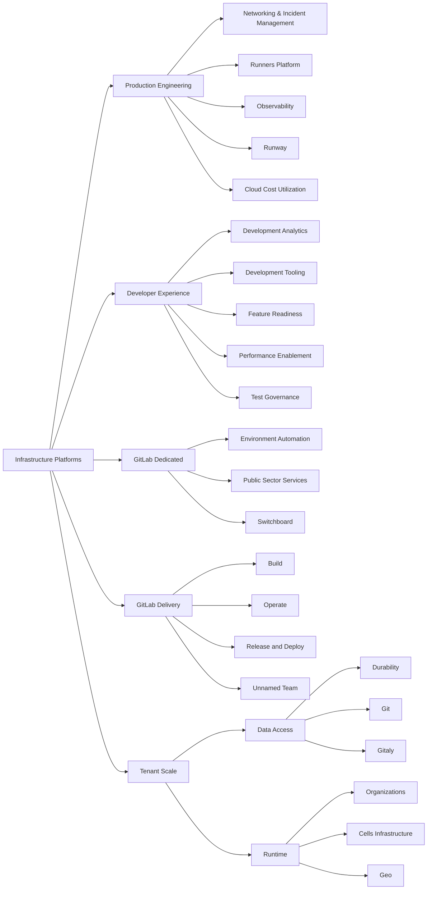

## Mission

As Infrastructure Platforms, our mission is to enable GitLab to deliver a single DevSecOps platform across SaaS and self-managed platforms by building highly available, reliable, performant, and scalable infrastructure solutions while maintaining the lowest total cost of ownership.

## Vision

Deliver the industry leading SaaS solutions, empowering organizations worldwide with the most innovative and efficient DevSecOps platform.

## Getting Assistance

If you're a GitLab team member and are looking to alert the Infrastructure Platforms teams about an availability issue with GitLab.com, please find quick instructions to report an incident here: [Reporting an Incident](/handbook/engineering/infrastructure/incident-management/#reporting-an-incident).

For all other queries, please see the [getting assistance](/handbook/engineering/infrastructure-platforms/getting-assistance/) page.

## Direction

Initiatives driven within the Platforms section, often spanning multiple quarters, are represented on the [SaaS Platforms section epic](https://gitlab.com/groups/gitlab-com/-/epics/2115) (GitLab team member).

{}

## Organization structure

(click the boxes for more details)

## Dogfooding

The Infrastructure Platforms department uses GitLab and GitLab features extensively as the main tool for operating many [environments](/handbook/engineering/infrastructure-platforms/environments/), including GitLab.com.

We follow the same [dogfooding process](/handbook/engineering/development/principles/#dogfooding) as part of the Engineering function, while keeping the [department mission statement](#mission) as the primary prioritization driver. The prioritization process is aligned to [the Engineering function level prioritization process](/handbook/engineering/#prioritizing-technical-decisions) which defines where the priority of dogfooding lies with regards to other technical decisions the Infrastructure Platforms department makes.

When we consider building tools to help us operate GitLab.com, we follow the [`5x rule`](/handbook/product/product-processes/dogfooding-for-r-d/#dogfooding-process) to determine whether to build the tool as a feature in GitLab or outside of GitLab. To track Infrastructure's contributions back into the GitLab product, we tag those issues with the appropriate [Dogfooding](https://gitlab.com/groups/gitlab-org/-/labels?utf8=%E2%9C%93&subscribed=&search=dogfooding) label.

## Handbook use at the Infrastructure Platforms department

At GitLab, we have a [handbook first policy](/handbook/about/handbook-usage/#why-handbook-first). It is how we communicate process changes, and how we build up a single source of truth for work that is being delivered every day.

The [handbook usage page guide](/handbook/about/handbook-usage/) lists a number of general tips. Highlighting the ones that can be encountered most frequently in the Infrastructure Platforms department:

1. The wider community can benefit from training materials, architectural diagrams, technical documentation, and how-to documentation. A good place for this detailed information is in the related project documentation. A handbook page can contain a high level overview, and link to more in-depth information placed in the project documentation.
1. Think about the audience consuming the material in the handbook. A detailed run through of a GitLab.com operational runbook in the handbook might provide information that is not applicable to self-managed users, potentially causing confusion. Additionally, the handbook is not a go-to place for operational information, and grouping operational information together in a single place while explaining the general context with links as a reference will increase visibility.
1. Ensure that the handbook pages are easy to consume. Checklists, onboarding, repeatable tasks should be either automated or created in a form of template that can be linked from the handbook.
1. The handbook is the process. The handbook describes our principles, and our epics and issues are our principles put into practice.

## Projects

Classification of the Infrastructure Platforms department projects is described on the [infrastructure department projects page](/handbook/engineering/infrastructure-platforms/projects).

The [infrastructure issue tracker](https://gitlab.com/gitlab-com/gl-infra/production-engineering/-/issues) is the backlog and a catch-all project for the infrastructure teams and tracks the work our teams are doing–unrelated to an ongoing change or incident.

In addition to tracking the backlog, Infrastructure Platforms department projects are captured in our [Infrastructure Platforms department Epic](https://gitlab.com/groups/gitlab-com/-/epics/1049) as well as in our [Quarterly Objectives & Key Results](https://gitlab.com/groups/gitlab-com/-/epics/1420)

## Design

The [**Infrastructure Library**](https://gitlab.com/gitlab-com/gl-infra/readiness/-/tree/master/library) contains documents that outline our thinking about the problems we are solving and represents the ***current state*** for any topic, playing a significant role in how we produce technical solutions to meet the challenges we face.

## Technical Roadmap

Infrastructure maintains a [Technical Roadmap](/handbook/engineering/#technical-roadmaps)
for planning projects over the short (1y), medium (2y), and long term (3y).
This serves as our strategic compass,
helping us balance immediate needs with long-term sustainability.

The Technical Roadmap is based on the [Product Roadmap](https://about.gitlab.com/direction/),
where Product provides the "What" (customer needs) and "Why" (business strategy).
Engineers then determine the "How" (technical implementation),
while Engineering Managers plan the "When" (scheduling).
This comprehensive roadmap emphasizes building high-quality,
complete features in a sustainable manner.

The Technical Roadmap serves three key purposes:

1. It helps build engineering excellence by addressing critical areas that might not show up in product backlogs,
   such as technical debt, performance improvements, platform improvements, and system scalability.

1. It enables the department to be proactive rather than reactive.
   By regularly asking key questions like "Where do we see the biggest instability in our systems?" or
   "What is generating the most toil?", we can address issues before they become critical problems.
   This helps maintain our SLOs and keeps our customers happy.

1. It aligns engineering efforts with business goals, ensuring technical improvements drive GitLab's success.
   Each technical roadmap item is prioritized based on business value and strategic alignment.

### Current State

The Infrastructure Roadmap is maintained as a static site.
GitLab team-members can review the current technical roadmap,
at [infra-roadmap.gitlab.com](https://infra-roadmap.gitlab.com/).

**NOTE**:
The Infrastructure Roadmap is not publicly available as some of the projects and
initiatives may be considered [unSAFE](/handbook/legal/safe-framework/).

The site presents the roadmap in a visual manner, showing:

- Dependencies between planned initiatives
- Filtering options by confidence, stage, or tags
- Individual roadmaps for each stage within the department
- Impact analysis through dependency visualization

### Updating the Roadmap

Changes to the Roadmap are made through merge requests to the [`infra-roadmap`](https://gitlab.com/gitlab-com/gl-infra/infra-roadmap/-/tree/main/data) project.
The data is stored in YAML format, and changes can be made by editing the YAML.
This allows for version control and collaborative discussion through the merge request process.

Full instructions for making changes to the Infrastructure Roadmap are available
in [the project's README.md](https://gitlab.com/gitlab-com/gl-infra/infra-roadmap/-/blob/main/README.md#updating-the-roadmap).

Everyone is encouraged to contribute to the roadmap,
whether proposing new initiatives or making smaller changes
like updating descriptions or adding links to relevant issues.

## Supporting Product Features

We have a model that we use to help us support product features. [This model](/handbook/engineering/infrastructure-platforms/feature-support/) provides details on how we collaborate to ship new features to Production.

## How we work

### Communication

#### Slack

Our main method of communication is Slack.

If you need assistance with a production issue or incident, please see the section on [getting assistance](/handbook/engineering/infrastructure-platforms/getting-assistance/).

**SaaS Platforms**

| **Channel** | **Purpose** |
|-----------|-----------|
| [#infrastructure_-_platforms](https://gitlab.slack.com/archives/C02D1HQRTKQ) | We collaborate on department level items here. This channel is used to share important information with the wider team, but also serves to align all teams in Platfroms with the common topic. |
| [#g_infrastructure_platforms_leads](https://gitlab.slack.com/archives/C010QV6RRB3) | Communication for managers. Everyone interested is welcome to join this channel if they find the topics interesting. |
| [confidential managers channel](https://gitlab.enterprise.slack.com/archives/C0808MLEXL1) | Used to discuss staffing issues affecting all teams that require additional coordination. We default to using the public channel as much as possible.|
| [#infrastructure_platforms_social](https://gitlab.enterprise.slack.com/archives/C062T669RFD) | Our social channel. |

**Dedicated**

| **Channel** | **Purpose** |
|-----------|-----------|
| [#g_dedicated-team](https://gitlab.enterprise.slack.com/archives/C025LECQY0M)| Dedicated Group discussion channel. Please use this channel for discussions relevant to engineers across the Dedicated group |
| [#f_gitlab_dedicated](https://gitlab.enterprise.slack.com/archives/C01S0QNSYJ2)| Dedicated function channel. Please use this channel to ask questions about features or ways of using the Dedicated product. Dedicated group will use this channel to make announcements relevant to wider groups |
| [#g_dedicated-us-pubsec](https://gitlab.enterprise.slack.com/archives/C03R5837WCV)| Dedicated USPubSec team channel. Used to discuss topics that affect PubSec team only. For broader engineering discussions please use [#g_dedicated-team](https://gitlab.enterprise.slack.com/archives/C025LECQY0M) |
| [#g_dedicated-switchboard-team](https://gitlab.enterprise.slack.com/archives/C04DG7DR1LG)| Dedicated Switchboard team channel. Used to discuss topics that affect Switchboard team only. For broader engineering discussions please use [#g_dedicated-team](https://gitlab.enterprise.slack.com/archives/C025LECQY0M)|
| [#g_dedicated-environment-automation-team](https://gitlab.enterprise.slack.com/archives/C074L0W77V0)|Dedicated Environment Automation team channel. Used to discuss topics that affect Switchboard team only. For broader engineering discussions please use [#g_dedicated-team](https://gitlab.enterprise.slack.com/archives/C025LECQY0M)|
| [#g_dedicated-team-social](https://gitlab.enterprise.slack.com/archives/C03QBGQ3K5W)| Dedicated social channel|
| [#dedicated-mr-review-stream](https://gitlab.enterprise.slack.com/archives/C065DDKPL21)| Visibility of new merge requests on Dedicated repos |

**Delivery**

| **Channel** | **Purpose** |
|-----------|-----------|
|[#g_release_and_deploy](https://gitlab.enterprise.slack.com/archives/g_release_and_deploy)| Release and Deploy Group channel|
|[#g_release_and_deploy_social](https://gitlab.enterprise.slack.com/archives/C01QX84J6UR)| Social channel for the group. |
|[#releases](https://gitlab.enterprise.slack.com/archives/C0XM5UU6B)| General communication about the current Release/Patch|
|[#f_upcoming_release](https://gitlab.enterprise.slack.com/archives/C0139MAV672)| Detailed Release status / Release Manager channel |
|[#announcements](https://gitlab.enterprise.slack.com/archives/C8PKBH3M5)|Release-Tools automation posts related to deployment activity|

**Production Engineering**

| **Channel** | **Purpose** |
|-----------|-----------|
| [#s_production_engineering](https://gitlab.enterprise.slack.com/archives/C07U6SAKS4D)| General conversation for Production Engineering teams and requests coming in from other team members. |
| [#g_production_engineering_leads](https://gitlab.enterprise.slack.com/archives/C06LDGA7Z9S)| Channel for Production Engineering leads (staff+ and management) |
| [#g_networking_and_incident_management](https://gitlab.enterprise.slack.com/archives/C09BM5XCPBP)| Networking & Incident Management team channel |
| [#g_observability](https://gitlab.enterprise.slack.com/archives/C065RLJB8HK)| Observability team channel |
| [#g_runners_platform](https://gitlab.enterprise.slack.com/archives/C08TJEKF0JZ)| Runners Platform team channel |
| [#g_runway](https://gitlab.enterprise.slack.com/archives/C07UED5CGR2)| Runway team channel |

**Tenant Scale**

| **Channel** | **Purpose** |
| ----------- | ----------- |
|[#s_tenant_scale](https://gitlab.enterprise.slack.com/archives/C07TWC3QX47) | General conversation for Tenant Scale and requests coming from other teams. |
|[#g_organizations](https://gitlab.enterprise.slack.com/archives/C01TQ838Y3T) | Discussions and requests specific to the Organizations team. |
|[#g_geo](https://gitlab.enterprise.slack.com/archives/C32LCGC1H) | Discussions and requests specific to the Geo team. |
|[#g_cells_infrastructure](https://gitlab.enterprise.slack.com/archives/C07URAK4J59) | Discussions and requests specific to the Cells Infrastructure team. |
|[#f_cells_and_organizations](https://gitlab.enterprise.slack.com/archives/C0609EXHX6F) | Channel for cross-functional discussion and coordination on Cells and Organizations. |

The SaaS Platforms group is gradually directing requests for help to the [#saas-platforms-help](https://gitlab.enterprise.slack.com/archives/C07DU5Z7V6V) Slack channel.
This channel can be used if it is unclear which Infrastructure team the question should be directed to.
For more information, refer to the [landing page for getting assistance](/handbook/engineering/infrastructure-platforms/getting-assistance/).

The [#saas-platforms-help](https://gitlab.enterprise.slack.com/archives/C07DU5Z7V6V) channel is monitored by SaaS Platforms Engineering Managers and Staff+ engineers who triage any inbound requests. When triaging this channel, one should locate the team who can best answer this question and instruct the requestor to contact that team using the team's preferred contact method. When the requestor is connected to the right team, add a green check emoji to the message. Finally, if needed, update the [getting assistance](/handbook/engineering/infrastructure-platforms/getting-assistance/) page with any changes.

#### Meetings

Once per week, we hold a `Platforms leads call` to align on action items related to career development, general direction or answer any ongoing questions that have not been addressed async. The call is cancelled when there are no topics added on the morning of the call.

In addition to the `Platforms leads call`, we have some recurring events and reminders that can be viewed in the [SaaS Platforms Leadership Calendar](https://calendar.google.com/calendar/embed?src=c_8a81f7acc76d72b8e4189a61f7a259b9d722e3fe1e05693236f592e7dd52e83b%40group.calendar.google.com). Please add this to your Calendars to stay up-to-date with the various events.

Sr. Director of Infrastructure Marin Jankovski, likes to meet with new team members that join the organization. Marin sets up informal 1:1 coffee chats a few times a month with newer team members to get to know one another and see how they are doing. This process is organized by his EBA who will reach out to team members once he has the availability to meet. As this is a large team, it may take a while to get through everyone.
If someone needs to meet with Marin sooner than when the coffee chat is scheduled, you can reach out to his EBA Liki Simonot to set something up.

##### Grand Review

The Engineering Leads for each Stage, along with their Product Managers, hold weekly progress reviews to assess their groups’ progress, share project updates, resolve blockers, and celebrate wins. Additionally, the Director of Product and the Senior Director of Infrastructure Platforms conduct a higher-level leadership review, where they go over summaries from these group-level meetings.

**Weekly Schedule**

- Wednesday (or depending what day is configured for the team): each Epic DRI will receive a [note that mentions them for a status update about updating progress](/handbook/engineering/infrastructure/platforms/project-management/#status-updates-on-project-epics). Keep updates short, and include:
  - New achievements from a high-level, business-oriented point of view. Graphs, demos, visualizations are also welcome.
  - Changes to risks, blockers, timelines, scope, and whether you need help or surfacing FYI
  - New key decisions made
  - Projects that are completed, including a [closing summary highlight in the epic description](/handbook/engineering/infrastructure/platforms/project-management/#when-a-project-is-finished). Leave the epic open, with the In Progress label. These epics will be closed during the Grand Reviews.
- Thursday: Group Level Reviews conducted and added as threads in [Infrastructure Platforms Top Level epic](https://gitlab.com/groups/gitlab-com/-/epics/2115) (see [example](https://gitlab.com/groups/gitlab-com/-/epics/2115#note_2197983622))
  - Data Access: run by the Data Access Acting Sr. EM and the Group PM
  - Tenant Scale: run by the Tenant Scale Sr. EM and Group PM
  - Production Engineering: run by the Production Engineering Sr. EM and Group PM
  - Software Delivery: run by the Software Delivery Acting Sr. EM and Group PM
  - Developer Experience: run by the Developer Experience Director and a rotation of Product Managers
  - Dedicated: run by the Dedicated Director and a Group PM
- Friday: Leadership Review, run by the Sr. Director of Infrastructure Platforms and the Director of Product Infrastructure Platforms. Review the group-level summaries added as threads in the [Infrastructure Platforms Top Level epic](https://gitlab.com/groups/gitlab-com/-/epics/2115), then conduct a deep dive into one specific group to ensure comprehensive project coverage.
- Friday: Group level and the leadership level reviews are released together in #infrastructure_platforms

The review is private streamed to the GitLab Unfiltered channel because the review covers confidential issues. All recordings are made available in the [Platforms Grand Review YouTube Playlist](https://www.youtube.com/playlist?list=PL05JrBw4t0KqDXSHdlUvPWHOj_Hw8JdQ1)

##### Infrastructure Platforms Leads Demo

The Infrastructure Platforms Leads Demo is an opportunity for sync discussions between Staff+ IC across the Infrastructure Platforms Group to highlight current ongoing efforts underway in the teams they support.
All team members are welcome to join the call, but the emphasis is on Staff+ ICs to present and discuss the work they're focused on, the problems they're experiencing, and solutions they're considering.

The call is recorded to the [Infrastructure Platforms Leads Demo Unfiltered Playlist](https://www.youtube.com/playlist?list=PL05JrBw4t0KpI98ZtrhYrA_gJgYJjnOgl). The agenda can be found in [Google Docs](https://docs.google.com/document/d/1MX__hMUcxEUv2JlRiXySNvFnOPHv7-Uul1_VbzImbKw/edit).

While the intention is for the call to be made public on GitLab Unfiltered, the default is for it to be published as private.
At the end of the call, a quick vote is held between the attendees and if all agree that the content is #SAFE, it can be published as public.

### Requests for Help

On the [landing page for getting assistance](/handbook/engineering/infrastructure-platforms/getting-assistance/), we ask team-members who need assistance to raise Requests for Help using standard templates.

These issues are raised in the [request for help issue tracker](https://gitlab.com/gitlab-com/saas-platforms/saas-platforms-request-for-help/-/issues) and are automatically assigned to the Engineering Manager of the relevant SaaS Platforms team.

The Engineering Manager is expected to:

1. Confirm that the question is not a duplicate and that the answer to the question is not already discoverable in the handbook or the tracker itself.
2. Confirm the urgency of the request.
3. Respond to the help request or assign to an engineer to help with the request.

### Slack to GitLab Issue Tracker Integration

In an effort to enhance the tracking and resolution of requests directed to the Infrastructure team, we are evaluating a bot that converts Slack messages in [#infrastructure_lounge](https://gitlab.slack.com/archives/CB3LSMEJV) channel into GitLab issues.

#### Workflow Overview

- **Acknowledgement**: An agent responds with the `acknowledged_emoji` (👀 in our case) to acknowledge a Slack message in the Infrastructure Lounge channel.
- **Issue Creation**: The Slack bot then creates an issue with the acknowledging agent assigned to it.
- **Thread Attachment**: The Slack thread corresponding to the message is also posted on the created GitLab issue.
- **Label Assignment**: Agents can further categorize issues by adding label emojis (`ops`, `foundations`, `observability`) in the Slack message. This action automatically assigns the issue to the respective team: Ops, Foundations, Observability.
- **Project Tracking**: These converted issues are tracked under a dedicated project hosted at [Infrastructure Lounge Slack Issue Tracker](https://gitlab.com/gitlab-com/gl-infra/infrastructure-lounge-slack-issue-tracker).
- **Issue Closure**: Agents/Requester can close the issue when resolved by adding any of the `resolved_emojis` (`green-circle-check`,`white_check_mark`or `checked`in our case)

#### Configuration

Agents responsible for handling these issues are defined in a JSON file, which serves as a [CI/CD variable](https://ops.gitlab.net/gitlab-com/gl-infra/infrastructure-lounge-slack-issue-creator/-/settings/ci_cd). Currently, this file contains a static list of all members of the infrastructure department.

### Project and Backlog Management

We use epics and issues to manage our work. [Our project management process](/handbook/engineering/infrastructure/platforms/project-management/) is shared between all teams in SaaS Plaforms.

### Tools

The Platforms section builds and maintains various tools to help deploy, operate and monitor our SaaS platforms. You can view a list of these tools in the [Platforms Tools Index](/handbook/engineering/infrastructure/platforms/tools/).

### OKR

We use objective and key results to set goals in alignment with [OKRs at GitLab](/handbook/company/okrs/).
[Our OKR process](/handbook/engineering/infrastructure/platforms/okrs/) is shared between all teams in Saas Platforms.

### Hiring and Interviewing

[Our hiring process](/handbook/engineering/infrastructure/platforms/hiring/) is shared between all teams in Infrastructure Plaforms.

This [Infrastructure Platforms Interviewing Guide](/handbook/hiring/interviewing/infrastructure-interview/) offers more detail on some of our regular openings, interview process and other useful information related to applying to jobs with us. More information on our current openings can be found on the [careers page](https://about.gitlab.com/jobs/).

## Platforms Learning Path

All team members are encouraged to schedule time for personal development. The following links may help you get started with Platforms-relevant learning. Please add your own contributions to this list to help others with their personal development.

### Learn about Infrastructure Platforms, and its groups

| Group | Topic |
|-------|-------|
| SaaS Platforms | [Product direction](https://about.gitlab.com/direction/saas-platforms/) |
| Delivery Group | [Delivery Group](/handbook/engineering/infrastructure-platforms/gitlab-delivery/delivery/) |
| Production Engineering Group| [Production Engineering](/handbook/engineering/infrastructure-platforms/production-engineering/) |
| Dedicated Group | [Dedicated Group](/handbook/engineering/infrastructure-platforms/gitlab-dedicated/) |
| Tenant Scale | [Group Page](/handbook/engineering/infrastructure-platforms/tenant-scale/) |

### Learn about tools and technologies used within Platforms

1. [Jsonnet tutorial](https://jsonnet.org/learning/tutorial.html)

## Common Links

- [How we do Incident Management for GitLab.com](/handbook/engineering/infrastructure/incident-management/)
- [GitLab.com status information](https://status.gitlab.com)

### Other Slack Channels

- [#production](https://gitlab.slack.com/archives/production)
- [#infrastructure-lounge](https://gitlab.slack.com/archives/infrastructure-lounge)
- [#incidents](https://gitlab.slack.com/archives/incidents)
- [#announcements](https://gitlab.slack.com/archives/announcements)
- [#feed_alerts-general](https://gitlab.slack.com/archives/feed_alerts-general)

### General Issue Trackers

- [Production Engineering issue queue](https://gitlab.com/gitlab-com/gl-infra/production-engineering/-/issues)
- [Production incidents, and changes](https://gitlab.com/gitlab-com/gl-infra/production/issues/)
- [Release and Deploy](https://gitlab.com/gitlab-com/gl-infra/delivery/issues/)
- [Observability](https://gitlab.com/gitlab-com/gl-infra/observability/team/-/issues/)
- [Tenant Scale](https://gitlab.com/gitlab-com/gl-infra/tenant-scale/)
- [Runway](https://gitlab.com/groups/gitlab-com/gl-infra/platform/runway/-/issues)

### Resources

- [Production Architecture](/handbook/engineering/infrastructure/production/architecture/)
- [Operational Runbooks](https://gitlab.com/gitlab-com/runbooks)
- [Environments](/handbook/engineering/infrastructure-platforms/environments/)
- [Monitoring](/handbook/engineering/monitoring/)
- [Readiness Reviews](/handbook/engineering/infrastructure/production/readiness/)
- [Infrastructure Platforms Standards](/handbook/company/infrastructure-standards/)
- [Career development and Internships in Infrastructure Platforms](/handbook/engineering/infrastructure-platforms/careers)

## Other Pages

- [On-call Handover](/handbook/engineering/infrastructure-platforms/production-engineering/networking-and-incident-management/on-call-handover/)
- [On-call Shadowing](/handbook/engineering/infrastructure-platforms/production-engineering/networking-and-incident-management/on-call-shadowing/)
- [SRE Onboarding](/handbook/engineering/infrastructure-platforms/production-engineering/networking-and-incident-management/sre-onboarding/)
- [SRE Oncall Onboarding Buddies](/handbook/engineering/infrastructure-platforms/production-engineering/networking-and-incident-management/sre-oncall-onboarding-buddy/)
- [GitLab.com data breach notification policy](https://about.gitlab.com/security/#data-breach-notification-policy)
- [Coding at scale](/handbook/engineering/infrastructure/team/scalability/#regarding-coding-at-scale)
