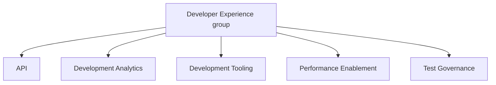

## Mission

Accelerate GitLab's engineering velocity while elevating quality standards by connecting teams, tools, and insights into a cohesive development ecosystem that works for everyone.

## Vision

Establish a DevEx platform for GitLab engineering teams that connects engineering tools, practices, and data into a single, easily discoverable location. Built on the GitLab application wherever possible, this internal platform leverages our own product to serve our engineering organization.

### What It Enables

Every GitLab engineer will confidently ship high-quality features through:

- Access to tools, tests, data, and insights about bugs, vulnerabilities, incidents, and production platform needs
- Rapid feedback on production readiness, feature quality, and security compliance

### Key Benefits

- Improved tool discoverability
- Stronger cross-department alignment
- Standardized development practices across engineering teams
- More consistent and efficient feature delivery
- Dogfooding our own product capabilities

## Strategic Objectives

To support GitLab's growth without becoming an SDLC bottleneck, DevEx will focus on three areas:

### 1. Build a DevEx Tools Platform

Provide a single entry point to well-designed, easily discoverable tools integrated directly into the development process. This eliminates toolchain overhead and setup time, letting teams own their objectives and focus on business value.

### 2. Capture Metrics and Provide Dashboards

Deliver metrics that support team decision-making and provide VP+ visibility into developer experience and quality through rollup reports

### 3. Deliver Complete, High-Quality User Experiences

Move from reactive support to proactive quality standards through:

- Thoughtfully designed processes
- Integrated tooling platforms
- Strategic testing frameworks

We'll anticipate GitLab's evolving needs (like AI development workflows) and empower teams through strategic consultation and comprehensive platform tools rather than direct DevEx support work. This platform-first approach leverages the GitLab application itself, allowing us to dogfood our own product while serving our engineering organization

DevEx will run quarterly DX surveys to track progress and identify new roadmap items.

## Working with us

Each [DevEx team](#team-structure) maintains a roadmap on their handbook page, and works on epics linked to a top-level team epic.

For ad-hoc or support requests, please use our [Request for Help Process](#request-for-help-process)

### Request for Help Process

Create issues to request support through the RFH process below. This will allow us to prioritize requests against our planned project roadmaps.

- Please follow the instructions in the [Request for Help](https://gitlab.com/gitlab-org/quality/request-for-help) project. Some teams in Developer Experience have their own Request for Help processes. If you are not sure where your request goes, please use the Developer Experience RFH project and we will route appropriately.
- Complete all sections of the template so we can quickly triage your request
- Developer Experience will triage the request within a week, adding appropriate labels and assigning team members based on the request type and priority.
- For more urgent requests please feel free to tag the management team above.

## Project Management

All work is tracked in epics and issues. We follow the [The Infrastructure Platforms Project Management processes](/handbook/engineering/infrastructure/platforms/project-management/)

### Starting a new project

Every project starts with an epic. Follow the [Infrastructure Platforms epic guide](/handbook/engineering/infrastructure/platforms/project-management/#epics) to create a new epic with the required information. The epic description should give the context, project scope, and intended outcomes. Often the epic will be an iteration of a larger project.

- Every project should have a DRI assigned. The DRI is responsible for making decisions, maintaining the epic and issues, and providing the weekly epic status update.
- We aim to have more than one person working on each project to allow for knowledge sharing. On projects with a single thread of work, we can knowledge share by working across timezones. Talk to your EM about the best way for the team to collaborate on work.

Follow the steps on https://gitlab.com/gitlab-com/gl-infra/epic-issue-summaries#child-epics to enable the weekly epic status automation used for Grand Reviews.

### Completing a project

After the planned work is completed, follow the [Infrastructure Platforms guide to finishing a project](/handbook/engineering/infrastructure/platforms/project-management/#when-a-project-is-finished)

## DevEx Grand Reviews

Every Thursday, the DevEx Senior EM, and one of the DevEx EMs, or their delegates, record a DevEx Grand Review to walk through the projects that are in progress. The goal is to improve project visibility across the section. [Top level epics](https://gitlab.com/groups/gitlab-org/quality/-/epics/113) are used to identify these projects.

Before Thursday 17:00UTC, DevEx EMs use the epic status updates to [draft updates for the Friday Platforms Grand Review - internal link](https://docs.google.com/document/d/1gnoXNSpMXPfDqOyKRfIUHfNHUmSu88x8vjIeDOv73dE/edit?usp=sharing). The DevEx updates are finalized on [the internal issue before the Friday Grand Review](https://gitlab.com/groups/gitlab-com/-/epics/2115) recording.

See the [Platforms Grand Review handbook section](/handbook/engineering/infrastructure/platforms/project-management/#projects-are-reviewed-weekly-in-the-grand-review) for more details about the department approach

## Developer Experience Demos

The DevEx section has internal sync demo calls scheduled for every other week. The goal of the demo calls is to build connections and share knowledge across the entire DevEx group.

People who want to demo something should add their name to the demo agenda sheet. Demos do not need to be polished or prepared in advance.

Please ping in the [DevEx Slack channel](https://gitlab.enterprise.slack.com/archives/C07TWBRER7H) if you would like to be added to the invite.

## Team Structure

[Infrastructure Platforms Department structure](/handbook/engineering/infrastructure-platforms/#organization-structure) is documented in our handbook.                                                                                                                   |

### Developer Experience group structure

## Team Members

### Management team



### Teams

#### API

The following people are members of the [API group](api):



#### Development Analytics

The following people are members of the [Development Analytics group](development-analytics):



#### Development Tooling

The following people are members of the [Development Tooling group](development-tooling):



#### Performance Enablement

The following people are members of the [Performance Enablement group](performance-enablement):



#### Test Governance

The following people are members of the [Test Governance group](test-governance):


