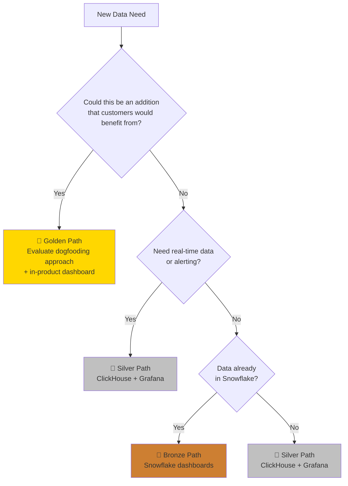
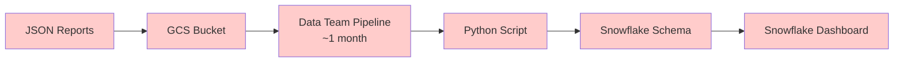
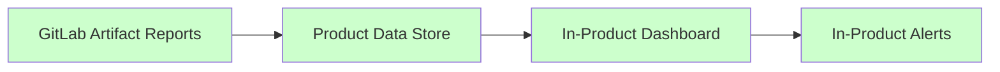

When we build custom tooling because a product feature is missing, we also create custom data. This custom data needs to go somewhere so we can monitor and alert on it. By turning our custom tools into product features (when applicable), the data becomes part of the product too - helping customers while reducing our maintenance work.

## Our Data Paths: Gold, Silver, Bronze

We use a medal system to guide teams toward the best approach based on their needs and constraints.

### 🥇 Golden Path (Target State)

**Data Storage:** Your data is already part of a GitLab product feature
**Visualizations:** In-product dashboards

This is our target state. When data is part of the product, it's automatically available for dashboards and benefits both internal teams and customers.

**Current blockers for Golden Path:**

- **Data storage:** Most custom data cannot yet be stored in the product (depends on [Data Insights Platform](/handbook/engineering/architecture/design-documents/data_insights_platform/) - no production estimate yet in [roadmap](/handbook/engineering/architecture/design-documents/data_insights_platform/#rollout-roadmap))
- **Custom dashboards:** Not yet available for product data (depends on Data Exploration feature in [Dashboard Foundations epic](https://gitlab.com/groups/gitlab-org/-/epics/18072) - planned for **FY26 Q4**)
- **Alerting:** Real-time alerting on product data not yet planned (though feature teams are open to the idea)

### 🥈 Silver Path (Good Alternative)

**Data Storage:** Custom data in ClickHouse
**Visualizations:** Grafana dashboards

Use this for custom data that isn't part of the product yet, or operational monitoring that needs real-time updates.

**Shared Devex ClickHouse instance**: For most datasets (unless unusually large), Development Analytics maintains a ClickHouse instance that can be used across Developer Experience. Please reach out on #g_development_analytics to get more details.

### 🥉 Bronze Path (Legacy/Special Cases Only)

**Data Storage:** Snowflake
**Visualizations:** Snowflake dashboards

Use this only for existing data already in Snowflake where migration isn't cost-effective, or when you need specific Snowflake features.

## When to Use Each Path

**Choose Gold when:**

- Your data could benefit GitLab customers
- You're building something that should be a product feature
- You want zero maintenance overhead

**Choose Silver when:**

- You need real-time monitoring and alerting (when migrating from Bronze)
- Your data is custom/operational and not suitable for product features (yet)
- You need self-service data pipeline setup
- You're prototyping before building a product feature

**Choose Bronze when:**

- Your data already exists in Snowflake
- You're doing one-off analysis that doesn't need real-time updates
- You don't need alerting capabilities

## Decision Flowchart

## Example: Backend Test Data

**Bronze Path (Past Implementation):**

**Silver Path (Current Implementation):**

**Golden Path (Target Implementation):**

**Legend:**
🔴 Custom tooling/infra
🟢 No custom tooling/infra

This shows how the Golden path eliminates maintenance work for us while creating customer value.

## Migration Paths

### Custom Solutions → Silver

For teams with existing custom data storage and visualization solutions (InfluxDB/Grafana, fully custom UIs, custom databases, etc.), migrate to the standardized Silver path:

1. **Audit existing data sources and pipelines** to understand what data you're collecting and how it's structured
2. **Export sample data** to validate the migration approach
3. **Set up ClickHouse data pipeline** from your existing data sources
4. **Recreate key visualizations in Grafana** using standardized ClickHouse data
5. **Validate data accuracy and performance** between old and new systems
6. **Add improved alerting and monitoring** using Grafana's native capabilities
7. **Gradually migrate users** from custom solutions to Grafana dashboards
8. **Decommission legacy systems** once migration is complete and validated

*Examples of custom solutions that should migrate: InfluxDB + Grafana stacks, BigQuery + custom UIs, PostgreSQL + custom dashboards, Elasticsearch + Kibana, custom time-series databases*

### Bronze → Silver

1. **Export existing Snowflake queries** to understand data structure
2. **Set up ClickHouse data pipeline** from your data source
3. **Recreate visualizations in Grafana** using ClickHouse data
4. **Validate data accuracy** between old and new systems
5. **Add alerting and monitoring** with new Grafana dashboards

*Note: You can also migrate directly from Bronze to Gold if the data already exists in the GitLab database and can be exposed through product features.*

### Silver → Gold (Dogfooding)

1. **Evaluate dogfooding opportunity** - can this data become a valuable addition for customers?
2. **Choose your approach:**
   - **Existing feature with full functionality:** Start dogfooding it immediately
   - **Existing feature missing functionality:** Collaborate with feature team to expand it (either contribute directly or request enhancements)
   - **No existing feature:** Work with product teams to build from scratch (longest path, requires cross-team collaboration)
   - **Data-only approach:** Store/expose data in product without UI feature (less ideal but feasible as a stepping stone toward full product feature)
3. **Build or enhance in-product dashboard** using the product's data
4. **Migrate users** from Grafana to in-product dashboard
5. **Decommission custom ClickHouse pipeline**

## Continuous Auditing & Migration Planning

### Quarterly Reviews

Every team should regularly audit their data paths and identify migration opportunities, following the principle that **custom solutions often represent missing product features**:

**Review Questions:**

1. What data are we using that could become a customer feature?
2. Which custom tools have we built that could benefit other GitLab users?
3. Which Bronze path solutions can be migrated or sunset?
4. Are there Silver path solutions ready to become Gold (product features)?
5. What technical debt are we accumulating by not dogfooding?
6. Could our internal workflows become features that help customers solve similar problems?

### Team Data Inventory Templates

Teams should maintain visibility into their data paths and dogfooding opportunities. **Document not just what you're building, but why it hasn't become a product feature yet.**

#### Development Analytics

| Data Type | Current Path | Custom Tool/Process | Reasoning | Product Potential | Migration Target | Timeline |
|-----------|--------------|---------------------|-----------|-------------------|------------------|----------|
| CI Pipeline Duration | Bronze | Snowflake dashboards | Legacy, already implemented | High - Could become native CI analytics | Silver → Gold | TBD |
| Test Results Analytics | Silver | Custom ClickHouse pipeline + Grafana | Missing native test concept in product | High - Many customers need test visibility | Gold (Test Analytics feature) | TBD |
| Failure Categories | Silver | Custom triage-ops rules | Advanced automation not in product | High - Could be native issue automation | Gold (Advanced triage) | TBD |
| Caching data | Bronze | Custom BigQuery/Grafana stack (POC) | POC deployment, needs migration | Medium - Could benefit customers with CI optimization | Silver | TBD |
| Predictive tests data | Bronze | Internal events to Snowflake + Snowflake dashboards | Using existing Snowflake infrastructure | High - Predictive testing could be valuable feature | Silver → Gold | TBD |

#### API

*Coming soon*

#### Development Tooling

*Coming soon*

#### Feature Readiness

*Coming soon*

#### Performance Enablement

*Coming soon*

#### Test Governance

*Coming soon*

## Future Vision

As GitLab's Data Insights Platform (DIP) matures, we expect to consolidate around the Golden Path for most use cases, with the Silver Path becoming simpler through DIP integration. The ultimate goal is to minimize custom tooling while maximizing customer value through dogfooding.
