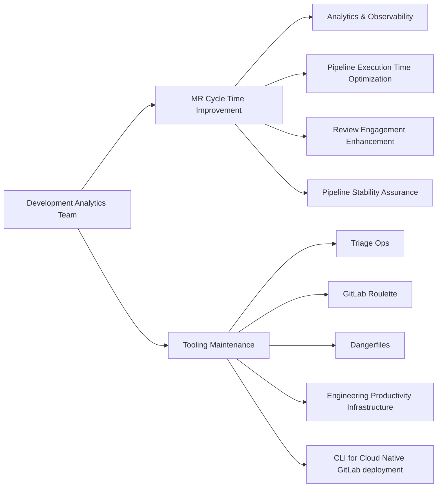

## Common Links

| **Category**            | **Handle**                                                                                                                 |
|-------------------------|----------------------------------------------------------------------------------------------------------------------------|
| **GitLab Group Handle** | [`@gl-dx/development-analytics`](https://gitlab.com/gl-dx/development-analytics)                                           |
| **Slack Channel**       | [`#g_development_analytics`](https://gitlab.enterprise.slack.com/archives/C064M4D2V37)                                     |
| **Slack Handle**        | `@dx-development-analytics`                                                                                                |
| **Team Boards**         | [`Team Issues Board`](https://gitlab.com/groups/gitlab-org/-/boards/8966549?label_name%5B%5D=group::development%20analytics), [`Team Epics Board`](https://gitlab.com/groups/gitlab-org/-/epic_boards/2068920?label_name[]=group%3A%3Adevelopment%20analytics), [`Support Requests`](https://gitlab.com/groups/gitlab-org/-/boards/9098093?label_name%5B%5D=development-analytics::support-request)                                           |
| **Issue Tracker**       | [`tracker`](https://gitlab.com/groups/gitlab-org/quality/dx/analytics/-/issues)                                            |
| **Team Repositories** | [development-analytics](https://gitlab.com/gitlab-org/quality/analytics)                                                   |

## Mission

Our mission is to enhance developer efficiency by delivering actionable insights, empowering teams with quality, CI and related metrics, and to build scalable tools that measurably improve the software development lifecycle for our teams and customers.

## Vision

Support the establishment and enforcement of the Infrastructure Platforms department KPIs. The team will consolidate metrics and reporting to provide measurable DevEx and Quality information from Engineer to VP+ level

- Enable data visualisation from every test suite, job, and pipeline.
- Produce and consolidate dashboards and reports to enable Engineering teams to assess and improve on quality e.g. Test coverage, test runtime, flakiness, bug numbers
- Enable the DevEx section and Platforms with information about test suite effectiveness, bugs identified by engineers and customers, incidents, and other Production-data to guide engineering teams
- Seek to build solutions into the GitLab product itself, so that our customers can also benefit from what we build.

## FY26-FY27 Roadmap

### Now FY26-Q4

**Focus: Improve visibility and processes to allow Engineering teams to self service access to test health data. Consolidate Devex data and dashboards** (FY26-Q3 to FY26-Q4)

| Epic | Description |
| ------ | ------ |
|  [Build CI Failure Signatures for Pattern Detection and Correlation](https://gitlab.com/groups/gitlab-org/quality/analytics/-/epics/27)| Complete from Q3, add failure categories and signatures to ClickHouse datastore. This will enable real time dashboards and alerts on CI failures, and put in place the data we need to better identify true master broken incidents quickly. This feeds in to pipeline stability improvements as a foundational element.        |
|  [Build single backend test observability solution across all test levels](https://gitlab.com/groups/gitlab-org/quality/analytics/-/epics/28)| Complete from Q3, our ClickHouse based Test Observability dashboards. These dashboards will underpin our work on identifying and fix/delete/quarantine flakey tests, and will support deep links into specific flakey test issues we create, giving engineers much improved visibility into the health of their tests.       |
|  [Improve the quarantine process for flaky tests](https://gitlab.com/groups/gitlab-org/quality/-/epics/259)| Improve Flakey Test detection by moving to ClickHouse based data, and support auto-quarantine system with Test Governance, to drive CI stability. Our success metric here is to drive down the number of flaky tests, and reduce unneeded pipeline failures.     |
|  [Review CI failures and ensure top infrastructure related reasons that fail pipelines are being addressed](https://gitlab.com/groups/gitlab-org/quality/-/epics/263)| Aligned with our DX survey actions around CI stability, we will review the top reasons for CI failures (such as infx issues or timeouts) and create issues with the responsible teams to work through and resolve the issues. Our success metric here is to reducing the amount of unneeded pipeline failures       |
|  [Introduce test coverage observability with ClickHouse and Grafana](https://gitlab.com/groups/gitlab-org/quality/-/epics/240)| Engineering teams lack visibility into test coverage trends and patterns across our codebase. While coverage data is generated during CI/CD, it's trapped in short-lived artifacts. This is a foundational component to being able to surface coverage to teams, to allow them understand how quarantined or deleted tests etc impact their coverage.   |
|  TBD | Support SaaS availability call with dashboards   |
|  [Migrate CI related Development Analytics snowflake dashboards and data to ClickHouse/Grafana](https://gitlab.com/groups/gitlab-org/quality/analytics/-/epics/31)| Migrate CI related Development Analytics snowflake dashboards and data to ClickHouse/Grafana to improve discoverability  |
|  [Migrate existing Devex Dashboards to new Data Path](https://gitlab.com/groups/gitlab-org/quality/analytics/-/epics/29)| Support consolidation of Devex dashboards and data to Grafana/ClickHouse |

See also Q4 Planning issue: https://gitlab.com/gitlab-org/quality/analytics/team/-/issues/309

### Next FY27-Q1/Q2

**Focus: Scale out usage of data/dashboards, with improved docs and a centralised landing page for teams. Build product features to improve pipeline telemetry and enable  Engineering teams to improve CI performance** (FY27-Q1 to FY27-Q2)

- Improved master branch broken detection process to improve time to recovery.
- Docs/training/Office Hours sessions to enable teams to use the dashboards/alerts
- Build scalable CI job telemetry reporting (into product, via runners)
- Dogfood Data Insight Platform Dashboarding capabilities (if ready)
- Triage Ops maintenance and improvements (e.g. Migrate Triage Ops to Runway)

### Later FY27-Q3 and beyond

**Focus: Move from custom tooling to product features**

- Prioritise custom tooling owned by the team to build into the product.

## Team members



## Core Responsibilities

## Custom Tooling and Dogfooding

GitLab [dogfoods](/handbook/values/#dogfooding) extensively. The Development Analytics team builds custom tooling to address GitLab functionality gaps, creating a valuable feedback loop between internal needs and product development.

### The Custom Data ↔ Custom Tooling Loop

Over the years, we've built custom tooling for missing GitLab features (triage-ops, test health management, CI observability, in-job metrics). This custom tooling generates **custom data** that's not part of GitLab's production database.

**By integrating custom tooling as product features, we achieve:**

- Features that benefit customers (if it helps us as customer zero, it likely helps others)
- Custom data becomes product data, available by default in visualizations
- Reduced technical debt from maintaining custom solutions
- Every improvement benefits both customers and internal teams

### Current Custom Tooling

#### CI/CD Pipeline Observability

| Tool | Purpose | Repository | Status | Product Potential |
|------|---------|------------|--------|-------------------|
| **CI Alerts** | Real-time alerting for pipeline failures and performance issues | [ci-alerts](https://gitlab.com/gitlab-org/quality/analytics/ci-alerts) | Active | High - Could become native pipeline alerting |
| **CI/CD Pipelines Observability** | Pipeline visualizer, failure categorization, CI log scraping for custom metrics, and comprehensive analytics requiring tests as first-class citizens and runner improvements | [Epic #22](https://gitlab.com/groups/gitlab-org/quality/analytics/-/epics/22), [Pipeline Visualizer](https://pipeline-visualizer-gitlab-org-quality-engineeri-bcf92e4999c4df.gitlab.io/), [Failure Categories](https://gitlab.com/gitlab-org/quality/triage-ops/-/blob/master/doc/failure_categories.md) | Active | High - Requires runner epic and native test concept in product |
| **Snowflake Observability** | Custom dashboards and analytics for GitLab.com operations and performance | [snowflake-dashboard-sql](https://gitlab.com/gitlab-org/quality/analytics/snowflake-dashboard-sql) | Active | High - Could be integrated directly in product |

#### Triage and Issue Management Automation

| Tool | Purpose | Repository | Status | Product Potential |
|------|---------|------------|--------|-------------------|
| **Triage Ops (Reactive)** | Real-time automated issue and MR triage using custom policies and reactive engine | [triage-ops](https://gitlab.com/gitlab-org/quality/triage-ops) | Active | High - Advanced real-time triage automation |
| **Triage Ops (Scheduled)** | Scheduled triage operations including weekly team reports and batch processing | [triage-ops](https://gitlab.com/gitlab-org/quality/triage-ops) | Active | High - Could benefit many customers (for example, weekly team reports) |

#### Review and Code Quality Tools

| Tool | Purpose | Repository | Status | Product Potential |
|------|---------|------------|--------|-------------------|
| **GitLab Roulette** | Intelligent reviewer assignment system that considers domain expertise, availability, and workload | [gitlab-roulette](https://gitlab-org.gitlab.io/gitlab-roulette/) | Active | High - Core developer workflow improvement |
| **GitLab Danger Files** | Standardized CI-based code review automation and policy enforcement | [gitlab-dangerfiles](https://gitlab.com/gitlab-org/ruby/gems/gitlab-dangerfiles) | Active | High - Demonstrates advanced merge request automation |
| **Renovate Bot** | Automated dependency management across GitLab projects | [renovate-gitlab-bot](https://gitlab.com/gitlab-org/frontend/renovate-gitlab-bot) | Active | High - Multiple teams built similar solutions, clear product need |

#### Test Health and Quality Management

| Tool | Purpose | Repository | Status | Product Potential |
|------|---------|------------|--------|-------------------|
| **Flaky Tests Management** | RSpec report parsing from job artifacts, automated test behavior analysis, GitLab issue creation for test health tracking, and data pipeline to GCS/Snowflake | [gitlab_quality-test_tooling](https://gitlab.com/gitlab-org/ruby/gems/gitlab_quality-test_tooling) | Active | High - Native test results concept missing from product |
| **Slow Tests Management** | RSpec profiling and analysis with custom frontend/backend for test performance insights | [RSpec profiling stats](https://gitlab-org.gitlab.io/rspec_profiling_stats/), [gitlab_quality-test_tooling](https://gitlab.com/gitlab-org/ruby/gems/gitlab_quality-test_tooling) | Active | Medium - Built but limited team adoption/reaction |

#### Incident and Process Management

| Tool | Purpose | Repository | Status | Product Potential |
|------|---------|------------|--------|-------------------|
| **Main Branch Broken Process** | Automated identification, incident management, response, and revert MR handling | [broken main branch workflow](/handbook/engineering/workflow/#broken-master) | Active | High - Critical workflow for maintaining stable main branches |

#### Data and Analytics Infrastructure

| Tool | Purpose | Repository | Status | Product Potential |
|------|---------|------------|--------|-------------------|
| **Data Pipelines** | Custom data processing pipelines feeding Snowflake dashboards and analytics | [test_tooling project](https://gitlab.com/gitlab-org/ruby/gems/gitlab_quality-test_tooling), various GCS buckets, [internal events](https://docs.gitlab.com/development/internal_analytics/internal_event_instrumentation/), [Snowflake SQL queries](https://gitlab.com/gitlab-org/quality/analytics/snowflake-dashboard-sql), [alerting](https://gitlab.com/gitlab-org/quality/analytics/ci-alerts) | Active | Medium - Could be integrated directly in product |

## Dashboards

### Pipeline Duration Analytics

- [Pipeline Duration Analytics](https://app.snowflake.com/ys68254/gitlab/#/dx-pipeline-durations-d4NWA2TAT)
- [Job Execution Analytics](https://app.snowflake.com/ys68254/gitlab/#/dx-job-durations-dPkG7M61u)
- [Pipeline Tier Analysis](https://app.snowflake.com/ys68254/gitlab/#/dx-pipeline-tiers-dS2zNDPHP)
- [Long-Running Test Analysis](https://app.snowflake.com/ys68254/gitlab/#/dx-weekly-long-running-qa-jobs-d8JKf0WUW)

### Pipeline Stability Analytics

- [Main Branch Incident Analytics](https://app.snowflake.com/ys68254/gitlab/#/dx-master-broken-incident-overview-dVcWBjizf)
- [E2E Test Analytics](https://dashboards.quality.gitlab.net/)

*Note: Access to these dashboards requires appropriate permissions. Contact team leads for access requests.*

## How we work

### Philosophy

- We prioritize asynchronous communication and a handbook-first approach, in line with GitLab's all-remote, timezone-distributed structure.
- We emphasize the [Maker's Schedule](https://www.paulgraham.com/makersschedule.html), focusing on productive, uninterrupted work.
- Most critical recurring meetings are scheduled on Tuesdays and Thursdays.
- We dedicate 3–4 hours weekly for focused learning and innovation. This protected time enables the team to explore emerging technologies, conduct proof-of-concepts, and stay current with industry trends. Meeting requests during these blocks require advance notice.
- All meeting agendas can be found in the [Team Shared Drive](https://drive.google.com/drive/folders/1uZg0J5hYsOUu3WMNR-PoAcmrhhmDxxoA?usp=drive_link) as well as in the meeting invite.

### Meetings/Events

| Event                        | Cadence                                     | Agenda                                                                                                                                                          |
|------------------------------|---------------------------------------------|-----------------------------------------------------------------------------------------------------------------------------------------------------------------|
| End-of-Week progress update  | Once a week (Wednesday)                     | Summarize status, progress, ETA, and areas needing support in the weekly update in issues and Epics. We leverage [epic-issue-summaries bot](https://gitlab.com/gitlab-com/gl-infra/epic-issue-summaries) for automated status checks |
| Team meeting                 | Twice a month on Tuesday 4:00 pm UTC        | [Agenda](https://docs.google.com/document/d/1gtghZCYeg42cMbQ8mWnjBcsu4maMO4OFA0xcQ8MfRHE/edit?usp=sharing)                                                      |
| Monthly Social Time          | Monthly on last Thursday 4:00 pm UTC        | No agenda, fun gathering. Choose one of the slots based on your timezone alignment. Read [Virtual team building](/handbook/finance/expenses/#team-building)     |
| Quarterly Business Report    | Quarterly                                   | Contribute to [team's success, learnings, innovations and improvement opportunities for each business quarter](https://gitlab.com/groups/gitlab-org/quality/quality-engineering/-/epics/61) |
| 1:1 with Engineering Manager | Weekly                                      | Discuss development goals (see the [1:1 guidelines](/handbook/leadership/1-1/))                                                                                |
| Team member's coffee chats   | Once/twice a month                          | Optional meetings for team members to regularly connect                                                                                                        |

### Yearly Roadmap Planning

- Each financial year, we create a roadmap to ensure visibility and alignment.
- We conduct an intensive month-long exercise (usually in Q4) to gather input from stakeholders.
- DRIs take the lead drafting the roadmap using the [roadmap prep-work template](https://gitlab.com/gitlab-org/quality/analytics/work-log/-/blob/main/templates/roadmap-pre-work-template.md?ref_type=heads)).
- Once the roadmap is approved, during our bi‑weekly team meetings, we review progress, address blockers, and gather feedback on the planned roadmap work.

### Iterations

Once the yearly roadmap is defined, we structure our work using [GitLab Iterations](https://docs.gitlab.com/ee/user/group/iterations/) within a twice-a-month iteration model. This approach ensures consistent progress tracking, clear priorities, and iterative improvements. Here are our [current iteration board](https://gitlab.com/groups/gitlab-org/-/boards/9114071?label_name%5B%5D=group::development%20analytics&iteration_id=Current) and [previous iterations](https://gitlab.com/groups/gitlab-org/-/boards/9114585?label_name%5B%5D=group::development%20analytics) for reference. As a team, we make sure:

1. Each issue is assigned to a [Development Analytics Iteration](https://gitlab.com/groups/gitlab-org/-/cadences/).
2. Issues that are not worked on within the iteration automatically roll over to the next iteration.
3. In every twice-a-month team meeting, we review the iteration boards and track velocity using burndown charts.

### Internal Rotation & Support Requests

#### Internal Rotation

We use [an internal rotation](https://gitlab.com/gitlab-org/quality/analytics/internal-rotation#process) for support requests and other team maintenance tasks. This frees up time for other Engineers in the team to work on planned work.

#### Support Requests

- If one finds a bug, needs assistance, or identifies an improvement opportunity then raise support requests using the `~"group::Development Analytics"` and `~"development-analytics::support-request"` labels. If the issue is urgent, escalate to the designated Slack channel - [`#g_development_analytics`](https://gitlab.enterprise.slack.com/archives/C064M4D2V37).
- If a request first comes through Slack, either the requester or a `group::Development Analytics` member should open an issue with the correct labels to ensure proper tracking and triage.
- The team reviews the [support request board](https://gitlab.com/groups/gitlab-org/-/boards/9098093?label_name%5B%5D=development-analytics%3A%3Asupport-request) and prioritizes accordingly. Generally, the team reserves ~20% of weekly time for support tasks, though this may vary based on current priorities.

### Tools/Repository Maintenance

- Team does not automatically watch every new issue created in each group-owned repository—use the group labels or escalate in Slack to ensure visibility.
- We highly promote self-served Merge Requests. If one already identified a fix or improvement, we request opening an MR for faster turnaround. The `~group::development analytics` maintainers will review and merge as appropriate.
- Feature work and bug fixes follow the team's current priorities.
- Find the version management rituals for `~group::development analytics` owned repositories:

| Repository                             | Release Process                                                                                 |
|----------------------------------------|-------------------------------------------------------------------------------------------------|
| **gitlab-roulette**                    | Version updates are not scheduled on a set cadence. A release can be cut whenever a version-update MR is submitted. |
| **gitlab-dangerfiles**                 | Same as above—no regular cadence; release triggered by a version-update MR.                     |
| **triage-ops**                         | A new release is initiated after merging a new commit into the default branch.                            |
| **engineering-productivity-infrastructure** | Dependency update MRs are generated by Renovate bot.                                            |

### Automated Label Migration

For details on label migration, see the [Handbook entry for creating label migration triage policy with GitLab Duo Workflow](https://handbook/engineering/infrastructure-platforms/developer-experience/development-analytics/create-triage-policy-with-gitlab-duo-workflow-guide).
